# erikwang2013/encryption

可插拔密码学组件库：在统一契约下提供**对称加密**、**非对称加密**、**哈希**、**密钥派生**（HKDF / PBKDF2），并包含 AES/Sodium、国密 SM2/SM3/SM4/ZUC 等实现，支持 Composer 安装。

## 目录

- [框架兼容性](#框架兼容性)
- [各框架接入方式](#各框架接入方式)
- [快速开始](#快速开始)
- [架构概览](#架构概览)
- [环境要求](#环境要求)
- [安装](#安装)
- [内置算法与标识](#内置算法与标识)
- [使用说明](#使用说明)
- [包结构](#包结构)
- [常见问题](#常见问题)
- [安全建议](#安全建议)
- [运行单元测试](#运行单元测试)
- [许可证](#许可证)

---

## 框架兼容性

本库**不依赖**任何 Web 框架，仅以 Composer 包形式提供类与自动加载；在业务项目中 `composer require erikwang2013/encryption` 即可，与路由、容器、配置方式无关。

前提为 **PHP ≥ 8.1** 且满足下文「环境要求」中的扩展与依赖。在此前提下，下列框架版本均可使用（与框架自带加密组件并行，按需注入 `EncryptionManager` 等即可）：

| 框架 | 说明 |
|------|------|
| **Laravel** 7 / 8 / 9 / 10 / 11 | 在 **PHP 8.1+** 的运行环境中安装；Laravel 7 若仍停留在 PHP 7.x 或仅 8.0，则无法满足本库 PHP 约束，需先升级运行环境。 |
| **ThinkPHP** 6 / 8 | 在 TP 应用的标准 `composer.json` 中 `require` 本包即可。 |
| **Hyperf** 2 / 3 | 在 Hyperf 服务的 `composer.json` 中引入；按 Hyperf 习惯可在 `config` 或工厂类中注册单例。 |
| **webman** 1 / 2 | 在 webman 项目根目录执行 `composer require`，在业务类或 `support` 辅助函数中直接使用。 |

### 各框架接入方式

本库**不提供** Laravel ServiceProvider、ThinkPHP 行为扩展等专用封装；接入方式是在各框架的**依赖注入容器**或**单例工厂**中注册 `EncryptionManager`（或其它 Manager），由配置或环境变量提供主密钥（32 字节）后再构造实例。下文为最小示例，**密钥来源请按你方安全规范**（`.env`、KMS、配置中心等），勿直接写死在代码里。

**Laravel（`App\Providers\AppServiceProvider` 或独立 ServiceProvider）**

```php
use Erikwang2013\Encryption\EncryptionManagerFactory;

public function register(): void
{
    $this->app->singleton(\Erikwang2013\Encryption\EncryptionManager::class, function () {
        $raw = config('app.custom_master_key'); // 例如 base64 存 32 字节
        $master = is_string($raw) ? base64_decode($raw, true) : '';
        if ($master === false || strlen($master) !== 32) {
            throw new \RuntimeException('Invalid 32-byte master key.');
        }
        return EncryptionManagerFactory::fromMasterKey($master, 'aes-256-gcm');
    });
}
```

容器解析：`app(\Erikwang2013\Encryption\EncryptionManager::class)`。与 Laravel 自带的 `Crypt` / `encrypt()` **互不替代**：前者用于字段级、多算法注册表场景；后者用于框架序列化与 Cookie 等。

**ThinkPHP 6 / 8（服务类或 `common.php` 中工厂函数）**

```php
use Erikwang2013\Encryption\EncryptionManagerFactory;

function app_encryption_manager(): \Erikwang2013\Encryption\EncryptionManager
{
    static $mgr = null;
    if ($mgr === null) {
        $master = base64_decode(config('app.master_key'), true);
        $mgr = EncryptionManagerFactory::fromMasterKey($master, 'aes-256-gcm');
    }
    return $mgr;
}
```

也可在 `app\service` 下定义 `EncryptionService` 并在控制器中注入，便于单测 Mock。

**Hyperf 2 / 3（`config/autoload/dependencies.php` 或注解工厂）**

```php
use Erikwang2013\Encryption\EncryptionManager;
use Erikwang2013\Encryption\EncryptionManagerFactory;

return [
    EncryptionManager::class => function () {
        $master = base64_decode((string) config('encryption.master_key'), true);
        return EncryptionManagerFactory::fromMasterKey($master, 'aes-256-gcm');
    },
];
```

注意协程环境下若密钥来自远程配置，缓存解析结果即可。

**webman 1 / 2**

在 `config/plugin.php` / 自定义 `bootstrap` 或 `support/bootstrap.php` 中把 `EncryptionManager` 挂到全局 `support` 容器（若使用），或直接在需要的服务类构造函数里用 `EncryptionManagerFactory::fromMasterKey(...)` 构造；webman 无强制容器约定，**以项目现有组织方式为准**。

### 与本库无关的说明

- 框架版本升级（如 Laravel 10 → 11）一般**不需要**改本库 API；若 Composer 提示 PHP 版本冲突，以本库 `composer.json` 中 `php` 约束为准。
- 国密 **SM2** 需 **`ext-gmp`**；未安装时相关类在运行时会失败，与框架种类无关。

---

## 快速开始

1. 在业务项目根目录执行：`composer require erikwang2013/encryption:^1.0`（或你发布的版本约束）。
2. 确认 `php -v` 为 **8.1+**，且已启用 `openssl`；若使用 `sodium-xchacha20` 或 SM2，按需安装 `sodium`、`gmp` 扩展。
3. 在代码中 `use Erikwang2013\Encryption\...`，按下文「使用说明」选择 `EncryptionManager`、哈希或 KDF 等类即可。

---

## 架构概览

按能力划分为四类契约，每类对应独立注册表与可选门面（`*Manager`），便于组合与单元测试。

```mermaid
flowchart TB
  subgraph symmetric [对称加密]
    SI["SymmetricCipherInterface / EncryptorInterface"]
    ER["EncryptorRegistry"]
    EM["EncryptionManager"]
  end
  subgraph asymmetric [非对称加密]
    AI["AsymmetricCipherInterface"]
    AR["AsymmetricCipherRegistry"]
    AM["AsymmetricCryptoManager"]
  end
  subgraph hash [哈希]
    HI["HasherInterface"]
    HR["HasherRegistry"]
    HM["HashingManager"]
  end
  subgraph kdf [密钥派生]
    KI["KeyDerivationInterface"]
    PI["PasswordBasedKdfInterface"]
    KR["KeyDerivationRegistry / PasswordBasedKdfRegistry"]
    KM["KeyDerivationManager / PasswordBasedKdfManager"]
  end
  SI --> ER --> EM
  AI --> AR --> AM
  HI --> HR --> HM
  KI --> KR --> KM
  PI --> KR
```



| 能力 | 契约 | 注册表 | 门面（默认算法） |
|------|------|--------|------------------|
| 对称加解密 | `SymmetricCipherInterface`（`EncryptorInterface` 为其别名） | `EncryptorRegistry` | `EncryptionManager` |
| 非对称加解密 | `AsymmetricCipherInterface` | `AsymmetricCipherRegistry` | `AsymmetricCryptoManager` |
| 哈希 | `HasherInterface` | `HasherRegistry` | `HashingManager` |
| 密钥派生（IKM） | `KeyDerivationInterface` | `KeyDerivationRegistry` | `KeyDerivationManager` |
| 口令派生密钥 | `PasswordBasedKdfInterface` | `PasswordBasedKdfRegistry` | `PasswordBasedKdfManager` |

设计要点：

- **对称**：实例绑定固定密钥，载荷为二进制；适合批量字段加解密。
- **非对称**：每次调用传入公钥/私钥字符串（格式由实现约定，如 SM2 十六进制）。
- **哈希**：单向摘要，无密钥（或 SM3 等同标准杂凑）。
- **密钥派生**：**HKDF** 用于已有高熵密钥材料扩展子密钥；**PBKDF2** 用于从人类口令拉伸出密钥（需随机盐与高迭代次数）。

---

## 环境要求

| 项目 | 说明 |
|------|------|
| PHP | `^8.1`（与上述框架组合时，以本约束为准） |
| 扩展 | `ext-openssl`（必需） |
| 扩展 | `ext-sodium`（可选，用于 `sodium-xchacha20`） |
| 扩展 | `ext-gmp`（可选，**SM2** 加解密与密钥生成） |
| Composer | `pohoc/crypto-sm`（已作为依赖，提供 SM2/SM3/SM4 封装） |

## 安装

### 从本地路径（开发）

在业务项目 `composer.json` 中增加：

```json
{
    "repositories": [
        {
            "type": "path",
            "url": "/绝对路径/encryption"
        }
    ],
    "require": {
        "erikwang2013/encryption": "@dev"
    }
}
```

执行：

```bash
composer update erikwang2013/encryption
```

### 从 Git / Packagist（发布后）

```bash
composer require erikwang2013/encryption:^1.0
```

（需将本库推送到可访问的 Git 仓库并配置 Composer 源，或发布到 Packagist。）

---

## 内置算法与标识

### 对称加密（`SymmetricCipherInterface`）

| 标识 (`getIdentifier`) | 类 | 密钥长度 | 说明 |
|------------------------|-----|----------|------|
| `aes-256-gcm` | `Aes256GcmEncryptor` | 32 字节 | 认证加密，推荐新系统默认 |
| `sodium-xchacha20` | `SodiumXChaCha20Encryptor` | 32 字节 | 需 `ext-sodium` |
| `aes-256-cbc-hmac` | `OpenSslAes256CbcEncryptor` | 32 字节 | CBC + HMAC，兼容旧环境 |
| `sm4-cbc` | `Sm4CbcEncryptor` | 16 字节 | 国密 SM4-CBC（OpenSSL SM4） |
| `zuc-128` | `ZucEncryptor` | 16 字节 | ZUC-128 流密码 |

### 非对称加密（`AsymmetricCipherInterface`）

| 标识 | 类 | 说明 |
|------|-----|------|
| `sm2` | `Sm2AsymmetricCipher` | 国密 SM2；密钥与密文为十六进制；需 `ext-gmp` |

（亦可继续使用静态门面 `Sm2EncryptionService`，与 `Sm2AsymmetricCipher` 行为一致。）

### 哈希（`HasherInterface`）

| 标识 | 类 | 输出长度 |
|------|-----|----------|
| `sha256` | `Sha256Hasher` | 32 字节 |
| `sm3` | `Sm3Hasher` | 32 字节 |

### 密钥派生

| 标识 | 类 | 契约 | 说明 |
|------|-----|------|------|
| `hkdf-sha256` | `HkdfSha256` | `KeyDerivationInterface` | RFC 5869，基于 IKM + salt + info |
| `pbkdf2-sha256` | `Pbkdf2Sha256` | `PasswordBasedKdfInterface` | 口令 + 盐 + 迭代次数（构造参数） |

密文/摘要多为二进制字符串；若需存入 JSON/文本，请自行 `base64_encode` / `base64_decode`。

---

## 使用说明

### 1. 对称加密：单算法与注册表

```php
<?php

use Erikwang2013\Encryption\Encryptor\Aes256GcmEncryptor;
use Erikwang2013\Encryption\EncryptionManager;
use Erikwang2013\Encryption\EncryptorRegistry;

$key = random_bytes(32);
$encryptor = new Aes256GcmEncryptor($key);
$ciphertext = $encryptor->encrypt('明文');
$plaintext  = $encryptor->decrypt($ciphertext);

$registry = new EncryptorRegistry(new Aes256GcmEncryptor($key));
$manager = new EncryptionManager($registry, 'aes-256-gcm');
$blob = $manager->encrypt('数据');
```

主密钥工厂：`EncryptionManagerFactory::fromMasterKey($masterKey32, 'aes-256-gcm')` 可一次注册多种对称算法子密钥。

### 2. 非对称加密

```php
<?php

use Erikwang2013\Encryption\Asymmetric\Sm2AsymmetricCipher;
use Erikwang2013\Encryption\AsymmetricCipherRegistry;
use Erikwang2013\Encryption\AsymmetricCryptoManager;
use Erikwang2013\Encryption\Guomi\Sm2EncryptionService;

// 需 ext-gmp
$pair = Sm2EncryptionService::generateKeyPairHex();

$cipher = new Sm2AsymmetricCipher();
$hexCipher = $cipher->encrypt('明文', $pair->getPublicKey());
$plain = $cipher->decrypt($hexCipher, $pair->getPrivateKey());

$mgr = new AsymmetricCryptoManager(new AsymmetricCipherRegistry($cipher), 'sm2');
$hexCipher2 = $mgr->encrypt('明文', $pair->getPublicKey());
```

### 3. 哈希

```php
<?php

use Erikwang2013\Encryption\Hash\Sha256Hasher;
use Erikwang2013\Encryption\Guomi\Sm3Hasher;
use Erikwang2013\Encryption\HasherRegistry;
use Erikwang2013\Encryption\HashingManager;

$registry = new HasherRegistry(
    new Sha256Hasher(),
    new Sm3Hasher(),
);
$hashing = new HashingManager($registry, 'sha256');
$bin = $hashing->digest('数据');
$hex = $hashing->digestHex('数据', 'sm3');
```

### 4. 密钥派生（HKDF / PBKDF2）

```php
<?php

use Erikwang2013\Encryption\Kdf\HkdfSha256;
use Erikwang2013\Encryption\Kdf\Pbkdf2Sha256;
use Erikwang2013\Encryption\KeyDerivationManager;
use Erikwang2013\Encryption\KeyDerivationRegistry;
use Erikwang2013\Encryption\PasswordBasedKdfManager;
use Erikwang2013\Encryption\PasswordBasedKdfRegistry;

// 从高熵材料派生子密钥（如 TLS、信封加密中的子密钥）
$hkdf = new HkdfSha256();
$subKey = $hkdf->derive($ikm32, $salt, 32, 'app:v1');

$kdfMgr = new KeyDerivationManager(new KeyDerivationRegistry($hkdf), 'hkdf-sha256');

// 从用户口令派生密钥（存储密码哈希时请改用 password_hash / Argon2 等专用 API）
$pbkdf2 = new Pbkdf2Sha256(iterations: 310_000);
$derived = $pbkdf2->deriveFromPassword('用户口令', random_bytes(16), 32);

$pwdMgr = new PasswordBasedKdfManager(new PasswordBasedKdfRegistry($pbkdf2), 'pbkdf2-sha256');
```

### 5. 国密（SM3 / SM4 / ZUC / SM2）

```php
<?php

use Erikwang2013\Encryption\Guomi\Sm2EncryptionService;
use Erikwang2013\Encryption\Guomi\Sm3Hasher;
use Erikwang2013\Encryption\Guomi\Sm4CbcEncryptor;
use Erikwang2013\Encryption\Guomi\ZucEncryptor;

$sm3 = new Sm3Hasher();
$bin = $sm3->digest('数据');

$key16 = random_bytes(16);
$sm4 = new Sm4CbcEncryptor($key16);
$blob = $sm4->encrypt('明文');

$zuc = new ZucEncryptor($key16);
$blob2 = $zuc->encrypt('明文');

// SM2：见上文非对称示例或 Sm2EncryptionService
```

SM1、SM7、SM9：`UnavailableNationalAlgorithms::sm1()` 等会抛出 `UnsupportedNationalAlgorithmException`。

### 6. 自定义插件

- 对称：实现 `EncryptorInterface`（即 `SymmetricCipherInterface`），注册到 `EncryptorRegistry`。
- 非对称：实现 `AsymmetricCipherInterface`，注册到 `AsymmetricCipherRegistry`。
- 哈希：实现 `HasherInterface`，注册到 `HasherRegistry`。
- KDF：实现 `KeyDerivationInterface` 或 `PasswordBasedKdfInterface`，注册到对应 `Registry`。

### 7. 异常

失败时抛出 `Erikwang2013\Encryption\Exception\EncryptionException`；国密不可用算法为 `UnsupportedNationalAlgorithmException`。业务层应捕获并记录，勿向前端泄露细节。

---

## 包结构

| 路径 | 说明 |
|------|------|
| `src/Contract/` | 各类能力接口（`EncryptorInterface`、`HasherInterface` 等） |
| `src/Encryptor/`、`src/Asymmetric/`、`src/Hash/`、`src/Kdf/` | 具体算法实现 |
| `src/Guomi/` | 国密相关实现与 `UnavailableNationalAlgorithms` |
| `src/Exception/` | `EncryptionException` 等 |
| `*Registry.php`、`*Manager.php`、`EncryptionManagerFactory.php` | 注册表与门面、主密钥工厂 |

命名空间前缀：`Erikwang2013\Encryption\`，与 Composer `psr-4` 一致。

---

## 常见问题

**Composer 提示 PHP 版本不满足**

本库要求 `php ^8.1`。若业务项目仍使用 PHP 8.0 或更低，需先升级运行环境，或勿使用本包。

**`sodium-xchacha20` 不可用**

安装并启用 PHP 扩展 `sodium`（`ext-sodium`）。未启用时 `EncryptionManagerFactory::fromMasterKey(..., 'sodium-xchacha20')` 会报错，可改用默认 `aes-256-gcm`。

**SM2 报错或无法生成密钥**

安装并启用 **`ext-gmp`**。SM2 依赖大数运算，无 GMP 时无法保证完整功能。

**密文要存数据库 / JSON**

二进制字段可直接存 `BLOB`；若只能存文本，对密文与 IV 等做 **`base64_encode`**，解密前再 `base64_decode`。

**与 Laravel `encrypt()` / `Crypt` 的区别**

Laravel 封装主要用于框架内序列化与 Cookie 等；本库面向**显式算法标识、多注册表、国密与 HKDF/PBKDF2** 等场景，二者可并存，不要混用同一密钥约定除非你自己对齐格式。

---

## 安全建议

1. **密钥**：高熵密钥使用 `random_bytes()` 或 KMS；口令必须先经 **PBKDF2 / Argon2** 等派生，勿直接作为 AES 密钥。
2. **算法**：新系统优先 **AES-256-GCM** 或 **Sodium**；国密用 **SM3/SM4/ZUC/SM2**；**HKDF** 用于子密钥扩展，**PBKDF2** 仅作口令拉伸时需足够迭代与随机盐。
3. **传输**：仍建议使用 TLS；本库提供字段级加解密与摘要。
4. **迁移**：用 `identifier` 区分算法版本，便于解密旧数据后重加密。

---

## 运行单元测试

克隆本仓库后：

```bash
composer install
composer test
```

等价于执行 `./vendor/bin/phpunit tests/`。若已为项目添加 `phpunit.xml`，可将 `composer.json` 中 `test` 脚本改为使用配置文件。

---

## 许可证

MIT（见 `composer.json` 中 `license` 字段）。
