# erikwang2013/encryption

**Languages:** **English** | [简体中文](README.zh-CN.md)

A pluggable cryptography component library: under a unified contract it provides **symmetric encryption**, **asymmetric encryption**, **hashing**, and **key derivation** (HKDF / PBKDF2), with implementations including AES/Sodium and Chinese national algorithms SM2/SM3/SM4/ZUC. Installable via Composer.

## Table of contents

- [Framework compatibility](#framework-compatibility)
- [Integration per framework](#integration-per-framework)
- [Quick start](#quick-start)
- [Architecture overview](#architecture-overview)
- [Requirements](#requirements)
- [Installation](#installation)
- [Built-in algorithms and identifiers](#built-in-algorithms-and-identifiers)
- [Usage](#usage)
- [Package layout](#package-layout)
- [FAQ](#faq)
- [Security notes](#security-notes)
- [Running tests](#running-tests)
- [License](#license)

---

## Framework compatibility

This package **does not depend** on any web framework. It ships as a Composer library with classes and autoloading only. In your application, run `composer require erikwang2013/encryption`; routing, container, and configuration are irrelevant.

You need **PHP ≥ 8.1** and the extensions/dependencies listed under [Requirements](#requirements). With that, the following framework versions work (alongside each framework’s own crypto APIs; inject `EncryptionManager` etc. as needed):

| Framework | Notes |
|-----------|--------|
| **Laravel** 7 / 8 / 9 / 10 / 11 | Install in a **PHP 8.1+** runtime. If Laravel 7 still runs on PHP 7.x or 8.0 only, this package’s PHP constraint is not satisfied—upgrade PHP first. |
| **ThinkPHP** 6 / 8 | Add the package to the app’s standard `composer.json` `require`. |
| **Hyperf** 2 / 3 | Require in the service’s `composer.json`; register a singleton in `config` or a factory as you usually do in Hyperf. |
| **webman** 1 / 2 | `composer require` at the project root; use from business classes or `support` helpers. |

### Integration per framework

There is **no** dedicated Laravel ServiceProvider or ThinkPHP behavior bundle. You register `EncryptionManager` (or other managers) in your framework’s **DI container** or **singleton factory**, loading a 32-byte master key from config or environment. The snippets below are minimal; **follow your own security policy** for key material (`.env`, KMS, config services)—do not hard-code secrets.

**Laravel (`App\Providers\AppServiceProvider` or a dedicated ServiceProvider)**

```php
use Erikwang2013\Encryption\EncryptionManagerFactory;

public function register(): void
{
    $this->app->singleton(\Erikwang2013\Encryption\EncryptionManager::class, function () {
        $raw = config('app.custom_master_key'); // e.g. base64 for 32 bytes
        $master = is_string($raw) ? base64_decode($raw, true) : '';
        if ($master === false || strlen($master) !== 32) {
            throw new \RuntimeException('Invalid 32-byte master key.');
        }
        return EncryptionManagerFactory::fromMasterKey($master, 'aes-256-gcm');
    });
}
```

Resolve via `app(\Erikwang2013\Encryption\EncryptionManager::class)`. This does **not** replace Laravel’s `Crypt` / `encrypt()`: this library targets field-level encryption and multi-algorithm registries; Laravel’s helpers cover framework serialization, cookies, etc.

**ThinkPHP 6 / 8 (service class or factory in `common.php`)**

```php
use Erikwang2013\Encryption\EncryptionManagerFactory;

function app_encryption_manager(): \Erikwang2013\Encryption\EncryptionManager
{
    static $mgr = null;
    if ($mgr === null) {
        $master = base64_decode(config('app.master_key'), true);
        $mgr = EncryptionManagerFactory::fromMasterKey($master, 'aes-256-gcm');
    }
    return $mgr;
}
```

You can also define `EncryptionService` under `app\service` and inject it in controllers for easier mocking in tests.

**Hyperf 2 / 3 (`config/autoload/dependencies.php` or annotation factories)**

```php
use Erikwang2013\Encryption\EncryptionManager;
use Erikwang2013\Encryption\EncryptionManagerFactory;

return [
    EncryptionManager::class => function () {
        $master = base64_decode((string) config('encryption.master_key'), true);
        return EncryptionManagerFactory::fromMasterKey($master, 'aes-256-gcm');
    },
];
```

In coroutine mode, if keys come from remote config, cache the parsed value.

**webman 1 / 2**

Register `EncryptionManager` on the global `support` container in `config/plugin.php`, a custom `bootstrap`, or `support/bootstrap.php` if you use that pattern, or construct with `EncryptionManagerFactory::fromMasterKey(...)` inside service classes. webman does not mandate a specific container—**follow your project’s conventions**.

### Unrelated to this library

- Framework upgrades (e.g. Laravel 10 → 11) usually **do not** require API changes here. If Composer reports a PHP version conflict, follow this package’s `php` constraint in `composer.json`.
- Chinese national **SM2** requires **`ext-gmp`**; without it, related classes fail at runtime regardless of framework.

---

## Quick start

1. In your project root: `composer require erikwang2013/encryption:^1.0` (or your published version constraint).
2. Ensure `php -v` is **8.1+** and `openssl` is enabled; for `sodium-xchacha20` or SM2, install the `sodium` and/or `gmp` extensions as needed.
3. `use Erikwang2013\Encryption\...` and pick `EncryptionManager`, hashing, KDF, etc. as described under [Usage](#usage).

---

## Architecture overview

Capabilities are split into four contract families, each with its own registry and optional facade (`*Manager`) for composition and testing.

```mermaid
flowchart TB
  subgraph symmetric [Symmetric encryption]
    SI["SymmetricCipherInterface / EncryptorInterface"]
    ER["EncryptorRegistry"]
    EM["EncryptionManager"]
  end
  subgraph asymmetric [Asymmetric encryption]
    AI["AsymmetricCipherInterface"]
    AR["AsymmetricCipherRegistry"]
    AM["AsymmetricCryptoManager"]
  end
  subgraph hash [Hashing]
    HI["HasherInterface"]
    HR["HasherRegistry"]
    HM["HashingManager"]
  end
  subgraph kdf [Key derivation]
    KI["KeyDerivationInterface"]
    PI["PasswordBasedKdfInterface"]
    KR["KeyDerivationRegistry / PasswordBasedKdfRegistry"]
    KM["KeyDerivationManager / PasswordBasedKdfManager"]
  end
  SI --> ER --> EM
  AI --> AR --> AM
  HI --> HR --> HM
  KI --> KR --> KM
  PI --> KR
```



| Capability | Contract | Registry | Facade (default algorithm) |
|------------|----------|----------|----------------------------|
| Symmetric | `SymmetricCipherInterface` (`EncryptorInterface` alias) | `EncryptorRegistry` | `EncryptionManager` |
| Asymmetric | `AsymmetricCipherInterface` | `AsymmetricCipherRegistry` | `AsymmetricCryptoManager` |
| Hashing | `HasherInterface` | `HasherRegistry` | `HashingManager` |
| Key derivation (IKM) | `KeyDerivationInterface` | `KeyDerivationRegistry` | `KeyDerivationManager` |
| Password-based KDF | `PasswordBasedKdfInterface` | `PasswordBasedKdfRegistry` | `PasswordBasedKdfManager` |

Design notes:

- **Symmetric**: instances bind a fixed key; payloads are binary—good for bulk field encryption.
- **Asymmetric**: each call passes public/private key material (format defined by the implementation, e.g. SM2 hex).
- **Hashing**: one-way digests, no secret key (or standard SM3-style hashing).
- **Key derivation**: **HKDF** expands high-entropy key material into subkeys; **PBKDF2** stretches human passwords (use random salt and high iteration counts).

---

## Requirements

| Item | Details |
|------|---------|
| PHP | `^8.1` (when combined with frameworks above, this constraint wins) |
| Extension | `ext-openssl` (required) |
| Extension | `ext-sodium` (optional, for `sodium-xchacha20`) |
| Extension | `ext-gmp` (optional, **SM2** encryption/decryption and key generation) |
| Composer | `pohoc/crypto-sm` (dependency; SM2/SM3/SM4 wrappers) |

## Installation

### From a local path (development)

In the consuming project’s `composer.json`:

```json
{
    "repositories": [
        {
            "type": "path",
            "url": "/absolute/path/to/encryption"
        }
    ],
    "require": {
        "erikwang2013/encryption": "@dev"
    }
}
```

Then:

```bash
composer update erikwang2013/encryption
```

### From Git / Packagist (after release)

```bash
composer require erikwang2013/encryption:^1.0
```

(Push the repo to an accessible Git remote and Composer source, or publish on Packagist.)

---

## Built-in algorithms and identifiers

### Symmetric encryption (`SymmetricCipherInterface`)

| Identifier (`getIdentifier`) | Class | Key length | Notes |
|------------------------------|-------|------------|--------|
| `aes-256-gcm` | `Aes256GcmEncryptor` | 32 bytes | AEAD; recommended default for new systems |
| `sodium-xchacha20` | `SodiumXChaCha20Encryptor` | 32 bytes | Requires `ext-sodium` |
| `aes-256-cbc-hmac` | `OpenSslAes256CbcEncryptor` | 32 bytes | CBC + HMAC for legacy compatibility |
| `sm4-cbc` | `Sm4CbcEncryptor` | 16 bytes | SM4-CBC (OpenSSL SM4) |
| `zuc-128` | `ZucEncryptor` | 16 bytes | ZUC-128 stream cipher |

### Asymmetric encryption (`AsymmetricCipherInterface`)

| Identifier | Class | Notes |
|------------|-------|--------|
| `sm2` | `Sm2AsymmetricCipher` | SM2; keys and ciphertext as hex; requires `ext-gmp` |

You can also use the static facade `Sm2EncryptionService`; behavior matches `Sm2AsymmetricCipher`.

### Hashing (`HasherInterface`)

| Identifier | Class | Output length |
|------------|-------|-----------------|
| `sha256` | `Sha256Hasher` | 32 bytes |
| `sm3` | `Sm3Hasher` | 32 bytes |

### Key derivation

| Identifier | Class | Contract | Notes |
|------------|-------|----------|--------|
| `hkdf-sha256` | `HkdfSha256` | `KeyDerivationInterface` | RFC 5869: IKM + salt + info |
| `pbkdf2-sha256` | `Pbkdf2Sha256` | `PasswordBasedKdfInterface` | Password + salt + iterations (constructor) |

Ciphertexts and digests are usually binary; for JSON/text storage, apply `base64_encode` / `base64_decode` yourself.

---

## Usage

### 1. Symmetric encryption: single algorithm and registry

```php
<?php

use Erikwang2013\Encryption\Encryptor\Aes256GcmEncryptor;
use Erikwang2013\Encryption\EncryptionManager;
use Erikwang2013\Encryption\EncryptorRegistry;

$key = random_bytes(32);
$encryptor = new Aes256GcmEncryptor($key);
$ciphertext = $encryptor->encrypt('plaintext');
$plaintext  = $encryptor->decrypt($ciphertext);

$registry = new EncryptorRegistry(new Aes256GcmEncryptor($key));
$manager = new EncryptionManager($registry, 'aes-256-gcm');
$blob = $manager->encrypt('data');
```

Master-key factory: `EncryptionManagerFactory::fromMasterKey($masterKey32, 'aes-256-gcm')` can register subkeys for multiple symmetric algorithms at once.

### 2. Asymmetric encryption

```php
<?php

use Erikwang2013\Encryption\Asymmetric\Sm2AsymmetricCipher;
use Erikwang2013\Encryption\AsymmetricCipherRegistry;
use Erikwang2013\Encryption\AsymmetricCryptoManager;
use Erikwang2013\Encryption\Guomi\Sm2EncryptionService;

// requires ext-gmp
$pair = Sm2EncryptionService::generateKeyPairHex();

$cipher = new Sm2AsymmetricCipher();
$hexCipher = $cipher->encrypt('plaintext', $pair->getPublicKey());
$plain = $cipher->decrypt($hexCipher, $pair->getPrivateKey());

$mgr = new AsymmetricCryptoManager(new AsymmetricCipherRegistry($cipher), 'sm2');
$hexCipher2 = $mgr->encrypt('plaintext', $pair->getPublicKey());
```

### 3. Hashing

```php
<?php

use Erikwang2013\Encryption\Hash\Sha256Hasher;
use Erikwang2013\Encryption\Guomi\Sm3Hasher;
use Erikwang2013\Encryption\HasherRegistry;
use Erikwang2013\Encryption\HashingManager;

$registry = new HasherRegistry(
    new Sha256Hasher(),
    new Sm3Hasher(),
);
$hashing = new HashingManager($registry, 'sha256');
$bin = $hashing->digest('data');
$hex = $hashing->digestHex('data', 'sm3');
```

### 4. Key derivation (HKDF / PBKDF2)

```php
<?php

use Erikwang2013\Encryption\Kdf\HkdfSha256;
use Erikwang2013\Encryption\Kdf\Pbkdf2Sha256;
use Erikwang2013\Encryption\KeyDerivationManager;
use Erikwang2013\Encryption\KeyDerivationRegistry;
use Erikwang2013\Encryption\PasswordBasedKdfManager;
use Erikwang2013\Encryption\PasswordBasedKdfRegistry;

// Derive subkey from high-entropy material (e.g. TLS, envelope subkeys)
$hkdf = new HkdfSha256();
$subKey = $hkdf->derive($ikm32, $salt, 32, 'app:v1');

$kdfMgr = new KeyDerivationManager(new KeyDerivationRegistry($hkdf), 'hkdf-sha256');

// Derive from user password (for password storage prefer password_hash / Argon2, etc.)
$pbkdf2 = new Pbkdf2Sha256(iterations: 310_000);
$derived = $pbkdf2->deriveFromPassword('user password', random_bytes(16), 32);

$pwdMgr = new PasswordBasedKdfManager(new PasswordBasedKdfRegistry($pbkdf2), 'pbkdf2-sha256');
```

### 5. Chinese national algorithms (SM3 / SM4 / ZUC / SM2)

```php
<?php

use Erikwang2013\Encryption\Guomi\Sm2EncryptionService;
use Erikwang2013\Encryption\Guomi\Sm3Hasher;
use Erikwang2013\Encryption\Guomi\Sm4CbcEncryptor;
use Erikwang2013\Encryption\Guomi\ZucEncryptor;

$sm3 = new Sm3Hasher();
$bin = $sm3->digest('data');

$key16 = random_bytes(16);
$sm4 = new Sm4CbcEncryptor($key16);
$blob = $sm4->encrypt('plaintext');

$zuc = new ZucEncryptor($key16);
$blob2 = $zuc->encrypt('plaintext');

// SM2: see asymmetric example above or Sm2EncryptionService
```

SM1, SM7, SM9: `UnavailableNationalAlgorithms::sm1()` and similar throw `UnsupportedNationalAlgorithmException`.

### 6. Custom plugins

- Symmetric: implement `EncryptorInterface` (`SymmetricCipherInterface`), register in `EncryptorRegistry`.
- Asymmetric: implement `AsymmetricCipherInterface`, register in `AsymmetricCipherRegistry`.
- Hashing: implement `HasherInterface`, register in `HasherRegistry`.
- KDF: implement `KeyDerivationInterface` or `PasswordBasedKdfInterface`, register in the matching `Registry`.

### 7. Exceptions

Failures throw `Erikwang2013\Encryption\Exception\EncryptionException`; unavailable national algorithms use `UnsupportedNationalAlgorithmException`. Catch and log in application code; do not leak details to clients.

---

## Package layout

| Path | Purpose |
|------|---------|
| `src/Contract/` | Capability interfaces (`EncryptorInterface`, `HasherInterface`, …) |
| `src/Encryptor/`, `src/Asymmetric/`, `src/Hash/`, `src/Kdf/` | Algorithm implementations |
| `src/Guomi/` | Chinese national crypto and `UnavailableNationalAlgorithms` |
| `src/Exception/` | `EncryptionException`, etc. |
| `*Registry.php`, `*Manager.php`, `EncryptionManagerFactory.php` | Registries, facades, master-key factory |

Namespace prefix: `Erikwang2013\Encryption\`, aligned with Composer `psr-4`.

---

## FAQ

**Composer reports PHP version mismatch**

This package requires `php ^8.1`. If the app still runs PHP 8.0 or lower, upgrade PHP or do not use this package.

**`sodium-xchacha20` unavailable**

Install and enable the `sodium` extension (`ext-sodium`). Without it, `EncryptionManagerFactory::fromMasterKey(..., 'sodium-xchacha20')` fails; use `aes-256-gcm` instead.

**SM2 errors or key generation fails**

Install and enable **`ext-gmp`**. SM2 relies on big integers; without GMP, behavior is not guaranteed.

**Storing ciphertext in a database / JSON**

Use `BLOB` for binary columns; if you must use text, **`base64_encode`** ciphertext and IVs, then **`base64_decode`** before decryption.

**Difference from Laravel `encrypt()` / `Crypt`**

Laravel’s API targets framework serialization and cookies; this library targets **explicit algorithm IDs, multiple registries, national algorithms, HKDF/PBKDF2**, etc. They can coexist—do not mix keying unless you align formats yourself.

---

## Security notes

1. **Keys**: use `random_bytes()` or a KMS for high-entropy keys; never use raw passwords as AES keys—stretch with **PBKDF2 / Argon2** first.
2. **Algorithms**: prefer **AES-256-GCM** or **Sodium** for new systems; use **SM3/SM4/ZUC/SM2** where required; **HKDF** for subkey expansion; for **PBKDF2** password stretching, use sufficient iterations and random salt.
3. **Transport**: still use TLS in transit; this library handles field-level crypto and digests.
4. **Migration**: track `identifier` per algorithm version so old data can be decrypted and re-encrypted.

---

## Running tests

After cloning:

```bash
composer install
composer test
```

Equivalent to `./vendor/bin/phpunit tests/`. If you add `phpunit.xml`, point the `test` script in `composer.json` at it.

---

## License

MIT (see the `license` field in `composer.json`).
