# erikwang2013/encryption

可插拔密码学组件库：在统一契约下提供**对称加密**、**非对称加密**、**哈希**、**密钥派生**（HKDF / PBKDF2），并包含 AES/Sodium、国密 SM2/SM3/SM4/ZUC 等实现，支持 Composer 安装。

## 架构概览

按能力划分为四类契约，每类对应独立注册表与可选门面（`*Manager`），便于组合与单元测试。

```mermaid
flowchart TB
  subgraph symmetric [对称加密]
    SI["SymmetricCipherInterface / EncryptorInterface"]
    ER["EncryptorRegistry"]
    EM["EncryptionManager"]
  end
  subgraph asymmetric [非对称加密]
    AI["AsymmetricCipherInterface"]
    AR["AsymmetricCipherRegistry"]
    AM["AsymmetricCryptoManager"]
  end
  subgraph hash [哈希]
    HI["HasherInterface"]
    HR["HasherRegistry"]
    HM["HashingManager"]
  end
  subgraph kdf [密钥派生]
    KI["KeyDerivationInterface"]
    PI["PasswordBasedKdfInterface"]
    KR["KeyDerivationRegistry / PasswordBasedKdfRegistry"]
    KM["KeyDerivationManager / PasswordBasedKdfManager"]
  end
  SI --> ER --> EM
  AI --> AR --> AM
  HI --> HR --> HM
  KI --> KR --> KM
  PI --> KR
```



| 能力 | 契约 | 注册表 | 门面（默认算法） |
|------|------|--------|------------------|
| 对称加解密 | `SymmetricCipherInterface`（`EncryptorInterface` 为其别名） | `EncryptorRegistry` | `EncryptionManager` |
| 非对称加解密 | `AsymmetricCipherInterface` | `AsymmetricCipherRegistry` | `AsymmetricCryptoManager` |
| 哈希 | `HasherInterface` | `HasherRegistry` | `HashingManager` |
| 密钥派生（IKM） | `KeyDerivationInterface` | `KeyDerivationRegistry` | `KeyDerivationManager` |
| 口令派生密钥 | `PasswordBasedKdfInterface` | `PasswordBasedKdfRegistry` | `PasswordBasedKdfManager` |

设计要点：

- **对称**：实例绑定固定密钥，载荷为二进制；适合批量字段加解密。
- **非对称**：每次调用传入公钥/私钥字符串（格式由实现约定，如 SM2 十六进制）。
- **哈希**：单向摘要，无密钥（或 SM3 等同标准杂凑）。
- **密钥派生**：**HKDF** 用于已有高熵密钥材料扩展子密钥；**PBKDF2** 用于从人类口令拉伸出密钥（需随机盐与高迭代次数）。

---

## 环境要求

| 项目 | 说明 |
|------|------|
| PHP | `^8.1` |
| 扩展 | `ext-openssl`（必需） |
| 扩展 | `ext-sodium`（可选，用于 `sodium-xchacha20`） |
| 扩展 | `ext-gmp`（可选，**SM2** 加解密与密钥生成） |
| Composer | `pohoc/crypto-sm`（已作为依赖，提供 SM2/SM3/SM4 封装） |

## 安装

### 从本地路径（开发）

在业务项目 `composer.json` 中增加：

```json
{
    "repositories": [
        {
            "type": "path",
            "url": "/绝对路径/encryption"
        }
    ],
    "require": {
        "erikwang2013/encryption": "@dev"
    }
}
```

执行：

```bash
composer update erikwang2013/encryption
```

### 从 Git / Packagist（发布后）

```bash
composer require erikwang2013/encryption:^1.0
```

（需将本库推送到可访问的 Git 仓库并配置 Composer 源，或发布到 Packagist。）

---

## 内置算法与标识

### 对称加密（`SymmetricCipherInterface`）

| 标识 (`getIdentifier`) | 类 | 密钥长度 | 说明 |
|------------------------|-----|----------|------|
| `aes-256-gcm` | `Aes256GcmEncryptor` | 32 字节 | 认证加密，推荐新系统默认 |
| `sodium-xchacha20` | `SodiumXChaCha20Encryptor` | 32 字节 | 需 `ext-sodium` |
| `aes-256-cbc-hmac` | `OpenSslAes256CbcEncryptor` | 32 字节 | CBC + HMAC，兼容旧环境 |
| `sm4-cbc` | `Sm4CbcEncryptor` | 16 字节 | 国密 SM4-CBC（OpenSSL SM4） |
| `zuc-128` | `ZucEncryptor` | 16 字节 | ZUC-128 流密码 |

### 非对称加密（`AsymmetricCipherInterface`）

| 标识 | 类 | 说明 |
|------|-----|------|
| `sm2` | `Sm2AsymmetricCipher` | 国密 SM2；密钥与密文为十六进制；需 `ext-gmp` |

（亦可继续使用静态门面 `Sm2EncryptionService`，与 `Sm2AsymmetricCipher` 行为一致。）

### 哈希（`HasherInterface`）

| 标识 | 类 | 输出长度 |
|------|-----|----------|
| `sha256` | `Sha256Hasher` | 32 字节 |
| `sm3` | `Sm3Hasher` | 32 字节 |

### 密钥派生

| 标识 | 类 | 契约 | 说明 |
|------|-----|------|------|
| `hkdf-sha256` | `HkdfSha256` | `KeyDerivationInterface` | RFC 5869，基于 IKM + salt + info |
| `pbkdf2-sha256` | `Pbkdf2Sha256` | `PasswordBasedKdfInterface` | 口令 + 盐 + 迭代次数（构造参数） |

密文/摘要多为二进制字符串；若需存入 JSON/文本，请自行 `base64_encode` / `base64_decode`。

---

## 使用说明

### 1. 对称加密：单算法与注册表

```php
<?php

use Erikwang2013\Encryption\Encryptor\Aes256GcmEncryptor;
use Erikwang2013\Encryption\EncryptionManager;
use Erikwang2013\Encryption\EncryptorRegistry;

$key = random_bytes(32);
$encryptor = new Aes256GcmEncryptor($key);
$ciphertext = $encryptor->encrypt('明文');
$plaintext  = $encryptor->decrypt($ciphertext);

$registry = new EncryptorRegistry(new Aes256GcmEncryptor($key));
$manager = new EncryptionManager($registry, 'aes-256-gcm');
$blob = $manager->encrypt('数据');
```

主密钥工厂：`EncryptionManagerFactory::fromMasterKey($masterKey32, 'aes-256-gcm')` 可一次注册多种对称算法子密钥。

### 2. 非对称加密

```php
<?php

use Erikwang2013\Encryption\Asymmetric\Sm2AsymmetricCipher;
use Erikwang2013\Encryption\AsymmetricCipherRegistry;
use Erikwang2013\Encryption\AsymmetricCryptoManager;
use Erikwang2013\Encryption\Guomi\Sm2EncryptionService;

// 需 ext-gmp
$pair = Sm2EncryptionService::generateKeyPairHex();

$cipher = new Sm2AsymmetricCipher();
$hexCipher = $cipher->encrypt('明文', $pair->getPublicKey());
$plain = $cipher->decrypt($hexCipher, $pair->getPrivateKey());

$mgr = new AsymmetricCryptoManager(new AsymmetricCipherRegistry($cipher), 'sm2');
$hexCipher2 = $mgr->encrypt('明文', $pair->getPublicKey());
```

### 3. 哈希

```php
<?php

use Erikwang2013\Encryption\Hash\Sha256Hasher;
use Erikwang2013\Encryption\Guomi\Sm3Hasher;
use Erikwang2013\Encryption\HasherRegistry;
use Erikwang2013\Encryption\HashingManager;

$registry = new HasherRegistry(
    new Sha256Hasher(),
    new Sm3Hasher(),
);
$hashing = new HashingManager($registry, 'sha256');
$bin = $hashing->digest('数据');
$hex = $hashing->digestHex('数据', 'sm3');
```

### 4. 密钥派生（HKDF / PBKDF2）

```php
<?php

use Erikwang2013\Encryption\Kdf\HkdfSha256;
use Erikwang2013\Encryption\Kdf\Pbkdf2Sha256;
use Erikwang2013\Encryption\KeyDerivationManager;
use Erikwang2013\Encryption\KeyDerivationRegistry;
use Erikwang2013\Encryption\PasswordBasedKdfManager;
use Erikwang2013\Encryption\PasswordBasedKdfRegistry;

// 从高熵材料派生子密钥（如 TLS、信封加密中的子密钥）
$hkdf = new HkdfSha256();
$subKey = $hkdf->derive($ikm32, $salt, 32, 'app:v1');

$kdfMgr = new KeyDerivationManager(new KeyDerivationRegistry($hkdf), 'hkdf-sha256');

// 从用户口令派生密钥（存储密码哈希时请改用 password_hash / Argon2 等专用 API）
$pbkdf2 = new Pbkdf2Sha256(iterations: 310_000);
$derived = $pbkdf2->deriveFromPassword('用户口令', random_bytes(16), 32);

$pwdMgr = new PasswordBasedKdfManager(new PasswordBasedKdfRegistry($pbkdf2), 'pbkdf2-sha256');
```

### 5. 国密（SM3 / SM4 / ZUC / SM2）

```php
<?php

use Erikwang2013\Encryption\Guomi\Sm2EncryptionService;
use Erikwang2013\Encryption\Guomi\Sm3Hasher;
use Erikwang2013\Encryption\Guomi\Sm4CbcEncryptor;
use Erikwang2013\Encryption\Guomi\ZucEncryptor;

$sm3 = new Sm3Hasher();
$bin = $sm3->digest('数据');

$key16 = random_bytes(16);
$sm4 = new Sm4CbcEncryptor($key16);
$blob = $sm4->encrypt('明文');

$zuc = new ZucEncryptor($key16);
$blob2 = $zuc->encrypt('明文');

// SM2：见上文非对称示例或 Sm2EncryptionService
```

SM1、SM7、SM9：`UnavailableNationalAlgorithms::sm1()` 等会抛出 `UnsupportedNationalAlgorithmException`。

### 6. 自定义插件

- 对称：实现 `EncryptorInterface`（即 `SymmetricCipherInterface`），注册到 `EncryptorRegistry`。
- 非对称：实现 `AsymmetricCipherInterface`，注册到 `AsymmetricCipherRegistry`。
- 哈希：实现 `HasherInterface`，注册到 `HasherRegistry`。
- KDF：实现 `KeyDerivationInterface` 或 `PasswordBasedKdfInterface`，注册到对应 `Registry`。

### 7. 异常

失败时抛出 `Erikwang2013\Encryption\Exception\EncryptionException`；国密不可用算法为 `UnsupportedNationalAlgorithmException`。业务层应捕获并记录，勿向前端泄露细节。

---

## 安全建议

1. **密钥**：高熵密钥使用 `random_bytes()` 或 KMS；口令必须先经 **PBKDF2 / Argon2** 等派生，勿直接作为 AES 密钥。
2. **算法**：新系统优先 **AES-256-GCM** 或 **Sodium**；国密用 **SM3/SM4/ZUC/SM2**；**HKDF** 用于子密钥扩展，**PBKDF2** 仅作口令拉伸时需足够迭代与随机盐。
3. **传输**：仍建议使用 TLS；本库提供字段级加解密与摘要。
4. **迁移**：用 `identifier` 区分算法版本，便于解密旧数据后重加密。

---

## 运行单元测试

```bash
composer install
composer test
```

或：

```bash
./vendor/bin/phpunit
```

---

## 许可证

MIT（见 `composer.json` 中 `license` 字段）。
