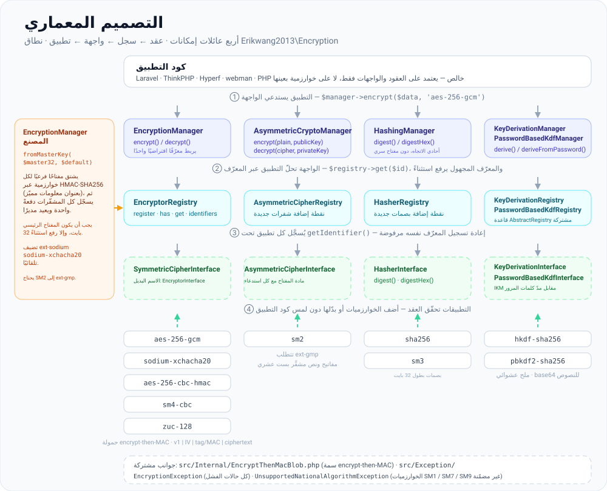
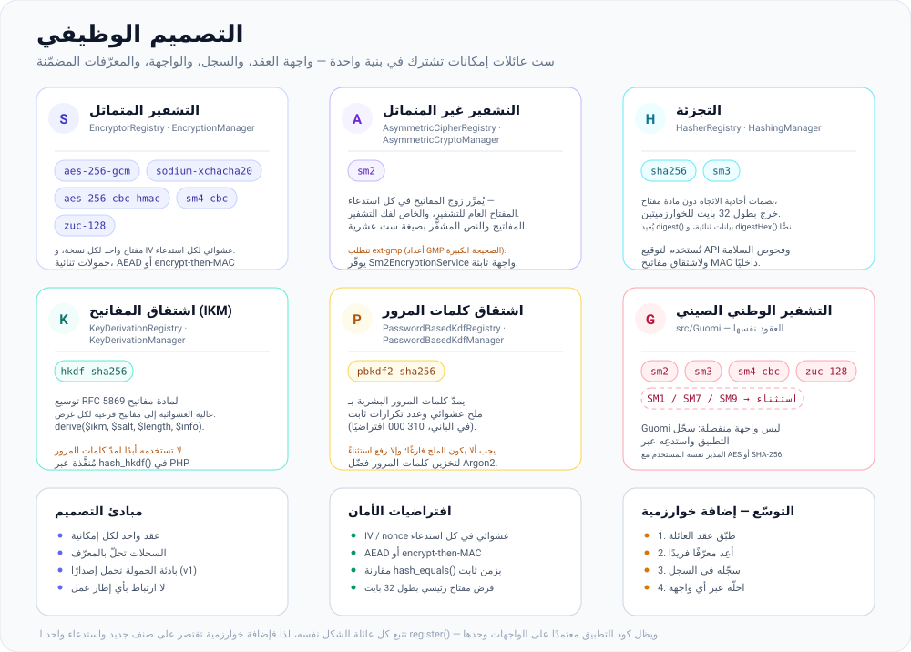
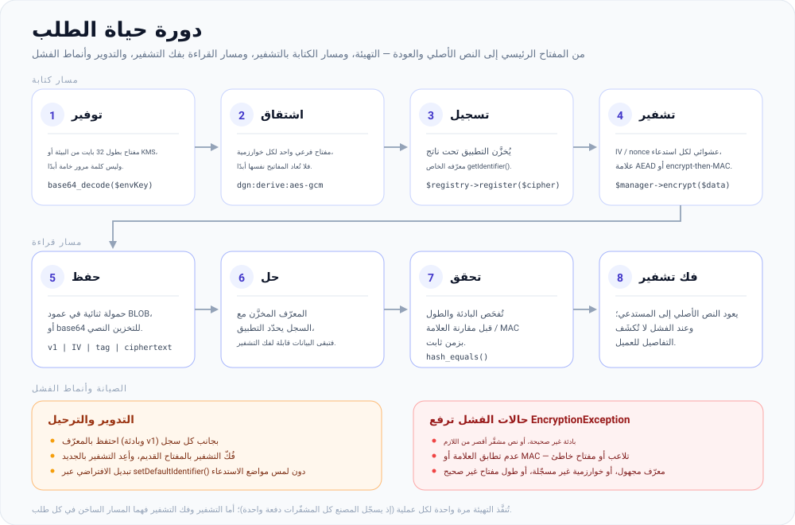

# erikwang2013/encryption

**Languages:** [English](../en/README.md) | [简体中文](../../../README.zh-CN.md) | [한국어](../ko/README.md) | [Русский](../ru/README.md) | [Deutsch](../de/README.md) | [Français](../fr/README.md) | [Español](../es/README.md) | [Português](../pt/README.md) | [हिन्दी](../hi/README.md) | **العربية** | [বাংলা](../bn/README.md) | [Bahasa Indonesia](../id/README.md) | [日本語](../ja/README.md)

<p align="center">
  
</p>

مكتبة مكوّنات تشفير قابلة للتوصيل: توفّر في إطار عقد موحّد **التشفير المتماثل** و**التشفير غير المتماثل** و**التجزئة** و**اشتقاق المفاتيح** (HKDF / PBKDF2)، مع تطبيقات تشمل AES/Sodium والخوارزميات الوطنية الصينية SM2/SM3/SM4/ZUC. قابلة للتثبيت عبر Composer.

**Locky**، القفل الظاهر أعلاه، هو تميمة المشروع: يحتفظ بمفتاح واحد لكل خوارزمية، وبـ IV جديد في كل استدعاء، وبفتحة مفتاح لا تفشي سرًّا. ويمكن لتطبيقك أن يعرضه أيضًا — إذ يُعيد `Mascot::svg()` الرسم لاستخدامه في HTML، ويُعيد `Mascot::ascii()` شعارًا لسطر الأوامر، وقيمة `Mascot::NAME` هي `Locky`.

## عن المشروع

### ما هي

`erikwang2013/encryption` مكتبة مكوّنات تشفير مكتوبة بلغة PHP خالصة، تمنح تطبيقات PHP تشفيرًا وتجزئةً واشتقاق مفاتيح **آمنة من ناحية الأنواع وقابلة للتوسّع**. لا تعتمد على أي إطار عمل، وتعمل بمعزل عن غيرها أو داخل Laravel وThinkPHP وHyperf وwebman.

تجد أدناه [بنية المشروع](#بنية-المشروع) إلى جانب مخططات SVG لكلٍّ من [التصميم المعماري](#نظرة-عامة-على-البنية) و[التصميم الوظيفي](#التصميم-الوظيفي) و[دورة حياة الطلب](#دورة-حياة-الطلب)؛ وتقع ملفات المخططات المصدرية في [`docs/`](../../).

### لماذا وُجدت

مشهد التشفير في PHP مُشتّت: فـ Laravel يوفّر `Crypt` خاصًّا به، والخوارزميات الوطنية الصينية (SM2/SM3/SM4) تفتقر إلى حزمة Composer موحّدة، وأساسيات اشتقاق المفاتيح (HKDF/PBKDF2) لا تجد واجهة مشتركة. تجمع هذه المكتبة الخوارزميات السائدة — المتماثلة وغير المتماثلة والتجزئة واشتقاق المفاتيح — تحت **نظام عقود واحد**، بحيث:

- **لا يعتمد كود التطبيق إلا على الواجهات** — ويصبح تبديل الخوارزميات بلا أي تغيير في منطق الأعمال
- **تحصل الخوارزميات الوطنية (Guomi) على معاملة من الدرجة الأولى** — إذ تُستدعى عبر المدير نفسه المستخدم مع AES/Sodium
- **إدارة المفاتيح موحّدة المعايير** — إذ تُشتق مفاتيح فرعية لكل خوارزمية من مفتاح رئيسي واحد، ما يمنع إعادة استخدام المفتاح نفسه بين الشفرات المختلفة
- **الإعدادات الافتراضية آمنة** — إذ يأتي التشفير الموثّق (GCM / encrypt-then-MAC) وقيم IV العشوائية والمقارنة بزمن ثابت جاهزةً منذ البداية

### حالات الاستخدام

- التشفير على مستوى الحقول (تشفير البيانات الشخصية مثل أرقام الهواتف أو أرقام الهوية قبل تخزينها في قاعدة البيانات)
- التعايش بين خوارزميات متعددة والترحيل التدريجي (مثل الانتقال من AES-256-CBC إلى AES-256-GCM)
- الأنظمة الخلفية المتوافقة مع الخوارزميات الوطنية الصينية (SM2 غير متماثل، SM3 للتجزئة، SM4 متماثل، ZUC شيفرة تدفقية)
- توقيع واجهات API والتحقق منها (HMAC / SHA-256 / SM3)
- اشتقاق مفاتيح فرعية من كلمات المرور أو من المفاتيح الرئيسية (PBKDF2 / HKDF)

## جدول المحتويات

- [التوافق مع أطر العمل](#التوافق-مع-أطر-العمل)
- [التكامل مع كل إطار عمل](#التكامل-مع-كل-إطار-عمل)
- [البدء السريع](#البدء-السريع)
- [نظرة عامة على البنية](#نظرة-عامة-على-البنية)
- [التصميم الوظيفي](#التصميم-الوظيفي)
- [دورة حياة الطلب](#دورة-حياة-الطلب)
- [المتطلبات](#المتطلبات)
- [التثبيت](#التثبيت)
- [الخوارزميات والمعرّفات المدمجة](#الخوارزميات-والمعرّفات-المدمجة)
- [الاستخدام](#الاستخدام)
- [بنية المشروع](#بنية-المشروع)
- [الأسئلة الشائعة](#الأسئلة-الشائعة)
- [ملاحظات أمنية](#ملاحظات-أمنية)
- [تشغيل الاختبارات](#تشغيل-الاختبارات)
- [الترخيص](#الترخيص)

---

## التوافق مع أطر العمل

لا تعتمد هذه الحزمة على أي إطار عمل ويب. فهي تُوزَّع كمكتبة Composer لا تحوي إلا الأصناف والتحميل التلقائي. وفي تطبيقك نفّذ `composer require erikwang2013/encryption`؛ فالتوجيه وحاوية الحقن والإعدادات لا علاقة لها بالأمر.

تحتاج إلى **PHP ≥ 8.0** وإلى الإضافات والاعتماديات المذكورة في [المتطلبات](#المتطلبات). وبذلك تعمل إصدارات أطر العمل التالية (جنبًا إلى جنب مع واجهات التشفير الخاصة بكل إطار؛ مع حقن `EncryptionManager` وغيره حسب الحاجة):

| إطار العمل | ملاحظات |
|-----------|--------|
| **Laravel** 7 / 8 / 9 / 10 / 11 | ثبّتها في بيئة تشغيل **PHP 8.0+**. الإصدار الوحيد الذي لا يستوفي قيد هذه الحزمة هو Laravel 7 العامل على PHP 7.x — فحدّث PHP أولًا. |
| **ThinkPHP** 6 / 8 | أضف الحزمة إلى `require` في ملف `composer.json` القياسي الخاص بالتطبيق. |
| **Hyperf** 2 / 3 | اطلبها في ملف `composer.json` الخاص بالخدمة؛ وسجّل singleton في `config` أو factory كما اعتدت في Hyperf. |
| **webman** 1 / 2 | نفّذ `composer require` في جذر المشروع؛ واستخدمها من أصناف الأعمال أو من مساعدات `support`. |

### التكامل مع كل إطار عمل

لا يوجد ServiceProvider مخصّص لـ Laravel ولا حزمة سلوك (behavior) مخصّصة لـ ThinkPHP. أنت تسجّل `EncryptionManager` (أو غيره من المدراء) في **حاوية الحقن (DI container)** أو في **factory للـ singleton** داخل إطار عملك، مع تحميل مفتاح رئيسي بطول 32 بايت من الإعدادات أو من متغيّرات البيئة. المقاطع التالية مختصرة إلى الحد الأدنى؛ **فاتبع سياستك الأمنية الخاصة** في التعامل مع المفاتيح (`.env`، KMS، خدمات الإعدادات) — ولا تضع الأسرار مباشرة في الكود.

**Laravel (في `App\Providers\AppServiceProvider` أو في ServiceProvider مخصّص)**

```php
use Erikwang2013\Encryption\EncryptionManagerFactory;

public function register(): void
{
    $this->app->singleton(\Erikwang2013\Encryption\EncryptionManager::class, function () {
        $raw = config('app.custom_master_key'); // e.g. base64 for 32 bytes
        $master = is_string($raw) ? base64_decode($raw, true) : '';
        if ($master === false || strlen($master) !== 32) {
            throw new \RuntimeException('Invalid 32-byte master key.');
        }
        return EncryptionManagerFactory::fromMasterKey($master, 'aes-256-gcm');
    });
}
```

استدعِها عبر `app(\Erikwang2013\Encryption\EncryptionManager::class)`. وهذا **لا** يحل محل `Crypt` / `encrypt()` في Laravel: فهدف هذه المكتبة هو التشفير على مستوى الحقول وسجلات الخوارزميات المتعددة، بينما تغطي مساعدات Laravel تسلسل بيانات الإطار وملفات تعريف الارتباط وما شابهها.

**ThinkPHP 6 / 8 (صنف خدمة أو factory في `common.php`)**

```php
use Erikwang2013\Encryption\EncryptionManagerFactory;

function app_encryption_manager(): \Erikwang2013\Encryption\EncryptionManager
{
    static $mgr = null;
    if ($mgr === null) {
        $master = base64_decode(config('app.master_key'), true);
        $mgr = EncryptionManagerFactory::fromMasterKey($master, 'aes-256-gcm');
    }
    return $mgr;
}
```

ويمكنك كذلك تعريف `EncryptionService` داخل `app\service` وحقنه في المتحكمات (controllers) لتسهيل المحاكاة في الاختبارات.

**Hyperf 2 / 3 (ملف `config/autoload/dependencies.php` أو factories بالتعليقات التوضيحية)**

```php
use Erikwang2013\Encryption\EncryptionManager;
use Erikwang2013\Encryption\EncryptionManagerFactory;

return [
    EncryptionManager::class => function () {
        $master = base64_decode((string) config('encryption.master_key'), true);
        return EncryptionManagerFactory::fromMasterKey($master, 'aes-256-gcm');
    },
];
```

في وضع الـ coroutine، إذا جاءت المفاتيح من إعدادات بعيدة، فخزّن القيمة المُحلَّلة في الذاكرة المؤقتة.

**webman 1 / 2**

سجّل `EncryptionManager` في حاوية `support` العامة داخل `config/plugin.php`، أو في `bootstrap` مخصّص، أو في `support/bootstrap.php` إن كنت تستخدم هذا النمط، أو أنشئها عبر `EncryptionManagerFactory::fromMasterKey(...)` داخل أصناف الخدمة. لا يفرض webman حاوية بعينها — **فاتبع اصطلاحات مشروعك**.

### مسائل لا تتعلق بهذه المكتبة

- ترقيات إطار العمل (مثل الانتقال من Laravel 10 إلى 11) **لا** تتطلب عادةً أي تغيير في واجهات هذه المكتبة. وإذا أبلغ Composer عن تعارض في إصدار PHP، فاتبع قيد `php` الخاص بهذه الحزمة في `composer.json`.
- تتطلب الخوارزمية الوطنية الصينية **SM2** الإضافة **`ext-gmp`**؛ وبدونها تفشل الأصناف المعنية في وقت التشغيل بصرف النظر عن إطار العمل.

---

## البدء السريع

1. في جذر مشروعك: `composer require erikwang2013/encryption:^1.0` (أو قيد الإصدار الذي نشرته).
2. تأكد من أن `php -v` تُظهر **8.0+** وأن `openssl` مفعّلة؛ ولاستخدام `sodium-xchacha20` أو SM2، ثبّت الإضافتين `sodium` و/أو `gmp` حسب الحاجة.
3. استخدم `use Erikwang2013\Encryption\...` واختر `EncryptionManager` أو التجزئة أو اشتقاق المفاتيح وغيرها كما هو موضّح في [الاستخدام](#الاستخدام).

---

## نظرة عامة على البنية

تُقسَّم الإمكانات إلى أربع عائلات من العقود، لكلٍّ منها سجلها الخاص وواجهة اختيارية (`*Manager`) لأغراض التركيب والاختبار. وتتخذ كل عائلة الشكل نفسه — واجهة العقد → السجل → الواجهة → التطبيقات — بينما تربط `EncryptionManagerFactory` العائلة المتماثلة انطلاقًا من مفتاح رئيسي واحد.



المصدر: [`docs/architecture-design.svg`](./architecture-design.svg)

| الإمكانية | العقد | السجل | الواجهة (الخوارزمية الافتراضية) |
|------------|----------|----------|----------------------------|
| التشفير المتماثل | `SymmetricCipherInterface` (الاسم البديل `EncryptorInterface`) | `EncryptorRegistry` | `EncryptionManager` |
| التشفير غير المتماثل | `AsymmetricCipherInterface` | `AsymmetricCipherRegistry` | `AsymmetricCryptoManager` |
| التجزئة | `HasherInterface` | `HasherRegistry` | `HashingManager` |
| اشتقاق المفاتيح (IKM) | `KeyDerivationInterface` | `KeyDerivationRegistry` | `KeyDerivationManager` |
| الاشتقاق من كلمات المرور | `PasswordBasedKdfInterface` | `PasswordBasedKdfRegistry` | `PasswordBasedKdfManager` |

ملاحظات التصميم:

- **التشفير المتماثل**: تربط كل نسخة مفتاحًا ثابتًا؛ والحمولات ثنائية — وهو مناسب لتشفير الحقول بالجملة.
- **التشفير غير المتماثل**: يمرّر كل استدعاء مادة المفتاح العام/الخاص (الصيغة يحدّدها التطبيق، مثل ترميز SM2 الست عشري).
- **التجزئة**: بصمات أحادية الاتجاه دون مفتاح سري (أو تجزئة قياسية على طريقة SM3).
- **اشتقاق المفاتيح**: توسّع **HKDF** مادة مفاتيح عالية العشوائية إلى مفاتيح فرعية؛ و**PBKDF2** يمدّ كلمات المرور البشرية (استخدم ملحًا عشوائيًا وعدد تكرارات مرتفعًا).

---

## التصميم الوظيفي

ست عائلات من الإمكانات، تأتي كل عائلة بالمعرّفات المذكورة أدناه. وإضافة خوارزمية جديدة تقتصر على صنف جديد واستدعاء واحد لـ `register()` — فلا يتغيّر شيء في النواة، ويظل كود التطبيق معتمدًا على الواجهات وحدها.



المصدر: [`docs/functional-design.svg`](./functional-design.svg)

| العائلة | المعرّف | الغرض |
|--------|-----------|----------------|
| التشفير المتماثل | `aes-256-gcm`, `sodium-xchacha20`, `aes-256-cbc-hmac`, `sm4-cbc`, `zuc-128` | تشفير على مستوى الحقول لأي حجم، بمفتاح واحد مرتبط بكل نسخة |
| التشفير غير المتماثل | `sm2` | مادة المفتاح العام/الخاص تُمرَّر مع كل استدعاء (ست عشري)، وتتطلب `ext-gmp` |
| التجزئة | `sha256`, `sm3` | بصمات أحادية الاتجاه للتوقيع وفحوص السلامة |
| اشتقاق المفاتيح (IKM) | `hkdf-sha256` | توسيع مادة مفاتيح عالية العشوائية إلى مفاتيح فرعية لكل غرض |
| الاشتقاق من كلمات المرور | `pbkdf2-sha256` | مدّ كلمات المرور البشرية (ملح عشوائي، 310 000 تكرار افتراضيًا) |
| Guomi (الخوارزميات الوطنية) | SM2 / SM3 / SM4 / ZUC | الخوارزميات الوطنية عبر العقود نفسها؛ أما SM1 / SM7 / SM9 فترفع `UnsupportedNationalAlgorithmException` |

---

## دورة حياة الطلب

تُنفَّذ التهيئة مرة واحدة لكل عملية (process)؛ أما التشفير وفك التشفير فهما المسار الساخن في كل طلب. وتحمل كل حمولة بادئة إصدار (`v1`)، فيبقى النص المشفَّر المكتوب اليوم قابلًا للقراءة بعد أي تدوير للمفاتيح.



المصدر: [`docs/lifecycle.svg`](./lifecycle.svg)

1. **التوفير** — مفتاح رئيسي بطول 32 بايت من `.env` أو من KMS؛ ويرفض المصنع أي طول آخر.
2. **الاشتقاق والتسجيل** — تشتق `EncryptionManagerFactory::fromMasterKey()` مفتاحًا فرعيًا واحدًا لكل خوارزمية باستخدام HMAC-SHA256 (بعنوان معلومات مميّز لكلٍّ منها)، وتسجّل كل المشفّرات دفعة واحدة.
3. **التشفير** — `$manager->encrypt($data, 'aes-256-gcm')`؛ ويُولَّد IV/nonce عشوائي في كل استدعاء، وتُحسب العلامة (tag) أو MAC على النص المشفَّر.
4. **الحفظ** — تُكتب الحمولة الثنائية `v1 | IV | tag/MAC | ciphertext` في عمود `BLOB`، أو تُرمَّز بـ `base64_encode` للتخزين النصي.
5. **فك التشفير** — يختار المعرّف المخزَّن التطبيق المناسب، وتُفحَص البادئة والطول، وتُقارَن العلامة/MAC بزمن ثابت، وعندها فقط يُعاد النص الأصلي. وأي فشل يرفع `EncryptionException`.

---

## المتطلبات

| البند | التفاصيل |
|------|---------|
| PHP | `^8.0` (عند الدمج مع أطر العمل المذكورة أعلاه، يسود هذا القيد) |
| الإضافة | `ext-openssl` (مطلوبة) |
| الإضافة | `ext-sodium` (اختيارية، من أجل `sodium-xchacha20`) |
| الإضافة | `ext-gmp` (اختيارية، لتشفير وفك تشفير **SM2** وتوليد المفاتيح) |
| Composer | `pohoc/crypto-sm` (اعتمادية؛ أغلفة SM2/SM3/SM4) |

## التثبيت

### من مسار محلي (للتطوير)

في ملف `composer.json` الخاص بالمشروع المستهلِك:

```json
{
    "repositories": [
        {
            "type": "path",
            "url": "/absolute/path/to/encryption"
        }
    ],
    "require": {
        "erikwang2013/encryption": "@dev"
    }
}
```

ثم:

```bash
composer update erikwang2013/encryption
```

### من Git / Packagist (بعد الإصدار)

```bash
composer require erikwang2013/encryption:^1.0
```

(ادفع المستودع إلى Git remote متاح وإلى مصدر Composer، أو انشره على Packagist.)

---

## الخوارزميات والمعرّفات المدمجة

### التشفير المتماثل (`SymmetricCipherInterface`)

| المعرّف (`getIdentifier`) | الصنف | طول المفتاح | ملاحظات |
|------------------------------|-------|------------|--------|
| `aes-256-gcm` | `Aes256GcmEncryptor` | 32 بايت | AEAD؛ الخيار الافتراضي الموصى به للأنظمة الجديدة |
| `sodium-xchacha20` | `SodiumXChaCha20Encryptor` | 32 بايت | تتطلب `ext-sodium` |
| `aes-256-cbc-hmac` | `OpenSslAes256CbcEncryptor` | 32 بايت | CBC + HMAC للتوافق مع الأنظمة القديمة |
| `sm4-cbc` | `Sm4CbcEncryptor` | 16 بايت | SM4-CBC (OpenSSL SM4) |
| `zuc-128` | `ZucEncryptor` | 16 بايت | شيفرة تدفقية ZUC-128 |

### التشفير غير المتماثل (`AsymmetricCipherInterface`)

| المعرّف | الصنف | ملاحظات |
|------------|-------|--------|
| `sm2` | `Sm2AsymmetricCipher` | SM2؛ المفاتيح والنص المشفَّر بترميز ست عشري؛ تتطلب `ext-gmp` |

يمكنك أيضًا استخدام الواجهة الثابتة `Sm2EncryptionService`؛ وسلوكها مطابق لـ `Sm2AsymmetricCipher`.

### التجزئة (`HasherInterface`)

| المعرّف | الصنف | طول الخرج |
|------------|-------|-----------------|
| `sha256` | `Sha256Hasher` | 32 بايت |
| `sm3` | `Sm3Hasher` | 32 بايت |

### اشتقاق المفاتيح

| المعرّف | الصنف | العقد | ملاحظات |
|------------|-------|----------|--------|
| `hkdf-sha256` | `HkdfSha256` | `KeyDerivationInterface` | RFC 5869: IKM + salt + info |
| `pbkdf2-sha256` | `Pbkdf2Sha256` | `PasswordBasedKdfInterface` | كلمة المرور + الملح + عدد التكرارات (في الباني) |

النصوص المشفَّرة والبصمات ثنائية عادةً؛ ولتخزينها في JSON أو كنصوص، طبّق `base64_encode` / `base64_decode` بنفسك.

---

## الاستخدام

### 1. التشفير المتماثل: خوارزمية واحدة والسجل

```php
<?php

use Erikwang2013\Encryption\Encryptor\Aes256GcmEncryptor;
use Erikwang2013\Encryption\EncryptionManager;
use Erikwang2013\Encryption\EncryptorRegistry;

$key = random_bytes(32);
$encryptor = new Aes256GcmEncryptor($key);
$ciphertext = $encryptor->encrypt('plaintext');
$plaintext  = $encryptor->decrypt($ciphertext);

$registry = new EncryptorRegistry(new Aes256GcmEncryptor($key));
$manager = new EncryptionManager($registry, 'aes-256-gcm');
$blob = $manager->encrypt('data');
```

مصنع المفتاح الرئيسي: تشتق `EncryptionManagerFactory::fromMasterKey($masterKey32, 'aes-256-gcm')` مفاتيح فرعية لكل خوارزمية، وتسجّل **aes-256-gcm** و**aes-256-cbc-hmac** و**sm4-cbc** و**zuc-128** و**sodium-xchacha20** (إذا كانت ext-sodium متاحة) دفعة واحدة.

### 2. التشفير غير المتماثل

```php
<?php

use Erikwang2013\Encryption\Asymmetric\Sm2AsymmetricCipher;
use Erikwang2013\Encryption\AsymmetricCipherRegistry;
use Erikwang2013\Encryption\AsymmetricCryptoManager;
use Erikwang2013\Encryption\Guomi\Sm2EncryptionService;

// requires ext-gmp
$pair = Sm2EncryptionService::generateKeyPairHex();

$cipher = new Sm2AsymmetricCipher();
$hexCipher = $cipher->encrypt('plaintext', $pair->getPublicKey());
$plain = $cipher->decrypt($hexCipher, $pair->getPrivateKey());

$mgr = new AsymmetricCryptoManager(new AsymmetricCipherRegistry($cipher), 'sm2');
$hexCipher2 = $mgr->encrypt('plaintext', $pair->getPublicKey());
```

### 3. التجزئة

```php
<?php

use Erikwang2013\Encryption\Hash\Sha256Hasher;
use Erikwang2013\Encryption\Guomi\Sm3Hasher;
use Erikwang2013\Encryption\HasherRegistry;
use Erikwang2013\Encryption\HashingManager;

$registry = new HasherRegistry(
    new Sha256Hasher(),
    new Sm3Hasher(),
);
$hashing = new HashingManager($registry, 'sha256');
$bin = $hashing->digest('data');
$hex = $hashing->digestHex('data', 'sm3');
```

### 4. اشتقاق المفاتيح (HKDF / PBKDF2)

```php
<?php

use Erikwang2013\Encryption\Kdf\HkdfSha256;
use Erikwang2013\Encryption\Kdf\Pbkdf2Sha256;
use Erikwang2013\Encryption\KeyDerivationManager;
use Erikwang2013\Encryption\KeyDerivationRegistry;
use Erikwang2013\Encryption\PasswordBasedKdfManager;
use Erikwang2013\Encryption\PasswordBasedKdfRegistry;

// Derive subkey from high-entropy material (e.g. TLS, envelope subkeys)
$hkdf = new HkdfSha256();
$subKey = $hkdf->derive($ikm32, $salt, 32, 'app:v1');

$kdfMgr = new KeyDerivationManager(new KeyDerivationRegistry($hkdf), 'hkdf-sha256');

// Derive from user password (for password storage prefer password_hash / Argon2, etc.)
$pbkdf2 = new Pbkdf2Sha256(iterations: 310_000);
$derived = $pbkdf2->deriveFromPassword('user password', random_bytes(16), 32);

$pwdMgr = new PasswordBasedKdfManager(new PasswordBasedKdfRegistry($pbkdf2), 'pbkdf2-sha256');
```

### 5. الخوارزميات الوطنية الصينية (SM3 / SM4 / ZUC / SM2)

```php
<?php

use Erikwang2013\Encryption\Guomi\Sm2EncryptionService;
use Erikwang2013\Encryption\Guomi\Sm3Hasher;
use Erikwang2013\Encryption\Guomi\Sm4CbcEncryptor;
use Erikwang2013\Encryption\Guomi\ZucEncryptor;

$sm3 = new Sm3Hasher();
$bin = $sm3->digest('data');

$key16 = random_bytes(16);
$sm4 = new Sm4CbcEncryptor($key16);
$blob = $sm4->encrypt('plaintext');

$zuc = new ZucEncryptor($key16);
$blob2 = $zuc->encrypt('plaintext');

// SM2: see asymmetric example above or Sm2EncryptionService
```

أما الخوارزميات SM1 وSM7 وSM9: فترفع `UnavailableNationalAlgorithms::sm1()` ونظيراتها الاستثناء `UnsupportedNationalAlgorithmException`.

### 6. الإضافات المخصصة

- التشفير المتماثل: طبّق `EncryptorInterface` (`SymmetricCipherInterface`)، ثم سجّلها في `EncryptorRegistry`.
- التشفير غير المتماثل: طبّق `AsymmetricCipherInterface`، ثم سجّلها في `AsymmetricCipherRegistry`.
- التجزئة: طبّق `HasherInterface`، ثم سجّلها في `HasherRegistry`.
- اشتقاق المفاتيح: طبّق `KeyDerivationInterface` أو `PasswordBasedKdfInterface`، ثم سجّلها في الـ `Registry` المطابق.

### 7. الاستثناءات

ترفع حالات الفشل `Erikwang2013\Encryption\Exception\EncryptionException`؛ أما الخوارزميات الوطنية غير المتاحة فتستخدم `UnsupportedNationalAlgorithmException`. التقط الاستثناءات وسجّلها في كود التطبيق، ولا تفشِ التفاصيل للعملاء.

---

## بنية المشروع

```text
encryption/
├── src/
│   ├── Contract/                    واجهات الإمكانات — العقد العام:
│   │                                SymmetricCipherInterface (alias EncryptorInterface),
│   │                                AsymmetricCipherInterface, HasherInterface,
│   │                                KeyDerivationInterface, PasswordBasedKdfInterface
│   ├── Encryptor/                   Aes256GcmEncryptor, OpenSslAes256CbcEncryptor,
│   │                                SodiumXChaCha20Encryptor
│   ├── Asymmetric/                  Sm2AsymmetricCipher
│   ├── Hash/                        Sha256Hasher
│   ├── Kdf/                         HkdfSha256, Pbkdf2Sha256
│   ├── Guomi/                       Sm2EncryptionService, Sm3Hasher, Sm4CbcEncryptor,
│   │                                ZucEncryptor, UnavailableNationalAlgorithms
│   │   └── Internal/ZucEngine.php   محرّك تدفّق مفاتيح ZUC
│   ├── Internal/                    EncryptThenMacBlob trait (encrypt-then-MAC مشترك)
│   ├── Exception/                   EncryptionException,
│   │                                UnsupportedNationalAlgorithmException
│   ├── AbstractRegistry.php         مخزن المعرّف ← التطبيق، تتقاسمه السجلات
│   ├── EncryptorRegistry.php        AsymmetricCipherRegistry.php, HasherRegistry.php,
│   │                                KeyDerivationRegistry.php, PasswordBasedKdfRegistry.php
│   ├── EncryptionManager.php        AsymmetricCryptoManager.php, HashingManager.php,
│   │                                KeyDerivationManager.php, PasswordBasedKdfManager.php
│   ├── EncryptionManagerFactory.php المفتاح الرئيسي ← مفاتيح فرعية لكل خوارزمية ← السجل
│   └── Mascot.php                   واجهة اختيارية للتميمة (SVG / ASCII)؛ لا يستدعيها كود التشفير أبدًا
├── tests/                           مجموعات PHPUnit: العقود والسجلات والمدراء
│                                    واختبارات الخوارزميات مع مساعدات TestCase
├── docs/                            التميمة ومخططات التصميم
│   ├── mascot.svg                   تميمة المشروع (Locky)
│   ├── architecture-design.svg      مُضمَّن في «نظرة عامة على البنية»
│   ├── functional-design.svg        مُضمَّن في «التصميم الوظيفي»
│   ├── lifecycle.svg                مُضمَّن في «دورة حياة الطلب»
│   └── *.md                         أرشيف تقارير المراجعة والاختبارات
├── composer.json                    تحميل psr-4 التلقائي، PHP ^8.0، اعتمادية phpunit للتطوير
├── phpunit.xml.dist
└── README.md  README.zh-CN.md
```

| المسار | الغرض |
|------|---------|
| `src/Contract/` | واجهات الإمكانات (`EncryptorInterface`، `HasherInterface`، …) |
| `src/Encryptor/`, `src/Asymmetric/`, `src/Hash/`, `src/Kdf/` | تطبيقات الخوارزميات |
| `src/Guomi/` | التشفير الوطني الصيني و`UnavailableNationalAlgorithms` |
| `src/Internal/` | `EncryptThenMacBlob` — encrypt-then-MAC المشترك بين CBC وSM4 وZUC |
| `src/Exception/` | `EncryptionException` وغيره |
| `*Registry.php`, `*Manager.php`, `EncryptionManagerFactory.php` | السجلات والواجهات ومصنع المفتاح الرئيسي |
| `docs/*.svg` | التميمة ومخططات التصميم المُضمَّنة في هذا الملف |

بادئة النطاق (namespace): `Erikwang2013\Encryption\`، وهي متوافقة مع `psr-4` في Composer.

---

## الأسئلة الشائعة

**يبلّغ Composer عن تعارض في إصدار PHP**

تشترط هذه الحزمة `php ^8.0`. فإذا كان التطبيق ما زال يعمل على PHP 8.0 أو أقل، فحدّث PHP أو لا تستخدم هذه الحزمة.

**`sodium-xchacha20` غير متاحة**

ثبّت إضافة `sodium` وفعّلها (`ext-sodium`). وبدونها يفشل `EncryptionManagerFactory::fromMasterKey(..., 'sodium-xchacha20')`؛ فاستخدم `aes-256-gcm` بدلًا منها.

**أخطاء في SM2 أو فشل في توليد المفاتيح**

ثبّت **`ext-gmp`** وفعّلها. فـ SM2 يعتمد على الأعداد الصحيحة الكبيرة، وبدون GMP لا يمكن ضمان السلوك.

**تخزين النص المشفَّر في قاعدة بيانات أو JSON**

استخدم `BLOB` للأعمدة الثنائية؛ وإذا لزمك التخزين النصي، فرمّز النص المشفَّر وقيم IV بـ **`base64_encode`**، ثم فكّ الترميز بـ **`base64_decode`** قبل فك التشفير.

**الفرق عن `encrypt()` / `Crypt` في Laravel**

تستهدف واجهة Laravel تسلسل بيانات الإطار وملفات تعريف الارتباط؛ أما هذه المكتبة فتستهدف **معرّفات الخوارزميات الصريحة، والسجلات المتعددة، والخوارزميات الوطنية، وHKDF/PBKDF2** وغيرها. ويمكنهما التعايش — لكن لا تخلط المفاتيح بينهما إلا إذا وحّدت الصيغ بنفسك.

---

## ملاحظات أمنية

1. **المفاتيح**: استخدم `random_bytes()` أو KMS للحصول على مفاتيح عالية العشوائية؛ ولا تستخدم كلمات المرور الخام مفاتيحَ لـ AES أبدًا — بل مدّها أولًا بـ **PBKDF2 / Argon2**.
2. **الخوارزميات**: فضّل **AES-256-GCM** أو **Sodium** للأنظمة الجديدة؛ واستخدم **SM3/SM4/ZUC/SM2** حيث تُشترط؛ و**HKDF** لتوسيع المفاتيح الفرعية؛ وأما **PBKDF2** لمدّ كلمات المرور فاستخدم له عدد تكرارات كافيًا وملحًا عشوائيًا.
3. **النقل**: استخدم TLS دائمًا أثناء النقل؛ فهذه المكتبة تتولى التشفير على مستوى الحقول والبصمات.
4. **الترحيل**: تتبّع `identifier` مع كل إصدار خوارزمية، حتى يمكن فك تشفير البيانات القديمة وإعادة تشفيرها.

---

## تشغيل الاختبارات

بعد الاستنساخ:

```bash
composer install
composer test
```

وهو مكافئ لـ `./vendor/bin/phpunit tests/`. وإذا أضفت ملف `phpunit.xml`، فوجّه إليه سكربت `test` في `composer.json`.

---

## شكرًا لدعمكم

| WeChat Pay | Alipay |
|:---:|:---:|
|  |  |

---

## الترخيص

MIT (انظر حقل `license` في `composer.json`).
