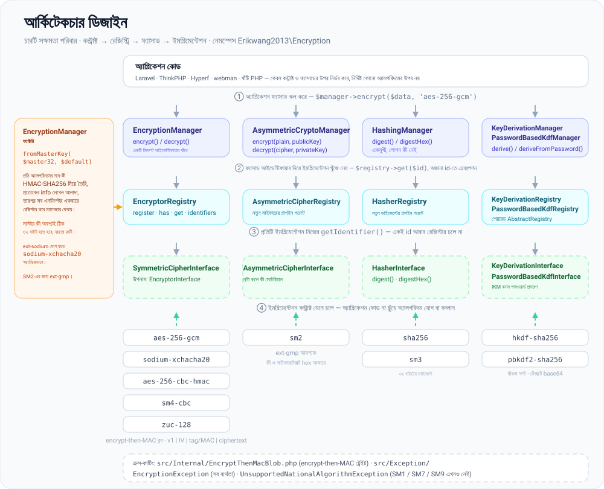
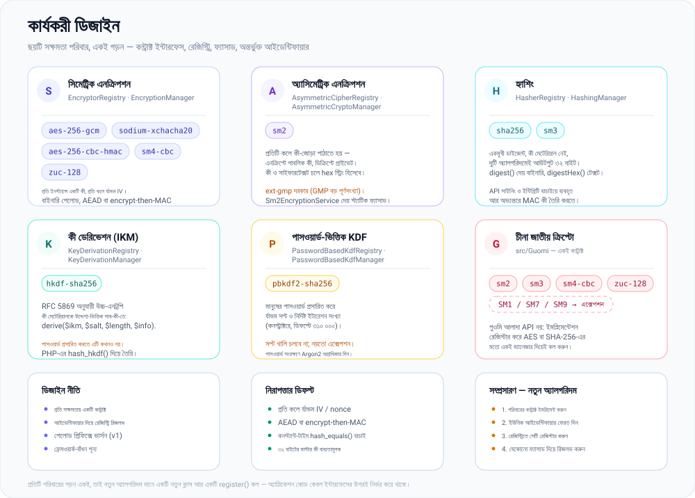
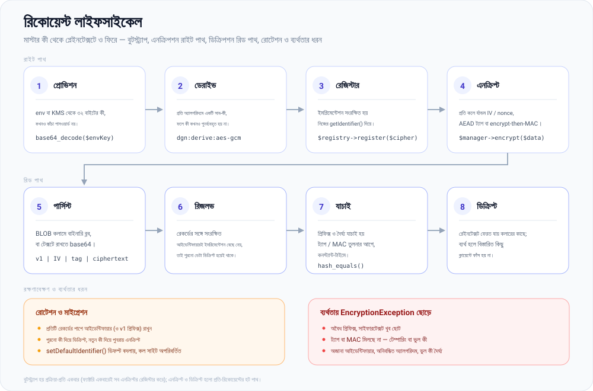

# erikwang2013/encryption

**Languages:** [English](../en/README.md) | [简体中文](../../../README.zh-CN.md) | [한국어](../ko/README.md) | [Русский](../ru/README.md) | [Deutsch](../de/README.md) | [Français](../fr/README.md) | [Español](../es/README.md) | [Português](../pt/README.md) | [हिन्दी](../hi/README.md) | [العربية](../ar/README.md) | **বাংলা** | [Bahasa Indonesia](../id/README.md) | [日本語](../ja/README.md)

<p align="center">
  
</p>

একটি প্লাগযোগ্য ক্রিপ্টোগ্রাফি কম্পোনেন্ট লাইব্রেরি: একটি অভিন্ন কন্ট্রাক্টের অধীনে এটি **সিমেট্রিক এনক্রিপশন**, **অ্যাসিমেট্রিক এনক্রিপশন**, **হ্যাশিং** এবং **কী ডেরিভেশন** (HKDF / PBKDF2) প্রদান করে; এর ইমপ্লিমেন্টেশনের মধ্যে রয়েছে AES/Sodium এবং চীনা জাতীয় অ্যালগরিদম SM2/SM3/SM4/ZUC। Composer দিয়ে ইনস্টল করা যায়।

উপরের তালাটিই **Locky**, প্রকল্পের মাসকট: এটি প্রতি অ্যালগরিদমে একটি করে কী রাখে, প্রতিটি কলে নতুন IV নেয়, আর তার কীহোল কখনও কিছু বলে না। আপনার নিজের অ্যাপও এটিকে দেখাতে পারে — `Mascot::svg()` HTML-এর জন্য ছবিটি ফেরত দেয়, `Mascot::ascii()` টার্মিনাল ব্যানার দেয়, আর `Mascot::NAME` হলো `Locky`।

## প্রকল্প সম্পর্কে

### এটি কী

`erikwang2013/encryption` একটি বিশুদ্ধ PHP ক্রিপ্টোগ্রাফি কম্পোনেন্ট লাইব্রেরি, যা PHP অ্যাপ্লিকেশনকে **টাইপ-নিরাপদ ও সম্প্রসারণযোগ্য** এনক্রিপশন, হ্যাশিং এবং কী ডেরিভেশন দেয়। এতে কোনো ফ্রেমওয়ার্কের নির্ভরতা নেই; এটি স্বতন্ত্রভাবে বা Laravel, ThinkPHP, Hyperf ও webman-এর ভিতরে কাজ করে।

নিচে রয়েছে [প্রকল্পের কাঠামো](#প্রকল্পের-কাঠামো) এবং [আর্কিটেকচার পরিচিতি](#আর্কিটেকচার-পরিচিতি), [কার্যকরী ডিজাইন](#কার্যকরী-ডিজাইন) ও [রিকোয়েস্ট লাইফসাইকেল](#রিকোয়েস্ট-লাইফসাইকেল)-এর SVG ডায়াগ্রাম; ডায়াগ্রামের সোর্স রয়েছে [`docs/`](../../)-এ।

### কেন এটি তৈরি

PHP-এর ক্রিপ্টোগ্রাফি জগৎ বিচ্ছিন্ন: Laravel নিজস্ব `Crypt` নিয়ে আসে, চীনা জাতীয় অ্যালগরিদমগুলোকে (SM2/SM3/SM4) একটি অভিন্ন Composer প্যাকেজে পাওয়া যায় না, আর কী ডেরিভেশনের প্রিমিটিভগুলোকে (HKDF/PBKDF2) বাঁধার কোনো সাধারণ ইন্টারফেস নেই। এই লাইব্রেরি প্রধান সিমেট্রিক/অ্যাসিমেট্রিক/হ্যাশ/KDF অ্যালগরিদমগুলোকে একটি **একক কন্ট্রাক্ট সিস্টেমের** অধীনে আনে, যাতে:

- **অ্যাপ্লিকেশন কোড কেবল ইন্টারফেসের উপর নির্ভর করে** — অ্যালগরিদম বদলাতে ব্যবসায়িক লজিকে একটুও পরিবর্তন লাগে না
- **গুওমি অ্যালগরিদম প্রথম শ্রেণির সুবিধা পায়** — AES/Sodium-এর মতো একই Manager দিয়েই সেগুলো কল করুন
- **কী ম্যানেজমেন্ট প্রমিত** — একটি মাস্টার কী থেকে প্রতি অ্যালগরিদমের সাব-কী তৈরি হয়, ফলে বিভিন্ন সাইফারে একই কী পুনর্ব্যবহৃত হয় না
- **নিরাপদ ডিফল্ট আগে থেকেই আছে** — অথেনটিকেটেড এনক্রিপশন (GCM / encrypt-then-MAC), র্যান্ডম IV এবং কনস্ট্যান্ট-টাইম তুলনা ডিফল্টভাবেই পাওয়া যায়

### ব্যবহারের ক্ষেত্র

- ফিল্ড-লেভেল এনক্রিপশন (ডেটাবেসে রাখার আগে ফোন নম্বর বা পরিচয়পত্র নম্বরের মতো ব্যক্তিগত তথ্য এনক্রিপ্ট করা)
- একাধিক অ্যালগরিদমের সহাবস্থান ও ধাপে ধাপে মাইগ্রেশন (যেমন AES-256-CBC থেকে AES-256-GCM)
- গুওমি-সম্মত ব্যাক-অফিস সিস্টেম (SM2 অ্যাসিমেট্রিক, SM3 হ্যাশিং, SM4 সিমেট্রিক, ZUC স্ট্রিম সাইফার)
- API সাইনিং ও যাচাই (HMAC / SHA-256 / SM3)
- পাসওয়ার্ড বা মাস্টার কী থেকে সাব-কী ডেরিভেশন (PBKDF2 / HKDF)

## সূচিপত্র

- [ফ্রেমওয়ার্ক সামঞ্জস্য](#ফ্রেমওয়ার্ক-সামঞ্জস্য)
- [প্রতিটি ফ্রেমওয়ার্কে ইন্টিগ্রেশন](#প্রতিটি-ফ্রেমওয়ার্কে-ইন্টিগ্রেশন)
- [দ্রুত শুরু](#দ্রুত-শুরু)
- [আর্কিটেকচার পরিচিতি](#আর্কিটেকচার-পরিচিতি)
- [কার্যকরী ডিজাইন](#কার্যকরী-ডিজাইন)
- [রিকোয়েস্ট লাইফসাইকেল](#রিকোয়েস্ট-লাইফসাইকেল)
- [প্রয়োজনীয়তা](#প্রয়োজনীয়তা)
- [ইনস্টলেশন](#ইনস্টলেশন)
- [অন্তর্নির্মিত অ্যালগরিদম ও আইডেন্টিফায়ার](#অন্তর্নির্মিত-অ্যালগরিদম-ও-আইডেন্টিফায়ার)
- [ব্যবহার](#ব্যবহার)
- [প্রকল্পের কাঠামো](#প্রকল্পের-কাঠামো)
- [সাধারণ প্রশ্ন](#সাধারণ-প্রশ্ন)
- [নিরাপত্তা নির্দেশিকা](#নিরাপত্তা-নির্দেশিকা)
- [টেস্ট চালানো](#টেস্ট-চালানো)
- [লাইসেন্স](#লাইসেন্স)

---

## ফ্রেমওয়ার্ক সামঞ্জস্য

এই প্যাকেজ কোনো ওয়েব ফ্রেমওয়ার্কের উপর **নির্ভর করে না**। এটি কেবল ক্লাস ও অটোলোডিং নিয়ে একটি Composer লাইব্রেরি হিসেবে আসে। আপনার অ্যাপ্লিকেশনে `composer require erikwang2013/encryption` চালান; রাউটিং, কন্টেইনার বা কনফিগারেশনের কিছুই লাগে না।

আপনার প্রয়োজন **PHP ≥ 8.0** এবং [প্রয়োজনীয়তা](#প্রয়োজনীয়তা) অংশে তালিকাভুক্ত এক্সটেনশন/নির্ভরতাগুলো। সেগুলো থাকলে নিচের ফ্রেমওয়ার্ক সংস্করণগুলো কাজ করে (প্রতিটি ফ্রেমওয়ার্কের নিজস্ব ক্রিপ্টো API-এর পাশাপাশি; প্রয়োজন অনুযায়ী `EncryptionManager` ইত্যাদি ইনজেক্ট করুন):

| ফ্রেমওয়ার্ক | মন্তব্য |
|-----------|--------|
| **Laravel** 7 / 8 / 9 / 10 / 11 | **PHP 8.0+** রানটাইমে ইনস্টল করুন। কেবল PHP 7.x-এ চলতে থাকা Laravel 7 এই প্যাকেজের শর্ত পূরণ করে না—আগে PHP আপগ্রেড করুন। |
| **ThinkPHP** 6 / 8 | অ্যাপের সাধারণ `composer.json`-এর `require`-এ প্যাকেজটি যোগ করুন। |
| **Hyperf** 2 / 3 | সার্ভিসের `composer.json`-এ require করুন; Hyperf-এ যেমন করেন, তেমনি `config`-এ একটি সিঙ্গলটন বা একটি ফ্যাক্টরি রেজিস্টার করুন। |
| **webman** 1 / 2 | প্রকল্পের রুটে `composer require`; ব্যবসায়িক ক্লাস বা `support` হেল্পার থেকে ব্যবহার করুন। |

### প্রতিটি ফ্রেমওয়ার্কে ইন্টিগ্রেশন

Laravel-এর জন্য আলাদা কোনো ServiceProvider বা ThinkPHP-এর জন্য প্রস্তুত behavior bundle **নেই**। আপনি আপনার ফ্রেমওয়ার্কের **DI কন্টেইনার** বা **সিঙ্গলটন ফ্যাক্টরিতে** `EncryptionManager` (বা অন্য ম্যানেজারগুলো) রেজিস্টার করেন, আর কনফিগ বা এনভায়রনমেন্ট থেকে ৩২ বাইটের মাস্টার কী লোড করেন। নিচের স্নিপেটগুলো সংক্ষিপ্ত; কী মেটেরিয়ালের (`.env`, KMS, কনফিগ সার্ভিস) ক্ষেত্রে **নিজের নিরাপত্তা নীতি মেনে চলুন**—সিক্রেট হার্ড-কোড করবেন না।

**Laravel (`App\Providers\AppServiceProvider` বা আলাদা ServiceProvider)**

```php
use Erikwang2013\Encryption\EncryptionManagerFactory;

public function register(): void
{
    $this->app->singleton(\Erikwang2013\Encryption\EncryptionManager::class, function () {
        $raw = config('app.custom_master_key'); // e.g. base64 for 32 bytes
        $master = is_string($raw) ? base64_decode($raw, true) : '';
        if ($master === false || strlen($master) !== 32) {
            throw new \RuntimeException('Invalid 32-byte master key.');
        }
        return EncryptionManagerFactory::fromMasterKey($master, 'aes-256-gcm');
    });
}
```

`app(\Erikwang2013\Encryption\EncryptionManager::class)` দিয়ে রিজলভ করুন। এটি Laravel-এর `Crypt` / `encrypt()`-কে **প্রতিস্থাপন করে না**: এই লাইব্রেরির লক্ষ্য ফিল্ড-লেভেল এনক্রিপশন ও একাধিক অ্যালগরিদমের রেজিস্ট্রি; Laravel-এর হেল্পারগুলো ফ্রেমওয়ার্কের সিরিয়ালাইজেশন, কুকি ইত্যাদি সামলায়।

**ThinkPHP 6 / 8 (`common.php`-এ সার্ভিস ক্লাস বা ফ্যাক্টরি)**

```php
use Erikwang2013\Encryption\EncryptionManagerFactory;

function app_encryption_manager(): \Erikwang2013\Encryption\EncryptionManager
{
    static $mgr = null;
    if ($mgr === null) {
        $master = base64_decode(config('app.master_key'), true);
        $mgr = EncryptionManagerFactory::fromMasterKey($master, 'aes-256-gcm');
    }
    return $mgr;
}
```

টেস্টে সহজে মক করার জন্য `app\service`-এর অধীনে `EncryptionService` সংজ্ঞায়িত করে কন্ট্রোলারে ইনজেক্টও করতে পারেন।

**Hyperf 2 / 3 (`config/autoload/dependencies.php` বা annotation ফ্যাক্টরি)**

```php
use Erikwang2013\Encryption\EncryptionManager;
use Erikwang2013\Encryption\EncryptionManagerFactory;

return [
    EncryptionManager::class => function () {
        $master = base64_decode((string) config('encryption.master_key'), true);
        return EncryptionManagerFactory::fromMasterKey($master, 'aes-256-gcm');
    },
];
```

করুটিন মোডে, কী যদি দূরের কনফিগ থেকে আসে, তবে পার্স করা মানটি ক্যাশে রাখুন।

**webman 1 / 2**

`config/plugin.php`-এ গ্লোবাল `support` কন্টেইনারে, কাস্টম `bootstrap`-এ, অথবা আপনি যদি সেই প্যাটার্ন ব্যবহার করেন তবে `support/bootstrap.php`-এ `EncryptionManager` রেজিস্টার করুন; কিংবা সার্ভিস ক্লাসের ভিতরে `EncryptionManagerFactory::fromMasterKey(...)` দিয়ে তৈরি করুন। webman কোনো নির্দিষ্ট কন্টেইনার চাপিয়ে দেয় না—**আপনার প্রকল্পের রীতিনীতি অনুসরণ করুন**।

**ভ্যানিলা PHP (ফ্রেমওয়ার্ক ছাড়া)**

এখানে নিবন্ধনের জন্য কোনো কন্টেইনার নেই: প্রজেক্ট রুটে `composer require` চালান, তারপর ম্যানেজার একবার তৈরি করে সেটিই পুনরায় ব্যবহার করুন। এই অংশটির চালানো-যোগ্য সংস্করণ আছে [`examples/plain-php/`](../../../examples/plain-php)-এ — `php examples/plain-php/demo.php` এনক্রিপশন → সংরক্ষণ → পড়া → ডিক্রিপশন → টেম্পার শনাক্তকরণের পূর্ণ চক্র দেখায়।

```php
// bootstrap.php — require this once from your front controller
use Erikwang2013\Encryption\EncryptionManagerFactory;

$raw = getenv('ENCRYPTION_MASTER_KEY');            // base64 of 32 random bytes
$key = is_string($raw) ? base64_decode($raw, true) : false;
if ($key === false || strlen($key) !== 32) {
    throw new RuntimeException('ENCRYPTION_MASTER_KEY must be base64 of 32 bytes.');
}
$manager = EncryptionManagerFactory::fromMasterKey($key, 'aes-256-gcm');

// anywhere else in the project
$stored = base64_encode($manager->encrypt($phone));   // store as TEXT
$phone  = $manager->decrypt(base64_decode($stored));  // read it back
```

```bash
# generate the key once, keep it in the server environment — never in the code
export ENCRYPTION_MASTER_KEY="$(php -r 'echo base64_encode(random_bytes(32)), PHP_EOL;')"
```

বিশুদ্ধ PHP প্রজেক্টের জন্য নোট: খরচের বড় অংশটি ফ্যাক্টরি (এটি সব সাব-কী ডিরাইভ করে এবং প্রতিটি এনক্রিপ্টর রেজিস্টার করে), তাই এটি প্রতি প্রসেসে একবার ডাকুন এবং প্রতি কুয়েরিতে নতুন না বানিয়ে একই ইনস্ট্যান্স পুনরায় ব্যবহার করুন; কী-টি প্রসেসের এনভায়রনমেন্ট বা নিজের সিক্রেট স্টোরে রাখুন এবং ব্যাকআপ রাখুন — এটি হারালে ডেটাও হারাবেন; পড়ার সময় `EncryptionException` ধরে কারণটি ক্লায়েন্টকে ফেরত না দিয়ে সার্ভারে লগ করুন; সাইফারটেক্সট বাইনারি, তাই `base64_encode(...)` একটি `TEXT` কলামে বা কাঁচা বাইট একটি `BLOB` কলামে সংরক্ষণ করুন।

### এই লাইব্রেরির সাথে সম্পর্কিত নয়

- ফ্রেমওয়ার্ক আপগ্রেডে (যেমন Laravel 10 → 11) সাধারণত এখানে API পরিবর্তন লাগে **না**। Composer যদি PHP সংস্করণের দ্বন্দ্ব দেখায়, তবে `composer.json`-এ এই প্যাকেজের `php` শর্ত মেনে চলুন।
- চীনা জাতীয় **SM2**-এর জন্য **`ext-gmp`** আবশ্যক; এটি ছাড়া ফ্রেমওয়ার্ক যেটাই হোক, সংশ্লিষ্ট ক্লাসগুলো রানটাইমে ব্যর্থ হয়।

---

## দ্রুত শুরু

1. আপনার প্রকল্পের রুটে: `composer require erikwang2013/encryption:^1.0` (বা আপনার প্রকাশিত সংস্করণের শর্ত)।
2. নিশ্চিত করুন `php -v` **8.0+** এবং `openssl` চালু আছে; `sodium-xchacha20` বা SM2-এর জন্য প্রয়োজন অনুযায়ী `sodium` এবং/অথবা `gmp` এক্সটেনশন ইনস্টল করুন।
3. `use Erikwang2013\Encryption\...` করে [ব্যবহার](#ব্যবহার) অংশে বর্ণিত `EncryptionManager`, হ্যাশিং, KDF ইত্যাদি বেছে নিন।

---

## আর্কিটেকচার পরিচিতি

সক্ষমতাগুলো চারটি কন্ট্রাক্ট পরিবারে ভাগ করা হয়েছে; প্রতিটির নিজস্ব রেজিস্ট্রি এবং কম্পোজিশন ও টেস্টিংয়ের জন্য ঐচ্ছিক ফ্যাসাড (`*Manager`) আছে। প্রতিটি পরিবারের গড়ন একই — কন্ট্রাক্ট ইন্টারফেস → রেজিস্ট্রি → ফ্যাসাড → ইমপ্লিমেন্টেশন — আর `EncryptionManagerFactory` একটি মাত্র মাস্টার কী থেকে সিমেট্রিক পরিবারটি জুড়ে দেয়।



সূত্র: [`docs/architecture-design.svg`](./architecture-design.svg)

| সক্ষমতা | কন্ট্রাক্ট | রেজিস্ট্রি | ফ্যাসাড (ডিফল্ট অ্যালগরিদম) |
|------------|----------|----------|----------------------------|
| সিমেট্রিক | `SymmetricCipherInterface` (উপনাম `EncryptorInterface`) | `EncryptorRegistry` | `EncryptionManager` |
| অ্যাসিমেট্রিক | `AsymmetricCipherInterface` | `AsymmetricCipherRegistry` | `AsymmetricCryptoManager` |
| হ্যাশিং | `HasherInterface` | `HasherRegistry` | `HashingManager` |
| কী ডেরিভেশন (IKM) | `KeyDerivationInterface` | `KeyDerivationRegistry` | `KeyDerivationManager` |
| পাসওয়ার্ড-ভিত্তিক KDF | `PasswordBasedKdfInterface` | `PasswordBasedKdfRegistry` | `PasswordBasedKdfManager` |

ডিজাইনের খুঁটিনাটি:

- **সিমেট্রিক**: প্রতিটি ইনস্ট্যান্স একটি নির্দিষ্ট কী ধরে রাখে; পেলোড বাইনারি—বাল্ক ফিল্ড এনক্রিপশনের জন্য উপযোগী।
- **অ্যাসিমেট্রিক**: প্রতিটি কলে পাবলিক/প্রাইভেট কী মেটেরিয়াল পাঠাতে হয় (ফরম্যাট ঠিক করে ইমপ্লিমেন্টেশন, যেমন SM2 hex)।
- **হ্যাশিং**: একমুখী ডাইজেস্ট, কোনো গোপন কী নেই (বা প্রচলিত SM3 ধাঁচের হ্যাশিং)।
- **কী ডেরিভেশন**: **HKDF** উচ্চ-এনট্রপি কী মেটেরিয়ালকে সাব-কী-তে প্রসারিত করে; **PBKDF2** মানুষের পাসওয়ার্ড প্রসারিত করে (র্যান্ডম সল্ট ও বেশি ইটারেশন ব্যবহার করুন)।

---

## কার্যকরী ডিজাইন

ছয়টি সক্ষমতা পরিবার, প্রতিটির সঙ্গে নিচে তালিকাভুক্ত আইডেন্টিফায়ারগুলো দেওয়া আছে। নতুন অ্যালগরিদম যোগ করা মানে একটি নতুন ক্লাস আর একটি `register()` কল — কোরের কিছুই বদলায় না, আর অ্যাপ্লিকেশন কোড কেবল ইন্টারফেসের উপরই নির্ভর করে থাকে।



সূত্র: [`docs/functional-design.svg`](./functional-design.svg)

| পরিবার | আইডেন্টিফায়ার | কীসের জন্য |
|--------|-----------|----------------|
| সিমেট্রিক | `aes-256-gcm`, `sodium-xchacha20`, `aes-256-cbc-hmac`, `sm4-cbc`, `zuc-128` | যেকোনো আকারের ফিল্ড-লেভেল এনক্রিপশন, প্রতি ইনস্ট্যান্সে একটি কী নির্ধারিত |
| অ্যাসিমেট্রিক | `sm2` | প্রতি কলে পাবলিক/প্রাইভেট কী মেটেরিয়াল (hex), `ext-gmp` আবশ্যক |
| হ্যাশিং | `sha256`, `sm3` | সাইনিং ও ইন্টিগ্রিটি যাচাইয়ের জন্য একমুখী ডাইজেস্ট |
| কী ডেরিভেশন (IKM) | `hkdf-sha256` | উচ্চ-এনট্রপি কী মেটেরিয়ালকে উদ্দেশ্য-ভিত্তিক সাব-কী-তে প্রসারিত করা |
| পাসওয়ার্ড-ভিত্তিক KDF | `pbkdf2-sha256` | মানুষের পাসওয়ার্ড প্রসারিত করা (র্যান্ডম সল্ট, ডিফল্টে ৩১০ ০০০ ইটারেশন) |
| গুওমি | SM2 / SM3 / SM4 / ZUC | একই কন্ট্রাক্ট দিয়ে জাতীয় অ্যালগরিদম; SM1 / SM7 / SM9 `UnsupportedNationalAlgorithmException` ছোড়ে |

---

## রিকোয়েস্ট লাইফসাইকেল

বুটস্ট্র্যাপ হয় প্রক্রিয়া-প্রতি একবার; এনক্রিপ্ট ও ডিক্রিপ্ট হলো প্রতি-রিকোয়েস্টের হট পাথ। প্রতিটি পেলোডে একটি ভার্সন প্রিফিক্স (`v1`) থাকে, তাই আজ লেখা সাইফারটেক্সট রোটেশনের পরেও পাঠযোগ্য থাকে।



সূত্র: [`docs/lifecycle.svg`](./lifecycle.svg)

1. **প্রোভিশন** — `.env` বা KMS থেকে ৩২ বাইটের মাস্টার কী; অন্য যেকোনো দৈর্ঘ্য ফ্যাক্টরি প্রত্যাখ্যান করে।
2. **ডেরাইভ ও রেজিস্টার** — `EncryptionManagerFactory::fromMasterKey()` HMAC-SHA256 দিয়ে প্রতি অ্যালগরিদমের একটি করে সাব-কী তৈরি করে (প্রত্যেকের জন্য আলাদা info লেবেল) এবং একবারেই সব এনক্রিপ্টর রেজিস্টার করে।
3. **এনক্রিপ্ট** — `$manager->encrypt($data, 'aes-256-gcm')`; প্রতিটি কলে র্যান্ডম IV/nonce তৈরি হয় এবং সাইফারটেক্সটের উপর ট্যাগ বা MAC গণনা করা হয়।
4. **পার্সিস্ট** — বাইনারি ব্লব `v1 | IV | tag/MAC | ciphertext` একটি `BLOB` কলামে রাখা হয়, বা টেক্সটে সংরক্ষণের জন্য `base64_encode` করা হয়।
5. **ডিক্রিপ্ট** — সংরক্ষিত আইডেন্টিফায়ার ইমপ্লিমেন্টেশন বেছে নেয়, প্রিফিক্স ও দৈর্ঘ্য যাচাই হয়, ট্যাগ/MAC কনস্ট্যান্ট-টাইমে তুলনা করা হয়, তারপরই প্লেইনটেক্সট ফেরত দেওয়া হয়। যেকোনো ব্যর্থতা `EncryptionException` ছোড়ে।

---

## প্রয়োজনীয়তা

| বিষয় | বিবরণ |
|------|---------|
| PHP | `^8.0` (উপরের ফ্রেমওয়ার্কগুলোর সাথে ব্যবহার করলে এই শর্তই প্রযোজ্য) |
| এক্সটেনশন | `ext-openssl` (আবশ্যক) |
| এক্সটেনশন | `ext-sodium` (ঐচ্ছিক, `sodium-xchacha20`-এর জন্য) |
| এক্সটেনশন | `ext-gmp` (ঐচ্ছিক, **SM2** এনক্রিপশন/ডিক্রিপশন ও কী জেনারেশন) |
| Composer | `pohoc/crypto-sm` (নির্ভরতা; SM2/SM3/SM4 র‍্যাপার) |

## ইনস্টলেশন

### লোকাল পাথ থেকে (ডেভেলপমেন্ট)

ব্যবহারকারী প্রকল্পের `composer.json`-এ:

```json
{
    "repositories": [
        {
            "type": "path",
            "url": "/absolute/path/to/encryption"
        }
    ],
    "require": {
        "erikwang2013/encryption": "@dev"
    }
}
```

তারপর:

```bash
composer update erikwang2013/encryption
```

### Git / Packagist থেকে (রিলিজের পরে)

```bash
composer require erikwang2013/encryption:^1.0
```

(রিপোটি অ্যাক্সেসযোগ্য কোনো Git রিমোট ও Composer সোর্সে পুশ করুন, অথবা Packagist-এ প্রকাশ করুন।)

---

## অন্তর্নির্মিত অ্যালগরিদম ও আইডেন্টিফায়ার

### সিমেট্রিক এনক্রিপশন (`SymmetricCipherInterface`)

| আইডেন্টিফায়ার (`getIdentifier`) | ক্লাস | কী-এর দৈর্ঘ্য | মন্তব্য |
|------------------------------|-------|------------|--------|
| `aes-256-gcm` | `Aes256GcmEncryptor` | ৩২ বাইট | AEAD; নতুন সিস্টেমের জন্য প্রস্তাবিত ডিফল্ট |
| `sodium-xchacha20` | `SodiumXChaCha20Encryptor` | ৩২ বাইট | `ext-sodium` আবশ্যক |
| `aes-256-cbc-hmac` | `OpenSslAes256CbcEncryptor` | ৩২ বাইট | পুরনো সিস্টেমের সামঞ্জস্যের জন্য CBC + HMAC |
| `sm4-cbc` | `Sm4CbcEncryptor` | ১৬ বাইট | SM4-CBC (OpenSSL SM4) |
| `zuc-128` | `ZucEncryptor` | ১৬ বাইট | ZUC-128 স্ট্রিম সাইফার |

### অ্যাসিমেট্রিক এনক্রিপশন (`AsymmetricCipherInterface`)

| আইডেন্টিফায়ার | ক্লাস | মন্তব্য |
|------------|-------|--------|
| `sm2` | `Sm2AsymmetricCipher` | SM2; কী ও সাইফারটেক্সট hex আকারে; `ext-gmp` আবশ্যক |

স্ট্যাটিক ফ্যাসাড `Sm2EncryptionService`-ও ব্যবহার করতে পারেন; আচরণ `Sm2AsymmetricCipher`-এর সমান।

### হ্যাশিং (`HasherInterface`)

| আইডেন্টিফায়ার | ক্লাস | আউটপুটের দৈর্ঘ্য |
|------------|-------|-----------------|
| `sha256` | `Sha256Hasher` | ৩২ বাইট |
| `sm3` | `Sm3Hasher` | ৩২ বাইট |

### কী ডেরিভেশন

| আইডেন্টিফায়ার | ক্লাস | কন্ট্রাক্ট | মন্তব্য |
|------------|-------|----------|--------|
| `hkdf-sha256` | `HkdfSha256` | `KeyDerivationInterface` | RFC 5869: IKM + salt + info |
| `pbkdf2-sha256` | `Pbkdf2Sha256` | `PasswordBasedKdfInterface` | পাসওয়ার্ড + সল্ট + ইটারেশন (কনস্ট্রাক্টর) |

সাইফারটেক্সট ও ডাইজেস্ট সাধারণত বাইনারি; JSON/টেক্সটে সংরক্ষণের জন্য নিজেই `base64_encode` / `base64_decode` প্রয়োগ করুন।

---

## ব্যবহার

### 1. সিমেট্রিক এনক্রিপশন: একক অ্যালগরিদম ও রেজিস্ট্রি

```php
<?php

use Erikwang2013\Encryption\Encryptor\Aes256GcmEncryptor;
use Erikwang2013\Encryption\EncryptionManager;
use Erikwang2013\Encryption\EncryptorRegistry;

$key = random_bytes(32);
$encryptor = new Aes256GcmEncryptor($key);
$ciphertext = $encryptor->encrypt('plaintext');
$plaintext  = $encryptor->decrypt($ciphertext);

$registry = new EncryptorRegistry(new Aes256GcmEncryptor($key));
$manager = new EncryptionManager($registry, 'aes-256-gcm');
$blob = $manager->encrypt('data');
```

মাস্টার-কী ফ্যাক্টরি: `EncryptionManagerFactory::fromMasterKey($masterKey32, 'aes-256-gcm')` প্রতি অ্যালগরিদমের সাব-কী তৈরি করে এবং একবারেই **aes-256-gcm**, **aes-256-cbc-hmac**, **sm4-cbc**, **zuc-128** ও **sodium-xchacha20** (ext-sodium থাকলে) রেজিস্টার করে।

### 2. অ্যাসিমেট্রিক এনক্রিপশন

```php
<?php

use Erikwang2013\Encryption\Asymmetric\Sm2AsymmetricCipher;
use Erikwang2013\Encryption\AsymmetricCipherRegistry;
use Erikwang2013\Encryption\AsymmetricCryptoManager;
use Erikwang2013\Encryption\Guomi\Sm2EncryptionService;

// requires ext-gmp
$pair = Sm2EncryptionService::generateKeyPairHex();

$cipher = new Sm2AsymmetricCipher();
$hexCipher = $cipher->encrypt('plaintext', $pair->getPublicKey());
$plain = $cipher->decrypt($hexCipher, $pair->getPrivateKey());

$mgr = new AsymmetricCryptoManager(new AsymmetricCipherRegistry($cipher), 'sm2');
$hexCipher2 = $mgr->encrypt('plaintext', $pair->getPublicKey());
```

### 3. হ্যাশিং

```php
<?php

use Erikwang2013\Encryption\Hash\Sha256Hasher;
use Erikwang2013\Encryption\Guomi\Sm3Hasher;
use Erikwang2013\Encryption\HasherRegistry;
use Erikwang2013\Encryption\HashingManager;

$registry = new HasherRegistry(
    new Sha256Hasher(),
    new Sm3Hasher(),
);
$hashing = new HashingManager($registry, 'sha256');
$bin = $hashing->digest('data');
$hex = $hashing->digestHex('data', 'sm3');
```

### 4. কী ডেরিভেশন (HKDF / PBKDF2)

```php
<?php

use Erikwang2013\Encryption\Kdf\HkdfSha256;
use Erikwang2013\Encryption\Kdf\Pbkdf2Sha256;
use Erikwang2013\Encryption\KeyDerivationManager;
use Erikwang2013\Encryption\KeyDerivationRegistry;
use Erikwang2013\Encryption\PasswordBasedKdfManager;
use Erikwang2013\Encryption\PasswordBasedKdfRegistry;

// Derive subkey from high-entropy material (e.g. TLS, envelope subkeys)
$hkdf = new HkdfSha256();
$subKey = $hkdf->derive($ikm32, $salt, 32, 'app:v1');

$kdfMgr = new KeyDerivationManager(new KeyDerivationRegistry($hkdf), 'hkdf-sha256');

// Derive from user password (for password storage prefer password_hash / Argon2, etc.)
$pbkdf2 = new Pbkdf2Sha256(iterations: 310_000);
$derived = $pbkdf2->deriveFromPassword('user password', random_bytes(16), 32);

$pwdMgr = new PasswordBasedKdfManager(new PasswordBasedKdfRegistry($pbkdf2), 'pbkdf2-sha256');
```

### 5. চীনা জাতীয় অ্যালগরিদম (SM3 / SM4 / ZUC / SM2)

```php
<?php

use Erikwang2013\Encryption\Guomi\Sm2EncryptionService;
use Erikwang2013\Encryption\Guomi\Sm3Hasher;
use Erikwang2013\Encryption\Guomi\Sm4CbcEncryptor;
use Erikwang2013\Encryption\Guomi\ZucEncryptor;

$sm3 = new Sm3Hasher();
$bin = $sm3->digest('data');

$key16 = random_bytes(16);
$sm4 = new Sm4CbcEncryptor($key16);
$blob = $sm4->encrypt('plaintext');

$zuc = new ZucEncryptor($key16);
$blob2 = $zuc->encrypt('plaintext');

// SM2: see asymmetric example above or Sm2EncryptionService
```

SM1, SM7, SM9: `UnavailableNationalAlgorithms::sm1()` ইত্যাদি `UnsupportedNationalAlgorithmException` ছোড়ে।

### 6. কাস্টম প্লাগইন

- সিমেট্রিক: `EncryptorInterface` (`SymmetricCipherInterface`) ইমপ্লিমেন্ট করুন, `EncryptorRegistry`-তে রেজিস্টার করুন।
- অ্যাসিমেট্রিক: `AsymmetricCipherInterface` ইমপ্লিমেন্ট করুন, `AsymmetricCipherRegistry`-তে রেজিস্টার করুন।
- হ্যাশিং: `HasherInterface` ইমপ্লিমেন্ট করুন, `HasherRegistry`-তে রেজিস্টার করুন।
- KDF: `KeyDerivationInterface` বা `PasswordBasedKdfInterface` ইমপ্লিমেন্ট করুন, সংশ্লিষ্ট `Registry`-তে রেজিস্টার করুন।

### 7. এক্সেপশন

ব্যর্থতা `Erikwang2013\Encryption\Exception\EncryptionException` ছোড়ে; অনুপলব্ধ জাতীয় অ্যালগরিদমের ক্ষেত্রে `UnsupportedNationalAlgorithmException`। অ্যাপ্লিকেশন কোডে এগুলো ধরে লগ করুন; ক্লায়েন্টের কাছে বিস্তারিত ফাঁস করবেন না।

---

## প্রকল্পের কাঠামো

```text
encryption/
├── src/
│   ├── Contract/                    সক্ষমতা ইন্টারফেস — সর্বজনীন কনট্র্যাক্ট:
│   │                                SymmetricCipherInterface (উপনাম EncryptorInterface),
│   │                                AsymmetricCipherInterface, HasherInterface,
│   │                                KeyDerivationInterface, PasswordBasedKdfInterface
│   ├── Encryptor/                   Aes256GcmEncryptor, OpenSslAes256CbcEncryptor,
│   │                                SodiumXChaCha20Encryptor
│   ├── Asymmetric/                  Sm2AsymmetricCipher
│   ├── Hash/                        Sha256Hasher
│   ├── Kdf/                         HkdfSha256, Pbkdf2Sha256
│   ├── Guomi/                       Sm2EncryptionService, Sm3Hasher, Sm4CbcEncryptor,
│   │                                ZucEncryptor, UnavailableNationalAlgorithms
│   │   └── Internal/ZucEngine.php   ZUC কীস্ট্রিম ইঞ্জিন
│   ├── Internal/                    EncryptThenMacBlob ট্রেইট (শেয়ারড encrypt-then-MAC)
│   ├── Exception/                   EncryptionException,
│   │                                UnsupportedNationalAlgorithmException
│   ├── AbstractRegistry.php         আইডেন্টিফায়ার → ইমপ্লিমেন্টেশন স্টোর, সব রেজিস্ট্রি শেয়ার করে
│   ├── EncryptorRegistry.php        AsymmetricCipherRegistry.php, HasherRegistry.php,
│   │                                KeyDerivationRegistry.php, PasswordBasedKdfRegistry.php
│   ├── EncryptionManager.php        AsymmetricCryptoManager.php, HashingManager.php,
│   │                                KeyDerivationManager.php, PasswordBasedKdfManager.php
│   ├── EncryptionManagerFactory.php মাস্টার কী → প্রতি-অ্যালগরিদম সাব-কী → রেজিস্ট্রি
│   └── Mascot.php                   ঐচ্ছিক মাসকট API (SVG / ASCII); ক্রিপ্টো কোড এটি কখনো ডাকে না
├── tests/                           PHPUnit স্যুট: কনট্র্যাক্ট, রেজিস্ট্রি, ম্যানেজার ও
│                                    অ্যালগরিদম টেস্ট এবং TestCase হেল্পার
├── docs/                            মাসকট ও ডিজাইন ডায়াগ্রাম
│   ├── mascot.svg                   প্রজেক্ট মাসকট (Locky)
│   ├── architecture-design.svg      「আর্কিটেকচার পরিচিতি」-তে এমবেড করা
│   ├── functional-design.svg        「কার্যকরী ডিজাইন」-তে এমবেড করা
│   ├── lifecycle.svg                「রিকোয়েস্ট লাইফসাইকেল」-তে এমবেড করা
│   ├── i18n/                        এই README আরও ১২টি ভাষায়, প্রতিটিতে
│   │                                ডায়াগ্রামের স্থানীয়কৃত অনুলিপি (+ labels/*.json)
│   └── *.md                         সংরক্ষিত রিভিউ / টেস্ট রিপোর্ট
├── examples/plain-php/              চালানো-যোগ্য ভ্যানিলা-PHP ইন্টিগ্রেশন (বুটস্ট্র্যাপ + ডেমো)
├── scripts/i18n-build-svg.php       লেবেল অভিধান থেকে docs/i18n/<lang>/*.svg তৈরি করে
├── composer.json                    psr-4 অটোলোড, PHP ^8.0, phpunit ডেভ ডিপেন্ডেন্সি
├── phpunit.xml.dist
└── README.md  README.zh-CN.md
```

| পাথ | উদ্দেশ্য |
|------|---------|
| `src/Contract/` | সক্ষমতার ইন্টারফেস (`EncryptorInterface`, `HasherInterface`, …) |
| `src/Encryptor/`, `src/Asymmetric/`, `src/Hash/`, `src/Kdf/` | অ্যালগরিদমের ইমপ্লিমেন্টেশন |
| `src/Guomi/` | চীনা জাতীয় ক্রিপ্টো ও `UnavailableNationalAlgorithms` |
| `src/Internal/` | `EncryptThenMacBlob` — CBC / SM4 / ZUC-এর মধ্যে ভাগ করা encrypt-then-MAC |
| `src/Exception/` | `EncryptionException` ইত্যাদি |
| `*Registry.php`, `*Manager.php`, `EncryptionManagerFactory.php` | রেজিস্ট্রি, ফ্যাসাড, মাস্টার-কী ফ্যাক্টরি |
| `docs/*.svg` | এই README-তে বসানো মাসকট ও ডিজাইন ডায়াগ্রাম |

নেমস্পেস প্রিফিক্স: `Erikwang2013\Encryption\`, Composer `psr-4`-এর সঙ্গে সঙ্গতিপূর্ণ।

---

## সাধারণ প্রশ্ন

**Composer PHP সংস্করণের অমিল জানাচ্ছে**

এই প্যাকেজের জন্য `php ^8.0` আবশ্যক। অ্যাপ যদি এখনও PHP 8.0 বা তার নিচে চলে, তবে PHP আপগ্রেড করুন, নয়তো এই প্যাকেজ ব্যবহার করবেন না।

**`sodium-xchacha20` পাওয়া যাচ্ছে না**

`sodium` এক্সটেনশনটি (`ext-sodium`) ইনস্টল করে চালু করুন। এটি ছাড়া `EncryptionManagerFactory::fromMasterKey(..., 'sodium-xchacha20')` ব্যর্থ হয়; বদলে `aes-256-gcm` ব্যবহার করুন।

**SM2-এ ত্রুটি বা কী জেনারেশন ব্যর্থ**

**`ext-gmp`** ইনস্টল করে চালু করুন। SM2 বড় পূর্ণসংখ্যার উপর নির্ভর করে; GMP ছাড়া আচরণের নিশ্চয়তা নেই।

**ডেটাবেস / JSON-এ সাইফারটেক্সট সংরক্ষণ**

বাইনারি কলামের জন্য `BLOB` ব্যবহার করুন; টেক্সট ব্যবহার করতেই হলে সাইফারটেক্সট ও IV **`base64_encode`** করুন, আর ডিক্রিপশনের আগে **`base64_decode`** করুন।

**Laravel `encrypt()` / `Crypt`-এর সঙ্গে পার্থক্য**

Laravel-এর API লক্ষ্য করে ফ্রেমওয়ার্কের সিরিয়ালাইজেশন ও কুকি; এই লাইব্রেরি লক্ষ্য করে **স্পষ্ট অ্যালগরিদম আইডি, একাধিক রেজিস্ট্রি, জাতীয় অ্যালগরিদম, HKDF/PBKDF2** ইত্যাদি। দুটো একসাথে থাকতে পারে—নিজে ফরম্যাট মিলিয়ে না নিলে কী একসাথে মিশিয়ে ব্যবহার করবেন না।

---

## নিরাপত্তা নির্দেশিকা

1. **কী**: উচ্চ-এনট্রপি কী-এর জন্য `random_bytes()` বা কোনো KMS ব্যবহার করুন; কাঁচা পাসওয়ার্ড কখনও AES কী হিসেবে ব্যবহার করবেন না—আগে **PBKDF2 / Argon2** দিয়ে প্রসারিত করুন।
2. **অ্যালগরিদম**: নতুন সিস্টেমে **AES-256-GCM** বা **Sodium**-কে অগ্রাধিকার দিন; যেখানে আবশ্যক সেখানে **SM3/SM4/ZUC/SM2**; সাব-কী প্রসারণে **HKDF**; **PBKDF2** দিয়ে পাসওয়ার্ড প্রসারিত করতে পর্যাপ্ত ইটারেশন ও র্যান্ডম সল্ট ব্যবহার করুন।
3. **পরিবহন**: ট্রানজিটে তখনও TLS ব্যবহার করুন; এই লাইব্রেরি ফিল্ড-লেভেল ক্রিপ্টো ও ডাইজেস্ট সামলায়।
4. **মাইগ্রেশন**: প্রতি অ্যালগরিদম সংস্করণের `identifier` সংরক্ষণ করুন, যাতে পুরনো ডেটা ডিক্রিপ্ট করে পুনরায় এনক্রিপ্ট করা যায়।

---

## টেস্ট চালানো

ক্লোন করার পরে:

```bash
composer install
composer test
```

এটি `./vendor/bin/phpunit tests/`-এর সমতুল্য। আপনি যদি `phpunit.xml` যোগ করেন, তবে `composer.json`-এর `test` স্ক্রিপ্টটি তার দিকে নির্দেশ করুন।

---

## সহায়তার জন্য ধন্যবাদ / ওপেন সোর্স ধরে রাখা সহজ নয়, সহযোগিতা স্বাগতম

| WeChat Pay / 微信 | Alipay / 支付宝 |
|:---:|:---:|
|  |  |

---

## লাইসেন্স

MIT (`composer.json`-এর `license` ফিল্ড দেখুন)।
