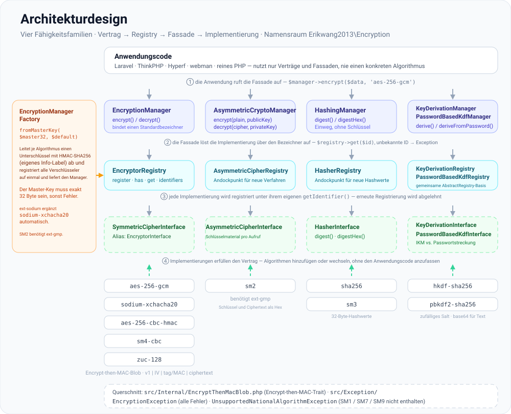
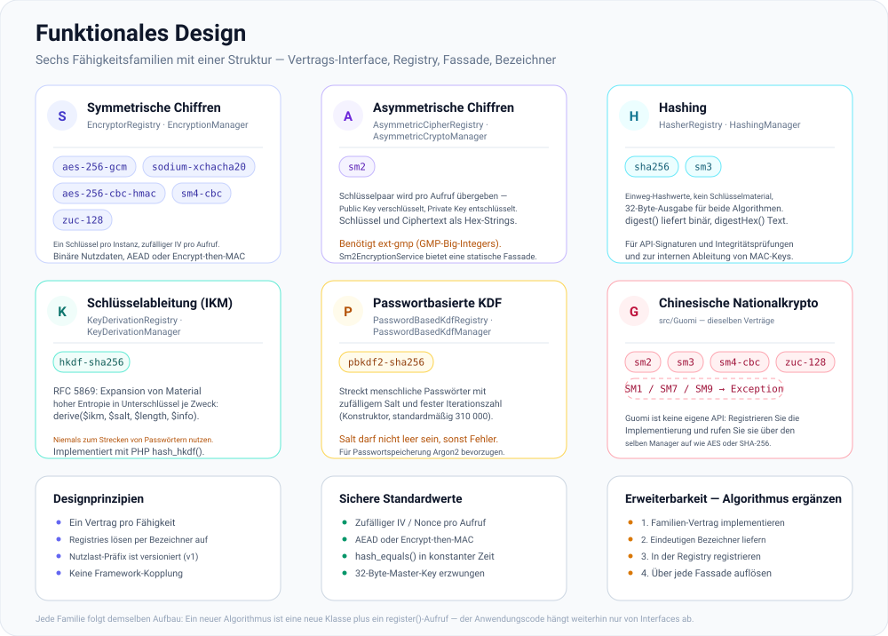

# erikwang2013/encryption

**Languages:** [English](../en/README.md) | [简体中文](../../../README.zh-CN.md) | [한국어](../ko/README.md) | [Русский](../ru/README.md) | **Deutsch** | [Français](../fr/README.md) | [Español](../es/README.md) | [Português](../pt/README.md) | [हिन्दी](../hi/README.md) | [العربية](../ar/README.md) | [বাংলা](../bn/README.md) | [Bahasa Indonesia](../id/README.md) | [日本語](../ja/README.md)

<p align="center">
  
</p>

Eine plug-in-fähige Kryptografie-Komponentenbibliothek: Unter einem einheitlichen Vertrag bietet sie **symmetrische Verschlüsselung**, **asymmetrische Verschlüsselung**, **Hashing** und **Schlüsselableitung** (HKDF / PBKDF2), mit Implementierungen für AES/Sodium sowie die chinesischen Nationalalgorithmen SM2/SM3/SM4/ZUC. Installation über Composer.

**Locky**, das Schloss oben, ist das Maskottchen des Projekts: Es hütet einen Schlüssel pro Algorithmus, erzeugt bei jedem Aufruf einen frischen IV und hat ein Schlüsselloch, das niemals etwas verrät. Auch Ihre eigene Anwendung kann es anzeigen — `Mascot::svg()` liefert die Grafik für HTML, `Mascot::ascii()` ein Terminal-Banner, und `Mascot::NAME` ist `Locky`.

## Über das Projekt

### Was es ist

`erikwang2013/encryption` ist eine reine PHP-Kryptografie-Komponentenbibliothek, die PHP-Anwendungen **typsichere, erweiterbare** Ver- und Entschlüsselung, Hashing und Schlüsselableitung bietet. Sie hat keinerlei Framework-Abhängigkeiten und läuft eigenständig oder innerhalb von Laravel, ThinkPHP, Hyperf und webman.

Im Folgenden finden Sie die [Projektstruktur](#projektstruktur) zusammen mit SVG-Diagrammen für das [Architekturdesign](#architekturüberblick), das [funktionale Design](#funktionales-design) und den [Request-Lebenszyklus](#lebenszyklus-einer-anfrage); die Quellen der Diagramme liegen in [`docs/`](../../).

### Warum es existiert

Die Kryptografie-Landschaft in PHP ist zersplittert: Laravel bringt sein eigenes `Crypt` mit, für die chinesischen Nationalalgorithmen (SM2/SM3/SM4) fehlt ein einheitliches Composer-Paket, und für KDF-Primitive (HKDF/PBKDF2) gibt es keine gemeinsame Schnittstelle. Diese Bibliothek führt gängige symmetrische, asymmetrische, Hash- und KDF-Algorithmen unter einem **einzigen Vertragssystem** zusammen, sodass:

- **Anwendungscode nur von Interfaces abhängt** — ein Algorithmuswechsel erfordert keinerlei Änderungen an der Geschäftslogik
- **Guomi-Algorithmen erstklassig behandelt werden** — Sie rufen sie über denselben Manager auf wie AES/Sodium
- **die Schlüsselverwaltung standardisiert ist** — leiten Sie pro Algorithmus Unterschlüssel aus einem Master-Key ab, was eine Schlüsselwiederverwendung über verschiedene Verfahren hinweg verhindert
- **sichere Standardeinstellungen eingebaut sind** — authentifizierte Verschlüsselung (GCM / Encrypt-then-MAC), zufällige IVs und Vergleiche in konstanter Zeit sind von Haus aus dabei

### Anwendungsfälle

- Feldweise Verschlüsselung (PII wie Telefonnummern oder Ausweisnummern verschlüsseln, bevor sie in der Datenbank landen)
- Paralleler Betrieb mehrerer Algorithmen und schrittweise Migration (z. B. von AES-256-CBC auf AES-256-GCM)
- Guomi-konforme Backoffice-Systeme (SM2 asymmetrisch, SM3 als Hash, SM4 symmetrisch, ZUC als Stromchiffre)
- Signieren und Verifizieren von APIs (HMAC / SHA-256 / SM3)
- Ableitung von Unterschlüsseln aus Passwörtern oder Master-Keys (PBKDF2 / HKDF)

## Inhaltsverzeichnis

- [Framework-Kompatibilität](#framework-kompatibilität)
- [Integration je Framework](#integration-je-framework)
- [Schnellstart](#schnellstart)
- [Architekturüberblick](#architekturüberblick)
- [Funktionales Design](#funktionales-design)
- [Lebenszyklus einer Anfrage](#lebenszyklus-einer-anfrage)
- [Anforderungen](#anforderungen)
- [Installation](#installation)
- [Integrierte Algorithmen und Bezeichner](#integrierte-algorithmen-und-bezeichner)
- [Verwendung](#verwendung)
- [Projektstruktur](#projektstruktur)
- [FAQ](#faq)
- [Sicherheitshinweise](#sicherheitshinweise)
- [Tests ausführen](#tests-ausführen)
- [Lizenz](#lizenz)

---

## Framework-Kompatibilität

Dieses Paket **hängt von keinem** Web-Framework ab. Es wird als reine Composer-Bibliothek mit Klassen und Autoloading ausgeliefert. Führen Sie in Ihrer Anwendung `composer require erikwang2013/encryption` aus; Routing, Container und Konfiguration spielen keine Rolle.

Sie benötigen **PHP ≥ 8.0** sowie die unter [Anforderungen](#anforderungen) aufgeführten Erweiterungen und Abhängigkeiten. Damit funktionieren die folgenden Framework-Versionen (parallel zu den jeweiligen Krypto-APIs des Frameworks; injizieren Sie `EncryptionManager` usw. nach Bedarf):

| Framework | Hinweise |
|-----------|--------|
| **Laravel** 7 / 8 / 9 / 10 / 11 | In einer **PHP 8.0+**-Laufzeit installieren. Nur Laravel 7, das noch unter PHP 7.x läuft, erfüllt die Vorgabe dieses Pakets nicht — aktualisieren Sie zuerst PHP. |
| **ThinkPHP** 6 / 8 | Das Paket im standardmäßigen `require` der `composer.json` der Anwendung ergänzen. |
| **Hyperf** 2 / 3 | In der `composer.json` des Service einbinden; registrieren Sie ein Singleton in `config` oder eine Factory, wie Sie es in Hyperf üblicherweise tun. |
| **webman** 1 / 2 | `composer require` im Projektstamm; verwenden Sie es aus Business-Klassen oder `support`-Helfern heraus. |

### Integration je Framework

Es gibt **keinen** eigenen Laravel-ServiceProvider und kein ThinkPHP-Behavior-Bundle. Sie registrieren `EncryptionManager` (oder andere Manager) im **DI-Container** oder in einer **Singleton-Factory** Ihres Frameworks und laden dabei einen 32 Byte langen Master-Key aus der Konfiguration oder der Umgebung. Die folgenden Ausschnitte sind minimal gehalten; **befolgen Sie Ihre eigene Sicherheitsrichtlinie** für Schlüsselmaterial (`.env`, KMS, Konfigurationsdienste) — hartcodieren Sie keine Secrets.

**Laravel (`App\Providers\AppServiceProvider` oder ein eigener ServiceProvider)**

```php
use Erikwang2013\Encryption\EncryptionManagerFactory;

public function register(): void
{
    $this->app->singleton(\Erikwang2013\Encryption\EncryptionManager::class, function () {
        $raw = config('app.custom_master_key'); // z. B. base64 für 32 Byte
        $master = is_string($raw) ? base64_decode($raw, true) : '';
        if ($master === false || strlen($master) !== 32) {
            throw new \RuntimeException('Invalid 32-byte master key.');
        }
        return EncryptionManagerFactory::fromMasterKey($master, 'aes-256-gcm');
    });
}
```

Auflösen lässt sich der Manager über `app(\Erikwang2013\Encryption\EncryptionManager::class)`. Das ersetzt Laravels `Crypt` / `encrypt()` **nicht**: Diese Bibliothek zielt auf feldweise Verschlüsselung und Registries für mehrere Algorithmen; Laravels Helfer decken Framework-Serialisierung, Cookies usw. ab.

**ThinkPHP 6 / 8 (Service-Klasse oder Factory in `common.php`)**

```php
use Erikwang2013\Encryption\EncryptionManagerFactory;

function app_encryption_manager(): \Erikwang2013\Encryption\EncryptionManager
{
    static $mgr = null;
    if ($mgr === null) {
        $master = base64_decode(config('app.master_key'), true);
        $mgr = EncryptionManagerFactory::fromMasterKey($master, 'aes-256-gcm');
    }
    return $mgr;
}
```

Sie können auch einen `EncryptionService` unter `app\service` definieren und ihn in Controllern injizieren, um ihn in Tests leichter mocken zu können.

**Hyperf 2 / 3 (`config/autoload/dependencies.php` oder Annotation-Factories)**

```php
use Erikwang2013\Encryption\EncryptionManager;
use Erikwang2013\Encryption\EncryptionManagerFactory;

return [
    EncryptionManager::class => function () {
        $master = base64_decode((string) config('encryption.master_key'), true);
        return EncryptionManagerFactory::fromMasterKey($master, 'aes-256-gcm');
    },
];
```

Im Koroutinen-Modus sollten Sie den geparsten Wert zwischenspeichern, wenn die Schlüssel aus einer entfernten Konfiguration stammen.

**webman 1 / 2**

Registrieren Sie `EncryptionManager` im globalen `support`-Container in `config/plugin.php`, in einem eigenen `bootstrap` oder in `support/bootstrap.php`, falls Sie dieses Muster verwenden, oder erzeugen Sie die Instanz in Service-Klassen mit `EncryptionManagerFactory::fromMasterKey(...)`. webman schreibt keinen bestimmten Container vor — **folgen Sie den Konventionen Ihres Projekts**.

**Vanilla PHP (ohne Framework)**

Es gibt keinen Container, in den Sie sich einklinken könnten: einmal `composer require` im Projektstamm, dann den Manager einmal aufbauen und wiederverwenden. Eine lauffähige Fassung dieses Abschnitts liegt in [`examples/plain-php/`](../../../examples/plain-php) — `php examples/plain-php/demo.php` zeigt einen vollständigen Zyklus aus Verschlüsseln → Speichern → Lesen → Entschlüsseln → Manipulationserkennung.

```php
// bootstrap.php — einmal aus Ihrem Front-Controller einbinden
use Erikwang2013\Encryption\EncryptionManagerFactory;

$raw = getenv('ENCRYPTION_MASTER_KEY');            // base64 von 32 zufälligen Bytes
$key = is_string($raw) ? base64_decode($raw, true) : false;
if ($key === false || strlen($key) !== 32) {
    throw new RuntimeException('ENCRYPTION_MASTER_KEY must be base64 of 32 bytes.');
}
$manager = EncryptionManagerFactory::fromMasterKey($key, 'aes-256-gcm');

// überall sonst im Projekt
$stored = base64_encode($manager->encrypt($phone));   // als TEXT speichern
$phone  = $manager->decrypt(base64_decode($stored));  // wieder auslesen
```

```bash
# den Schlüssel einmal erzeugen und in der Serverumgebung halten — niemals im Code
export ENCRYPTION_MASTER_KEY="$(php -r 'echo base64_encode(random_bytes(32)), PHP_EOL;')"
```

Hinweise für reine PHP-Projekte: Der teure Teil ist die Factory (sie leitet alle Unterschlüssel ab und registriert jeden Encryptor), rufen Sie sie deshalb einmal pro Prozess auf und verwenden Sie dieselbe Instanz weiter, statt sie pro Query neu zu erzeugen; halten Sie den Schlüssel in der Prozessumgebung oder in Ihrem eigenen Secret-Store und sichern Sie ihn — sein Verlust bedeutet Datenverlust; fangen Sie beim Lesen `EncryptionException` ab und protokollieren Sie serverseitig, statt den Grund an den Client auszugeben; Chiffretext ist binär, speichern Sie also `base64_encode(...)` in einer `TEXT`-Spalte oder den Rohblob in einer `BLOB`-Spalte.

### Nicht mit dieser Bibliothek zusammenhängend

- Framework-Upgrades (z. B. Laravel 10 → 11) erfordern hier üblicherweise **keine** API-Änderungen. Meldet Composer einen PHP-Versionskonflikt, richten Sie sich nach der `php`-Vorgabe dieses Pakets in der `composer.json`.
- Das chinesische **SM2** benötigt **`ext-gmp`**; ohne diese Erweiterung schlagen die zugehörigen Klassen zur Laufzeit fehl, unabhängig vom Framework.

---

## Schnellstart

1. Im Projektstamm: `composer require erikwang2013/encryption:^1.0` (oder Ihre veröffentlichte Versionsvorgabe).
2. Stellen Sie sicher, dass `php -v` **8.0+** meldet und `openssl` aktiviert ist; für `sodium-xchacha20` oder SM2 installieren Sie bei Bedarf die Erweiterungen `sodium` und/oder `gmp`.
3. `use Erikwang2013\Encryption\...` und wählen Sie `EncryptionManager`, Hashing, KDF usw. wie unter [Verwendung](#verwendung) beschrieben.

---

## Architekturüberblick

Die Fähigkeiten sind in vier Vertragsfamilien aufgeteilt, jede mit eigener Registry und optionaler Fassade (`*Manager`) für Komposition und Tests. Jede Familie hat denselben Aufbau — Vertrags-Interface → Registry → Fassade → Implementierungen — und `EncryptionManagerFactory` verdrahtet die symmetrische Familie aus einem einzigen Master-Key.



Quelle: [`docs/architecture-design.svg`](./architecture-design.svg)

| Fähigkeit | Vertrag | Registry | Fassade (Standardalgorithmus) |
|------------|----------|----------|----------------------------|
| Symmetrisch | `SymmetricCipherInterface` (Alias `EncryptorInterface`) | `EncryptorRegistry` | `EncryptionManager` |
| Asymmetrisch | `AsymmetricCipherInterface` | `AsymmetricCipherRegistry` | `AsymmetricCryptoManager` |
| Hashing | `HasherInterface` | `HasherRegistry` | `HashingManager` |
| Schlüsselableitung (IKM) | `KeyDerivationInterface` | `KeyDerivationRegistry` | `KeyDerivationManager` |
| Passwortbasierte KDF | `PasswordBasedKdfInterface` | `PasswordBasedKdfRegistry` | `PasswordBasedKdfManager` |

Hinweise zum Design:

- **Symmetrisch**: Instanzen binden einen festen Schlüssel; die Nutzdaten sind binär — ideal für massenhafte Feldverschlüsselung.
- **Asymmetrisch**: Bei jedem Aufruf wird öffentliches/privates Schlüsselmaterial übergeben (Format von der Implementierung festgelegt, z. B. Hex bei SM2).
- **Hashing**: Einweg-Hashwerte, kein geheimer Schlüssel (bzw. standardkonformes Hashing nach SM3-Art).
- **Schlüsselableitung**: **HKDF** expandiert Schlüsselmaterial mit hoher Entropie zu Unterschlüsseln; **PBKDF2** streckt menschliche Passwörter (verwenden Sie zufälliges Salt und hohe Iterationszahlen).

---

## Funktionales Design

Sechs Fähigkeitsfamilien, jede mit den unten aufgeführten Bezeichnern ausgeliefert. Ein neuer Algorithmus ist eine neue Klasse plus ein `register()`-Aufruf — im Kern ändert sich nichts, und der Anwendungscode hängt weiterhin nur von Interfaces ab.



Quelle: [`docs/functional-design.svg`](./functional-design.svg)

| Familie | Bezeichner | Wofür es gedacht ist |
|--------|-----------|----------------|
| Symmetrisch | `aes-256-gcm`, `sodium-xchacha20`, `aes-256-cbc-hmac`, `sm4-cbc`, `zuc-128` | Feldweise Verschlüsselung beliebiger Größe, ein Schlüssel pro Instanz |
| Asymmetrisch | `sm2` | Öffentliches/privates Schlüsselmaterial pro Aufruf (Hex), benötigt `ext-gmp` |
| Hashing | `sha256`, `sm3` | Einweg-Hashwerte zum Signieren und für Integritätsprüfungen |
| Schlüsselableitung (IKM) | `hkdf-sha256` | Expansion von Schlüsselmaterial hoher Entropie in zweckgebundene Unterschlüssel |
| Passwortbasierte KDF | `pbkdf2-sha256` | Streckung menschlicher Passwörter (zufälliges Salt, standardmäßig 310 000 Iterationen) |
| Guomi | SM2 / SM3 / SM4 / ZUC | Nationalalgorithmen über dieselben Verträge; SM1 / SM7 / SM9 werfen `UnsupportedNationalAlgorithmException` |

---

## Lebenszyklus einer Anfrage

Das Bootstrap erfolgt einmal pro Prozess; Ver- und Entschlüsselung sind der Hot Path pro Anfrage. Jede Nutzlast trägt ein Versionspräfix (`v1`), sodass heute geschriebener Ciphertext auch nach einer Rotation lesbar bleibt.


Quelle: [`docs/lifecycle.svg`](./lifecycle.svg)

1. **Bereitstellen** — ein 32 Byte langer Master-Key aus `.env` oder einem KMS; jede andere Länge lehnt die Factory ab.
2. **Ableiten und registrieren** — `EncryptionManagerFactory::fromMasterKey()` leitet mit HMAC-SHA256 je Algorithmus einen Unterschlüssel ab (jeweils mit eigenem Info-Label) und registriert alle Verschlüsseler auf einmal.
3. **Verschlüsseln** — `$manager->encrypt($data, 'aes-256-gcm')`; pro Aufruf wird ein zufälliger IV/Nonce erzeugt und der Tag bzw. MAC über den Ciphertext berechnet.
4. **Speichern** — der binäre Blob `v1 | IV | tag/MAC | ciphertext` landet in einer `BLOB`-Spalte oder wird für die Textablage `base64_encode`t.
5. **Entschlüsseln** — der gespeicherte Bezeichner wählt die Implementierung, Präfix und Länge werden geprüft, der Tag/MAC wird in konstanter Zeit verglichen, und erst danach wird der Klartext zurückgegeben. Jeder Fehler löst eine `EncryptionException` aus.

---

## Anforderungen

| Element | Details |
|------|---------|
| PHP | `^8.0` (in Kombination mit den oben genannten Frameworks gilt diese Vorgabe) |
| Erweiterung | `ext-openssl` (erforderlich) |
| Erweiterung | `ext-sodium` (optional, für `sodium-xchacha20`) |
| Erweiterung | `ext-gmp` (optional, **SM2**-Ver- und -Entschlüsselung sowie Schlüsselerzeugung) |
| Composer | `pohoc/crypto-sm` (Abhängigkeit; Wrapper für SM2/SM3/SM4) |

## Installation

### Aus einem lokalen Pfad (Entwicklung)

In der `composer.json` des verwendenden Projekts:

```json
{
    "repositories": [
        {
            "type": "path",
            "url": "/absolute/path/to/encryption"
        }
    ],
    "require": {
        "erikwang2013/encryption": "@dev"
    }
}
```

Danach:

```bash
composer update erikwang2013/encryption
```

### Aus Git / Packagist (nach dem Release)

```bash
composer require erikwang2013/encryption:^1.0
```

(Übertragen Sie das Repository in ein erreichbares Git-Remote und eine Composer-Quelle oder veröffentlichen Sie es auf Packagist.)

---

## Integrierte Algorithmen und Bezeichner

### Symmetrische Verschlüsselung (`SymmetricCipherInterface`)

| Bezeichner (`getIdentifier`) | Klasse | Schlüssellänge | Hinweise |
|------------------------------|-------|------------|--------|
| `aes-256-gcm` | `Aes256GcmEncryptor` | 32 Byte | AEAD; empfohlener Standard für neue Systeme |
| `sodium-xchacha20` | `SodiumXChaCha20Encryptor` | 32 Byte | Benötigt `ext-sodium` |
| `aes-256-cbc-hmac` | `OpenSslAes256CbcEncryptor` | 32 Byte | CBC + HMAC für die Kompatibilität mit Altsystemen |
| `sm4-cbc` | `Sm4CbcEncryptor` | 16 Byte | SM4-CBC (OpenSSL SM4) |
| `zuc-128` | `ZucEncryptor` | 16 Byte | ZUC-128-Stromchiffre |

### Asymmetrische Verschlüsselung (`AsymmetricCipherInterface`)

| Bezeichner | Klasse | Hinweise |
|------------|-------|--------|
| `sm2` | `Sm2AsymmetricCipher` | SM2; Schlüssel und Ciphertext als Hex; benötigt `ext-gmp` |

Sie können auch die statische Fassade `Sm2EncryptionService` verwenden; das Verhalten entspricht `Sm2AsymmetricCipher`.

### Hashing (`HasherInterface`)

| Bezeichner | Klasse | Ausgabelänge |
|------------|-------|-----------------|
| `sha256` | `Sha256Hasher` | 32 Byte |
| `sm3` | `Sm3Hasher` | 32 Byte |

### Schlüsselableitung

| Bezeichner | Klasse | Vertrag | Hinweise |
|------------|-------|----------|--------|
| `hkdf-sha256` | `HkdfSha256` | `KeyDerivationInterface` | RFC 5869: IKM + Salt + Info |
| `pbkdf2-sha256` | `Pbkdf2Sha256` | `PasswordBasedKdfInterface` | Passwort + Salt + Iterationen (Konstruktor) |

Ciphertexte und Hashwerte sind in der Regel binär; für die Ablage in JSON oder Text wenden Sie `base64_encode` / `base64_decode` selbst an.

---

## Verwendung

### 1. Symmetrische Verschlüsselung: einzelner Algorithmus und Registry

```php
<?php

use Erikwang2013\Encryption\Encryptor\Aes256GcmEncryptor;
use Erikwang2013\Encryption\EncryptionManager;
use Erikwang2013\Encryption\EncryptorRegistry;

$key = random_bytes(32);
$encryptor = new Aes256GcmEncryptor($key);
$ciphertext = $encryptor->encrypt('plaintext');
$plaintext  = $encryptor->decrypt($ciphertext);

$registry = new EncryptorRegistry(new Aes256GcmEncryptor($key));
$manager = new EncryptionManager($registry, 'aes-256-gcm');
$blob = $manager->encrypt('data');
```

Master-Key-Factory: `EncryptionManagerFactory::fromMasterKey($masterKey32, 'aes-256-gcm')` leitet Unterschlüssel je Algorithmus ab und registriert **aes-256-gcm**, **aes-256-cbc-hmac**, **sm4-cbc**, **zuc-128** und **sodium-xchacha20** (sofern ext-sodium verfügbar ist) in einem Schritt.

### 2. Asymmetrische Verschlüsselung

```php
<?php

use Erikwang2013\Encryption\Asymmetric\Sm2AsymmetricCipher;
use Erikwang2013\Encryption\AsymmetricCipherRegistry;
use Erikwang2013\Encryption\AsymmetricCryptoManager;
use Erikwang2013\Encryption\Guomi\Sm2EncryptionService;

// benötigt ext-gmp
$pair = Sm2EncryptionService::generateKeyPairHex();

$cipher = new Sm2AsymmetricCipher();
$hexCipher = $cipher->encrypt('plaintext', $pair->getPublicKey());
$plain = $cipher->decrypt($hexCipher, $pair->getPrivateKey());

$mgr = new AsymmetricCryptoManager(new AsymmetricCipherRegistry($cipher), 'sm2');
$hexCipher2 = $mgr->encrypt('plaintext', $pair->getPublicKey());
```

### 3. Hashing

```php
<?php

use Erikwang2013\Encryption\Hash\Sha256Hasher;
use Erikwang2013\Encryption\Guomi\Sm3Hasher;
use Erikwang2013\Encryption\HasherRegistry;
use Erikwang2013\Encryption\HashingManager;

$registry = new HasherRegistry(
    new Sha256Hasher(),
    new Sm3Hasher(),
);
$hashing = new HashingManager($registry, 'sha256');
$bin = $hashing->digest('data');
$hex = $hashing->digestHex('data', 'sm3');
```

### 4. Schlüsselableitung (HKDF / PBKDF2)

```php
<?php

use Erikwang2013\Encryption\Kdf\HkdfSha256;
use Erikwang2013\Encryption\Kdf\Pbkdf2Sha256;
use Erikwang2013\Encryption\KeyDerivationManager;
use Erikwang2013\Encryption\KeyDerivationRegistry;
use Erikwang2013\Encryption\PasswordBasedKdfManager;
use Erikwang2013\Encryption\PasswordBasedKdfRegistry;

// Unterschlüssel aus Material mit hoher Entropie ableiten (z. B. TLS, Envelope-Unterschlüssel)
$hkdf = new HkdfSha256();
$subKey = $hkdf->derive($ikm32, $salt, 32, 'app:v1');

$kdfMgr = new KeyDerivationManager(new KeyDerivationRegistry($hkdf), 'hkdf-sha256');

// Aus einem Benutzerpasswort ableiten (für die Passwortspeicherung besser password_hash / Argon2 usw. verwenden)
$pbkdf2 = new Pbkdf2Sha256(iterations: 310_000);
$derived = $pbkdf2->deriveFromPassword('user password', random_bytes(16), 32);

$pwdMgr = new PasswordBasedKdfManager(new PasswordBasedKdfRegistry($pbkdf2), 'pbkdf2-sha256');
```

### 5. Chinesische Nationalalgorithmen (SM3 / SM4 / ZUC / SM2)

```php
<?php

use Erikwang2013\Encryption\Guomi\Sm2EncryptionService;
use Erikwang2013\Encryption\Guomi\Sm3Hasher;
use Erikwang2013\Encryption\Guomi\Sm4CbcEncryptor;
use Erikwang2013\Encryption\Guomi\ZucEncryptor;

$sm3 = new Sm3Hasher();
$bin = $sm3->digest('data');

$key16 = random_bytes(16);
$sm4 = new Sm4CbcEncryptor($key16);
$blob = $sm4->encrypt('plaintext');

$zuc = new ZucEncryptor($key16);
$blob2 = $zuc->encrypt('plaintext');

// SM2: siehe asymmetrisches Beispiel oben oder Sm2EncryptionService
```

SM1, SM7, SM9: `UnavailableNationalAlgorithms::sm1()` und die übrigen Methoden werfen `UnsupportedNationalAlgorithmException`.

### 6. Eigene Plugins

- Symmetrisch: `EncryptorInterface` (`SymmetricCipherInterface`) implementieren und in der `EncryptorRegistry` registrieren.
- Asymmetrisch: `AsymmetricCipherInterface` implementieren und in der `AsymmetricCipherRegistry` registrieren.
- Hashing: `HasherInterface` implementieren und in der `HasherRegistry` registrieren.
- KDF: `KeyDerivationInterface` oder `PasswordBasedKdfInterface` implementieren und in der passenden `Registry` registrieren.

### 7. Ausnahmen

Fehler werfen `Erikwang2013\Encryption\Exception\EncryptionException`; nicht verfügbare Nationalalgorithmen verwenden `UnsupportedNationalAlgorithmException`. Fangen Sie diese im Anwendungscode ab und protokollieren Sie sie; geben Sie keine Details an Clients weiter.

---

## Projektstruktur

```text
encryption/
├── src/
│   ├── Contract/                    Fähigkeits-Interfaces — der öffentliche Vertrag:
│   │                                SymmetricCipherInterface (Alias EncryptorInterface),
│   │                                AsymmetricCipherInterface, HasherInterface,
│   │                                KeyDerivationInterface, PasswordBasedKdfInterface
│   ├── Encryptor/                   Aes256GcmEncryptor, OpenSslAes256CbcEncryptor,
│   │                                SodiumXChaCha20Encryptor
│   ├── Asymmetric/                  Sm2AsymmetricCipher
│   ├── Hash/                        Sha256Hasher
│   ├── Kdf/                         HkdfSha256, Pbkdf2Sha256
│   ├── Guomi/                       Sm2EncryptionService, Sm3Hasher, Sm4CbcEncryptor,
│   │                                ZucEncryptor, UnavailableNationalAlgorithms
│   │   └── Internal/ZucEngine.php   ZUC-Keystream-Engine
│   ├── Internal/                    Trait EncryptThenMacBlob (gemeinsames Encrypt-then-MAC)
│   ├── Exception/                   EncryptionException,
│   │                                UnsupportedNationalAlgorithmException
│   ├── AbstractRegistry.php         Speicher für Bezeichner → Implementierung, von allen Registries genutzt
│   ├── EncryptorRegistry.php        AsymmetricCipherRegistry.php, HasherRegistry.php,
│   │                                KeyDerivationRegistry.php, PasswordBasedKdfRegistry.php
│   ├── EncryptionManager.php        AsymmetricCryptoManager.php, HashingManager.php,
│   │                                KeyDerivationManager.php, PasswordBasedKdfManager.php
│   ├── EncryptionManagerFactory.php Master-Key → Unterschlüssel je Algorithmus → Registry
│   └── Mascot.php                   optionale Maskottchen-API (SVG / ASCII); der Krypto-Code ruft sie nie auf
├── tests/                           PHPUnit-Suites: Vertrags-, Registry-, Manager- und
│                                    Algorithmus-Tests sowie TestCase-Helfer
├── docs/                            Maskottchen und Design-Diagramme
│   ├── mascot.svg                   das Projekt-Maskottchen (Locky)
│   ├── architecture-design.svg      eingebettet in „Architekturüberblick“
│   ├── functional-design.svg        eingebettet in „Funktionales Design“
│   ├── lifecycle.svg                eingebettet in „Lebenszyklus einer Anfrage“
│   └── *.md                         archivierte Review- und Testberichte
├── examples/plain-php/              lauffähige Vanilla-PHP-Integration (Bootstrap + Demo)
├── composer.json                    psr-4-Autoload, PHP ^8.0, phpunit als Dev-Abhängigkeit
├── phpunit.xml.dist
└── README.md  README.zh-CN.md
```

| Pfad | Zweck |
|------|---------|
| `src/Contract/` | Fähigkeits-Interfaces (`EncryptorInterface`, `HasherInterface`, …) |
| `src/Encryptor/`, `src/Asymmetric/`, `src/Hash/`, `src/Kdf/` | Algorithmus-Implementierungen |
| `src/Guomi/` | Chinesische Nationalkryptografie und `UnavailableNationalAlgorithms` |
| `src/Internal/` | `EncryptThenMacBlob` — von CBC / SM4 / ZUC gemeinsam genutztes Encrypt-then-MAC |
| `src/Exception/` | `EncryptionException` usw. |
| `*Registry.php`, `*Manager.php`, `EncryptionManagerFactory.php` | Registries, Fassaden, Master-Key-Factory |
| `docs/*.svg` | Maskottchen und Design-Diagramme, die in dieses README eingebettet sind |

Namensraum-Präfix: `Erikwang2013\Encryption\`, abgestimmt auf das Composer-`psr-4`.

---

## FAQ

**Composer meldet eine PHP-Versionsabweichung**

Dieses Paket benötigt `php ^8.0`. Läuft die Anwendung noch mit PHP 8.0 oder älter, aktualisieren Sie PHP oder verzichten Sie auf dieses Paket.

**`sodium-xchacha20` nicht verfügbar**

Installieren und aktivieren Sie die Erweiterung `sodium` (`ext-sodium`). Ohne sie schlägt `EncryptionManagerFactory::fromMasterKey(..., 'sodium-xchacha20')` fehl; verwenden Sie stattdessen `aes-256-gcm`.

**SM2-Fehler oder fehlgeschlagene Schlüsselerzeugung**

Installieren und aktivieren Sie **`ext-gmp`**. SM2 basiert auf großen Ganzzahlen; ohne GMP ist das Verhalten nicht garantiert.

**Ciphertext in einer Datenbank / JSON speichern**

Verwenden Sie `BLOB` für binäre Spalten; wenn es Text sein muss, **`base64_encode`**n Sie Ciphertext und IVs und vor der Entschlüsselung wieder **`base64_decode`**.

**Unterschied zu Laravels `encrypt()` / `Crypt`**

Laravels API zielt auf Framework-Serialisierung und Cookies; diese Bibliothek zielt auf **explizite Algorithmus-IDs, mehrere Registries, Nationalalgorithmen, HKDF/PBKDF2** usw. Beide können koexistieren — mischen Sie die Schlüsselverwendung jedoch nicht, es sei denn, Sie gleichen die Formate selbst ab.

---

## Sicherheitshinweise

1. **Schlüssel**: Verwenden Sie `random_bytes()` oder ein KMS für Schlüssel mit hoher Entropie; nutzen Sie niemals rohe Passwörter als AES-Schlüssel — strecken Sie sie zuerst mit **PBKDF2 / Argon2**.
2. **Algorithmen**: Bevorzugen Sie für neue Systeme **AES-256-GCM** oder **Sodium**; setzen Sie **SM3/SM4/ZUC/SM2** dort ein, wo es vorgeschrieben ist; **HKDF** für die Unterschlüssel-Expansion; beim Passwortstrecken mit **PBKDF2** verwenden Sie ausreichend hohe Iterationszahlen und zufälliges Salt.
3. **Transport**: Nutzen Sie auf dem Übertragungsweg weiterhin TLS; diese Bibliothek übernimmt feldweise Kryptografie und Hashwerte.
4. **Migration**: Führen Sie den `identifier` je Algorithmusversion mit, damit alte Daten entschlüsselt und neu verschlüsselt werden können.

---

## Tests ausführen

Nach dem Klonen:

```bash
composer install
composer test
```

Entspricht `./vendor/bin/phpunit tests/`. Wenn Sie eine `phpunit.xml` hinzufügen, richten Sie das Skript `test` in der `composer.json` darauf aus.

---

## Danke für Ihre Unterstützung / 开源不易，欢迎支持

| WeChat Pay / 微信 | Alipay / 支付宝 |
|:---:|:---:|
|  |  |

---

## Lizenz

MIT (siehe Feld `license` in der `composer.json`).
