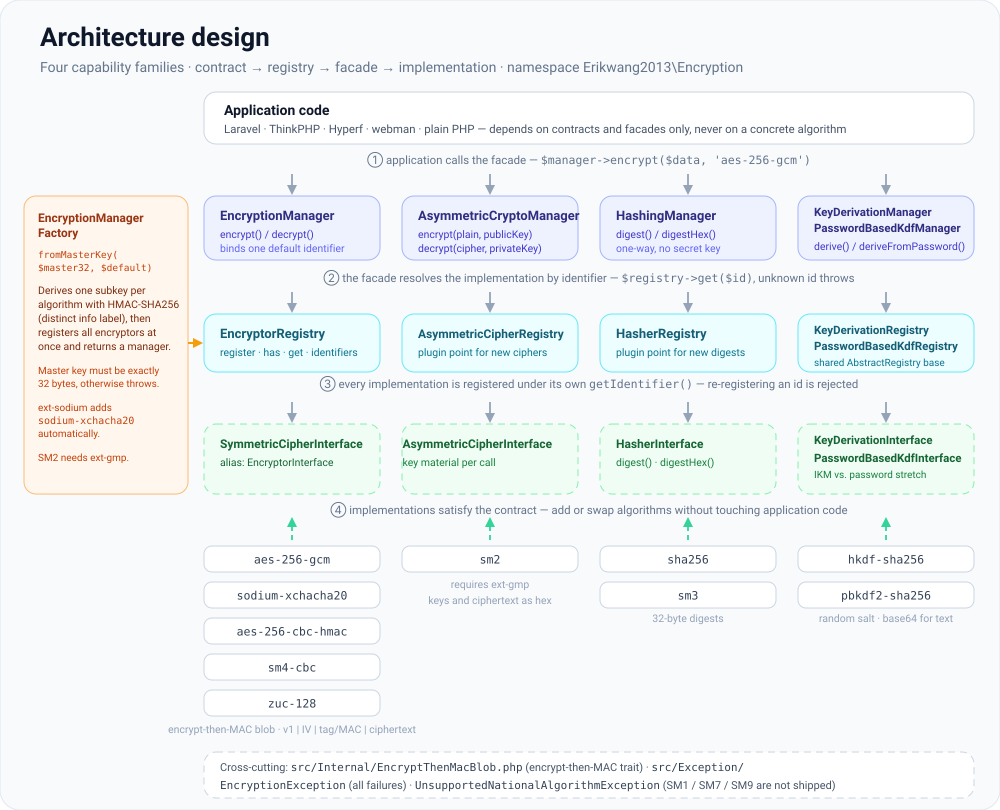
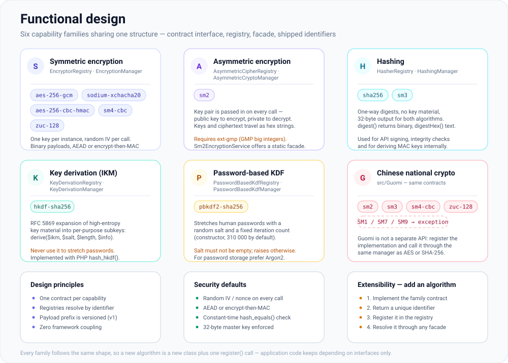
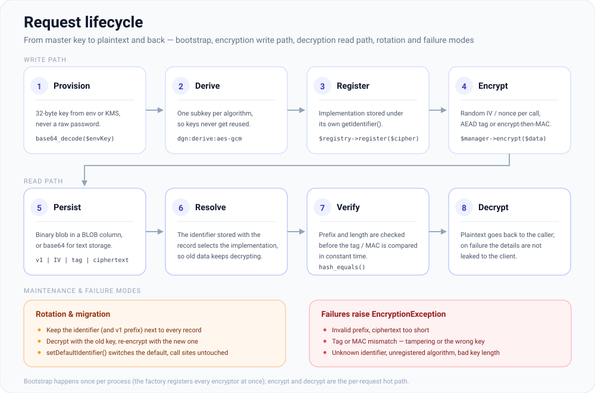

# erikwang2013/encryption

**Languages:** **English** | [简体中文](../../../README.zh-CN.md) | [한국어](../ko/README.md) | [Русский](../ru/README.md) | [Deutsch](../de/README.md) | [Français](../fr/README.md) | [Español](../es/README.md) | [Português](../pt/README.md) | [हिन्दी](../hi/README.md) | [العربية](../ar/README.md) | [বাংলা](../bn/README.md) | [Bahasa Indonesia](../id/README.md) | [日本語](../ja/README.md)

<p align="center">
  
</p>

A pluggable cryptography component library: under a unified contract it provides **symmetric encryption**, **asymmetric encryption**, **hashing**, and **key derivation** (HKDF / PBKDF2), with implementations including AES/Sodium and Chinese national algorithms SM2/SM3/SM4/ZUC. Installable via Composer.

**Locky**, the padlock above, is the project mascot: it keeps one key per algorithm, a fresh IV on every call, and a keyhole that never tells. Your own app can show it too — `Mascot::svg()` returns the artwork for HTML, `Mascot::ascii()` a terminal banner, and `Mascot::NAME` is `Locky`.

## About the project

### What it is

`erikwang2013/encryption` is a pure PHP cryptography component library that gives PHP applications **type-safe, extensible** encryption, hashing, and key derivation. It has zero framework dependencies and works standalone or within Laravel, ThinkPHP, Hyperf, and webman.

Below you will find the [project structure](#project-structure) together with SVG diagrams for the [architecture design](#architecture-overview), the [functional design](#functional-design), and the [request lifecycle](#request-lifecycle); the diagram sources live in [`docs/`](../../).

### Why it exists

PHP's cryptography landscape is fragmented: Laravel ships its own `Crypt`, Chinese national algorithms (SM2/SM3/SM4) lack a unified Composer package, and key derivation primitives (HKDF/PBKDF2) have no common interface. This library converges mainstream symmetric/asymmetric/hash/KDF algorithms under a **single contract system**, so that:

- **Application code only depends on interfaces** — switching algorithms requires zero business-logic changes
- **Guomi algorithms get first-class treatment** — call them through the same Manager as AES/Sodium
- **Key management is standardized** — derive per-algorithm sub-keys from one master key, preventing key reuse across ciphers
- **Secure defaults are built in** — authenticated encryption (GCM / encrypt-then-MAC), random IVs, and constant-time comparison come out of the box

### Use cases

- Field-level encryption (encrypt PII such as phone numbers or ID numbers before storing to the database)
- Multi-algorithm coexistence and gradual migration (e.g. AES-256-CBC to AES-256-GCM)
- Guomi-compliant back-office systems (SM2 asymmetric, SM3 hashing, SM4 symmetric, ZUC stream cipher)
- API signing and verification (HMAC / SHA-256 / SM3)
- Sub-key derivation from passwords or master keys (PBKDF2 / HKDF)

## Table of contents

- [Framework compatibility](#framework-compatibility)
- [Integration per framework](#integration-per-framework)
- [Quick start](#quick-start)
- [Architecture overview](#architecture-overview)
- [Functional design](#functional-design)
- [Request lifecycle](#request-lifecycle)
- [Requirements](#requirements)
- [Installation](#installation)
- [Built-in algorithms and identifiers](#built-in-algorithms-and-identifiers)
- [Usage](#usage)
- [Project structure](#project-structure)
- [FAQ](#faq)
- [Security notes](#security-notes)
- [Running tests](#running-tests)
- [License](#license)

---

## Framework compatibility

This package **does not depend** on any web framework. It ships as a Composer library with classes and autoloading only. In your application, run `composer require erikwang2013/encryption`; routing, container, and configuration are irrelevant.

You need **PHP ≥ 8.0** and the extensions/dependencies listed under [Requirements](#requirements). With that, the following framework versions work (alongside each framework’s own crypto APIs; inject `EncryptionManager` etc. as needed):

| Framework | Notes |
|-----------|--------|
| **Laravel** 7 / 8 / 9 / 10 / 11 | Install in a **PHP 8.0+** runtime. Only Laravel 7 still running on PHP 7.x falls short of this package’s constraint—upgrade PHP first. |
| **ThinkPHP** 6 / 8 | Add the package to the app’s standard `composer.json` `require`. |
| **Hyperf** 2 / 3 | Require in the service’s `composer.json`; register a singleton in `config` or a factory as you usually do in Hyperf. |
| **webman** 1 / 2 | `composer require` at the project root; use from business classes or `support` helpers. |

### Integration per framework

There is **no** dedicated Laravel ServiceProvider or ThinkPHP behavior bundle. You register `EncryptionManager` (or other managers) in your framework’s **DI container** or **singleton factory**, loading a 32-byte master key from config or environment. The snippets below are minimal; **follow your own security policy** for key material (`.env`, KMS, config services)—do not hard-code secrets.

**Laravel (`App\Providers\AppServiceProvider` or a dedicated ServiceProvider)**

```php
use Erikwang2013\Encryption\EncryptionManagerFactory;

public function register(): void
{
    $this->app->singleton(\Erikwang2013\Encryption\EncryptionManager::class, function () {
        $raw = config('app.custom_master_key'); // e.g. base64 for 32 bytes
        $master = is_string($raw) ? base64_decode($raw, true) : '';
        if ($master === false || strlen($master) !== 32) {
            throw new \RuntimeException('Invalid 32-byte master key.');
        }
        return EncryptionManagerFactory::fromMasterKey($master, 'aes-256-gcm');
    });
}
```

Resolve via `app(\Erikwang2013\Encryption\EncryptionManager::class)`. This does **not** replace Laravel’s `Crypt` / `encrypt()`: this library targets field-level encryption and multi-algorithm registries; Laravel’s helpers cover framework serialization, cookies, etc.

**ThinkPHP 6 / 8 (service class or factory in `common.php`)**

```php
use Erikwang2013\Encryption\EncryptionManagerFactory;

function app_encryption_manager(): \Erikwang2013\Encryption\EncryptionManager
{
    static $mgr = null;
    if ($mgr === null) {
        $master = base64_decode(config('app.master_key'), true);
        $mgr = EncryptionManagerFactory::fromMasterKey($master, 'aes-256-gcm');
    }
    return $mgr;
}
```

You can also define `EncryptionService` under `app\service` and inject it in controllers for easier mocking in tests.

**Hyperf 2 / 3 (`config/autoload/dependencies.php` or annotation factories)**

```php
use Erikwang2013\Encryption\EncryptionManager;
use Erikwang2013\Encryption\EncryptionManagerFactory;

return [
    EncryptionManager::class => function () {
        $master = base64_decode((string) config('encryption.master_key'), true);
        return EncryptionManagerFactory::fromMasterKey($master, 'aes-256-gcm');
    },
];
```

In coroutine mode, if keys come from remote config, cache the parsed value.

**webman 1 / 2**

Register `EncryptionManager` on the global `support` container in `config/plugin.php`, a custom `bootstrap`, or `support/bootstrap.php` if you use that pattern, or construct with `EncryptionManagerFactory::fromMasterKey(...)` inside service classes. webman does not mandate a specific container—**follow your project’s conventions**.

**Vanilla PHP (no framework)**

There is no container to hook into: `composer require` at the project root, then build the manager once and reuse it. A runnable version of this file lives in [`examples/plain-php/`](../../../examples/plain-php) — `php examples/plain-php/demo.php` prints a full encrypt → store → read → decrypt → tamper-detection cycle.

```php
// bootstrap.php — require this once from your front controller
use Erikwang2013\Encryption\EncryptionManagerFactory;

$raw = getenv('ENCRYPTION_MASTER_KEY');            // base64 of 32 random bytes
$key = is_string($raw) ? base64_decode($raw, true) : false;
if ($key === false || strlen($key) !== 32) {
    throw new RuntimeException('ENCRYPTION_MASTER_KEY must be base64 of 32 bytes.');
}
$manager = EncryptionManagerFactory::fromMasterKey($key, 'aes-256-gcm');

// anywhere else in the project
$stored = base64_encode($manager->encrypt($phone));   // store as TEXT
$phone  = $manager->decrypt(base64_decode($stored));  // read it back
```

```bash
# generate the key once, keep it in the server environment — never in the code
export ENCRYPTION_MASTER_KEY="$(php -r 'echo base64_encode(random_bytes(32)), PHP_EOL;')"
```

Notes for plain PHP projects: the factory is the expensive part (it derives every subkey and registers every encryptor), so call it once per process and reuse the instance rather than per query; keep the key in the process environment or your own secret store, and back it up — losing it means losing the data; catch `EncryptionException` around reads and log server-side instead of echoing the reason to the client; ciphertext is binary, so store `base64_encode(...)` in a `TEXT` column or the raw blob in a `BLOB` column.

### Unrelated to this library

- Framework upgrades (e.g. Laravel 10 → 11) usually **do not** require API changes here. If Composer reports a PHP version conflict, follow this package’s `php` constraint in `composer.json`.
- Chinese national **SM2** requires **`ext-gmp`**; without it, related classes fail at runtime regardless of framework.

---

## Quick start

1. In your project root: `composer require erikwang2013/encryption:^1.0` (or your published version constraint).
2. Ensure `php -v` is **8.0+** and `openssl` is enabled; for `sodium-xchacha20` or SM2, install the `sodium` and/or `gmp` extensions as needed.
3. `use Erikwang2013\Encryption\...` and pick `EncryptionManager`, hashing, KDF, etc. as described under [Usage](#usage).

---

## Architecture overview

Capabilities are split into four contract families, each with its own registry and optional facade (`*Manager`) for composition and testing. Every family has the same shape — contract interface → registry → facade → implementations — and `EncryptionManagerFactory` wires the symmetric one from a single master key.



Source: [`docs/architecture-design.svg`](../../architecture-design.svg)

| Capability | Contract | Registry | Facade (default algorithm) |
|------------|----------|----------|----------------------------|
| Symmetric | `SymmetricCipherInterface` (`EncryptorInterface` alias) | `EncryptorRegistry` | `EncryptionManager` |
| Asymmetric | `AsymmetricCipherInterface` | `AsymmetricCipherRegistry` | `AsymmetricCryptoManager` |
| Hashing | `HasherInterface` | `HasherRegistry` | `HashingManager` |
| Key derivation (IKM) | `KeyDerivationInterface` | `KeyDerivationRegistry` | `KeyDerivationManager` |
| Password-based KDF | `PasswordBasedKdfInterface` | `PasswordBasedKdfRegistry` | `PasswordBasedKdfManager` |

Design notes:

- **Symmetric**: instances bind a fixed key; payloads are binary—good for bulk field encryption.
- **Asymmetric**: each call passes public/private key material (format defined by the implementation, e.g. SM2 hex).
- **Hashing**: one-way digests, no secret key (or standard SM3-style hashing).
- **Key derivation**: **HKDF** expands high-entropy key material into subkeys; **PBKDF2** stretches human passwords (use random salt and high iteration counts).

---

## Functional design

Six capability families, each shipped with the identifiers listed below. Adding an algorithm is a new class plus one `register()` call — nothing in the core changes, and application code keeps depending on interfaces only.



Source: [`docs/functional-design.svg`](../../functional-design.svg)

| Family | Identifier | What it is for |
|--------|-----------|----------------|
| Symmetric | `aes-256-gcm`, `sodium-xchacha20`, `aes-256-cbc-hmac`, `sm4-cbc`, `zuc-128` | Field-level encryption of any size, one key bound per instance |
| Asymmetric | `sm2` | Per-call public/private key material (hex), needs `ext-gmp` |
| Hashing | `sha256`, `sm3` | One-way digests for signing and integrity checks |
| Key derivation (IKM) | `hkdf-sha256` | Expanding high-entropy key material into per-purpose subkeys |
| Password-based KDF | `pbkdf2-sha256` | Stretching human passwords (random salt, 310 000 iterations by default) |
| Guomi | SM2 / SM3 / SM4 / ZUC | National algorithms through the same contracts; SM1 / SM7 / SM9 raise `UnsupportedNationalAlgorithmException` |

---

## Request lifecycle

Bootstrap happens once per process; encrypt and decrypt are the per-request hot path. Each payload carries a version prefix (`v1`), so ciphertext written today stays readable after a rotation.



Source: [`docs/lifecycle.svg`](../../lifecycle.svg)

1. **Provision** — a 32-byte master key from `.env` or a KMS; the factory rejects any other length.
2. **Derive and register** — `EncryptionManagerFactory::fromMasterKey()` derives one subkey per algorithm with HMAC-SHA256 (distinct info label each) and registers every encryptor at once.
3. **Encrypt** — `$manager->encrypt($data, 'aes-256-gcm')`; a random IV/nonce is generated per call and the tag or MAC is computed over the ciphertext.
4. **Persist** — the binary blob `v1 | IV | tag/MAC | ciphertext` goes into a `BLOB` column, or is `base64_encode`d for text storage.
5. **Decrypt** — the stored identifier picks the implementation, the prefix and length are checked, the tag/MAC is compared in constant time, and only then is the plaintext returned. Any failure raises `EncryptionException`.

---

## Requirements

| Item | Details |
|------|---------|
| PHP | `^8.0` (when combined with frameworks above, this constraint wins) |
| Extension | `ext-openssl` (required) |
| Extension | `ext-sodium` (optional, for `sodium-xchacha20`) |
| Extension | `ext-gmp` (optional, **SM2** encryption/decryption and key generation) |
| Composer | `pohoc/crypto-sm` (dependency; SM2/SM3/SM4 wrappers) |

SM3 and SM4-CBC use OpenSSL's native implementations whenever the linked OpenSSL provides `sm3` / `sm4-cbc` (OpenSSL 1.1.1+). Otherwise they fall back to the pure-PHP implementations in `pohoc/crypto-sm` — byte-for-byte identical output, but far slower: the SM3 fallback is quadratic in memory (~490 MB and ~85 s for a single 1 MiB digest, versus ~4 MB at ~60 MB/s natively). CI runs the suite on both paths.

## Installation

### From a local path (development)

In the consuming project’s `composer.json`:

```json
{
    "repositories": [
        {
            "type": "path",
            "url": "/absolute/path/to/encryption"
        }
    ],
    "require": {
        "erikwang2013/encryption": "@dev"
    }
}
```

Then:

```bash
composer update erikwang2013/encryption
```

### From Git / Packagist (after release)

```bash
composer require erikwang2013/encryption:^1.0
```

(Push the repo to an accessible Git remote and Composer source, or publish on Packagist.)

---

## Built-in algorithms and identifiers

### Symmetric encryption (`SymmetricCipherInterface`)

| Identifier (`getIdentifier`) | Class | Key length | Notes |
|------------------------------|-------|------------|--------|
| `aes-256-gcm` | `Aes256GcmEncryptor` | 32 bytes | AEAD; recommended default for new systems |
| `sodium-xchacha20` | `SodiumXChaCha20Encryptor` | 32 bytes | Requires `ext-sodium` |
| `aes-256-cbc-hmac` | `OpenSslAes256CbcEncryptor` | 32 bytes | CBC + HMAC for legacy compatibility |
| `sm4-cbc` | `Sm4CbcEncryptor` | 16 bytes | SM4-CBC (OpenSSL SM4) |
| `zuc-128` | `ZucEncryptor` | 16 bytes | ZUC-128 stream cipher |

### Asymmetric encryption (`AsymmetricCipherInterface`)

| Identifier | Class | Notes |
|------------|-------|--------|
| `sm2` | `Sm2AsymmetricCipher` | SM2; keys and ciphertext as hex; requires `ext-gmp` |

You can also use the static facade `Sm2EncryptionService`; behavior matches `Sm2AsymmetricCipher`.

### Hashing (`HasherInterface`)

| Identifier | Class | Output length |
|------------|-------|-----------------|
| `sha256` | `Sha256Hasher` | 32 bytes |
| `sm3` | `Sm3Hasher` | 32 bytes |

### Key derivation

| Identifier | Class | Contract | Notes |
|------------|-------|----------|--------|
| `hkdf-sha256` | `HkdfSha256` | `KeyDerivationInterface` | RFC 5869: IKM + salt + info |
| `pbkdf2-sha256` | `Pbkdf2Sha256` | `PasswordBasedKdfInterface` | Password + salt + iterations (constructor) |

Ciphertexts and digests are usually binary; for JSON/text storage, apply `base64_encode` / `base64_decode` yourself.

---

## Usage

### 1. Symmetric encryption: single algorithm and registry

```php
<?php

use Erikwang2013\Encryption\Encryptor\Aes256GcmEncryptor;
use Erikwang2013\Encryption\EncryptionManager;
use Erikwang2013\Encryption\EncryptorRegistry;

$key = random_bytes(32);
$encryptor = new Aes256GcmEncryptor($key);
$ciphertext = $encryptor->encrypt('plaintext');
$plaintext  = $encryptor->decrypt($ciphertext);

$registry = new EncryptorRegistry(new Aes256GcmEncryptor($key));
$manager = new EncryptionManager($registry, 'aes-256-gcm');
$blob = $manager->encrypt('data');
```

Master-key factory: `EncryptionManagerFactory::fromMasterKey($masterKey32, 'aes-256-gcm')` derives per-algorithm subkeys and registers **aes-256-gcm**, **aes-256-cbc-hmac**, **sm4-cbc**, **zuc-128**, and **sodium-xchacha20** (if ext-sodium is available) at once. Derivation defaults to `'v1'`; pass `'v2'` as the third argument for the corrected HMAC argument order (the two are mutually unreadable — see §8).

### 2. Asymmetric encryption

```php
<?php

use Erikwang2013\Encryption\Asymmetric\Sm2AsymmetricCipher;
use Erikwang2013\Encryption\AsymmetricCipherRegistry;
use Erikwang2013\Encryption\AsymmetricCryptoManager;
use Erikwang2013\Encryption\Guomi\Sm2EncryptionService;

// requires ext-gmp
$pair = Sm2EncryptionService::generateKeyPairHex();

$cipher = new Sm2AsymmetricCipher();
$hexCipher = $cipher->encrypt('plaintext', $pair->getPublicKey());
$plain = $cipher->decrypt($hexCipher, $pair->getPrivateKey());

$mgr = new AsymmetricCryptoManager(new AsymmetricCipherRegistry($cipher), 'sm2');
$hexCipher2 = $mgr->encrypt('plaintext', $pair->getPublicKey());
```

### 3. Hashing

```php
<?php

use Erikwang2013\Encryption\Hash\Sha256Hasher;
use Erikwang2013\Encryption\Guomi\Sm3Hasher;
use Erikwang2013\Encryption\HasherRegistry;
use Erikwang2013\Encryption\HashingManager;

$registry = new HasherRegistry(
    new Sha256Hasher(),
    new Sm3Hasher(),
);
$hashing = new HashingManager($registry, 'sha256');
$bin = $hashing->digest('data');
$hex = $hashing->digestHex('data', 'sm3');
```

### 4. Key derivation (HKDF / PBKDF2)

```php
<?php

use Erikwang2013\Encryption\Kdf\HkdfSha256;
use Erikwang2013\Encryption\Kdf\Pbkdf2Sha256;
use Erikwang2013\Encryption\KeyDerivationManager;
use Erikwang2013\Encryption\KeyDerivationRegistry;
use Erikwang2013\Encryption\PasswordBasedKdfManager;
use Erikwang2013\Encryption\PasswordBasedKdfRegistry;

// Derive subkey from high-entropy material (e.g. TLS, envelope subkeys)
$hkdf = new HkdfSha256();
$subKey = $hkdf->derive($ikm32, $salt, 32, 'app:v1');

$kdfMgr = new KeyDerivationManager(new KeyDerivationRegistry($hkdf), 'hkdf-sha256');

// Derive from user password (for password storage prefer password_hash / Argon2, etc.)
$pbkdf2 = new Pbkdf2Sha256(iterations: 310_000);
$derived = $pbkdf2->deriveFromPassword('user password', random_bytes(16), 32);

$pwdMgr = new PasswordBasedKdfManager(new PasswordBasedKdfRegistry($pbkdf2), 'pbkdf2-sha256');
```

### 5. Chinese national algorithms (SM3 / SM4 / ZUC / SM2)

```php
<?php

use Erikwang2013\Encryption\Guomi\Sm2EncryptionService;
use Erikwang2013\Encryption\Guomi\Sm3Hasher;
use Erikwang2013\Encryption\Guomi\Sm4CbcEncryptor;
use Erikwang2013\Encryption\Guomi\ZucEncryptor;

$sm3 = new Sm3Hasher();
$bin = $sm3->digest('data');

$key16 = random_bytes(16);
$sm4 = new Sm4CbcEncryptor($key16);
$blob = $sm4->encrypt('plaintext');

$zuc = new ZucEncryptor($key16);
$blob2 = $zuc->encrypt('plaintext');

// SM2: see asymmetric example above or Sm2EncryptionService
```

SM1, SM7, SM9: `UnavailableNationalAlgorithms::sm1()` and similar throw `UnsupportedNationalAlgorithmException`.

### 6. Custom plugins

- Symmetric: implement `EncryptorInterface` (`SymmetricCipherInterface`), register in `EncryptorRegistry`.
- Asymmetric: implement `AsymmetricCipherInterface`, register in `AsymmetricCipherRegistry`.
- Hashing: implement `HasherInterface`, register in `HasherRegistry`.
- KDF: implement `KeyDerivationInterface` or `PasswordBasedKdfInterface`, register in the matching `Registry`.

### 7. Exceptions

Failures throw `Erikwang2013\Encryption\Exception\EncryptionException`; unavailable national algorithms use `UnsupportedNationalAlgorithmException`. Catch and log in application code; do not leak details to clients.

### 8. Key-derivation scheme v1 → v2 (opt-in migration)

**What was wrong.** When deriving the per-algorithm subkeys and the MAC keys of `aes-256-cbc-hmac`, `sm4-cbc` and `zuc-128`, `hash_hmac($algo, $data, $key)` was called with the constant usage label as the HMAC **key** and the secret material as the **message** — the two arguments were swapped. The secret must be the HMAC key.

**Why nothing is exploitable.** The usage label is a public constant and the secret still feeds the HMAC; an attacker without the master key (or the cipher key) derives nothing and forges nothing. Only the argument order was wrong, not the strength of the derivation.

**How to switch.** Pass `'v2'` as the third argument. Omitting it keeps today's behaviour byte for byte, so every existing call site is unchanged:

```php
$v1 = EncryptionManagerFactory::fromMasterKey($master);                       // default: unchanged behaviour
$v2 = EncryptionManagerFactory::fromMasterKey($master, 'aes-256-gcm', 'v2');  // corrected HMAC order
```

Each MAC-based encryptor takes the same switch as a trailing optional argument — `new Sm4CbcEncryptor($key16, macDerivation: 'v2')`. An unknown scheme name throws `EncryptionException` instead of silently falling back to v1.

**Migration.** v1 and v2 derive *different* subkeys and MAC keys, so they are not interchangeable: a v2 manager cannot decrypt v1 ciphertext and a v1 manager cannot decrypt v2 ciphertext (MAC / authentication failure). There is no on-wire marker for the scheme — both write the same `v1` payload prefix — so during a migration a wrong-scheme read is indistinguishable from a tampered ciphertext: both surface as a MAC failure. Log the scheme used for each read while you migrate, and expect such failures to be scheme mismatches before you suspect corruption. Build both managers from the same master key and read-then-write:

```php
$v1 = EncryptionManagerFactory::fromMasterKey($master);                       // read legacy data
$v2 = EncryptionManagerFactory::fromMasterKey($master, 'aes-256-gcm', 'v2');  // write new data
$plain = $v1->decrypt($legacyBlob, 'aes-256-cbc-hmac');                       // 1. decrypt with v1
$blob  = $v2->encrypt($plain, 'aes-256-cbc-hmac');                            // 2. re-encrypt with v2
```

Re-encrypt stored data (sessions and tokens included) and retire the v1 manager once no v1 ciphertext remains. The master key itself does not change: switching the derivation scheme is not a key rotation.

**Unrelated to the payload prefix.** The `v1` in the `v1 | IV | MAC | ciphertext` payload layout is a *ciphertext format* version, not this derivation scheme — the prefix stays `v1` under v2, and old blobs keep theirs. Do not rename it.

---

## Project structure

```text
encryption/
├── src/
│   ├── Contract/                    capability interfaces — the public contract:
│   │                                SymmetricCipherInterface (alias EncryptorInterface),
│   │                                AsymmetricCipherInterface, HasherInterface,
│   │                                KeyDerivationInterface, PasswordBasedKdfInterface
│   ├── Encryptor/                   Aes256GcmEncryptor, OpenSslAes256CbcEncryptor,
│   │                                SodiumXChaCha20Encryptor
│   ├── Asymmetric/                  Sm2AsymmetricCipher
│   ├── Hash/                        Sha256Hasher
│   ├── Kdf/                         HkdfSha256, Pbkdf2Sha256
│   ├── Guomi/                       Sm2EncryptionService, Sm3Hasher, Sm4CbcEncryptor,
│   │                                ZucEncryptor, UnavailableNationalAlgorithms
│   │   └── Internal/ZucEngine.php   ZUC keystream engine
│   ├── Internal/                    EncryptThenMacBlob trait (shared encrypt-then-MAC)
│   ├── Exception/                   EncryptionException,
│   │                                UnsupportedNationalAlgorithmException
│   ├── AbstractRegistry.php         identifier → implementation store, shared by registries
│   ├── EncryptorRegistry.php        AsymmetricCipherRegistry.php, HasherRegistry.php,
│   │                                KeyDerivationRegistry.php, PasswordBasedKdfRegistry.php
│   ├── EncryptionManager.php        AsymmetricCryptoManager.php, HashingManager.php,
│   │                                KeyDerivationManager.php, PasswordBasedKdfManager.php
│   ├── EncryptionManagerFactory.php master key → per-algorithm subkeys → registry
│   └── Mascot.php                   optional mascot API (SVG / ASCII); the crypto code never calls it
├── tests/                           PHPUnit suites: contract, registry, manager and
│                                    algorithm tests plus TestCase helpers
├── docs/                            mascot and design diagrams
│   ├── mascot.svg                   the project mascot (Locky)
│   ├── architecture-design.svg      embedded in “Architecture overview”
│   ├── functional-design.svg        embedded in “Functional design”
│   ├── lifecycle.svg                embedded in “Request lifecycle”
│   ├── i18n/                        this README in 12 more languages, each with
│   │                                localised copies of the diagrams (+ labels/*.json)
│   └── *.md                         archived review / test reports
├── examples/plain-php/              runnable vanilla-PHP integration (bootstrap + demo)
├── scripts/i18n-build-svg.php       builds docs/i18n/<lang>/*.svg from the label dictionaries
├── .github/workflows/tests.yml      phpunit on PHP 8.0–8.4 in CI (gmp + sodium)
├── composer.json                    psr-4 autoload, PHP ^8.0, phpunit dev dependency
├── phpunit.xml.dist
├── SECURITY.md                      vulnerability disclosure policy
└── README.md  README.zh-CN.md
```

| Path | Purpose |
|------|---------|
| `src/Contract/` | Capability interfaces (`EncryptorInterface`, `HasherInterface`, …) |
| `src/Encryptor/`, `src/Asymmetric/`, `src/Hash/`, `src/Kdf/` | Algorithm implementations |
| `src/Guomi/` | Chinese national crypto and `UnavailableNationalAlgorithms` |
| `src/Internal/` | `EncryptThenMacBlob` — encrypt-then-MAC shared by CBC / SM4 / ZUC |
| `src/Exception/` | `EncryptionException`, etc. |
| `*Registry.php`, `*Manager.php`, `EncryptionManagerFactory.php` | Registries, facades, master-key factory |
| `docs/*.svg` | Mascot and design diagrams embedded in this README |

Namespace prefix: `Erikwang2013\Encryption\`, aligned with Composer `psr-4`.

---

## FAQ

**Composer reports PHP version mismatch**

This package requires `php ^8.0`. If the app still runs PHP 8.0 or lower, upgrade PHP or do not use this package.

**`sodium-xchacha20` unavailable**

Install and enable the `sodium` extension (`ext-sodium`). Without it, `EncryptionManagerFactory::fromMasterKey(..., 'sodium-xchacha20')` fails; use `aes-256-gcm` instead.

**SM2 errors or key generation fails**

Install and enable **`ext-gmp`**. SM2 relies on big integers; without GMP, behavior is not guaranteed.

**Storing ciphertext in a database / JSON**

Use `BLOB` for binary columns; if you must use text, **`base64_encode`** ciphertext and IVs, then **`base64_decode`** before decryption.

**Difference from Laravel `encrypt()` / `Crypt`**

Laravel’s API targets framework serialization and cookies; this library targets **explicit algorithm IDs, multiple registries, national algorithms, HKDF/PBKDF2**, etc. They can coexist—do not mix keying unless you align formats yourself.

---

## Security notes

1. **Keys**: use `random_bytes()` or a KMS for high-entropy keys; never use raw passwords as AES keys—stretch with **PBKDF2 / Argon2** first.
2. **Algorithms**: prefer **AES-256-GCM** or **Sodium** for new systems; use **SM3/SM4/ZUC/SM2** where required; **HKDF** for subkey expansion; for **PBKDF2** password stretching, use sufficient iterations and random salt.
3. **Transport**: still use TLS in transit; this library handles field-level crypto and digests.
4. **Migration**: track `identifier` per algorithm version so old data can be decrypted and re-encrypted.
5. **Found a vulnerability?** Report it privately — see [`SECURITY.md`](../../../SECURITY.md).

---

## Running tests

After cloning:

```bash
composer install
composer test
```

Equivalent to `./vendor/bin/phpunit tests/`. If you add `phpunit.xml`, point the `test` script in `composer.json` at it.

---

## Thank you for your support / 开源不易，欢迎支持

| WeChat Pay / 微信 | Alipay / 支付宝 |
|:---:|:---:|
|  |  |

---

## License

MIT (see the `license` field in `composer.json`).
