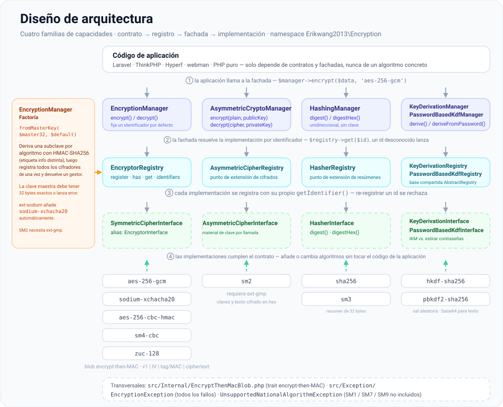
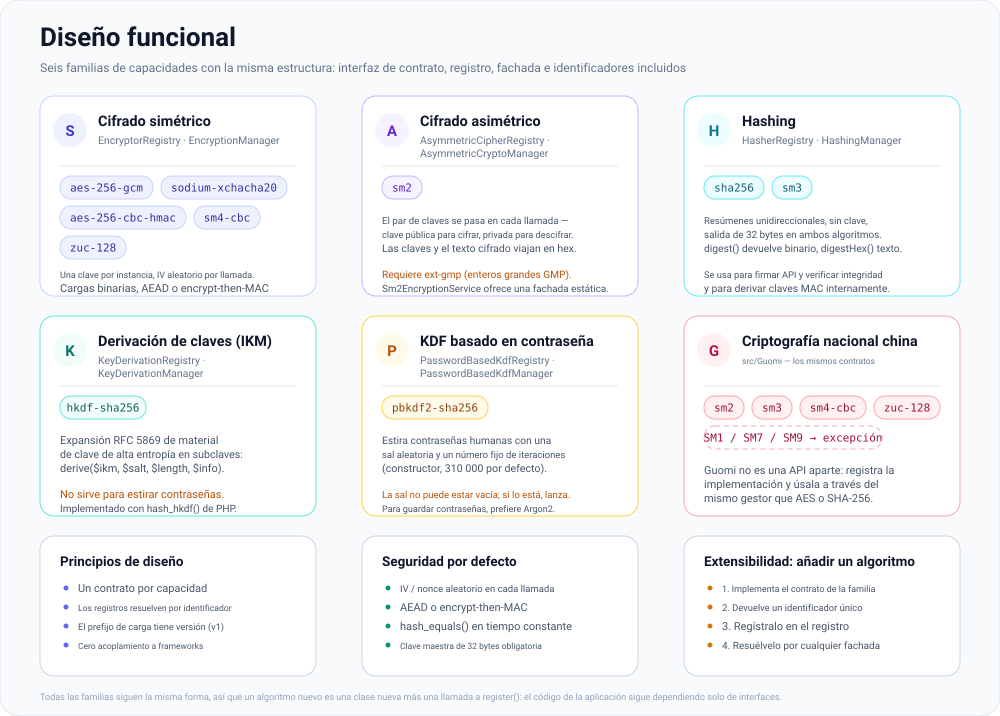

# erikwang2013/encryption

**Languages:** [English](../en/README.md) | [简体中文](../../../README.zh-CN.md) | [한국어](../ko/README.md) | [Русский](../ru/README.md) | [Deutsch](../de/README.md) | [Français](../fr/README.md) | **Español** | [Português](../pt/README.md) | [हिन्दी](../hi/README.md) | [العربية](../ar/README.md) | [বাংলা](../bn/README.md) | [Bahasa Indonesia](../id/README.md) | [日本語](../ja/README.md)

<p align="center">
  
</p>

Una biblioteca de componentes criptográficos conectables: bajo un contrato unificado ofrece **cifrado simétrico**, **cifrado asimétrico**, **hashing** y **derivación de claves** (HKDF / PBKDF2), con implementaciones que incluyen AES/Sodium y los algoritmos nacionales chinos SM2/SM3/SM4/ZUC. Instalable mediante Composer.

**Locky**, el candado de arriba, es la mascota del proyecto: guarda una clave por algoritmo, un IV nuevo en cada llamada y una cerradura que nunca revela nada. Tu propia aplicación también puede mostrarlo: `Mascot::svg()` devuelve la ilustración para HTML, `Mascot::ascii()` un banner de terminal, y `Mascot::NAME` es `Locky`.

## Acerca del proyecto

### Qué es

`erikwang2013/encryption` es una biblioteca de componentes criptográficos de PHP puro que aporta a las aplicaciones PHP cifrado, hashing y derivación de claves **con tipado seguro y extensibles**. No tiene ninguna dependencia de frameworks y funciona por sí sola o dentro de Laravel, ThinkPHP, Hyperf y webman.

A continuación encontrarás la [estructura del proyecto](#estructura-del-proyecto) junto con diagramas SVG del [diseño de la arquitectura](#visión-general-de-la-arquitectura), el [diseño funcional](#diseño-funcional) y el [ciclo de vida de una petición](#ciclo-de-vida-de-una-petición); las fuentes de los diagramas están en [`docs/`](../../).

### Por qué existe

El panorama criptográfico de PHP está fragmentado: Laravel trae su propio `Crypt`, los algoritmos nacionales chinos (SM2/SM3/SM4) no tienen un paquete Composer unificado y las primitivas de derivación de claves (HKDF/PBKDF2) carecen de una interfaz común. Esta biblioteca reúne los algoritmos convencionales simétricos/asimétricos/hash/KDF bajo un **único sistema de contratos**, de modo que:

- **El código de la aplicación solo depende de interfaces** — cambiar de algoritmo no exige tocar la lógica de negocio
- **Los algoritmos Guomi reciben un trato preferente** — se invocan a través del mismo Manager que AES/Sodium
- **La gestión de claves está normalizada** — deriva subclaves por algoritmo a partir de una única clave maestra, lo que evita reutilizar claves entre cifrados
- **Los valores seguros vienen de serie** — cifrado autenticado (GCM / encrypt-then-MAC), IV aleatorios y comparación en tiempo constante

### Casos de uso

- Cifrado a nivel de campo (cifrar datos personales como teléfonos o documentos de identidad antes de guardarlos en la base de datos)
- Convivencia de varios algoritmos y migración gradual (p. ej. de AES-256-CBC a AES-256-GCM)
- Sistemas de back-office con cumplimiento Guomi (SM2 asimétrico, SM3 hash, SM4 simétrico, cifrado de flujo ZUC)
- Firma y verificación de API (HMAC / SHA-256 / SM3)
- Derivación de subclaves a partir de contraseñas o claves maestras (PBKDF2 / HKDF)

## Índice

- [Compatibilidad con frameworks](#compatibilidad-con-frameworks)
- [Integración por framework](#integración-por-framework)
- [Inicio rápido](#inicio-rápido)
- [Visión general de la arquitectura](#visión-general-de-la-arquitectura)
- [Diseño funcional](#diseño-funcional)
- [Ciclo de vida de una petición](#ciclo-de-vida-de-una-petición)
- [Requisitos](#requisitos)
- [Instalación](#instalación)
- [Algoritmos e identificadores integrados](#algoritmos-e-identificadores-integrados)
- [Uso](#uso)
- [Estructura del proyecto](#estructura-del-proyecto)
- [Preguntas frecuentes](#preguntas-frecuentes)
- [Notas de seguridad](#notas-de-seguridad)
- [Ejecutar las pruebas](#ejecutar-las-pruebas)
- [Licencia](#licencia)

---

## Compatibilidad con frameworks

Este paquete **no depende** de ningún framework web. Se distribuye como una biblioteca Composer con clases y autocarga, nada más. En tu aplicación, ejecuta `composer require erikwang2013/encryption`; el enrutado, el contenedor y la configuración son irrelevantes.

Necesitas **PHP ≥ 8.0** y las extensiones/dependencias que figuran en [Requisitos](#requisitos). Con eso funcionan las siguientes versiones de framework (junto a las API criptográficas propias de cada uno; inyecta `EncryptionManager` u otros gestores según los necesites):

| Framework | Notas |
|-----------|--------|
| **Laravel** 7 / 8 / 9 / 10 / 11 | Instálalo en un entorno **PHP 8.0+**. Solo Laravel 7 sobre PHP 7.x queda por debajo de la restricción de este paquete: actualiza PHP primero. |
| **ThinkPHP** 6 / 8 | Añade el paquete al `require` del `composer.json` estándar de la aplicación. |
| **Hyperf** 2 / 3 | Requiérelo en el `composer.json` del servicio; registra un singleton en `config` o una factoría como sueles hacer en Hyperf. |
| **webman** 1 / 2 | `composer require` en la raíz del proyecto; úsalo desde clases de negocio o desde los helpers de `support`. |

### Integración por framework

**No** hay ningún ServiceProvider de Laravel ni bundle de comportamiento de ThinkPHP específicos. Registras `EncryptionManager` (u otros gestores) en el **contenedor de inyección de dependencias** o en la **factoría singleton** de tu framework, y cargas una clave maestra de 32 bytes desde la configuración o el entorno. Los fragmentos siguientes son mínimos; **sigue tu propia política de seguridad** para el material de clave (`.env`, KMS, servicios de configuración): no codifiques secretos en el código.

**Laravel (`App\Providers\AppServiceProvider` o un ServiceProvider dedicado)**

```php
use Erikwang2013\Encryption\EncryptionManagerFactory;

public function register(): void
{
    $this->app->singleton(\Erikwang2013\Encryption\EncryptionManager::class, function () {
        $raw = config('app.custom_master_key'); // e.g. base64 for 32 bytes
        $master = is_string($raw) ? base64_decode($raw, true) : '';
        if ($master === false || strlen($master) !== 32) {
            throw new \RuntimeException('Invalid 32-byte master key.');
        }
        return EncryptionManagerFactory::fromMasterKey($master, 'aes-256-gcm');
    });
}
```

Resuélvelo con `app(\Erikwang2013\Encryption\EncryptionManager::class)`. Esto **no** sustituye al `Crypt` / `encrypt()` de Laravel: esta biblioteca se orienta al cifrado a nivel de campo y a los registros multi-algoritmo; los helpers de Laravel cubren la serialización del framework, las cookies, etc.

**ThinkPHP 6 / 8 (clase de servicio o factoría en `common.php`)**

```php
use Erikwang2013\Encryption\EncryptionManagerFactory;

function app_encryption_manager(): \Erikwang2013\Encryption\EncryptionManager
{
    static $mgr = null;
    if ($mgr === null) {
        $master = base64_decode(config('app.master_key'), true);
        $mgr = EncryptionManagerFactory::fromMasterKey($master, 'aes-256-gcm');
    }
    return $mgr;
}
```

También puedes definir `EncryptionService` bajo `app\service` e inyectarlo en los controladores para facilitar el uso de dobles en las pruebas.

**Hyperf 2 / 3 (`config/autoload/dependencies.php` o factorías por anotaciones)**

```php
use Erikwang2013\Encryption\EncryptionManager;
use Erikwang2013\Encryption\EncryptionManagerFactory;

return [
    EncryptionManager::class => function () {
        $master = base64_decode((string) config('encryption.master_key'), true);
        return EncryptionManagerFactory::fromMasterKey($master, 'aes-256-gcm');
    },
];
```

En modo corrutina, si las claves provienen de configuración remota, cachea el valor ya descodificado.

**webman 1 / 2**

Registra `EncryptionManager` en el contenedor global `support` desde `config/plugin.php`, un `bootstrap` propio o `support/bootstrap.php` si usas ese patrón, o constrúyelo con `EncryptionManagerFactory::fromMasterKey(...)` dentro de las clases de servicio. webman no impone un contenedor concreto: **sigue las convenciones de tu proyecto**.

**Vanilla PHP (sin framework)**

No hay ningún contenedor donde registrarse: ejecuta `composer require` en la raíz del proyecto y luego construye el gestor una sola vez y reutilízalo. En [`examples/plain-php/`](../../../examples/plain-php) hay una versión ejecutable de este apartado: `php examples/plain-php/demo.php` imprime un ciclo completo de cifrado → almacenamiento → lectura → descifrado → detección de manipulación.

```php
// bootstrap.php — require this once from your front controller
use Erikwang2013\Encryption\EncryptionManagerFactory;

$raw = getenv('ENCRYPTION_MASTER_KEY');            // base64 of 32 random bytes
$key = is_string($raw) ? base64_decode($raw, true) : false;
if ($key === false || strlen($key) !== 32) {
    throw new RuntimeException('ENCRYPTION_MASTER_KEY must be base64 of 32 bytes.');
}
$manager = EncryptionManagerFactory::fromMasterKey($key, 'aes-256-gcm');

// anywhere else in the project
$stored = base64_encode($manager->encrypt($phone));   // store as TEXT
$phone  = $manager->decrypt(base64_decode($stored));  // read it back
```

```bash
# generate the key once, keep it in the server environment — never in the code
export ENCRYPTION_MASTER_KEY="$(php -r 'echo base64_encode(random_bytes(32)), PHP_EOL;')"
```

Notas para proyectos PHP puros: la parte costosa es la factoría (deriva todas las subclaves y registra cada cifrador), así que llámala una vez por proceso y reutiliza la instancia en lugar de crearla en cada consulta; guarda la clave en el entorno del proceso o en tu propio almacén de secretos, y haz copia de seguridad — perderla significa perder los datos; captura `EncryptionException` en las lecturas y registra en el servidor en vez de devolver el motivo al cliente; el texto cifrado es binario, así que guarda `base64_encode(...)` en una columna `TEXT` o los bytes sin procesar en una columna `BLOB`.

### Ajeno a esta biblioteca

- Las actualizaciones de framework (p. ej. Laravel 10 → 11) normalmente **no** exigen cambios de API aquí. Si Composer informa de un conflicto de versión de PHP, respeta la restricción `php` de este paquete en `composer.json`.
- El algoritmo nacional chino **SM2** requiere **`ext-gmp`**; sin ella, las clases relacionadas fallan en tiempo de ejecución sea cual sea el framework.

---

## Inicio rápido

1. En la raíz de tu proyecto: `composer require erikwang2013/encryption:^1.0` (o la restricción de versión que hayas publicado).
2. Comprueba que `php -v` sea **8.0+** y que `openssl` esté habilitada; para `sodium-xchacha20` o SM2, instala las extensiones `sodium` y/o `gmp` según necesites.
3. `use Erikwang2013\Encryption\...` y elige `EncryptionManager`, hashing, KDF, etc. como se describe en [Uso](#uso).

---

## Visión general de la arquitectura

Las capacidades se dividen en cuatro familias de contratos, cada una con su propio registro y una fachada opcional (`*Manager`) para composición y pruebas. Todas las familias tienen la misma forma —interfaz de contrato → registro → fachada → implementaciones— y `EncryptionManagerFactory` conecta la simétrica a partir de una única clave maestra.



Fuente: [`docs/architecture-design.svg`](./architecture-design.svg)

| Capacidad | Contrato | Registro | Fachada (algoritmo por defecto) |
|------------|----------|----------|----------------------------|
| Simétrica | `SymmetricCipherInterface` (alias `EncryptorInterface`) | `EncryptorRegistry` | `EncryptionManager` |
| Asimétrica | `AsymmetricCipherInterface` | `AsymmetricCipherRegistry` | `AsymmetricCryptoManager` |
| Hashing | `HasherInterface` | `HasherRegistry` | `HashingManager` |
| Derivación de claves (IKM) | `KeyDerivationInterface` | `KeyDerivationRegistry` | `KeyDerivationManager` |
| KDF basado en contraseña | `PasswordBasedKdfInterface` | `PasswordBasedKdfRegistry` | `PasswordBasedKdfManager` |

Notas de diseño:

- **Simétrica**: cada instancia fija una clave; las cargas son binarias, lo que resulta idóneo para cifrar campos en volumen.
- **Asimétrica**: cada llamada recibe el material de clave pública/privada (el formato lo define la implementación, p. ej. SM2 en hex).
- **Hashing**: resúmenes unidireccionales, sin clave secreta (o hashing estándar al estilo SM3).
- **Derivación de claves**: **HKDF** expande material de clave de alta entropía en subclaves; **PBKDF2** estira contraseñas humanas (usa sal aleatoria y un número alto de iteraciones).

---

## Diseño funcional

Seis familias de capacidades, cada una distribuida con los identificadores que se indican más abajo. Añadir un algoritmo es una clase nueva más una llamada a `register()`: nada cambia en el núcleo y el código de la aplicación sigue dependiendo únicamente de interfaces.



Fuente: [`docs/functional-design.svg`](./functional-design.svg)

| Familia | Identificador | Para qué sirve |
|--------|-----------|----------------|
| Simétrica | `aes-256-gcm`, `sodium-xchacha20`, `aes-256-cbc-hmac`, `sm4-cbc`, `zuc-128` | Cifrado a nivel de campo de cualquier tamaño, con una clave fijada por instancia |
| Asimétrica | `sm2` | Material de clave pública/privada por llamada (hex), necesita `ext-gmp` |
| Hashing | `sha256`, `sm3` | Resúmenes unidireccionales para firmas y comprobaciones de integridad |
| Derivación de claves (IKM) | `hkdf-sha256` | Expandir material de clave de alta entropía en subclaves por propósito |
| KDF basado en contraseña | `pbkdf2-sha256` | Estirar contraseñas humanas (sal aleatoria, 310 000 iteraciones por defecto) |
| Guomi | SM2 / SM3 / SM4 / ZUC | Algoritmos nacionales a través de los mismos contratos; SM1 / SM7 / SM9 lanzan `UnsupportedNationalAlgorithmException` |

---

## Ciclo de vida de una petición

El arranque ocurre una vez por proceso; cifrar y descifrar son la ruta crítica de cada petición. Cada carga lleva un prefijo de versión (`v1`), de modo que el texto cifrado hoy siga siendo legible tras una rotación.


Fuente: [`docs/lifecycle.svg`](./lifecycle.svg)

1. **Aprovisionar** — una clave maestra de 32 bytes desde `.env` o un KMS; la factoría rechaza cualquier otra longitud.
2. **Derivar y registrar** — `EncryptionManagerFactory::fromMasterKey()` deriva una subclave por algoritmo con HMAC-SHA256 (una etiqueta info distinta para cada una) y registra todos los cifradores de una vez.
3. **Cifrar** — `$manager->encrypt($data, 'aes-256-gcm')`; se genera un IV/nonce aleatorio en cada llamada y la etiqueta o el MAC se calcula sobre el texto cifrado.
4. **Persistir** — el blob binario `v1 | IV | tag/MAC | ciphertext` va a una columna `BLOB`, o se aplica `base64_encode` para guardarlo como texto.
5. **Descifrar** — el identificador almacenado elige la implementación, se comprueban el prefijo y la longitud, el tag/MAC se compara en tiempo constante y solo entonces se devuelve el texto plano. Cualquier fallo lanza `EncryptionException`.

---

## Requisitos

| Elemento | Detalles |
|------|---------|
| PHP | `^8.0` (combinado con los frameworks de arriba, esta restricción manda) |
| Extensión | `ext-openssl` (obligatoria) |
| Extensión | `ext-sodium` (opcional, para `sodium-xchacha20`) |
| Extensión | `ext-gmp` (opcional, cifrado/descifrado **SM2** y generación de claves) |
| Composer | `pohoc/crypto-sm` (dependencia; envoltorios de SM2/SM3/SM4) |

## Instalación

### Desde una ruta local (desarrollo)

En el `composer.json` del proyecto consumidor:

```json
{
    "repositories": [
        {
            "type": "path",
            "url": "/absolute/path/to/encryption"
        }
    ],
    "require": {
        "erikwang2013/encryption": "@dev"
    }
}
```

Después:

```bash
composer update erikwang2013/encryption
```

### Desde Git / Packagist (tras la publicación)

```bash
composer require erikwang2013/encryption:^1.0
```

(Sube el repositorio a un remoto Git accesible y a una fuente Composer, o publícalo en Packagist.)

---

## Algoritmos e identificadores integrados

### Cifrado simétrico (`SymmetricCipherInterface`)

| Identificador (`getIdentifier`) | Clase | Longitud de clave | Notas |
|------------------------------|-------|------------|--------|
| `aes-256-gcm` | `Aes256GcmEncryptor` | 32 bytes | AEAD; valor por defecto recomendado para sistemas nuevos |
| `sodium-xchacha20` | `SodiumXChaCha20Encryptor` | 32 bytes | Requiere `ext-sodium` |
| `aes-256-cbc-hmac` | `OpenSslAes256CbcEncryptor` | 32 bytes | CBC + HMAC por compatibilidad con sistemas heredados |
| `sm4-cbc` | `Sm4CbcEncryptor` | 16 bytes | SM4-CBC (SM4 de OpenSSL) |
| `zuc-128` | `ZucEncryptor` | 16 bytes | Cifrado de flujo ZUC-128 |

### Cifrado asimétrico (`AsymmetricCipherInterface`)

| Identificador | Clase | Notas |
|------------|-------|--------|
| `sm2` | `Sm2AsymmetricCipher` | SM2; claves y texto cifrado en hex; requiere `ext-gmp` |

También puedes usar la fachada estática `Sm2EncryptionService`; su comportamiento es idéntico al de `Sm2AsymmetricCipher`.

### Hashing (`HasherInterface`)

| Identificador | Clase | Longitud de salida |
|------------|-------|-----------------|
| `sha256` | `Sha256Hasher` | 32 bytes |
| `sm3` | `Sm3Hasher` | 32 bytes |

### Derivación de claves

| Identificador | Clase | Contrato | Notas |
|------------|-------|----------|--------|
| `hkdf-sha256` | `HkdfSha256` | `KeyDerivationInterface` | RFC 5869: IKM + sal + info |
| `pbkdf2-sha256` | `Pbkdf2Sha256` | `PasswordBasedKdfInterface` | Contraseña + sal + iteraciones (constructor) |

Los textos cifrados y los resúmenes suelen ser binarios; para guardarlos en JSON o como texto, aplica tú mismo `base64_encode` / `base64_decode`.

---

## Uso

### 1. Cifrado simétrico: un solo algoritmo y el registro

```php
<?php

use Erikwang2013\Encryption\Encryptor\Aes256GcmEncryptor;
use Erikwang2013\Encryption\EncryptionManager;
use Erikwang2013\Encryption\EncryptorRegistry;

$key = random_bytes(32);
$encryptor = new Aes256GcmEncryptor($key);
$ciphertext = $encryptor->encrypt('plaintext');
$plaintext  = $encryptor->decrypt($ciphertext);

$registry = new EncryptorRegistry(new Aes256GcmEncryptor($key));
$manager = new EncryptionManager($registry, 'aes-256-gcm');
$blob = $manager->encrypt('data');
```

Factoría de clave maestra: `EncryptionManagerFactory::fromMasterKey($masterKey32, 'aes-256-gcm')` deriva subclaves por algoritmo y registra **aes-256-gcm**, **aes-256-cbc-hmac**, **sm4-cbc**, **zuc-128** y **sodium-xchacha20** (si ext-sodium está disponible) de una sola vez.

### 2. Cifrado asimétrico

```php
<?php

use Erikwang2013\Encryption\Asymmetric\Sm2AsymmetricCipher;
use Erikwang2013\Encryption\AsymmetricCipherRegistry;
use Erikwang2013\Encryption\AsymmetricCryptoManager;
use Erikwang2013\Encryption\Guomi\Sm2EncryptionService;

// requires ext-gmp
$pair = Sm2EncryptionService::generateKeyPairHex();

$cipher = new Sm2AsymmetricCipher();
$hexCipher = $cipher->encrypt('plaintext', $pair->getPublicKey());
$plain = $cipher->decrypt($hexCipher, $pair->getPrivateKey());

$mgr = new AsymmetricCryptoManager(new AsymmetricCipherRegistry($cipher), 'sm2');
$hexCipher2 = $mgr->encrypt('plaintext', $pair->getPublicKey());
```

### 3. Hashing

```php
<?php

use Erikwang2013\Encryption\Hash\Sha256Hasher;
use Erikwang2013\Encryption\Guomi\Sm3Hasher;
use Erikwang2013\Encryption\HasherRegistry;
use Erikwang2013\Encryption\HashingManager;

$registry = new HasherRegistry(
    new Sha256Hasher(),
    new Sm3Hasher(),
);
$hashing = new HashingManager($registry, 'sha256');
$bin = $hashing->digest('data');
$hex = $hashing->digestHex('data', 'sm3');
```

### 4. Derivación de claves (HKDF / PBKDF2)

```php
<?php

use Erikwang2013\Encryption\Kdf\HkdfSha256;
use Erikwang2013\Encryption\Kdf\Pbkdf2Sha256;
use Erikwang2013\Encryption\KeyDerivationManager;
use Erikwang2013\Encryption\KeyDerivationRegistry;
use Erikwang2013\Encryption\PasswordBasedKdfManager;
use Erikwang2013\Encryption\PasswordBasedKdfRegistry;

// Derive subkey from high-entropy material (e.g. TLS, envelope subkeys)
$hkdf = new HkdfSha256();
$subKey = $hkdf->derive($ikm32, $salt, 32, 'app:v1');

$kdfMgr = new KeyDerivationManager(new KeyDerivationRegistry($hkdf), 'hkdf-sha256');

// Derive from user password (for password storage prefer password_hash / Argon2, etc.)
$pbkdf2 = new Pbkdf2Sha256(iterations: 310_000);
$derived = $pbkdf2->deriveFromPassword('user password', random_bytes(16), 32);

$pwdMgr = new PasswordBasedKdfManager(new PasswordBasedKdfRegistry($pbkdf2), 'pbkdf2-sha256');
```

### 5. Algoritmos nacionales chinos (SM3 / SM4 / ZUC / SM2)

```php
<?php

use Erikwang2013\Encryption\Guomi\Sm2EncryptionService;
use Erikwang2013\Encryption\Guomi\Sm3Hasher;
use Erikwang2013\Encryption\Guomi\Sm4CbcEncryptor;
use Erikwang2013\Encryption\Guomi\ZucEncryptor;

$sm3 = new Sm3Hasher();
$bin = $sm3->digest('data');

$key16 = random_bytes(16);
$sm4 = new Sm4CbcEncryptor($key16);
$blob = $sm4->encrypt('plaintext');

$zuc = new ZucEncryptor($key16);
$blob2 = $zuc->encrypt('plaintext');

// SM2: see asymmetric example above or Sm2EncryptionService
```

SM1, SM7, SM9: `UnavailableNationalAlgorithms::sm1()` y similares lanzan `UnsupportedNationalAlgorithmException`.

### 6. Complementos personalizados

- Simétrico: implementa `EncryptorInterface` (`SymmetricCipherInterface`) y regístralo en `EncryptorRegistry`.
- Asimétrico: implementa `AsymmetricCipherInterface` y regístralo en `AsymmetricCipherRegistry`.
- Hashing: implementa `HasherInterface` y regístralo en `HasherRegistry`.
- KDF: implementa `KeyDerivationInterface` o `PasswordBasedKdfInterface` y regístralo en el `Registry` correspondiente.

### 7. Excepciones

Los fallos lanzan `Erikwang2013\Encryption\Exception\EncryptionException`; los algoritmos nacionales no disponibles usan `UnsupportedNationalAlgorithmException`. Captúralas y regístralas en el código de la aplicación; no filtres detalles al cliente.

---

## Estructura del proyecto

```text
encryption/
├── src/
│   ├── Contract/                    interfaces de capacidad — el contrato público:
│   │                                SymmetricCipherInterface (alias EncryptorInterface),
│   │                                AsymmetricCipherInterface, HasherInterface,
│   │                                KeyDerivationInterface, PasswordBasedKdfInterface
│   ├── Encryptor/                   Aes256GcmEncryptor, OpenSslAes256CbcEncryptor,
│   │                                SodiumXChaCha20Encryptor
│   ├── Asymmetric/                  Sm2AsymmetricCipher
│   ├── Hash/                        Sha256Hasher
│   ├── Kdf/                         HkdfSha256, Pbkdf2Sha256
│   ├── Guomi/                       Sm2EncryptionService, Sm3Hasher, Sm4CbcEncryptor,
│   │                                ZucEncryptor, UnavailableNationalAlgorithms
│   │   └── Internal/ZucEngine.php   motor de flujo de claves ZUC
│   ├── Internal/                    trait EncryptThenMacBlob (encrypt-then-MAC compartido)
│   ├── Exception/                   EncryptionException,
│   │                                UnsupportedNationalAlgorithmException
│   ├── AbstractRegistry.php         almacén identificador → implementación, compartido por los registros
│   ├── EncryptorRegistry.php        AsymmetricCipherRegistry.php, HasherRegistry.php,
│   │                                KeyDerivationRegistry.php, PasswordBasedKdfRegistry.php
│   ├── EncryptionManager.php        AsymmetricCryptoManager.php, HashingManager.php,
│   │                                KeyDerivationManager.php, PasswordBasedKdfManager.php
│   ├── EncryptionManagerFactory.php clave maestra → subclaves por algoritmo → registro
│   └── Mascot.php                   API opcional de la mascota (SVG / ASCII); el código cripto nunca la llama
├── tests/                           suites PHPUnit: pruebas de contrato, registro, gestor y
│                                    algoritmos, además de helpers de TestCase
├── docs/                            mascota y diagramas de diseño
│   ├── mascot.svg                   la mascota del proyecto (Locky)
│   ├── architecture-design.svg      incluido en «Visión general de la arquitectura»
│   ├── functional-design.svg        incluido en «Diseño funcional»
│   ├── lifecycle.svg                incluido en «Ciclo de vida de una petición»
│   ├── i18n/                        este README en 12 idiomas más, cada uno con
│   │                                copias localizadas de los diagramas (+ labels/*.json)
│   └── *.md                         informes archivados de revisión / pruebas
├── examples/plain-php/              integración Vanilla PHP ejecutable (bootstrap + demo)
├── scripts/i18n-build-svg.php       genera docs/i18n/<lang>/*.svg desde los diccionarios de etiquetas
├── composer.json                    autocarga psr-4, PHP ^8.0, phpunit como dependencia de desarrollo
├── phpunit.xml.dist
└── README.md  README.zh-CN.md
```

| Ruta | Propósito |
|------|---------|
| `src/Contract/` | Interfaces de capacidad (`EncryptorInterface`, `HasherInterface`, …) |
| `src/Encryptor/`, `src/Asymmetric/`, `src/Hash/`, `src/Kdf/` | Implementaciones de algoritmos |
| `src/Guomi/` | Criptografía nacional china y `UnavailableNationalAlgorithms` |
| `src/Internal/` | `EncryptThenMacBlob` — encrypt-then-MAC compartido por CBC / SM4 / ZUC |
| `src/Exception/` | `EncryptionException`, etc. |
| `*Registry.php`, `*Manager.php`, `EncryptionManagerFactory.php` | Registros, fachadas, factoría de clave maestra |
| `docs/*.svg` | Mascota y diagramas de diseño incluidos en este README |

Prefijo de espacio de nombres: `Erikwang2013\Encryption\`, alineado con `psr-4` de Composer.

---

## Preguntas frecuentes

**Composer informa de un desajuste de versión de PHP**

Este paquete requiere `php ^8.0`. Si la aplicación todavía corre sobre PHP 8.0 o inferior, actualiza PHP o no uses este paquete.

**`sodium-xchacha20` no está disponible**

Instala y habilita la extensión `sodium` (`ext-sodium`). Sin ella, `EncryptionManagerFactory::fromMasterKey(..., 'sodium-xchacha20')` falla; usa `aes-256-gcm` en su lugar.

**SM2 da errores o falla la generación de claves**

Instala y habilita **`ext-gmp`**. SM2 se apoya en enteros grandes; sin GMP, el comportamiento no está garantizado.

**Guardar el texto cifrado en una base de datos / JSON**

Usa `BLOB` para las columnas binarias; si tienes que usar texto, aplica **`base64_encode`** al texto cifrado y a los IV, y luego **`base64_decode`** antes de descifrar.

**Diferencia con `encrypt()` / `Crypt` de Laravel**

La API de Laravel se orienta a la serialización del framework y a las cookies; esta biblioteca se orienta a **identificadores de algoritmo explícitos, múltiples registros, algoritmos nacionales, HKDF/PBKDF2**, etc. Pueden convivir: no mezcles el material de clave salvo que alinees los formatos por tu cuenta.

---

## Notas de seguridad

1. **Claves**: usa `random_bytes()` o un KMS para obtener claves de alta entropía; nunca uses contraseñas sin más como claves AES: estíralas antes con **PBKDF2 / Argon2**.
2. **Algoritmos**: para sistemas nuevos prefiere **AES-256-GCM** o **Sodium**; usa **SM3/SM4/ZUC/SM2** donde sea obligatorio; **HKDF** para expandir subclaves; y para estirar contraseñas con **PBKDF2**, usa suficientes iteraciones y sal aleatoria.
3. **Transporte**: sigue usando TLS en tránsito; esta biblioteca se ocupa del cifrado a nivel de campo y de los resúmenes.
4. **Migración**: registra el `identifier` por versión de algoritmo para poder descifrar y volver a cifrar los datos antiguos.

---

## Ejecutar las pruebas

Tras clonar:

```bash
composer install
composer test
```

Equivale a `./vendor/bin/phpunit tests/`. Si añades un `phpunit.xml`, apunta a él el script `test` de `composer.json`.

---

## Gracias por tu apoyo / 开源不易，欢迎支持

| WeChat Pay / 微信 | Alipay / 支付宝 |
|:---:|:---:|
|  |  |

---

## Licencia

MIT (consulta el campo `license` en `composer.json`).
