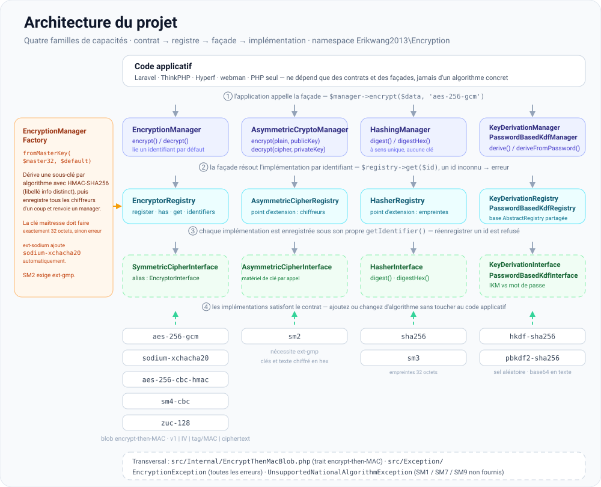

# erikwang2013/encryption

**Languages:** [English](../en/README.md) | [简体中文](../../../README.zh-CN.md) | [한국어](../ko/README.md) | [Русский](../ru/README.md) | [Deutsch](../de/README.md) | **Français** | [Español](../es/README.md) | [Português](../pt/README.md) | [हिन्दी](../hi/README.md) | [العربية](../ar/README.md) | [বাংলা](../bn/README.md) | [Bahasa Indonesia](../id/README.md) | [日本語](../ja/README.md)

<p align="center">
  
</p>

Une bibliothèque de composants cryptographiques enfichables : sous un contrat unifié, elle fournit le **chiffrement symétrique**, le **chiffrement asymétrique**, le **hachage** et la **dérivation de clés** (HKDF / PBKDF2), avec des implémentations incluant AES/Sodium et les algorithmes nationaux chinois SM2/SM3/SM4/ZUC. Installable via Composer.

**Locky**, le cadenas ci-dessus, est la mascotte du projet : il garde une clé par algorithme, un IV neuf à chaque appel et un trou de serrure qui ne dit jamais rien. Votre propre application peut aussi l'afficher — `Mascot::svg()` renvoie l'illustration pour le HTML, `Mascot::ascii()` une bannière pour le terminal, et `Mascot::NAME` vaut `Locky`.

## À propos du projet

### De quoi s'agit-il

`erikwang2013/encryption` est une bibliothèque de composants cryptographiques en PHP pur qui apporte aux applications PHP un chiffrement, un hachage et une dérivation de clés **sûrs en typage et extensibles**. Elle ne dépend d'aucun framework et fonctionne aussi bien seule qu'au sein de Laravel, ThinkPHP, Hyperf ou webman.

Vous trouverez ci-dessous la [structure du projet](#structure-du-projet) ainsi que des schémas SVG pour la [vue d'ensemble de l'architecture](#vue-densemble-de-larchitecture), la [conception fonctionnelle](#conception-fonctionnelle) et le [cycle de vie d'une requête](#cycle-de-vie-dune-requête) ; les sources des schémas se trouvent dans [`docs/`](../../).

### Pourquoi elle existe

Le paysage cryptographique de PHP est fragmenté : Laravel embarque son propre `Crypt`, les algorithmes nationaux chinois (SM2/SM3/SM4) n'ont pas de paquet Composer unifié et les primitives de dérivation de clés (HKDF/PBKDF2) n'offrent aucune interface commune. Cette bibliothèque réunit les algorithmes symétriques, asymétriques, de hachage et de dérivation de clés les plus courants sous un **système de contrats unique**, de sorte que :

- **Le code applicatif ne dépend que d'interfaces** — changer d'algorithme n'exige aucune modification de la logique métier
- **Les algorithmes Guomi sont traités comme des citoyens de première classe** — ils s'appellent via le même Manager qu'AES/Sodium
- **La gestion des clés est normalisée** — dérivez une sous-clé par algorithme à partir d'une seule clé maîtresse, ce qui évite toute réutilisation de clé d'un chiffrement à l'autre
- **Des valeurs par défaut sûres sont intégrées** — chiffrement authentifié (GCM / encrypt-then-MAC), IV aléatoires et comparaison à temps constant sont fournis de série

### Cas d'usage

- Chiffrement au niveau du champ (chiffrer des données personnelles telles que numéros de téléphone ou numéros d'identité avant de les stocker en base de données)
- Coexistence de plusieurs algorithmes et migration progressive (par ex. AES-256-CBC vers AES-256-GCM)
- Systèmes de gestion conformes Guomi (SM2 asymétrique, SM3 hachage, SM4 symétrique, chiffrement de flux ZUC)
- Signature et vérification d'API (HMAC / SHA-256 / SM3)
- Dérivation de sous-clés à partir de mots de passe ou de clés maîtresses (PBKDF2 / HKDF)

## Table des matières

- [Compatibilité avec les frameworks](#compatibilité-avec-les-frameworks)
- [Intégration par framework](#intégration-par-framework)
- [Démarrage rapide](#démarrage-rapide)
- [Vue d'ensemble de l'architecture](#vue-densemble-de-larchitecture)
- [Conception fonctionnelle](#conception-fonctionnelle)
- [Cycle de vie d'une requête](#cycle-de-vie-dune-requête)
- [Prérequis](#prérequis)
- [Installation](#installation)
- [Algorithmes intégrés et identifiants](#algorithmes-intégrés-et-identifiants)
- [Utilisation](#utilisation)
- [Structure du projet](#structure-du-projet)
- [FAQ](#faq)
- [Notes de sécurité](#notes-de-sécurité)
- [Exécuter les tests](#exécuter-les-tests)
- [Licence](#licence)

---

## Compatibilité avec les frameworks

Ce paquet **ne dépend d'aucun** framework web. Il est livré comme une bibliothèque Composer ne contenant que des classes et de l'autoloading. Dans votre application, lancez `composer require erikwang2013/encryption` ; le routage, le conteneur et la configuration n'entrent pas en jeu.

Il vous faut **PHP ≥ 8.0** ainsi que les extensions et dépendances listées dans les [prérequis](#prérequis). Avec cela, les versions de framework suivantes fonctionnent (en parallèle des API cryptographiques propres à chaque framework ; injectez `EncryptionManager` et consorts selon vos besoins) :

| Framework | Remarques |
|-----------|-----------|
| **Laravel** 7 / 8 / 9 / 10 / 11 | À installer dans un environnement **PHP 8.0+**. Seul Laravel 7 encore exécuté sous PHP 7.x ne satisfait pas la contrainte de ce paquet — commencez par mettre PHP à niveau. |
| **ThinkPHP** 6 / 8 | Ajoutez le paquet à la section `require` du `composer.json` standard de l'application. |
| **Hyperf** 2 / 3 | Déclarez-le dans le `composer.json` du service ; enregistrez un singleton dans `config` ou une factory, comme vous le faites habituellement avec Hyperf. |
| **webman** 1 / 2 | `composer require` à la racine du projet ; utilisez-le depuis vos classes métier ou les helpers `support`. |

### Intégration par framework

Il n'existe **aucun** ServiceProvider Laravel dédié ni bundle de comportement ThinkPHP. Vous enregistrez `EncryptionManager` (ou d'autres managers) dans le **conteneur d'injection de dépendances** ou la **factory singleton** de votre framework, en chargeant une clé maîtresse de 32 octets depuis la configuration ou l'environnement. Les extraits ci-dessous sont minimalistes ; **appliquez votre propre politique de sécurité** pour le matériel de clé (`.env`, KMS, services de configuration) — ne codez jamais de secret en dur.

**Laravel (`App\Providers\AppServiceProvider` ou un ServiceProvider dédié)**

```php
use Erikwang2013\Encryption\EncryptionManagerFactory;

public function register(): void
{
    $this->app->singleton(\Erikwang2013\Encryption\EncryptionManager::class, function () {
        $raw = config('app.custom_master_key'); // e.g. base64 for 32 bytes
        $master = is_string($raw) ? base64_decode($raw, true) : '';
        if ($master === false || strlen($master) !== 32) {
            throw new \RuntimeException('Invalid 32-byte master key.');
        }
        return EncryptionManagerFactory::fromMasterKey($master, 'aes-256-gcm');
    });
}
```

Résolvez via `app(\Erikwang2013\Encryption\EncryptionManager::class)`. Cela **ne remplace pas** le `Crypt` / `encrypt()` de Laravel : cette bibliothèque vise le chiffrement au niveau du champ et les registres multi-algorithmes ; les helpers de Laravel couvrent la sérialisation du framework, les cookies, etc.

**ThinkPHP 6 / 8 (classe de service ou factory dans `common.php`)**

```php
use Erikwang2013\Encryption\EncryptionManagerFactory;

function app_encryption_manager(): \Erikwang2013\Encryption\EncryptionManager
{
    static $mgr = null;
    if ($mgr === null) {
        $master = base64_decode(config('app.master_key'), true);
        $mgr = EncryptionManagerFactory::fromMasterKey($master, 'aes-256-gcm');
    }
    return $mgr;
}
```

Vous pouvez aussi définir un `EncryptionService` sous `app\service` et l'injecter dans vos contrôleurs pour faciliter les mocks dans les tests.

**Hyperf 2 / 3 (`config/autoload/dependencies.php` ou factories par annotation)**

```php
use Erikwang2013\Encryption\EncryptionManager;
use Erikwang2013\Encryption\EncryptionManagerFactory;

return [
    EncryptionManager::class => function () {
        $master = base64_decode((string) config('encryption.master_key'), true);
        return EncryptionManagerFactory::fromMasterKey($master, 'aes-256-gcm');
    },
];
```

En mode coroutine, si les clés proviennent d'une configuration distante, mettez en cache la valeur analysée.

**webman 1 / 2**

Enregistrez `EncryptionManager` sur le conteneur global `support` dans `config/plugin.php`, dans un `bootstrap` personnalisé ou dans `support/bootstrap.php` si vous utilisez ce schéma, ou construisez-le avec `EncryptionManagerFactory::fromMasterKey(...)` au sein de vos classes de service. webman n'impose pas de conteneur particulier — **suivez les conventions de votre projet**.

**Vanilla PHP (sans framework)**

Il n'y a aucun conteneur où s'enregistrer : lancez `composer require` à la racine du projet, puis construisez le manager une seule fois et réutilisez-le. Une version exécutable de cette section se trouve dans [`examples/plain-php/`](../../../examples/plain-php) — `php examples/plain-php/demo.php` affiche un cycle complet chiffrement → stockage → lecture → déchiffrement → détection d'altération.

```php
// bootstrap.php — require this once from your front controller
use Erikwang2013\Encryption\EncryptionManagerFactory;

$raw = getenv('ENCRYPTION_MASTER_KEY');            // base64 of 32 random bytes
$key = is_string($raw) ? base64_decode($raw, true) : false;
if ($key === false || strlen($key) !== 32) {
    throw new RuntimeException('ENCRYPTION_MASTER_KEY must be base64 of 32 bytes.');
}
$manager = EncryptionManagerFactory::fromMasterKey($key, 'aes-256-gcm');

// anywhere else in the project
$stored = base64_encode($manager->encrypt($phone));   // store as TEXT
$phone  = $manager->decrypt(base64_decode($stored));  // read it back
```

```bash
# generate the key once, keep it in the server environment — never in the code
export ENCRYPTION_MASTER_KEY="$(php -r 'echo base64_encode(random_bytes(32)), PHP_EOL;')"
```

Notes pour les projets PHP natifs : c'est la factory qui coûte cher (elle dérive toutes les sous-clés et enregistre chaque chiffreur), appelez-la donc une fois par processus et réutilisez l'instance plutôt qu'à chaque requête ; gardez la clé dans l'environnement du processus ou dans votre propre coffre de secrets, et sauvegardez-la — sa perte entraîne la perte des données ; interceptez `EncryptionException` autour des lectures et journalisez côté serveur au lieu de renvoyer la raison au client ; le texte chiffré est binaire : stockez `base64_encode(...)` dans une colonne `TEXT` ou les octets bruts dans une colonne `BLOB`.

### Sans rapport avec cette bibliothèque

- Les mises à niveau de framework (par ex. Laravel 10 → 11) **n'imposent généralement pas** de modifier l'API ici. Si Composer signale un conflit de version PHP, référez-vous à la contrainte `php` de ce paquet dans `composer.json`.
- Le **SM2** national chinois exige **`ext-gmp`** ; sans elle, les classes concernées échouent à l'exécution, quel que soit le framework.

---

## Démarrage rapide

1. À la racine de votre projet : `composer require erikwang2013/encryption:^1.0` (ou la contrainte de version que vous avez publiée).
2. Vérifiez que `php -v` affiche **8.0+** et que `openssl` est activé ; pour `sodium-xchacha20` ou SM2, installez les extensions `sodium` et/ou `gmp` selon vos besoins.
3. `use Erikwang2013\Encryption\...` puis choisissez `EncryptionManager`, le hachage, le KDF, etc. comme décrit dans la section [Utilisation](#utilisation).

---

## Vue d'ensemble de l'architecture

Les capacités sont réparties en quatre familles de contrats, chacune dotée de son propre registre et d'une façade facultative (`*Manager`) pour la composition et les tests. Toutes les familles partagent la même forme — interface de contrat → registre → façade → implémentations — et `EncryptionManagerFactory` assemble la famille symétrique à partir d'une seule clé maîtresse.



Source : [`docs/architecture-design.svg`](./architecture-design.svg)

| Capacité | Contrat | Registre | Façade (algorithme par défaut) |
|------------|----------|----------|----------------------------|
| Symétrique | `SymmetricCipherInterface` (alias `EncryptorInterface`) | `EncryptorRegistry` | `EncryptionManager` |
| Asymétrique | `AsymmetricCipherInterface` | `AsymmetricCipherRegistry` | `AsymmetricCryptoManager` |
| Hachage | `HasherInterface` | `HasherRegistry` | `HashingManager` |
| Dérivation de clés (IKM) | `KeyDerivationInterface` | `KeyDerivationRegistry` | `KeyDerivationManager` |
| KDF à base de mot de passe | `PasswordBasedKdfInterface` | `PasswordBasedKdfRegistry` | `PasswordBasedKdfManager` |

Notes de conception :

- **Symétrique** : chaque instance lie une clé fixe ; les données sont binaires — idéal pour le chiffrement de champs en masse.
- **Asymétrique** : chaque appel transmet le matériel de clé publique/privée (format défini par l'implémentation, par ex. hexadécimal pour SM2).
- **Hachage** : empreintes à sens unique, sans clé secrète (ou hachage standard de type SM3).
- **Dérivation de clés** : **HKDF** étend un matériel de clé à forte entropie en sous-clés ; **PBKDF2** étire les mots de passe humains (utilisez un sel aléatoire et un grand nombre d'itérations).

---

## Conception fonctionnelle

Six familles de capacités, chacune livrée avec les identifiants listés ci-dessous. Ajouter un algorithme se résume à une nouvelle classe et à un appel `register()` — rien ne change dans le cœur, et le code applicatif continue de ne dépendre que d'interfaces.


Source : [`docs/functional-design.svg`](./functional-design.svg)

| Famille | Identifiant | À quoi cela sert |
|--------|-----------|----------------|
| Symétrique | `aes-256-gcm`, `sodium-xchacha20`, `aes-256-cbc-hmac`, `sm4-cbc`, `zuc-128` | Chiffrement au niveau du champ de toute taille, une clé liée par instance |
| Asymétrique | `sm2` | Matériel de clé publique/privée transmis à chaque appel (hexadécimal), nécessite `ext-gmp` |
| Hachage | `sha256`, `sm3` | Empreintes à sens unique pour la signature et les contrôles d'intégrité |
| Dérivation de clés (IKM) | `hkdf-sha256` | Étendre un matériel de clé à forte entropie en sous-clés dédiées à chaque usage |
| KDF à base de mot de passe | `pbkdf2-sha256` | Étirement des mots de passe humains (sel aléatoire, 310 000 itérations par défaut) |
| Guomi | SM2 / SM3 / SM4 / ZUC | Algorithmes nationaux via les mêmes contrats ; SM1 / SM7 / SM9 lèvent `UnsupportedNationalAlgorithmException` |

---

## Cycle de vie d'une requête

Le bootstrap a lieu une fois par processus ; le chiffrement et le déchiffrement constituent le chemin critique de chaque requête. Chaque donnée chiffrée porte un préfixe de version (`v1`), de sorte qu'un texte chiffré aujourd'hui reste lisible après une rotation.


Source : [`docs/lifecycle.svg`](./lifecycle.svg)

1. **Provisionnement** — une clé maîtresse de 32 octets issue de `.env` ou d'un KMS ; la factory rejette toute autre longueur.
2. **Dérivation et enregistrement** — `EncryptionManagerFactory::fromMasterKey()` dérive une sous-clé par algorithme avec HMAC-SHA256 (un libellé info distinct pour chacune) et enregistre tous les chiffreurs d'un coup.
3. **Chiffrement** — `$manager->encrypt($data, 'aes-256-gcm')` ; un IV/nonce aléatoire est généré à chaque appel et le tag ou le MAC est calculé sur le texte chiffré.
4. **Persistance** — le blob binaire `v1 | IV | tag/MAC | ciphertext` est stocké dans une colonne `BLOB`, ou passé à `base64_encode` pour un stockage texte.
5. **Déchiffrement** — l'identifiant stocké sélectionne l'implémentation, le préfixe et la longueur sont vérifiés, le tag/MAC est comparé à temps constant, et c'est seulement alors que le texte en clair est renvoyé. Toute défaillance lève `EncryptionException`.

---

## Prérequis

| Élément | Détails |
|------|---------|
| PHP | `^8.0` (combiné aux frameworks ci-dessus, c'est cette contrainte qui s'applique) |
| Extension | `ext-openssl` (obligatoire) |
| Extension | `ext-sodium` (facultatif, pour `sodium-xchacha20`) |
| Extension | `ext-gmp` (facultatif, chiffrement/déchiffrement **SM2** et génération de clés) |
| Composer | `pohoc/crypto-sm` (dépendance ; wrappers SM2/SM3/SM4) |

## Installation

### Depuis un chemin local (développement)

Dans le `composer.json` du projet consommateur :

```json
{
    "repositories": [
        {
            "type": "path",
            "url": "/absolute/path/to/encryption"
        }
    ],
    "require": {
        "erikwang2013/encryption": "@dev"
    }
}
```

Ensuite :

```bash
composer update erikwang2013/encryption
```

### Depuis Git / Packagist (après publication)

```bash
composer require erikwang2013/encryption:^1.0
```

(Poussez le dépôt vers un dépôt Git distant et une source Composer accessibles, ou publiez-le sur Packagist.)

---

## Algorithmes intégrés et identifiants

### Chiffrement symétrique (`SymmetricCipherInterface`)

| Identifiant (`getIdentifier`) | Classe | Longueur de clé | Remarques |
|------------------------------|-------|------------|--------|
| `aes-256-gcm` | `Aes256GcmEncryptor` | 32 octets | AEAD ; valeur par défaut recommandée pour les nouveaux systèmes |
| `sodium-xchacha20` | `SodiumXChaCha20Encryptor` | 32 octets | Nécessite `ext-sodium` |
| `aes-256-cbc-hmac` | `OpenSslAes256CbcEncryptor` | 32 octets | CBC + HMAC pour la compatibilité avec l'existant |
| `sm4-cbc` | `Sm4CbcEncryptor` | 16 octets | SM4-CBC (OpenSSL SM4) |
| `zuc-128` | `ZucEncryptor` | 16 octets | Chiffrement de flux ZUC-128 |

### Chiffrement asymétrique (`AsymmetricCipherInterface`)

| Identifiant | Classe | Remarques |
|------------|-------|--------|
| `sm2` | `Sm2AsymmetricCipher` | SM2 ; clés et texte chiffré en hexadécimal ; nécessite `ext-gmp` |

Vous pouvez également utiliser la façade statique `Sm2EncryptionService` ; son comportement est identique à celui de `Sm2AsymmetricCipher`.

### Hachage (`HasherInterface`)

| Identifiant | Classe | Longueur de sortie |
|------------|-------|-----------------|
| `sha256` | `Sha256Hasher` | 32 octets |
| `sm3` | `Sm3Hasher` | 32 octets |

### Dérivation de clés

| Identifiant | Classe | Contrat | Remarques |
|------------|-------|----------|--------|
| `hkdf-sha256` | `HkdfSha256` | `KeyDerivationInterface` | RFC 5869 : IKM + sel + info |
| `pbkdf2-sha256` | `Pbkdf2Sha256` | `PasswordBasedKdfInterface` | Mot de passe + sel + itérations (constructeur) |

Les textes chiffrés et les empreintes sont généralement binaires ; pour un stockage JSON/texte, appliquez vous-même `base64_encode` / `base64_decode`.

---

## Utilisation

### 1. Chiffrement symétrique : algorithme unique et registre

```php
<?php

use Erikwang2013\Encryption\Encryptor\Aes256GcmEncryptor;
use Erikwang2013\Encryption\EncryptionManager;
use Erikwang2013\Encryption\EncryptorRegistry;

$key = random_bytes(32);
$encryptor = new Aes256GcmEncryptor($key);
$ciphertext = $encryptor->encrypt('plaintext');
$plaintext  = $encryptor->decrypt($ciphertext);

$registry = new EncryptorRegistry(new Aes256GcmEncryptor($key));
$manager = new EncryptionManager($registry, 'aes-256-gcm');
$blob = $manager->encrypt('data');
```

Factory de clé maîtresse : `EncryptionManagerFactory::fromMasterKey($masterKey32, 'aes-256-gcm')` dérive une sous-clé par algorithme et enregistre d'un coup **aes-256-gcm**, **aes-256-cbc-hmac**, **sm4-cbc**, **zuc-128** et **sodium-xchacha20** (si ext-sodium est disponible).

### 2. Chiffrement asymétrique

```php
<?php

use Erikwang2013\Encryption\Asymmetric\Sm2AsymmetricCipher;
use Erikwang2013\Encryption\AsymmetricCipherRegistry;
use Erikwang2013\Encryption\AsymmetricCryptoManager;
use Erikwang2013\Encryption\Guomi\Sm2EncryptionService;

// requires ext-gmp
$pair = Sm2EncryptionService::generateKeyPairHex();

$cipher = new Sm2AsymmetricCipher();
$hexCipher = $cipher->encrypt('plaintext', $pair->getPublicKey());
$plain = $cipher->decrypt($hexCipher, $pair->getPrivateKey());

$mgr = new AsymmetricCryptoManager(new AsymmetricCipherRegistry($cipher), 'sm2');
$hexCipher2 = $mgr->encrypt('plaintext', $pair->getPublicKey());
```

### 3. Hachage

```php
<?php

use Erikwang2013\Encryption\Hash\Sha256Hasher;
use Erikwang2013\Encryption\Guomi\Sm3Hasher;
use Erikwang2013\Encryption\HasherRegistry;
use Erikwang2013\Encryption\HashingManager;

$registry = new HasherRegistry(
    new Sha256Hasher(),
    new Sm3Hasher(),
);
$hashing = new HashingManager($registry, 'sha256');
$bin = $hashing->digest('data');
$hex = $hashing->digestHex('data', 'sm3');
```

### 4. Dérivation de clés (HKDF / PBKDF2)

```php
<?php

use Erikwang2013\Encryption\Kdf\HkdfSha256;
use Erikwang2013\Encryption\Kdf\Pbkdf2Sha256;
use Erikwang2013\Encryption\KeyDerivationManager;
use Erikwang2013\Encryption\KeyDerivationRegistry;
use Erikwang2013\Encryption\PasswordBasedKdfManager;
use Erikwang2013\Encryption\PasswordBasedKdfRegistry;

// Derive subkey from high-entropy material (e.g. TLS, envelope subkeys)
$hkdf = new HkdfSha256();
$subKey = $hkdf->derive($ikm32, $salt, 32, 'app:v1');

$kdfMgr = new KeyDerivationManager(new KeyDerivationRegistry($hkdf), 'hkdf-sha256');

// Derive from user password (for password storage prefer password_hash / Argon2, etc.)
$pbkdf2 = new Pbkdf2Sha256(iterations: 310_000);
$derived = $pbkdf2->deriveFromPassword('user password', random_bytes(16), 32);

$pwdMgr = new PasswordBasedKdfManager(new PasswordBasedKdfRegistry($pbkdf2), 'pbkdf2-sha256');
```

### 5. Algorithmes nationaux chinois (SM3 / SM4 / ZUC / SM2)

```php
<?php

use Erikwang2013\Encryption\Guomi\Sm2EncryptionService;
use Erikwang2013\Encryption\Guomi\Sm3Hasher;
use Erikwang2013\Encryption\Guomi\Sm4CbcEncryptor;
use Erikwang2013\Encryption\Guomi\ZucEncryptor;

$sm3 = new Sm3Hasher();
$bin = $sm3->digest('data');

$key16 = random_bytes(16);
$sm4 = new Sm4CbcEncryptor($key16);
$blob = $sm4->encrypt('plaintext');

$zuc = new ZucEncryptor($key16);
$blob2 = $zuc->encrypt('plaintext');

// SM2: see asymmetric example above or Sm2EncryptionService
```

SM1, SM7, SM9 : `UnavailableNationalAlgorithms::sm1()` et les méthodes équivalentes lèvent `UnsupportedNationalAlgorithmException`.

### 6. Plugins personnalisés

- Symétrique : implémentez `EncryptorInterface` (`SymmetricCipherInterface`), enregistrez dans `EncryptorRegistry`.
- Asymétrique : implémentez `AsymmetricCipherInterface`, enregistrez dans `AsymmetricCipherRegistry`.
- Hachage : implémentez `HasherInterface`, enregistrez dans `HasherRegistry`.
- KDF : implémentez `KeyDerivationInterface` ou `PasswordBasedKdfInterface`, enregistrez dans le `Registry` correspondant.

### 7. Exceptions

Les défaillances lèvent `Erikwang2013\Encryption\Exception\EncryptionException` ; les algorithmes nationaux indisponibles utilisent `UnsupportedNationalAlgorithmException`. Interceptez et journalisez ces erreurs dans le code applicatif ; ne divulguez aucun détail aux clients.

---

## Structure du projet

```text
encryption/
├── src/
│   ├── Contract/                    interfaces de capacités — le contrat public :
│   │                                SymmetricCipherInterface (alias EncryptorInterface),
│   │                                AsymmetricCipherInterface, HasherInterface,
│   │                                KeyDerivationInterface, PasswordBasedKdfInterface
│   ├── Encryptor/                   Aes256GcmEncryptor, OpenSslAes256CbcEncryptor,
│   │                                SodiumXChaCha20Encryptor
│   ├── Asymmetric/                  Sm2AsymmetricCipher
│   ├── Hash/                        Sha256Hasher
│   ├── Kdf/                         HkdfSha256, Pbkdf2Sha256
│   ├── Guomi/                       Sm2EncryptionService, Sm3Hasher, Sm4CbcEncryptor,
│   │                                ZucEncryptor, UnavailableNationalAlgorithms
│   │   └── Internal/ZucEngine.php   moteur de flux de clés ZUC
│   ├── Internal/                    trait EncryptThenMacBlob (encrypt-then-MAC partagé)
│   ├── Exception/                   EncryptionException,
│   │                                UnsupportedNationalAlgorithmException
│   ├── AbstractRegistry.php         stockage identifiant → implémentation, partagé par les registres
│   ├── EncryptorRegistry.php        AsymmetricCipherRegistry.php, HasherRegistry.php,
│   │                                KeyDerivationRegistry.php, PasswordBasedKdfRegistry.php
│   ├── EncryptionManager.php        AsymmetricCryptoManager.php, HashingManager.php,
│   │                                KeyDerivationManager.php, PasswordBasedKdfManager.php
│   ├── EncryptionManagerFactory.php clé maîtresse → sous-clés par algorithme → registre
│   └── Mascot.php                   API de mascotte facultative (SVG / ASCII) ; le code crypto ne l'appelle jamais
├── tests/                           suites PHPUnit : contrats, registres, managers et
│                                    algorithmes, plus les helpers TestCase
├── docs/                            mascotte et schémas de conception
│   ├── mascot.svg                   la mascotte du projet (Locky)
│   ├── architecture-design.svg      intégré dans « Vue d'ensemble de l'architecture »
│   ├── functional-design.svg        intégré dans « Conception fonctionnelle »
│   ├── lifecycle.svg                intégré dans « Cycle de vie d'une requête »
│   ├── i18n/                        ce README en 12 langues supplémentaires, chacune avec
│   │                                des copies localisées des diagrammes (+ labels/*.json)
│   └── *.md                         rapports de revue / de tests archivés
├── examples/plain-php/              intégration Vanilla PHP exécutable (bootstrap + démo)
├── scripts/i18n-build-svg.php       génère docs/i18n/<lang>/*.svg depuis les dictionnaires de libellés
├── composer.json                    autoload psr-4, PHP ^8.0, dépendance de dev phpunit
├── phpunit.xml.dist
└── README.md  README.zh-CN.md
```

| Chemin | Rôle |
|------|---------|
| `src/Contract/` | Interfaces de capacités (`EncryptorInterface`, `HasherInterface`, …) |
| `src/Encryptor/`, `src/Asymmetric/`, `src/Hash/`, `src/Kdf/` | Implémentations d'algorithmes |
| `src/Guomi/` | Cryptographie nationale chinoise et `UnavailableNationalAlgorithms` |
| `src/Internal/` | `EncryptThenMacBlob` — encrypt-then-MAC partagé par CBC / SM4 / ZUC |
| `src/Exception/` | `EncryptionException`, etc. |
| `*Registry.php`, `*Manager.php`, `EncryptionManagerFactory.php` | Registres, façades, factory de clé maîtresse |
| `docs/*.svg` | Mascotte et schémas de conception intégrés à ce README |

Préfixe de namespace : `Erikwang2013\Encryption\`, aligné sur le `psr-4` de Composer.

---

## FAQ

**Composer signale une incompatibilité de version PHP**

Ce paquet exige `php ^8.0`. Si l'application tourne encore sous PHP 8.0 ou une version inférieure, mettez PHP à niveau ou renoncez à ce paquet.

**`sodium-xchacha20` indisponible**

Installez et activez l'extension `sodium` (`ext-sodium`). Sans elle, `EncryptionManagerFactory::fromMasterKey(..., 'sodium-xchacha20')` échoue ; utilisez plutôt `aes-256-gcm`.

**Erreurs SM2 ou échec de la génération de clés**

Installez et activez **`ext-gmp`**. SM2 repose sur les grands entiers ; sans GMP, le comportement n'est pas garanti.

**Stocker du texte chiffré en base de données / en JSON**

Utilisez `BLOB` pour les colonnes binaires ; si vous devez passer par du texte, faites **`base64_encode`** sur le texte chiffré et les IV, puis **`base64_decode`** avant le déchiffrement.

**Différence avec `encrypt()` / `Crypt` de Laravel**

L'API de Laravel vise la sérialisation du framework et les cookies ; cette bibliothèque vise les **identifiants d'algorithme explicites, les registres multiples, les algorithmes nationaux, HKDF/PBKDF2**, etc. Les deux peuvent coexister — ne mélangez pas les clés entre elles, sauf si vous alignez vous-même les formats.

---

## Notes de sécurité

1. **Clés** : utilisez `random_bytes()` ou un KMS pour obtenir des clés à forte entropie ; n'utilisez jamais un mot de passe brut comme clé AES — étirez-le d'abord avec **PBKDF2 / Argon2**.
2. **Algorithmes** : privilégiez **AES-256-GCM** ou **Sodium** pour les nouveaux systèmes ; utilisez **SM3/SM4/ZUC/SM2** là où c'est exigé ; **HKDF** pour l'expansion des sous-clés ; pour l'étirement de mots de passe avec **PBKDF2**, utilisez un nombre d'itérations suffisant et un sel aléatoire.
3. **Transport** : continuez d'utiliser TLS en transit ; cette bibliothèque se charge de la cryptographie au niveau du champ et des empreintes.
4. **Migration** : conservez l'`identifier` de chaque version d'algorithme afin que les anciennes données puissent être déchiffrées puis rechiffrées.

---

## Exécuter les tests

Après le clonage :

```bash
composer install
composer test
```

Équivalent à `./vendor/bin/phpunit tests/`. Si vous ajoutez un `phpunit.xml`, faites pointer le script `test` de `composer.json` dessus.

---

## Merci pour votre soutien

| WeChat Pay / 微信 | Alipay / 支付宝 |
|:---:|:---:|
|  |  |

---

## Licence

MIT (voir le champ `license` dans `composer.json`).
