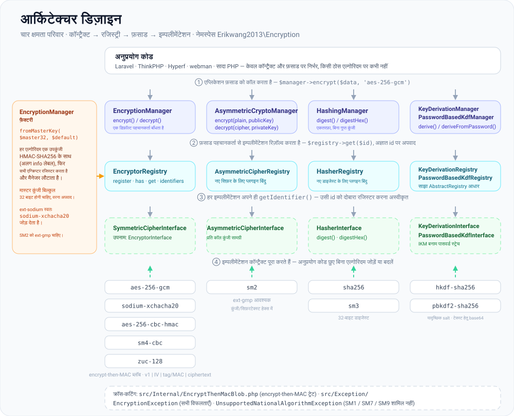
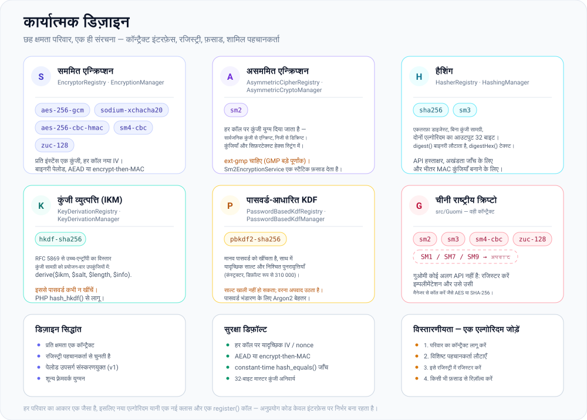
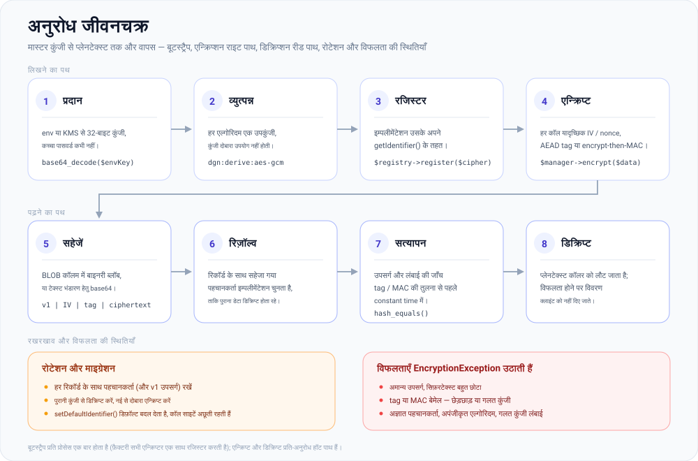

# erikwang2013/encryption

**Languages:** [English](../en/README.md) | [简体中文](../../../README.zh-CN.md) | [한국어](../ko/README.md) | [Русский](../ru/README.md) | [Deutsch](../de/README.md) | [Français](../fr/README.md) | [Español](../es/README.md) | [Português](../pt/README.md) | **हिन्दी** | [العربية](../ar/README.md) | [বাংলা](../bn/README.md) | [Bahasa Indonesia](../id/README.md) | [日本語](../ja/README.md)

<p align="center">
  
</p>

एक प्लग करने योग्य क्रिप्टोग्राफ़ी कॉम्पोनेंट लाइब्रेरी: एक एकीकृत कॉन्ट्रैक्ट (contract) के अंतर्गत यह **सममित एन्क्रिप्शन**, **असममित एन्क्रिप्शन**, **हैशिंग** और **कुंजी व्युत्पत्ति** (HKDF / PBKDF2) प्रदान करती है, जिसमें AES/Sodium तथा चीनी राष्ट्रीय एल्गोरिदम SM2/SM3/SM4/ZUC शामिल हैं। इसे Composer के माध्यम से इंस्टॉल किया जा सकता है।

**Locky**, ऊपर दिखने वाला ताला, इस परियोजना का शुभंकर है: यह हर एल्गोरिदम के लिए एक अलग कुंजी रखता है, हर कॉल पर नया IV बनाता है, और इसका कीहोल कभी कुछ नहीं बताता। आपका अपना ऐप भी इसे दिखा सकता है — `Mascot::svg()` HTML के लिए आर्टवर्क लौटाता है, `Mascot::ascii()` टर्मिनल बैनर, और `Mascot::NAME` का मान `Locky` है।

## परियोजना के बारे में

### यह क्या है

`erikwang2013/encryption` एक शुद्ध PHP क्रिप्टोग्राफ़ी कॉम्पोनेंट लाइब्रेरी है, जो PHP अनुप्रयोगों को **टाइप-सुरक्षित और विस्तारणीय** एन्क्रिप्शन, हैशिंग तथा कुंजी व्युत्पत्ति देती है। इसमें किसी फ़्रेमवर्क पर निर्भरता नहीं है और यह स्वतंत्र रूप से अथवा Laravel, ThinkPHP, Hyperf और webman के भीतर काम करती है।

नीचे आपको [परियोजना संरचना](#परियोजना-संरचना) के साथ-साथ [आर्किटेक्चर डिज़ाइन](#आर्किटेक्चर-का-अवलोकन), [कार्यात्मक डिज़ाइन](#कार्यात्मक-डिज़ाइन) और [अनुरोध जीवनचक्र](#अनुरोध-जीवनचक्र) के SVG आरेख मिलेंगे; आरेखों के स्रोत [`docs/`](../../) में हैं।

### यह क्यों मौजूद है

PHP का क्रिप्टोग्राफ़ी परिदृश्य बिखरा हुआ है: Laravel अपना अलग `Crypt` देता है, चीनी राष्ट्रीय एल्गोरिदम (SM2/SM3/SM4) के लिए कोई एकीकृत Composer पैकेज नहीं है, और कुंजी व्युत्पत्ति की मूल क्रियाओं (HKDF/PBKDF2) के लिए कोई साझा इंटरफ़ेस नहीं है। यह लाइब्रेरी मुख्यधारा के सममित/असममित/हैश/KDF एल्गोरिदम को **एक ही कॉन्ट्रैक्ट प्रणाली** के अंतर्गत लाती है, ताकि:

- **अनुप्रयोग कोड केवल इंटरफ़ेस पर निर्भर रहता है** — एल्गोरिदम बदलने पर व्यावसायिक लॉजिक में कोई बदलाव नहीं करना पड़ता
- **गुओमी (Guomi) एल्गोरिदम को प्रथम श्रेणी का समर्थन** — इन्हें AES/Sodium की तरह ही उसी Manager से कॉल करें
- **कुंजी प्रबंधन मानकीकृत है** — एक मास्टर कुंजी से हर एल्गोरिदम की अलग उप-कुंजी व्युत्पन्न करें, जिससे अलग-अलग सिफ़रों में कुंजी का पुनरुपयोग न हो
- **सुरक्षित डिफ़ॉल्ट अंतर्निहित हैं** — प्रमाणित एन्क्रिप्शन (GCM / encrypt-then-MAC), यादृच्छिक IV और constant-time तुलना बिना किसी अतिरिक्त प्रयास के उपलब्ध हैं

### उपयोग के क्षेत्र

- फ़ील्ड-स्तरीय एन्क्रिप्शन (फ़ोन नंबर या आईडी नंबर जैसी व्यक्तिगत जानकारी को डेटाबेस में सहेजने से पहले एन्क्रिप्ट करना)
- एक साथ कई एल्गोरिदम का उपयोग और क्रमिक माइग्रेशन (जैसे AES-256-CBC से AES-256-GCM)
- गुओमी-अनुपालन वाले बैक-ऑफ़िस सिस्टम (SM2 असममित, SM3 हैशिंग, SM4 सममित, ZUC स्ट्रीम सिफ़र)
- API हस्ताक्षर और सत्यापन (HMAC / SHA-256 / SM3)
- पासवर्ड या मास्टर कुंजी से उप-कुंजी व्युत्पत्ति (PBKDF2 / HKDF)

## विषय-सूची

- [फ़्रेमवर्क संगतता](#फ़्रेमवर्क-संगतता)
- [प्रत्येक फ़्रेमवर्क के लिए एकीकरण](#प्रत्येक-फ़्रेमवर्क-के-लिए-एकीकरण)
- [त्वरित शुरुआत](#त्वरित-शुरुआत)
- [आर्किटेक्चर का अवलोकन](#आर्किटेक्चर-का-अवलोकन)
- [कार्यात्मक डिज़ाइन](#कार्यात्मक-डिज़ाइन)
- [अनुरोध जीवनचक्र](#अनुरोध-जीवनचक्र)
- [आवश्यकताएँ](#आवश्यकताएँ)
- [इंस्टॉलेशन](#इंस्टॉलेशन)
- [अंतर्निहित एल्गोरिदम और पहचानकर्ता](#अंतर्निहित-एल्गोरिदम-और-पहचानकर्ता)
- [उपयोग](#उपयोग)
- [परियोजना संरचना](#परियोजना-संरचना)
- [अक्सर पूछे जाने वाले प्रश्न](#अक्सर-पूछे-जाने-वाले-प्रश्न)
- [सुरक्षा नोट्स](#सुरक्षा-नोट्स)
- [परीक्षण चलाना](#परीक्षण-चलाना)
- [लाइसेंस](#लाइसेंस)

---

## फ़्रेमवर्क संगतता

यह पैकेज किसी भी वेब फ़्रेमवर्क पर **निर्भर नहीं** करता। यह केवल क्लास और ऑटोलोडिंग वाली एक Composer लाइब्रेरी के रूप में आता है। अपने अनुप्रयोग में `composer require erikwang2013/encryption` चलाएँ; राउटिंग, कंटेनर और कॉन्फ़िगरेशन से इसका कोई संबंध नहीं है।

आपको **PHP ≥ 8.0** तथा [आवश्यकताएँ](#आवश्यकताएँ) में दिए गए एक्सटेंशन/निर्भरताएँ चाहिए। इनके साथ निम्नलिखित फ़्रेमवर्क संस्करण काम करते हैं (प्रत्येक फ़्रेमवर्क के अपने क्रिप्टो API के साथ-साथ; आवश्यकता अनुसार `EncryptionManager` आदि इंजेक्ट करें):

| फ़्रेमवर्क | टिप्पणियाँ |
|-----------|--------|
| **Laravel** 7 / 8 / 9 / 10 / 11 | **PHP 8.0+** रनटाइम में इंस्टॉल करें। केवल Laravel 7, जो अभी भी PHP 7.x पर चलता है, इस पैकेज की शर्त पूरी नहीं करता—पहले PHP अपग्रेड करें। |
| **ThinkPHP** 6 / 8 | पैकेज को ऐप के मानक `composer.json` के `require` में जोड़ें। |
| **Hyperf** 2 / 3 | सेवा के `composer.json` में जोड़ें; जैसा आप Hyperf में सामान्यतः करते हैं, वैसे ही `config` में सिंगलटन या फ़ैक्टरी रजिस्टर करें। |
| **webman** 1 / 2 | परियोजना की जड़ में `composer require` चलाएँ; बिज़नेस क्लास या `support` हेल्पर से उपयोग करें। |

### प्रत्येक फ़्रेमवर्क के लिए एकीकरण

Laravel के लिए कोई समर्पित ServiceProvider या ThinkPHP के लिए कोई बिहेवियर बंडल **नहीं** है। आप `EncryptionManager` (या अन्य मैनेजर) को अपने फ़्रेमवर्क के **DI कंटेनर** या **सिंगलटन फ़ैक्टरी** में रजिस्टर करते हैं, और कॉन्फ़िग या एनवायरनमेंट से 32-बाइट की मास्टर कुंजी लोड करते हैं। नीचे दिए गए स्निपेट न्यूनतम हैं; कुंजी सामग्री (`.env`, KMS, कॉन्फ़िग सेवाएँ) के लिए **अपनी सुरक्षा नीति का पालन करें**—सीक्रेट को हार्ड-कोड न करें।

**Laravel (`App\Providers\AppServiceProvider` अथवा कोई समर्पित ServiceProvider)**

```php
use Erikwang2013\Encryption\EncryptionManagerFactory;

public function register(): void
{
    $this->app->singleton(\Erikwang2013\Encryption\EncryptionManager::class, function () {
        $raw = config('app.custom_master_key'); // e.g. base64 for 32 bytes
        $master = is_string($raw) ? base64_decode($raw, true) : '';
        if ($master === false || strlen($master) !== 32) {
            throw new \RuntimeException('Invalid 32-byte master key.');
        }
        return EncryptionManagerFactory::fromMasterKey($master, 'aes-256-gcm');
    });
}
```

`app(\Erikwang2013\Encryption\EncryptionManager::class)` से इसे रिज़ॉल्व करें। यह Laravel के `Crypt` / `encrypt()` का **विकल्प नहीं** है: यह लाइब्रेरी फ़ील्ड-स्तरीय एन्क्रिप्शन और बहु-एल्गोरिदम रजिस्ट्री के लिए बनी है; Laravel के हेल्पर फ़्रेमवर्क सीरियलाइज़ेशन, कुकीज़ आदि संभालते हैं।

**ThinkPHP 6 / 8 (`common.php` में सेवा क्लास या फ़ैक्टरी)**

```php
use Erikwang2013\Encryption\EncryptionManagerFactory;

function app_encryption_manager(): \Erikwang2013\Encryption\EncryptionManager
{
    static $mgr = null;
    if ($mgr === null) {
        $master = base64_decode(config('app.master_key'), true);
        $mgr = EncryptionManagerFactory::fromMasterKey($master, 'aes-256-gcm');
    }
    return $mgr;
}
```

आप `app\service` के अंतर्गत `EncryptionService` भी परिभाषित कर सकते हैं और परीक्षणों में आसान मॉकिंग के लिए इसे कंट्रोलर में इंजेक्ट कर सकते हैं।

**Hyperf 2 / 3 (`config/autoload/dependencies.php` अथवा एनोटेशन फ़ैक्टरी)**

```php
use Erikwang2013\Encryption\EncryptionManager;
use Erikwang2013\Encryption\EncryptionManagerFactory;

return [
    EncryptionManager::class => function () {
        $master = base64_decode((string) config('encryption.master_key'), true);
        return EncryptionManagerFactory::fromMasterKey($master, 'aes-256-gcm');
    },
];
```

कोरूटीन मोड में, यदि कुंजियाँ रिमोट कॉन्फ़िग से आती हैं, तो पार्स किए गए मान को कैश करें।

**webman 1 / 2**

`EncryptionManager` को `config/plugin.php` के ग्लोबल `support` कंटेनर पर, किसी कस्टम `bootstrap` में, या यदि आप वह पैटर्न उपयोग करते हैं तो `support/bootstrap.php` में रजिस्टर करें; अथवा सेवा क्लासों के भीतर `EncryptionManagerFactory::fromMasterKey(...)` से बनाएँ। webman किसी विशिष्ट कंटेनर को अनिवार्य नहीं करता—**अपनी परियोजना की परंपराओं का पालन करें**।

**वनीला PHP (बिना फ़्रेमवर्क)**

यहाँ कोई कंटेनर नहीं है जिसमें रजिस्टर किया जाए: प्रोजेक्ट रूट में `composer require` चलाएँ, फिर मैनेजर एक बार बनाकर उसी को दोबारा इस्तेमाल करें। इस अनुभाग का चलाने योग्य संस्करण [`examples/plain-php/`](../../../examples/plain-php) में है — `php examples/plain-php/demo.php` एन्क्रिप्शन → संग्रहण → पढ़ना → डिक्रिप्शन → छेड़छाड़ पहचान का पूरा चक्र दिखाता है।

```php
// bootstrap.php — require this once from your front controller
use Erikwang2013\Encryption\EncryptionManagerFactory;

$raw = getenv('ENCRYPTION_MASTER_KEY');            // base64 of 32 random bytes
$key = is_string($raw) ? base64_decode($raw, true) : false;
if ($key === false || strlen($key) !== 32) {
    throw new RuntimeException('ENCRYPTION_MASTER_KEY must be base64 of 32 bytes.');
}
$manager = EncryptionManagerFactory::fromMasterKey($key, 'aes-256-gcm');

// anywhere else in the project
$stored = base64_encode($manager->encrypt($phone));   // store as TEXT
$phone  = $manager->decrypt(base64_decode($stored));  // read it back
```

```bash
# generate the key once, keep it in the server environment — never in the code
export ENCRYPTION_MASTER_KEY="$(php -r 'echo base64_encode(random_bytes(32)), PHP_EOL;')"
```

शुद्ध PHP प्रोजेक्ट के लिए नोट: महँगा हिस्सा फ़ैक्टरी है (यह हर सबकी व्युत्पन्न करती है और हर एन्क्रिप्टर रजिस्टर करती है), इसलिए इसे प्रति प्रोसेस एक बार बुलाएँ और हर क्वेरी के बजाय उसी इंस्टेंस को दोबारा इस्तेमाल करें; कुंजी को प्रोसेस के एनवायरनमेंट या अपने सीक्रेट स्टोर में रखें और उसका बैकअप रखें — इसे खोने का अर्थ डेटा खोना है; पढ़ते समय `EncryptionException` पकड़ें और कारण क्लाइंट को लौटाने के बजाय सर्वर-साइड लॉग करें; सिफ़रटेक्स्ट बाइनरी होता है, इसलिए `base64_encode(...)` को `TEXT` कॉलम में या कच्चे बाइट्स को `BLOB` कॉलम में संग्रहीत करें।

### इस लाइब्रेरी से असंबंधित

- फ़्रेमवर्क अपग्रेड (जैसे Laravel 10 → 11) के लिए यहाँ सामान्यतः API में बदलाव **आवश्यक नहीं** होता। यदि Composer PHP संस्करण का टकराव बताए, तो `composer.json` में इस पैकेज की `php` शर्त का पालन करें।
- चीनी राष्ट्रीय **SM2** के लिए **`ext-gmp`** आवश्यक है; इसके बिना संबंधित क्लास फ़्रेमवर्क चाहे कोई भी हो, रनटाइम पर विफल हो जाती हैं।

---

## त्वरित शुरुआत

1. अपनी परियोजना की जड़ में: `composer require erikwang2013/encryption:^1.0` (या आपकी प्रकाशित संस्करण शर्त)।
2. सुनिश्चित करें कि `php -v` **8.0+** है और `openssl` सक्षम है; `sodium-xchacha20` या SM2 के लिए आवश्यकतानुसार `sodium` और/या `gmp` एक्सटेंशन इंस्टॉल करें।
3. `use Erikwang2013\Encryption\...` करें और [उपयोग](#उपयोग) में वर्णित अनुसार `EncryptionManager`, हैशिंग, KDF आदि चुनें।

---

## आर्किटेक्चर का अवलोकन

क्षमताओं को चार कॉन्ट्रैक्ट परिवारों में बाँटा गया है, जिनमें से प्रत्येक की अपनी रजिस्ट्री और संयोजन तथा परीक्षण के लिए वैकल्पिक फ़साड (`*Manager`) है। हर परिवार का आकार एक जैसा है — कॉन्ट्रैक्ट इंटरफ़ेस → रजिस्ट्री → फ़साड → इम्प्लीमेंटेशन — और `EncryptionManagerFactory` सममित परिवार को एक ही मास्टर कुंजी से जोड़ती है।



स्रोत: [`docs/architecture-design.svg`](./architecture-design.svg)

| क्षमता | कॉन्ट्रैक्ट | रजिस्ट्री | फ़साड (डिफ़ॉल्ट एल्गोरिदम) |
|------------|----------|----------|----------------------------|
| सममित | `SymmetricCipherInterface` (`EncryptorInterface` उपनाम) | `EncryptorRegistry` | `EncryptionManager` |
| असममित | `AsymmetricCipherInterface` | `AsymmetricCipherRegistry` | `AsymmetricCryptoManager` |
| हैशिंग | `HasherInterface` | `HasherRegistry` | `HashingManager` |
| कुंजी व्युत्पत्ति (IKM) | `KeyDerivationInterface` | `KeyDerivationRegistry` | `KeyDerivationManager` |
| पासवर्ड-आधारित KDF | `PasswordBasedKdfInterface` | `PasswordBasedKdfRegistry` | `PasswordBasedKdfManager` |

डिज़ाइन नोट्स:

- **सममित**: इंस्टेंस एक निश्चित कुंजी से बंधे होते हैं; पेलोड बाइनरी होते हैं—बड़े पैमाने पर फ़ील्ड एन्क्रिप्शन के लिए उपयुक्त।
- **असममित**: हर कॉल में सार्वजनिक/निजी कुंजी सामग्री दी जाती है (प्रारूप इम्प्लीमेंटेशन तय करता है, जैसे SM2 हेक्स)।
- **हैशिंग**: एकतरफ़ा डाइजेस्ट, कोई गुप्त कुंजी नहीं (या मानक SM3-शैली हैशिंग)।
- **कुंजी व्युत्पत्ति**: **HKDF** उच्च-एन्ट्रॉपी कुंजी सामग्री को उप-कुंजियों में विस्तारित करता है; **PBKDF2** मानव पासवर्ड को खींचता है (यादृच्छिक साल्ट और अधिक पुनरावृत्तियों का उपयोग करें)।

---

## कार्यात्मक डिज़ाइन

छह क्षमता परिवार, जिनमें से प्रत्येक नीचे दिए गए पहचानकर्ताओं के साथ आता है। नया एल्गोरिदम जोड़ना यानी एक नई क्लास और एक `register()` कॉल — कोर में कुछ नहीं बदलता, और अनुप्रयोग कोड केवल इंटरफ़ेस पर निर्भर बना रहता है।



स्रोत: [`docs/functional-design.svg`](./functional-design.svg)

| परिवार | पहचानकर्ता | यह किसके लिए है |
|--------|-----------|----------------|
| सममित | `aes-256-gcm`, `sodium-xchacha20`, `aes-256-cbc-hmac`, `sm4-cbc`, `zuc-128` | किसी भी आकार का फ़ील्ड-स्तरीय एन्क्रिप्शन, प्रति इंस्टेंस एक कुंजी बंधी |
| असममित | `sm2` | प्रति कॉल सार्वजनिक/निजी कुंजी सामग्री (हेक्स), `ext-gmp` आवश्यक |
| हैशिंग | `sha256`, `sm3` | हस्ताक्षर और अखंडता जाँच के लिए एकतरफ़ा डाइजेस्ट |
| कुंजी व्युत्पत्ति (IKM) | `hkdf-sha256` | उच्च-एन्ट्रॉपी कुंजी सामग्री को हर प्रयोजन की उप-कुंजियों में विस्तारित करना |
| पासवर्ड-आधारित KDF | `pbkdf2-sha256` | मानव पासवर्ड को खींचना (यादृच्छिक साल्ट, डिफ़ॉल्ट रूप से 310 000 पुनरावृत्तियाँ) |
| गुओमी | SM2 / SM3 / SM4 / ZUC | उन्हीं कॉन्ट्रैक्ट के माध्यम से राष्ट्रीय एल्गोरिदम; SM1 / SM7 / SM9 `UnsupportedNationalAlgorithmException` फेंकते हैं |

---

## अनुरोध जीवनचक्र

बूटस्ट्रैप प्रति प्रोसेस एक बार होता है; एन्क्रिप्ट और डिक्रिप्ट प्रति-अनुरोध का हॉट पाथ हैं। हर पेलोड के साथ एक संस्करण उपसर्ग (`v1`) रहता है, इसलिए आज लिखा गया सिफ़रटेक्स्ट रोटेशन के बाद भी पढ़ा जा सकता है।



स्रोत: [`docs/lifecycle.svg`](./lifecycle.svg)

1. **प्रदान** — `.env` या KMS से 32-बाइट की मास्टर कुंजी; फ़ैक्टरी किसी अन्य लंबाई को अस्वीकार करती है।
2. **व्युत्पन्न और रजिस्टर** — `EncryptionManagerFactory::fromMasterKey()` HMAC-SHA256 की सहायता से हर एल्गोरिदम के लिए एक उप-कुंजी व्युत्पन्न करता है (हर एक के लिए अलग info लेबल) और सभी एन्क्रिप्टर एक साथ रजिस्टर करता है।
3. **एन्क्रिप्ट** — `$manager->encrypt($data, 'aes-256-gcm')`; हर कॉल पर यादृच्छिक IV/nonce बनाया जाता है और सिफ़रटेक्स्ट पर tag या MAC की गणना की जाती है।
4. **सहेजें** — बाइनरी ब्लॉब `v1 | IV | tag/MAC | ciphertext` किसी `BLOB` कॉलम में जाता है, या टेक्स्ट भंडारण के लिए `base64_encode` किया जाता है।
5. **डिक्रिप्ट** — सहेजा गया पहचानकर्ता इम्प्लीमेंटेशन चुनता है, उपसर्ग और लंबाई की जाँच होती है, tag/MAC की तुलना constant time में होती है, और तभी प्लेनटेक्स्ट लौटाया जाता है। कोई भी विफलता `EncryptionException` उठाती है।

---

## आवश्यकताएँ

| मद | विवरण |
|------|---------|
| PHP | `^8.0` (ऊपर दिए गए फ़्रेमवर्क के साथ प्रयोग करने पर यही शर्त लागू होगी) |
| एक्सटेंशन | `ext-openssl` (आवश्यक) |
| एक्सटेंशन | `ext-sodium` (वैकल्पिक, `sodium-xchacha20` के लिए) |
| एक्सटेंशन | `ext-gmp` (वैकल्पिक, **SM2** एन्क्रिप्शन/डिक्रिप्शन और कुंजी निर्माण) |
| Composer | `pohoc/crypto-sm` (निर्भरता; SM2/SM3/SM4 रैपर) |

## इंस्टॉलेशन

### स्थानीय पथ से (विकास)

उपयोग करने वाली परियोजना के `composer.json` में:

```json
{
    "repositories": [
        {
            "type": "path",
            "url": "/absolute/path/to/encryption"
        }
    ],
    "require": {
        "erikwang2013/encryption": "@dev"
    }
}
```

फिर:

```bash
composer update erikwang2013/encryption
```

### Git / Packagist से (रिलीज़ के बाद)

```bash
composer require erikwang2013/encryption:^1.0
```

(रिपॉज़िटरी को सुलभ Git रिमोट और Composer स्रोत पर पुश करें, अथवा Packagist पर प्रकाशित करें।)

---

## अंतर्निहित एल्गोरिदम और पहचानकर्ता

### सममित एन्क्रिप्शन (`SymmetricCipherInterface`)

| पहचानकर्ता (`getIdentifier`) | क्लास | कुंजी की लंबाई | टिप्पणियाँ |
|------------------------------|-------|------------|--------|
| `aes-256-gcm` | `Aes256GcmEncryptor` | 32 बाइट | AEAD; नए सिस्टम के लिए अनुशंसित डिफ़ॉल्ट |
| `sodium-xchacha20` | `SodiumXChaCha20Encryptor` | 32 बाइट | `ext-sodium` आवश्यक |
| `aes-256-cbc-hmac` | `OpenSslAes256CbcEncryptor` | 32 बाइट | पुरानी संगतता के लिए CBC + HMAC |
| `sm4-cbc` | `Sm4CbcEncryptor` | 16 बाइट | SM4-CBC (OpenSSL SM4) |
| `zuc-128` | `ZucEncryptor` | 16 बाइट | ZUC-128 स्ट्रीम सिफ़र |

### असममित एन्क्रिप्शन (`AsymmetricCipherInterface`)

| पहचानकर्ता | क्लास | टिप्पणियाँ |
|------------|-------|--------|
| `sm2` | `Sm2AsymmetricCipher` | SM2; कुंजियाँ और सिफ़रटेक्स्ट हेक्स में; `ext-gmp` आवश्यक |

आप स्टैटिक फ़साड `Sm2EncryptionService` का भी उपयोग कर सकते हैं; इसका व्यवहार `Sm2AsymmetricCipher` जैसा ही है।

### हैशिंग (`HasherInterface`)

| पहचानकर्ता | क्लास | आउटपुट की लंबाई |
|------------|-------|-----------------|
| `sha256` | `Sha256Hasher` | 32 बाइट |
| `sm3` | `Sm3Hasher` | 32 बाइट |

### कुंजी व्युत्पत्ति

| पहचानकर्ता | क्लास | कॉन्ट्रैक्ट | टिप्पणियाँ |
|------------|-------|----------|--------|
| `hkdf-sha256` | `HkdfSha256` | `KeyDerivationInterface` | RFC 5869: IKM + salt + info |
| `pbkdf2-sha256` | `Pbkdf2Sha256` | `PasswordBasedKdfInterface` | पासवर्ड + salt + पुनरावृत्तियाँ (कंस्ट्रक्टर) |

सिफ़रटेक्स्ट और डाइजेस्ट सामान्यतः बाइनरी होते हैं; JSON/टेक्स्ट भंडारण के लिए स्वयं `base64_encode` / `base64_decode` लगाएँ।

---

## उपयोग

### 1. सममित एन्क्रिप्शन: एकल एल्गोरिदम और रजिस्ट्री

```php
<?php

use Erikwang2013\Encryption\Encryptor\Aes256GcmEncryptor;
use Erikwang2013\Encryption\EncryptionManager;
use Erikwang2013\Encryption\EncryptorRegistry;

$key = random_bytes(32);
$encryptor = new Aes256GcmEncryptor($key);
$ciphertext = $encryptor->encrypt('plaintext');
$plaintext  = $encryptor->decrypt($ciphertext);

$registry = new EncryptorRegistry(new Aes256GcmEncryptor($key));
$manager = new EncryptionManager($registry, 'aes-256-gcm');
$blob = $manager->encrypt('data');
```

मास्टर-कुंजी फ़ैक्टरी: `EncryptionManagerFactory::fromMasterKey($masterKey32, 'aes-256-gcm')` हर एल्गोरिदम की उप-कुंजी व्युत्पन्न करती है और **aes-256-gcm**, **aes-256-cbc-hmac**, **sm4-cbc**, **zuc-128** तथा **sodium-xchacha20** (यदि ext-sodium उपलब्ध हो) को एक साथ रजिस्टर करती है।

### 2. असममित एन्क्रिप्शन

```php
<?php

use Erikwang2013\Encryption\Asymmetric\Sm2AsymmetricCipher;
use Erikwang2013\Encryption\AsymmetricCipherRegistry;
use Erikwang2013\Encryption\AsymmetricCryptoManager;
use Erikwang2013\Encryption\Guomi\Sm2EncryptionService;

// requires ext-gmp
$pair = Sm2EncryptionService::generateKeyPairHex();

$cipher = new Sm2AsymmetricCipher();
$hexCipher = $cipher->encrypt('plaintext', $pair->getPublicKey());
$plain = $cipher->decrypt($hexCipher, $pair->getPrivateKey());

$mgr = new AsymmetricCryptoManager(new AsymmetricCipherRegistry($cipher), 'sm2');
$hexCipher2 = $mgr->encrypt('plaintext', $pair->getPublicKey());
```

### 3. हैशिंग

```php
<?php

use Erikwang2013\Encryption\Hash\Sha256Hasher;
use Erikwang2013\Encryption\Guomi\Sm3Hasher;
use Erikwang2013\Encryption\HasherRegistry;
use Erikwang2013\Encryption\HashingManager;

$registry = new HasherRegistry(
    new Sha256Hasher(),
    new Sm3Hasher(),
);
$hashing = new HashingManager($registry, 'sha256');
$bin = $hashing->digest('data');
$hex = $hashing->digestHex('data', 'sm3');
```

### 4. कुंजी व्युत्पत्ति (HKDF / PBKDF2)

```php
<?php

use Erikwang2013\Encryption\Kdf\HkdfSha256;
use Erikwang2013\Encryption\Kdf\Pbkdf2Sha256;
use Erikwang2013\Encryption\KeyDerivationManager;
use Erikwang2013\Encryption\KeyDerivationRegistry;
use Erikwang2013\Encryption\PasswordBasedKdfManager;
use Erikwang2013\Encryption\PasswordBasedKdfRegistry;

// Derive subkey from high-entropy material (e.g. TLS, envelope subkeys)
$hkdf = new HkdfSha256();
$subKey = $hkdf->derive($ikm32, $salt, 32, 'app:v1');

$kdfMgr = new KeyDerivationManager(new KeyDerivationRegistry($hkdf), 'hkdf-sha256');

// Derive from user password (for password storage prefer password_hash / Argon2, etc.)
$pbkdf2 = new Pbkdf2Sha256(iterations: 310_000);
$derived = $pbkdf2->deriveFromPassword('user password', random_bytes(16), 32);

$pwdMgr = new PasswordBasedKdfManager(new PasswordBasedKdfRegistry($pbkdf2), 'pbkdf2-sha256');
```

### 5. चीनी राष्ट्रीय एल्गोरिदम (SM3 / SM4 / ZUC / SM2)

```php
<?php

use Erikwang2013\Encryption\Guomi\Sm2EncryptionService;
use Erikwang2013\Encryption\Guomi\Sm3Hasher;
use Erikwang2013\Encryption\Guomi\Sm4CbcEncryptor;
use Erikwang2013\Encryption\Guomi\ZucEncryptor;

$sm3 = new Sm3Hasher();
$bin = $sm3->digest('data');

$key16 = random_bytes(16);
$sm4 = new Sm4CbcEncryptor($key16);
$blob = $sm4->encrypt('plaintext');

$zuc = new ZucEncryptor($key16);
$blob2 = $zuc->encrypt('plaintext');

// SM2: see asymmetric example above or Sm2EncryptionService
```

SM1, SM7, SM9: `UnavailableNationalAlgorithms::sm1()` और इसी तरह के तरीके `UnsupportedNationalAlgorithmException` फेंकते हैं।

### 6. कस्टम प्लगइन

- सममित: `EncryptorInterface` (`SymmetricCipherInterface`) लागू करें, `EncryptorRegistry` में रजिस्टर करें।
- असममित: `AsymmetricCipherInterface` लागू करें, `AsymmetricCipherRegistry` में रजिस्टर करें।
- हैशिंग: `HasherInterface` लागू करें, `HasherRegistry` में रजिस्टर करें।
- KDF: `KeyDerivationInterface` या `PasswordBasedKdfInterface` लागू करें, संबंधित `Registry` में रजिस्टर करें।

### 7. अपवाद

विफलताएँ `Erikwang2013\Encryption\Exception\EncryptionException` फेंकती हैं; अनुपलब्ध राष्ट्रीय एल्गोरिदम के लिए `UnsupportedNationalAlgorithmException` होता है। अनुप्रयोग कोड में इन्हें कैच करके लॉग करें; क्लाइंट को विवरण न लीक करें।

---

## परियोजना संरचना

```text
encryption/
├── src/
│   ├── Contract/                    क्षमता इंटरफ़ेस — सार्वजनिक कॉन्ट्रैक्ट:
│   │                                SymmetricCipherInterface (उपनाम EncryptorInterface),
│   │                                AsymmetricCipherInterface, HasherInterface,
│   │                                KeyDerivationInterface, PasswordBasedKdfInterface
│   ├── Encryptor/                   Aes256GcmEncryptor, OpenSslAes256CbcEncryptor,
│   │                                SodiumXChaCha20Encryptor
│   ├── Asymmetric/                  Sm2AsymmetricCipher
│   ├── Hash/                        Sha256Hasher
│   ├── Kdf/                         HkdfSha256, Pbkdf2Sha256
│   ├── Guomi/                       Sm2EncryptionService, Sm3Hasher, Sm4CbcEncryptor,
│   │                                ZucEncryptor, UnavailableNationalAlgorithms
│   │   └── Internal/ZucEngine.php   ZUC कीस्ट्रीम इंजन
│   ├── Internal/                    EncryptThenMacBlob ट्रेट (साझा encrypt-then-MAC)
│   ├── Exception/                   EncryptionException,
│   │                                UnsupportedNationalAlgorithmException
│   ├── AbstractRegistry.php         पहचानकर्ता → कार्यान्वयन स्टोर, सभी रजिस्ट्रियों द्वारा साझा
│   ├── EncryptorRegistry.php        AsymmetricCipherRegistry.php, HasherRegistry.php,
│   │                                KeyDerivationRegistry.php, PasswordBasedKdfRegistry.php
│   ├── EncryptionManager.php        AsymmetricCryptoManager.php, HashingManager.php,
│   │                                KeyDerivationManager.php, PasswordBasedKdfManager.php
│   ├── EncryptionManagerFactory.php मास्टर कुंजी → प्रति-एल्गोरिदम उपकुंजियाँ → रजिस्ट्री
│   └── Mascot.php                   वैकल्पिक मास्कॉट API (SVG / ASCII); क्रिप्टो कोड इसे कभी नहीं बुलाता
├── tests/                           PHPUnit सूट: कॉन्ट्रैक्ट, रजिस्ट्री, मैनेजर और
│                                    एल्गोरिदम परीक्षण तथा TestCase हेल्पर
├── docs/                            मास्कॉट और डिज़ाइन आरेख
│   ├── mascot.svg                   प्रोजेक्ट मास्कॉट (Locky)
│   ├── architecture-design.svg      「आर्किटेक्चर का अवलोकन」 में एम्बेडेड
│   ├── functional-design.svg        「कार्यात्मक डिज़ाइन」 में एम्बेडेड
│   ├── lifecycle.svg                「अनुरोध जीवनचक्र」 में एम्बेडेड
│   ├── i18n/                        यह README 12 और भाषाओं में, हर एक में
│   │                                आरेखों की स्थानीयकृत प्रतियाँ (+ labels/*.json)
│   └── *.md                         संग्रहीत समीक्षा / परीक्षण रिपोर्ट
├── examples/plain-php/              चलाने योग्य वनीला-PHP एकीकरण (बूटस्ट्रैप + डेमो)
├── scripts/i18n-build-svg.php       लेबल शब्दकोशों से docs/i18n/<lang>/*.svg बनाता है
├── composer.json                    psr-4 ऑटोलोड, PHP ^8.0, phpunit डेव निर्भरता
├── phpunit.xml.dist
└── README.md  README.zh-CN.md
```

| पथ | उद्देश्य |
|------|---------|
| `src/Contract/` | क्षमता इंटरफ़ेस (`EncryptorInterface`, `HasherInterface`, …) |
| `src/Encryptor/`, `src/Asymmetric/`, `src/Hash/`, `src/Kdf/` | एल्गोरिदम इम्प्लीमेंटेशन |
| `src/Guomi/` | चीनी राष्ट्रीय क्रिप्टो और `UnavailableNationalAlgorithms` |
| `src/Internal/` | `EncryptThenMacBlob` — CBC / SM4 / ZUC द्वारा साझा किया गया encrypt-then-MAC |
| `src/Exception/` | `EncryptionException`, आदि |
| `*Registry.php`, `*Manager.php`, `EncryptionManagerFactory.php` | रजिस्ट्री, फ़साड, मास्टर-कुंजी फ़ैक्टरी |
| `docs/*.svg` | इस README में एम्बेड किए गए शुभंकर और डिज़ाइन आरेख |

नेमस्पेस उपसर्ग: `Erikwang2013\Encryption\`, Composer `psr-4` के अनुरूप।

---

## अक्सर पूछे जाने वाले प्रश्न

**Composer PHP संस्करण का मेल न होने की सूचना देता है**

यह पैकेज `php ^8.0` चाहता है। यदि ऐप अभी भी PHP 8.0 या उससे नीचे चल रहा है, तो PHP अपग्रेड करें या इस पैकेज का उपयोग न करें।

**`sodium-xchacha20` उपलब्ध नहीं है**

`sodium` एक्सटेंशन (`ext-sodium`) इंस्टॉल करके सक्षम करें। इसके बिना `EncryptionManagerFactory::fromMasterKey(..., 'sodium-xchacha20')` विफल हो जाता है; इसके बजाय `aes-256-gcm` उपयोग करें।

**SM2 में त्रुटियाँ या कुंजी निर्माण विफल**

**`ext-gmp`** इंस्टॉल करके सक्षम करें। SM2 बड़े पूर्णांकों पर निर्भर है; GMP के बिना व्यवहार की गारंटी नहीं है।

**सिफ़रटेक्स्ट को डेटाबेस / JSON में सहेजना**

बाइनरी कॉलम के लिए `BLOB` का उपयोग करें; यदि टेक्स्ट ही उपयोग करना हो, तो सिफ़रटेक्स्ट और IV को **`base64_encode`** करें, फिर डिक्रिप्शन से पहले **`base64_decode`** करें।

**Laravel के `encrypt()` / `Crypt` से अंतर**

Laravel का API फ़्रेमवर्क सीरियलाइज़ेशन और कुकीज़ के लिए बना है; यह लाइब्रेरी **स्पष्ट एल्गोरिदम ID, अनेक रजिस्ट्री, राष्ट्रीय एल्गोरिदम, HKDF/PBKDF2** आदि के लिए बनी है। दोनों साथ रह सकते हैं—जब तक आप स्वयं प्रारूपों को एक-रूप न करें, कुंजीकरण को मिलाएँ नहीं।

---

## सुरक्षा नोट्स

1. **कुंजियाँ**: उच्च-एन्ट्रॉपी कुंजियों के लिए `random_bytes()` या KMS का उपयोग करें; कच्चे पासवर्ड को कभी AES कुंजी के रूप में उपयोग न करें—पहले **PBKDF2 / Argon2** से खींचें।
2. **एल्गोरिदम**: नए सिस्टम के लिए **AES-256-GCM** या **Sodium** को प्राथमिकता दें; जहाँ आवश्यक हो वहाँ **SM3/SM4/ZUC/SM2** उपयोग करें; उप-कुंजी विस्तार के लिए **HKDF**; **PBKDF2** से पासवर्ड खींचते समय पर्याप्त पुनरावृत्तियाँ और यादृच्छिक साल्ट उपयोग करें।
3. **परिवहन**: संचरण में TLS का उपयोग अब भी करें; यह लाइब्रेरी फ़ील्ड-स्तरीय क्रिप्टो और डाइजेस्ट संभालती है।
4. **माइग्रेशन**: हर एल्गोरिदम संस्करण के लिए `identifier` रिकॉर्ड रखें, ताकि पुराना डेटा डिक्रिप्ट करके दोबारा एन्क्रिप्ट किया जा सके।

---

## परीक्षण चलाना

क्लोन करने के बाद:

```bash
composer install
composer test
```

यह `./vendor/bin/phpunit tests/` के बराबर है। यदि आप `phpunit.xml` जोड़ते हैं, तो `composer.json` में `test` स्क्रिप्ट को उसी की ओर इंगित करें।

---

## समर्थन के लिए धन्यवाद

| WeChat Pay / 微信 | Alipay / 支付宝 |
|:---:|:---:|
|  |  |

---

## लाइसेंस

MIT (`composer.json` में `license` फ़ील्ड देखें)।
