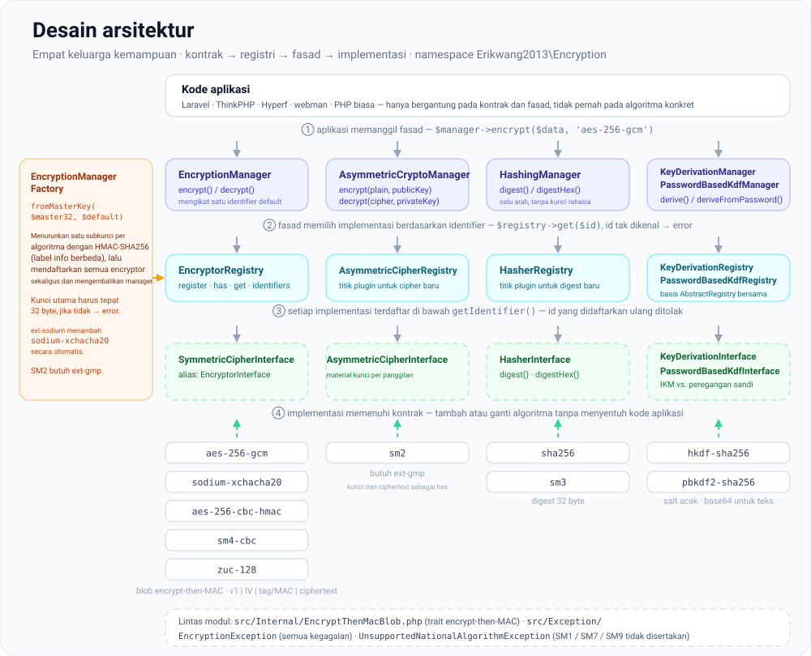
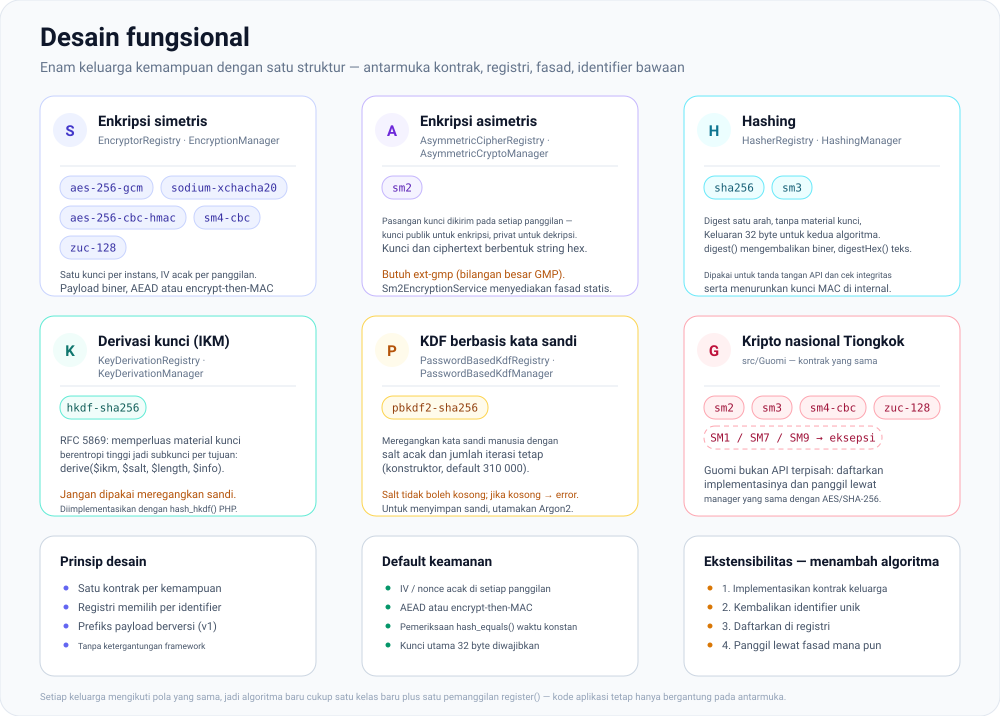
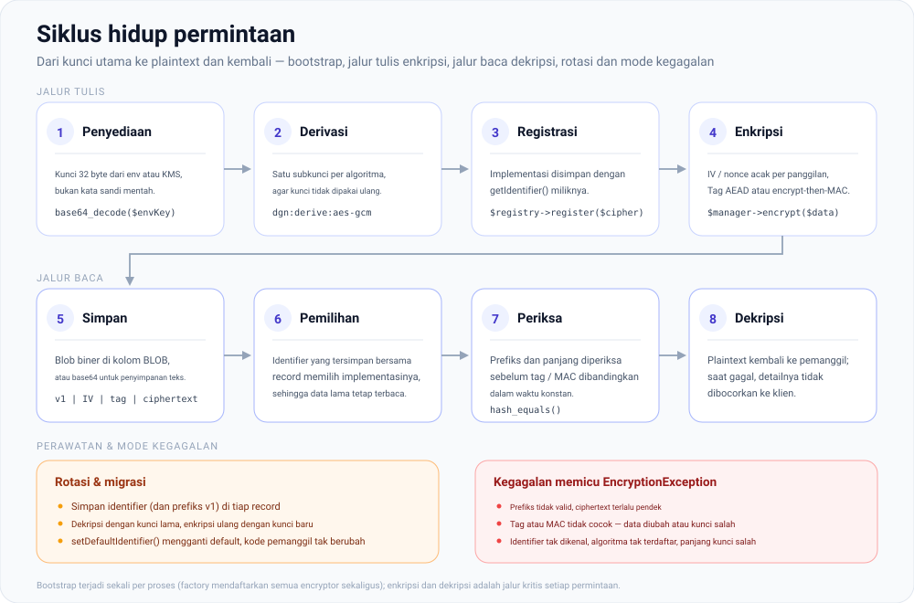

# erikwang2013/encryption

**Languages:** [English](../en/README.md) | [简体中文](../../../README.zh-CN.md) | [한국어](../ko/README.md) | [Русский](../ru/README.md) | [Deutsch](../de/README.md) | [Français](../fr/README.md) | [Español](../es/README.md) | [Português](../pt/README.md) | [हिन्दी](../hi/README.md) | [العربية](../ar/README.md) | [বাংলা](../bn/README.md) | **Bahasa Indonesia** | [日本語](../ja/README.md)

<p align="center">
  
</p>

Pustaka komponen kriptografi yang dapat dipasangi plug-in: di bawah satu kontrak yang seragam, pustaka ini menyediakan **enkripsi simetris**, **enkripsi asimetris**, **hashing**, dan **derivasi kunci** (HKDF / PBKDF2), dengan implementasi yang mencakup AES/Sodium serta algoritma nasional Tiongkok SM2/SM3/SM4/ZUC. Dapat dipasang melalui Composer.

**Locky**, gembok pada gambar di atas, adalah maskot proyek ini: ia menyimpan satu kunci untuk setiap algoritma, IV baru pada setiap pemanggilan, dan lubang kunci yang tidak pernah bocor. Aplikasi Anda pun dapat menampilkannya — `Mascot::svg()` mengembalikan gambar untuk HTML, `Mascot::ascii()` spanduk terminal, dan `Mascot::NAME` bernilai `Locky`.

## Tentang proyek

### Apa itu proyek ini

`erikwang2013/encryption` adalah pustaka komponen kriptografi PHP murni yang memberi aplikasi PHP enkripsi, hashing, dan derivasi kunci yang **type-safe dan dapat diperluas**. Pustaka ini tidak bergantung pada framework apa pun dan dapat dipakai secara mandiri maupun di dalam Laravel, ThinkPHP, Hyperf, dan webman.

Di bawah ini Anda akan menemukan [struktur proyek](#struktur-proyek) beserta diagram SVG untuk [ikhtisar arsitektur](#ikhtisar-arsitektur), [desain fungsional](#desain-fungsional), dan [siklus hidup permintaan](#siklus-hidup-permintaan); sumber diagramnya tersimpan di [`docs/`](../../).

### Mengapa proyek ini ada

Lanskap kriptografi di PHP terpecah-pecah: Laravel membawa `Crypt` sendiri, algoritma nasional Tiongkok (SM2/SM3/SM4) belum punya paket Composer yang terpadu, dan primitif derivasi kunci (HKDF/PBKDF2) tidak memiliki antarmuka bersama. Pustaka ini menyatukan algoritma simetris/asimetris/hash/KDF yang umum dipakai di bawah **satu sistem kontrak**, sehingga:

- **Kode aplikasi hanya bergantung pada antarmuka** — mengganti algoritma tidak memerlukan perubahan logika bisnis sama sekali
- **Algoritma Guomi diperlakukan setara** — panggil melalui Manager yang sama seperti AES/Sodium
- **Pengelolaan kunci menjadi terstandar** — turunkan subkunci per algoritma dari satu kunci utama, sehingga kunci tidak dipakai ulang antar cipher
- **Default yang aman sudah terpasang** — enkripsi terautentikasi (GCM / encrypt-then-MAC), IV acak, dan perbandingan waktu konstan tersedia langsung tanpa konfigurasi

### Kasus penggunaan

- Enkripsi tingkat field (enkripsi PII seperti nomor telepon atau nomor identitas sebelum disimpan ke basis data)
- Koeksistensi beberapa algoritma dan migrasi bertahap (misalnya AES-256-CBC ke AES-256-GCM)
- Sistem back-office yang mematuhi standar Guomi (SM2 asimetris, SM3 hashing, SM4 simetris, ZUC stream cipher)
- Penandatanganan dan verifikasi API (HMAC / SHA-256 / SM3)
- Derivasi subkunci dari kata sandi atau kunci utama (PBKDF2 / HKDF)

## Daftar isi

- [Kompatibilitas framework](#kompatibilitas-framework)
- [Integrasi per framework](#integrasi-per-framework)
- [Mulai cepat](#mulai-cepat)
- [Ikhtisar arsitektur](#ikhtisar-arsitektur)
- [Desain fungsional](#desain-fungsional)
- [Siklus hidup permintaan](#siklus-hidup-permintaan)
- [Persyaratan](#persyaratan)
- [Instalasi](#instalasi)
- [Algoritma dan identifier bawaan](#algoritma-dan-identifier-bawaan)
- [Penggunaan](#penggunaan)
- [Struktur proyek](#struktur-proyek)
- [FAQ](#faq)
- [Catatan keamanan](#catatan-keamanan)
- [Menjalankan pengujian](#menjalankan-pengujian)
- [Lisensi](#lisensi)

---

## Kompatibilitas framework

Paket ini **tidak bergantung** pada framework web mana pun. Paket ini dikirim sebagai pustaka Composer yang hanya berisi kelas dan autoloading. Di aplikasi Anda, jalankan `composer require erikwang2013/encryption`; routing, container, dan konfigurasi tidak relevan.

Anda memerlukan **PHP ≥ 8.0** dan ekstensi/dependensi yang tercantum pada bagian [Persyaratan](#persyaratan). Dengan itu, versi framework berikut dapat dipakai (berdampingan dengan API kripto bawaan masing-masing framework; suntikkan `EncryptionManager` dan sebagainya sesuai kebutuhan):

| Framework | Catatan |
|-----------|--------|
| **Laravel** 7 / 8 / 9 / 10 / 11 | Pasang pada runtime **PHP 8.0+**. Hanya Laravel 7 yang masih berjalan di PHP 7.x yang tidak memenuhi batasan paket ini—tingkatkan PHP terlebih dahulu. |
| **ThinkPHP** 6 / 8 | Tambahkan paket ini ke `require` di `composer.json` standar aplikasi. |
| **Hyperf** 2 / 3 | Tambahkan di `composer.json` layanan; daftarkan singleton di `config` atau factory seperti yang biasa Anda lakukan di Hyperf. |
| **webman** 1 / 2 | `composer require` di akar proyek; gunakan dari kelas bisnis atau helper `support`. |

### Integrasi per framework

Tidak ada ServiceProvider Laravel khusus maupun bundel behavior ThinkPHP. Anda mendaftarkan `EncryptionManager` (atau manager lain) di **container DI** atau **singleton factory** framework Anda, sambil memuat kunci utama 32 byte dari konfigurasi atau environment. Cuplikan di bawah ini bersifat minimal; **ikuti kebijakan keamanan Anda sendiri** untuk material kunci (`.env`, KMS, layanan konfigurasi)—jangan menuliskan rahasia secara hard-code.

**Laravel (`App\Providers\AppServiceProvider` atau ServiceProvider khusus)**

```php
use Erikwang2013\Encryption\EncryptionManagerFactory;

public function register(): void
{
    $this->app->singleton(\Erikwang2013\Encryption\EncryptionManager::class, function () {
        $raw = config('app.custom_master_key'); // e.g. base64 for 32 bytes
        $master = is_string($raw) ? base64_decode($raw, true) : '';
        if ($master === false || strlen($master) !== 32) {
            throw new \RuntimeException('Invalid 32-byte master key.');
        }
        return EncryptionManagerFactory::fromMasterKey($master, 'aes-256-gcm');
    });
}
```

Selesaikan melalui `app(\Erikwang2013\Encryption\EncryptionManager::class)`. Ini **tidak** menggantikan `Crypt` / `encrypt()` milik Laravel: pustaka ini menyasar enkripsi tingkat field dan registri multi-algoritma; helper Laravel menangani serialisasi framework, cookie, dan lain-lain.

**ThinkPHP 6 / 8 (kelas service atau factory di `common.php`)**

```php
use Erikwang2013\Encryption\EncryptionManagerFactory;

function app_encryption_manager(): \Erikwang2013\Encryption\EncryptionManager
{
    static $mgr = null;
    if ($mgr === null) {
        $master = base64_decode(config('app.master_key'), true);
        $mgr = EncryptionManagerFactory::fromMasterKey($master, 'aes-256-gcm');
    }
    return $mgr;
}
```

Anda juga dapat mendefinisikan `EncryptionService` di bawah `app\service` dan menyuntikkannya ke controller agar lebih mudah di-mock saat pengujian.

**Hyperf 2 / 3 (`config/autoload/dependencies.php` atau factory berbasis anotasi)**

```php
use Erikwang2013\Encryption\EncryptionManager;
use Erikwang2013\Encryption\EncryptionManagerFactory;

return [
    EncryptionManager::class => function () {
        $master = base64_decode((string) config('encryption.master_key'), true);
        return EncryptionManagerFactory::fromMasterKey($master, 'aes-256-gcm');
    },
];
```

Dalam mode coroutine, jika kunci berasal dari konfigurasi jarak jauh, cache nilai yang sudah diurai.

**webman 1 / 2**

Daftarkan `EncryptionManager` pada container `support` global di `config/plugin.php`, pada `bootstrap` kustom, atau di `support/bootstrap.php` jika Anda memakai pola itu, atau buat instansnya dengan `EncryptionManagerFactory::fromMasterKey(...)` di dalam kelas service. webman tidak mewajibkan container tertentu—**ikuti konvensi proyek Anda**.

**Vanilla PHP (tanpa framework)**

Tidak ada container untuk tempat mendaftar: jalankan `composer require` di akar proyek, lalu bangun manager sekali dan pakai ulang. Versi yang bisa dijalankan dari bagian ini ada di [`examples/plain-php/`](../../../examples/plain-php) — `php examples/plain-php/demo.php` mencetak siklus lengkap enkripsi → simpan → baca → dekripsi → deteksi perubahan.

```php
// bootstrap.php — require this once from your front controller
use Erikwang2013\Encryption\EncryptionManagerFactory;

$raw = getenv('ENCRYPTION_MASTER_KEY');            // base64 of 32 random bytes
$key = is_string($raw) ? base64_decode($raw, true) : false;
if ($key === false || strlen($key) !== 32) {
    throw new RuntimeException('ENCRYPTION_MASTER_KEY must be base64 of 32 bytes.');
}
$manager = EncryptionManagerFactory::fromMasterKey($key, 'aes-256-gcm');

// anywhere else in the project
$stored = base64_encode($manager->encrypt($phone));   // store as TEXT
$phone  = $manager->decrypt(base64_decode($stored));  // read it back
```

```bash
# generate the key once, keep it in the server environment — never in the code
export ENCRYPTION_MASTER_KEY="$(php -r 'echo base64_encode(random_bytes(32)), PHP_EOL;')"
```

Catatan untuk proyek PHP murni: bagian yang mahal adalah factory-nya (ia menurunkan semua subkunci dan mendaftarkan setiap enkriptor), jadi panggil sekali per proses dan pakai ulang instansnya, bukan sekali per kueri; simpan kunci di environment proses atau penyimpanan rahasia Anda sendiri, dan cadangkan — kehilangannya berarti kehilangan datanya; tangkap `EncryptionException` di sekitar pembacaan dan catat di sisi server alih-alih mengembalikan alasannya ke klien; ciphertext bersifat biner, jadi simpan `base64_encode(...)` di kolom `TEXT` atau byte mentahnya di kolom `BLOB`.

### Hal yang tidak terkait dengan pustaka ini

- Peningkatan versi framework (misalnya Laravel 10 → 11) biasanya **tidak** memerlukan perubahan API di sini. Jika Composer melaporkan konflik versi PHP, ikuti batasan `php` paket ini di `composer.json`.
- **SM2** nasional Tiongkok memerlukan **`ext-gmp`**; tanpa ekstensi itu, kelas terkait akan gagal saat runtime terlepas dari framework yang dipakai.

---

## Mulai cepat

1. Di akar proyek Anda: `composer require erikwang2013/encryption:^1.0` (atau batasan versi yang Anda terbitkan).
2. Pastikan `php -v` menunjukkan **8.0+** dan `openssl` aktif; untuk `sodium-xchacha20` atau SM2, pasang ekstensi `sodium` dan/atau `gmp` sesuai kebutuhan.
3. `use Erikwang2013\Encryption\...` lalu pilih `EncryptionManager`, hashing, KDF, dan sebagainya seperti dijelaskan pada bagian [Penggunaan](#penggunaan).

---

## Ikhtisar arsitektur

Kemampuan pustaka dibagi menjadi empat keluarga kontrak, masing-masing dengan registri sendiri dan fasad opsional (`*Manager`) untuk komposisi dan pengujian. Setiap keluarga memiliki bentuk yang sama — antarmuka kontrak → registri → fasad → implementasi — dan `EncryptionManagerFactory` merangkai keluarga simetris dari satu kunci utama.



Sumber: [`docs/architecture-design.svg`](./architecture-design.svg)

| Kemampuan | Kontrak | Registri | Fasad (algoritma default) |
|------------|----------|----------|----------------------------|
| Simetris | `SymmetricCipherInterface` (`EncryptorInterface` alias) | `EncryptorRegistry` | `EncryptionManager` |
| Asimetris | `AsymmetricCipherInterface` | `AsymmetricCipherRegistry` | `AsymmetricCryptoManager` |
| Hashing | `HasherInterface` | `HasherRegistry` | `HashingManager` |
| Derivasi kunci (IKM) | `KeyDerivationInterface` | `KeyDerivationRegistry` | `KeyDerivationManager` |
| KDF berbasis kata sandi | `PasswordBasedKdfInterface` | `PasswordBasedKdfRegistry` | `PasswordBasedKdfManager` |

Catatan desain:

- **Simetris**: setiap instans mengikat kunci tetap; payload bersifat biner—cocok untuk enkripsi field dalam jumlah besar.
- **Asimetris**: setiap pemanggilan menyertakan material kunci publik/privat (formatnya ditentukan implementasi, misalnya hex SM2).
- **Hashing**: digest satu arah, tanpa kunci rahasia (atau hashing standar bergaya SM3).
- **Derivasi kunci**: **HKDF** memperluas material kunci berentropi tinggi menjadi subkunci; **PBKDF2** meregangkan kata sandi manusia (gunakan salt acak dan jumlah iterasi yang tinggi).

---

## Desain fungsional

Enam keluarga kemampuan, masing-masing disertai identifier yang tercantum di bawah. Menambahkan algoritma cukup dengan satu kelas baru plus satu pemanggilan `register()` — tidak ada yang berubah di inti pustaka, dan kode aplikasi tetap hanya bergantung pada antarmuka.



Sumber: [`docs/functional-design.svg`](./functional-design.svg)

| Keluarga | Identifier | Fungsinya |
|--------|-----------|----------------|
| Simetris | `aes-256-gcm`, `sodium-xchacha20`, `aes-256-cbc-hmac`, `sm4-cbc`, `zuc-128` | Enkripsi tingkat field untuk ukuran apa pun, satu kunci terikat per instans |
| Asimetris | `sm2` | Material kunci publik/privat per pemanggilan (hex), memerlukan `ext-gmp` |
| Hashing | `sha256`, `sm3` | Digest satu arah untuk penandatanganan dan pemeriksaan integritas |
| Derivasi kunci (IKM) | `hkdf-sha256` | Memperluas material kunci berentropi tinggi menjadi subkunci sesuai tujuan |
| KDF berbasis kata sandi | `pbkdf2-sha256` | Meregangkan kata sandi manusia (salt acak, 310 000 iterasi secara default) |
| Guomi | SM2 / SM3 / SM4 / ZUC | Algoritma nasional melalui kontrak yang sama; SM1 / SM7 / SM9 memicu `UnsupportedNationalAlgorithmException` |

---

## Siklus hidup permintaan

Bootstrap terjadi sekali per proses; enkripsi dan dekripsi adalah jalur kritis yang dieksekusi pada setiap permintaan. Setiap payload membawa prefiks versi (`v1`), sehingga ciphertext yang ditulis hari ini tetap dapat dibaca setelah rotasi kunci.



Sumber: [`docs/lifecycle.svg`](./lifecycle.svg)

1. **Penyediaan** — kunci utama 32 byte dari `.env` atau KMS; factory menolak panjang lain.
2. **Derivasi dan registrasi** — `EncryptionManagerFactory::fromMasterKey()` menurunkan satu subkunci per algoritma dengan HMAC-SHA256 (label info yang berbeda untuk masing-masing) lalu mendaftarkan semua encryptor sekaligus.
3. **Enkripsi** — `$manager->encrypt($data, 'aes-256-gcm')`; IV/nonce acak dibangkitkan pada setiap pemanggilan dan tag atau MAC dihitung atas ciphertext.
4. **Penyimpanan** — blob biner `v1 | IV | tag/MAC | ciphertext` dimasukkan ke kolom `BLOB`, atau di-`base64_encode` untuk penyimpanan teks.
5. **Dekripsi** — identifier yang tersimpan memilih implementasi, prefiks dan panjang diperiksa, tag/MAC dibandingkan dalam waktu konstan, dan hanya setelah itu plaintext dikembalikan. Kegagalan apa pun memicu `EncryptionException`.

---

## Persyaratan

| Item | Detail |
|------|---------|
| PHP | `^8.0` (bila dipadukan dengan framework di atas, batasan ini yang berlaku) |
| Ekstensi | `ext-openssl` (wajib) |
| Ekstensi | `ext-sodium` (opsional, untuk `sodium-xchacha20`) |
| Ekstensi | `ext-gmp` (opsional, enkripsi/dekripsi **SM2** dan pembangkitan kunci) |
| Composer | `pohoc/crypto-sm` (dependensi; wrapper SM2/SM3/SM4) |

SM3 dan SM4-CBC memakai implementasi native OpenSSL selama OpenSSL yang ditautkan menyediakan `sm3` / `sm4-cbc` (OpenSSL 1.1.1+). Jika tidak, keduanya jatuh ke implementasi PHP murni di `pohoc/crypto-sm` — keluarannya identik byte per byte, tetapi jauh lebih lambat: fallback SM3 bersifat kuadratik dalam memori (~490 MB dan ~85 s untuk satu digest 1 MiB, dibandingkan ~4 MB pada ~60 MB/s secara native). CI menjalankan suite pada kedua jalur.

## Instalasi

### Dari jalur lokal (pengembangan)

Pada `composer.json` proyek yang memakainya:

```json
{
    "repositories": [
        {
            "type": "path",
            "url": "/absolute/path/to/encryption"
        }
    ],
    "require": {
        "erikwang2013/encryption": "@dev"
    }
}
```

Lalu:

```bash
composer update erikwang2013/encryption
```

### Dari Git / Packagist (setelah rilis)

```bash
composer require erikwang2013/encryption:^1.0
```

(Dorong repositori ke remote Git dan sumber Composer yang dapat diakses, atau terbitkan di Packagist.)

---

## Algoritma dan identifier bawaan

### Enkripsi simetris (`SymmetricCipherInterface`)

| Identifier (`getIdentifier`) | Kelas | Panjang kunci | Catatan |
|------------------------------|-------|------------|--------|
| `aes-256-gcm` | `Aes256GcmEncryptor` | 32 byte | AEAD; default yang direkomendasikan untuk sistem baru |
| `sodium-xchacha20` | `SodiumXChaCha20Encryptor` | 32 byte | Memerlukan `ext-sodium` |
| `aes-256-cbc-hmac` | `OpenSslAes256CbcEncryptor` | 32 byte | CBC + HMAC untuk kompatibilitas dengan sistem lama |
| `sm4-cbc` | `Sm4CbcEncryptor` | 16 byte | SM4-CBC (OpenSSL SM4) |
| `zuc-128` | `ZucEncryptor` | 16 byte | Stream cipher ZUC-128 |

### Enkripsi asimetris (`AsymmetricCipherInterface`)

| Identifier | Kelas | Catatan |
|------------|-------|--------|
| `sm2` | `Sm2AsymmetricCipher` | SM2; kunci dan ciphertext dalam bentuk hex; memerlukan `ext-gmp` |

Anda juga dapat memakai fasad statis `Sm2EncryptionService`; perilakunya sama dengan `Sm2AsymmetricCipher`.

### Hashing (`HasherInterface`)

| Identifier | Kelas | Panjang keluaran |
|------------|-------|-----------------|
| `sha256` | `Sha256Hasher` | 32 byte |
| `sm3` | `Sm3Hasher` | 32 byte |

### Derivasi kunci

| Identifier | Kelas | Kontrak | Catatan |
|------------|-------|----------|--------|
| `hkdf-sha256` | `HkdfSha256` | `KeyDerivationInterface` | RFC 5869: IKM + salt + info |
| `pbkdf2-sha256` | `Pbkdf2Sha256` | `PasswordBasedKdfInterface` | Kata sandi + salt + iterasi (konstruktor) |

Ciphertext dan digest umumnya berbentuk biner; untuk penyimpanan JSON/teks, terapkan sendiri `base64_encode` / `base64_decode`.

---

## Penggunaan

### 1. Enkripsi simetris: algoritma tunggal dan registri

```php
<?php

use Erikwang2013\Encryption\Encryptor\Aes256GcmEncryptor;
use Erikwang2013\Encryption\EncryptionManager;
use Erikwang2013\Encryption\EncryptorRegistry;

$key = random_bytes(32);
$encryptor = new Aes256GcmEncryptor($key);
$ciphertext = $encryptor->encrypt('plaintext');
$plaintext  = $encryptor->decrypt($ciphertext);

$registry = new EncryptorRegistry(new Aes256GcmEncryptor($key));
$manager = new EncryptionManager($registry, 'aes-256-gcm');
$blob = $manager->encrypt('data');
```

Factory kunci utama: `EncryptionManagerFactory::fromMasterKey($masterKey32, 'aes-256-gcm')` menurunkan subkunci per algoritma dan mendaftarkan **aes-256-gcm**, **aes-256-cbc-hmac**, **sm4-cbc**, **zuc-128**, dan **sodium-xchacha20** (jika ext-sodium tersedia) sekaligus.

### 2. Enkripsi asimetris

```php
<?php

use Erikwang2013\Encryption\Asymmetric\Sm2AsymmetricCipher;
use Erikwang2013\Encryption\AsymmetricCipherRegistry;
use Erikwang2013\Encryption\AsymmetricCryptoManager;
use Erikwang2013\Encryption\Guomi\Sm2EncryptionService;

// requires ext-gmp
$pair = Sm2EncryptionService::generateKeyPairHex();

$cipher = new Sm2AsymmetricCipher();
$hexCipher = $cipher->encrypt('plaintext', $pair->getPublicKey());
$plain = $cipher->decrypt($hexCipher, $pair->getPrivateKey());

$mgr = new AsymmetricCryptoManager(new AsymmetricCipherRegistry($cipher), 'sm2');
$hexCipher2 = $mgr->encrypt('plaintext', $pair->getPublicKey());
```

### 3. Hashing

```php
<?php

use Erikwang2013\Encryption\Hash\Sha256Hasher;
use Erikwang2013\Encryption\Guomi\Sm3Hasher;
use Erikwang2013\Encryption\HasherRegistry;
use Erikwang2013\Encryption\HashingManager;

$registry = new HasherRegistry(
    new Sha256Hasher(),
    new Sm3Hasher(),
);
$hashing = new HashingManager($registry, 'sha256');
$bin = $hashing->digest('data');
$hex = $hashing->digestHex('data', 'sm3');
```

### 4. Derivasi kunci (HKDF / PBKDF2)

```php
<?php

use Erikwang2013\Encryption\Kdf\HkdfSha256;
use Erikwang2013\Encryption\Kdf\Pbkdf2Sha256;
use Erikwang2013\Encryption\KeyDerivationManager;
use Erikwang2013\Encryption\KeyDerivationRegistry;
use Erikwang2013\Encryption\PasswordBasedKdfManager;
use Erikwang2013\Encryption\PasswordBasedKdfRegistry;

// Derive subkey from high-entropy material (e.g. TLS, envelope subkeys)
$hkdf = new HkdfSha256();
$subKey = $hkdf->derive($ikm32, $salt, 32, 'app:v1');

$kdfMgr = new KeyDerivationManager(new KeyDerivationRegistry($hkdf), 'hkdf-sha256');

// Derive from user password (for password storage prefer password_hash / Argon2, etc.)
$pbkdf2 = new Pbkdf2Sha256(iterations: 310_000);
$derived = $pbkdf2->deriveFromPassword('user password', random_bytes(16), 32);

$pwdMgr = new PasswordBasedKdfManager(new PasswordBasedKdfRegistry($pbkdf2), 'pbkdf2-sha256');
```

### 5. Algoritma nasional Tiongkok (SM3 / SM4 / ZUC / SM2)

```php
<?php

use Erikwang2013\Encryption\Guomi\Sm2EncryptionService;
use Erikwang2013\Encryption\Guomi\Sm3Hasher;
use Erikwang2013\Encryption\Guomi\Sm4CbcEncryptor;
use Erikwang2013\Encryption\Guomi\ZucEncryptor;

$sm3 = new Sm3Hasher();
$bin = $sm3->digest('data');

$key16 = random_bytes(16);
$sm4 = new Sm4CbcEncryptor($key16);
$blob = $sm4->encrypt('plaintext');

$zuc = new ZucEncryptor($key16);
$blob2 = $zuc->encrypt('plaintext');

// SM2: see asymmetric example above or Sm2EncryptionService
```

SM1, SM7, SM9: `UnavailableNationalAlgorithms::sm1()` dan sejenisnya melempar `UnsupportedNationalAlgorithmException`.

### 6. Plugin kustom

- Simetris: implementasikan `EncryptorInterface` (`SymmetricCipherInterface`), daftarkan di `EncryptorRegistry`.
- Asimetris: implementasikan `AsymmetricCipherInterface`, daftarkan di `AsymmetricCipherRegistry`.
- Hashing: implementasikan `HasherInterface`, daftarkan di `HasherRegistry`.
- KDF: implementasikan `KeyDerivationInterface` atau `PasswordBasedKdfInterface`, daftarkan di `Registry` yang sesuai.

### 7. Eksepsi

Kegagalan melempar `Erikwang2013\Encryption\Exception\EncryptionException`; algoritma nasional yang tidak tersedia memakai `UnsupportedNationalAlgorithmException`. Tangkap dan catat ke log di kode aplikasi; jangan bocorkan detailnya ke klien.

---

## Struktur proyek

```text
encryption/
├── src/
│   ├── Contract/                    antarmuka kemampuan — kontrak publik:
│   │                                SymmetricCipherInterface (alias EncryptorInterface),
│   │                                AsymmetricCipherInterface, HasherInterface,
│   │                                KeyDerivationInterface, PasswordBasedKdfInterface
│   ├── Encryptor/                   Aes256GcmEncryptor, OpenSslAes256CbcEncryptor,
│   │                                SodiumXChaCha20Encryptor
│   ├── Asymmetric/                  Sm2AsymmetricCipher
│   ├── Hash/                        Sha256Hasher
│   ├── Kdf/                         HkdfSha256, Pbkdf2Sha256
│   ├── Guomi/                       Sm2EncryptionService, Sm3Hasher, Sm4CbcEncryptor,
│   │                                ZucEncryptor, UnavailableNationalAlgorithms
│   │   └── Internal/ZucEngine.php   mesin keystream ZUC
│   ├── Internal/                    trait EncryptThenMacBlob (encrypt-then-MAC bersama)
│   ├── Exception/                   EncryptionException,
│   │                                UnsupportedNationalAlgorithmException
│   ├── AbstractRegistry.php         penyimpan identifier → implementasi, dipakai semua registri
│   ├── EncryptorRegistry.php        AsymmetricCipherRegistry.php, HasherRegistry.php,
│   │                                KeyDerivationRegistry.php, PasswordBasedKdfRegistry.php
│   ├── EncryptionManager.php        AsymmetricCryptoManager.php, HashingManager.php,
│   │                                KeyDerivationManager.php, PasswordBasedKdfManager.php
│   ├── EncryptionManagerFactory.php kunci utama → subkunci per algoritma → registri
│   └── Mascot.php                   API maskot opsional (SVG / ASCII); kode kripto tidak pernah memanggilnya
├── tests/                           Suite PHPUnit: kontrak, registri, manager dan
│                                    pengujian algoritma plus helper TestCase
├── docs/                            maskot dan diagram desain
│   ├── mascot.svg                   maskot proyek (Locky)
│   ├── architecture-design.svg      disematkan di “Ikhtisar arsitektur”
│   ├── functional-design.svg        disematkan di “Desain fungsional”
│   ├── lifecycle.svg                disematkan di “Siklus hidup permintaan”
│   ├── i18n/                        README ini dalam 12 bahasa lain, masing-masing dengan
│   │                                salinan diagram yang dilokalkan (+ labels/*.json)
│   └── *.md                         arsip laporan review / pengujian
├── examples/plain-php/              integrasi Vanilla PHP yang bisa dijalankan (bootstrap + demo)
├── scripts/i18n-build-svg.php       membangun docs/i18n/<lang>/*.svg dari kamus label
├── .github/workflows/tests.yml      phpunit pada PHP 8.0–8.4 di CI (gmp + sodium)
├── composer.json                    autoload psr-4, PHP ^8.0, dependensi dev phpunit
├── phpunit.xml.dist
├── SECURITY.md                      kebijakan pengungkapan kerentanan
└── README.md  README.zh-CN.md
```

| Jalur | Fungsi |
|------|---------|
| `src/Contract/` | Antarmuka kemampuan (`EncryptorInterface`, `HasherInterface`, …) |
| `src/Encryptor/`, `src/Asymmetric/`, `src/Hash/`, `src/Kdf/` | Implementasi algoritma |
| `src/Guomi/` | Kriptografi nasional Tiongkok dan `UnavailableNationalAlgorithms` |
| `src/Internal/` | `EncryptThenMacBlob` — encrypt-then-MAC yang dipakai bersama oleh CBC / SM4 / ZUC |
| `src/Exception/` | `EncryptionException`, dan lain-lain |
| `*Registry.php`, `*Manager.php`, `EncryptionManagerFactory.php` | Registri, fasad, factory kunci utama |
| `docs/*.svg` | Maskot dan diagram desain yang disematkan di README ini |

Prefiks namespace: `Erikwang2013\Encryption\`, selaras dengan `psr-4` di Composer.

---

## FAQ

**Composer melaporkan ketidakcocokan versi PHP**

Paket ini memerlukan `php ^8.0`. Jika aplikasi masih berjalan di PHP 8.0 atau lebih rendah, tingkatkan PHP atau jangan pakai paket ini.

**`sodium-xchacha20` tidak tersedia**

Pasang dan aktifkan ekstensi `sodium` (`ext-sodium`). Tanpanya, `EncryptionManagerFactory::fromMasterKey(..., 'sodium-xchacha20')` akan gagal; gunakan `aes-256-gcm` sebagai gantinya.

**SM2 error atau pembangkitan kunci gagal**

Pasang dan aktifkan **`ext-gmp`**. SM2 bergantung pada bilangan bulat besar; tanpa GMP, perilakunya tidak dijamin.

**Menyimpan ciphertext di basis data / JSON**

Gunakan `BLOB` untuk kolom biner; jika harus memakai teks, **`base64_encode`** ciphertext dan IV, lalu **`base64_decode`** sebelum dekripsi.

**Perbedaan dengan `encrypt()` / `Crypt` milik Laravel**

API Laravel menyasar serialisasi framework dan cookie; pustaka ini menyasar **ID algoritma yang eksplisit, banyak registri, algoritma nasional, HKDF/PBKDF2**, dan lain-lain. Keduanya dapat hidup berdampingan—jangan mencampur skema kunci kecuali Anda menyelaraskan formatnya sendiri.

---

## Catatan keamanan

1. **Kunci**: gunakan `random_bytes()` atau KMS untuk kunci berentropi tinggi; jangan pernah memakai kata sandi mentah sebagai kunci AES—regangkan dulu dengan **PBKDF2 / Argon2**.
2. **Algoritma**: utamakan **AES-256-GCM** atau **Sodium** untuk sistem baru; gunakan **SM3/SM4/ZUC/SM2** bila diwajibkan; **HKDF** untuk pemekaran subkunci; untuk peregangan kata sandi dengan **PBKDF2**, gunakan jumlah iterasi yang memadai dan salt acak.
3. **Transportasi**: tetap gunakan TLS saat data dikirim; pustaka ini menangani kripto tingkat field dan digest.
4. **Migrasi**: catat `identifier` untuk setiap versi algoritma agar data lama dapat didekripsi dan dienkripsi ulang.
5. **Menemukan kerentanan?** Laporkan secara privat — lihat [`SECURITY.md`](../../../SECURITY.md).

---

## Menjalankan pengujian

Setelah melakukan clone:

```bash
composer install
composer test
```

Setara dengan `./vendor/bin/phpunit tests/`. Jika Anda menambahkan `phpunit.xml`, arahkan skrip `test` di `composer.json` ke berkas tersebut.

---

## Terima kasih atas dukungan Anda / 开源不易，欢迎支持

| WeChat Pay / 微信 | Alipay / 支付宝 |
|:---:|:---:|
|  |  |

---

## Lisensi

MIT (lihat bidang `license` di `composer.json`).
