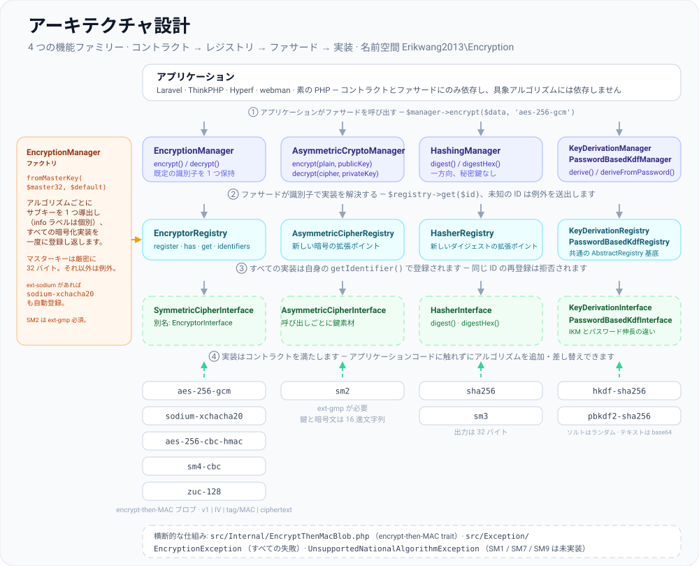
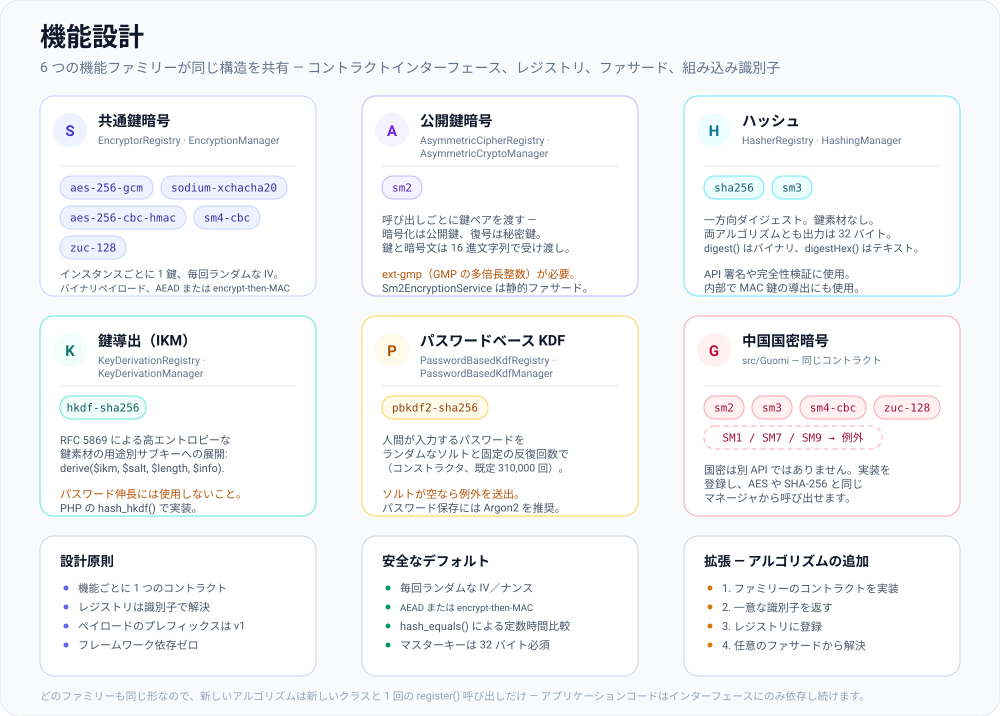
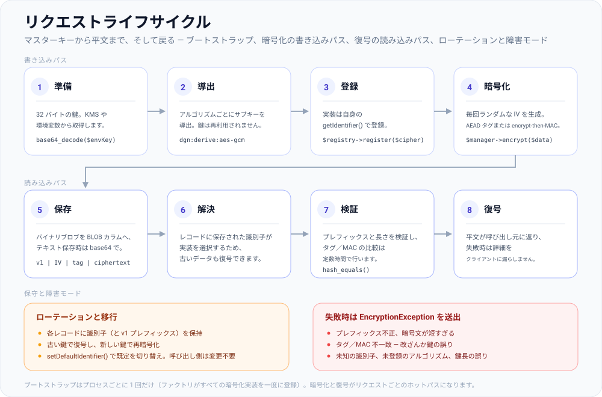

# erikwang2013/encryption

**Languages:** [English](../en/README.md) | [简体中文](../../../README.zh-CN.md) | [한국어](../ko/README.md) | [Русский](../ru/README.md) | [Deutsch](../de/README.md) | [Français](../fr/README.md) | [Español](../es/README.md) | [Português](../pt/README.md) | [हिन्दी](../hi/README.md) | [العربية](../ar/README.md) | [বাংলা](../bn/README.md) | [Bahasa Indonesia](../id/README.md) | **日本語**

<p align="center">
  
</p>

プラグイン可能な暗号コンポーネントライブラリです。統一されたコントラクトのもとで **共通鍵暗号**、**公開鍵暗号**、**ハッシュ**、**鍵導出**（HKDF / PBKDF2）を提供し、実装として AES/Sodium や中国国密アルゴリズムの SM2/SM3/SM4/ZUC を収録しています。Composer でインストールできます。

上に描かれている南京錠 **Locky** は当プロジェクトのマスコットです。アルゴリズムごとに 1 つの鍵を守り、呼び出しのたびに新しい IV を使い、鍵穴は決して秘密を明かしません。みなさんのアプリでも表示できます — `Mascot::svg()` は HTML 用の画像を返し、`Mascot::ascii()` はターミナル向けのバナーを返します。`Mascot::NAME` は `Locky` です。

## プロジェクトについて

### これは何か

`erikwang2013/encryption` はピュア PHP の暗号コンポーネントライブラリで、PHP アプリケーションに**型安全で拡張可能な**暗号化・ハッシュ・鍵導出を提供します。フレームワークへの依存は一切なく、単体でも、Laravel、ThinkPHP、Hyperf、webman の中でも動作します。

以下では [プロジェクト構成](#プロジェクト構成) とあわせて、[アーキテクチャ設計](#アーキテクチャ概要)、[機能設計](#機能設計)、[リクエストライフサイクル](#リクエストライフサイクル) の SVG 図を掲載しています。図のソースは [`docs/`](../../) にあります。

### なぜ必要か

PHP の暗号化を取り巻く状況は断片化しています。Laravel は独自の `Crypt` を備え、中国国密アルゴリズム（SM2/SM3/SM4）を扱う統一的な Composer パッケージは存在せず、鍵導出プリミティブ（HKDF/PBKDF2）にも共通のインターフェースがありません。本ライブラリは、主要な共通鍵暗号・公開鍵暗号・ハッシュ・KDF アルゴリズムを**単一のコントラクト体系**に統合します。その結果、次のことが実現します。

- **アプリケーションコードはインターフェースにのみ依存** — アルゴリズムを差し替えてもビジネスロジックの変更は不要です
- **国密アルゴリズムを一級市民として扱う** — AES/Sodium と同じ Manager から呼び出せます
- **鍵管理を標準化** — 1 つのマスターキーからアルゴリズムごとのサブキーを導出し、暗号間での鍵の使い回しを防ぎます
- **安全なデフォルトを標準搭載** — 認証付き暗号化（GCM / encrypt-then-MAC）、ランダム IV、定数時間比較をそのまま利用できます

### ユースケース

- フィールド単位の暗号化（電話番号や ID 番号などの個人情報をデータベースへ保存する前に暗号化）
- 複数アルゴリズムの併用と段階的な移行（例: AES-256-CBC から AES-256-GCM へ）
- 国密準拠が求められる業務システム（SM2 公開鍵暗号、SM3 ハッシュ、SM4 共通鍵暗号、ZUC ストリーム暗号）
- API の署名と検証（HMAC / SHA-256 / SM3）
- パスワードやマスターキーからのサブキー導出（PBKDF2 / HKDF）

## 目次

- [フレームワーク互換性](#フレームワーク互換性)
- [フレームワークごとの導入](#フレームワークごとの導入)
- [クイックスタート](#クイックスタート)
- [アーキテクチャ概要](#アーキテクチャ概要)
- [機能設計](#機能設計)
- [リクエストライフサイクル](#リクエストライフサイクル)
- [動作要件](#動作要件)
- [インストール](#インストール)
- [組み込みアルゴリズムと識別子](#組み込みアルゴリズムと識別子)
- [使い方](#使い方)
- [プロジェクト構成](#プロジェクト構成)
- [よくある質問](#よくある質問)
- [セキュリティに関する注意](#セキュリティに関する注意)
- [テストの実行](#テストの実行)
- [ライセンス](#ライセンス)

---

## フレームワーク互換性

本パッケージは特定の Web フレームワークに**依存しません**。クラスとオートロードのみを提供する Composer ライブラリとして配布されます。アプリケーション側では `composer require erikwang2013/encryption` を実行するだけで、ルーティングやコンテナ、設定の仕組みは関係ありません。

**PHP 8.0 以上**と、[動作要件](#動作要件) に記載した拡張モジュール／依存パッケージが必要です。これらが揃っていれば、以下のフレームワークのバージョンで動作します（各フレームワーク独自の暗号 API と併用でき、必要に応じて `EncryptionManager` などを注入します）。

| フレームワーク | 補足 |
|-----------|--------|
| **Laravel** 7 / 8 / 9 / 10 / 11 | **PHP 8.0 以上**の実行環境にインストールしてください。PHP 7.x で動作する Laravel 7 だけは本パッケージの制約を満たしません — まず PHP をアップグレードしてください。 |
| **ThinkPHP** 6 / 8 | アプリの標準的な `composer.json` の `require` にパッケージを追加します。 |
| **Hyperf** 2 / 3 | サービスの `composer.json` で require し、Hyperf で通常どおり `config` にシングルトンを登録するか、ファクトリを登録します。 |
| **webman** 1 / 2 | プロジェクトルートで `composer require` を実行し、ビジネスクラスや `support` ヘルパーから利用します。 |

### フレームワークごとの導入

Laravel 専用の ServiceProvider や ThinkPHP のビヘイビアバンドルは**用意していません**。フレームワークの **DI コンテナ**または**シングルトンファクトリ**に `EncryptionManager`（およびその他の Manager）を登録し、設定または環境変数から 32 バイトのマスターキーを読み込みます。以下のコードは最小限の例です。鍵素材（`.env`、KMS、構成管理サービス）の扱いは**自組織のセキュリティポリシーに従ってください** — シークレットをハードコードしないでください。

**Laravel（`App\Providers\AppServiceProvider` または専用の ServiceProvider）**

```php
use Erikwang2013\Encryption\EncryptionManagerFactory;

public function register(): void
{
    $this->app->singleton(\Erikwang2013\Encryption\EncryptionManager::class, function () {
        $raw = config('app.custom_master_key'); // e.g. base64 for 32 bytes
        $master = is_string($raw) ? base64_decode($raw, true) : '';
        if ($master === false || strlen($master) !== 32) {
            throw new \RuntimeException('Invalid 32-byte master key.');
        }
        return EncryptionManagerFactory::fromMasterKey($master, 'aes-256-gcm');
    });
}
```

`app(\Erikwang2013\Encryption\EncryptionManager::class)` で解決できます。これは Laravel の `Crypt` / `encrypt()` を**置き換えるものではありません**。本ライブラリはフィールド単位の暗号化と複数アルゴリズムのレジストリを対象とし、Laravel のヘルパーはフレームワークのシリアライズや Cookie などを担います。

**ThinkPHP 6 / 8（サービスクラス、または `common.php` のファクトリ）**

```php
use Erikwang2013\Encryption\EncryptionManagerFactory;

function app_encryption_manager(): \Erikwang2013\Encryption\EncryptionManager
{
    static $mgr = null;
    if ($mgr === null) {
        $master = base64_decode(config('app.master_key'), true);
        $mgr = EncryptionManagerFactory::fromMasterKey($master, 'aes-256-gcm');
    }
    return $mgr;
}
```

`app\service` に `EncryptionService` を定義し、コントローラに注入すれば、テストでのモックが容易になります。

**Hyperf 2 / 3（`config/autoload/dependencies.php` またはアノテーションによるファクトリ）**

```php
use Erikwang2013\Encryption\EncryptionManager;
use Erikwang2013\Encryption\EncryptionManagerFactory;

return [
    EncryptionManager::class => function () {
        $master = base64_decode((string) config('encryption.master_key'), true);
        return EncryptionManagerFactory::fromMasterKey($master, 'aes-256-gcm');
    },
];
```

コルーチンモードで鍵をリモート設定から取得する場合は、パース済みの値をキャッシュしてください。

**webman 1 / 2**

`config/plugin.php` のグローバルな `support` コンテナ、独自の `bootstrap`、またはその方式を使う場合は `support/bootstrap.php` に `EncryptionManager` を登録するか、サービスクラス内で `EncryptionManagerFactory::fromMasterKey(...)` を使って生成します。webman は特定のコンテナを必須としていないため、**プロジェクトの慣習に従ってください**。

**Vanilla PHP（フレームワークなし）**

登録先となるコンテナがありません。プロジェクトのルートで `composer require` を実行し、マネージャーは一度だけ組み立てて再利用します。この節をそのまま動かせる版が [`examples/plain-php/`](../../../examples/plain-php) にあり、`php examples/plain-php/demo.php` を実行すると、暗号化 → 保存 → 読み出し → 復号 → 改ざん検知という一連の流れを出力します。

```php
// bootstrap.php — require this once from your front controller
use Erikwang2013\Encryption\EncryptionManagerFactory;

$raw = getenv('ENCRYPTION_MASTER_KEY');            // base64 of 32 random bytes
$key = is_string($raw) ? base64_decode($raw, true) : false;
if ($key === false || strlen($key) !== 32) {
    throw new RuntimeException('ENCRYPTION_MASTER_KEY must be base64 of 32 bytes.');
}
$manager = EncryptionManagerFactory::fromMasterKey($key, 'aes-256-gcm');

// anywhere else in the project
$stored = base64_encode($manager->encrypt($phone));   // store as TEXT
$phone  = $manager->decrypt(base64_decode($stored));  // read it back
```

```bash
# generate the key once, keep it in the server environment — never in the code
export ENCRYPTION_MASTER_KEY="$(php -r 'echo base64_encode(random_bytes(32)), PHP_EOL;')"
```

プレーン PHP プロジェクト向けの補足: コストがかかるのはファクトリの部分です（すべてのサブキーを導出し、各暗号化器を登録します）。そのためクエリごとではなくプロセスごとに一度だけ呼び出し、同じインスタンスを再利用してください。鍵はプロセスの環境変数か自前のシークレットストアに置き、必ずバックアップしてください（失うとデータも失われます）。読み出し時は `EncryptionException` を捕捉し、理由をクライアントに返さずサーバー側でログに記録してください。暗号文はバイナリなので、`base64_encode(...)` を `TEXT` カラムに、あるいは生のバイト列を `BLOB` カラムに保存します。

### 本ライブラリの対象外

- フレームワークのアップグレード（例: Laravel 10 → 11）では、通常、本ライブラリの API 変更は**不要です**。Composer が PHP バージョンの競合を報告する場合は、本パッケージの `composer.json` にある `php` 制約に従ってください。
- 中国国密の **SM2** には **`ext-gmp`** が必要です。これがない場合、フレームワークに関係なく関連クラスは実行時に失敗します。

---

## クイックスタート

1. プロジェクトルートで `composer require erikwang2013/encryption:^1.0` を実行します（公開済みのバージョン制約に読み替えてください）。
2. `php -v` が **8.0 以上**であることと、`openssl` が有効であることを確認します。`sodium-xchacha20` や SM2 を使う場合は、必要に応じて `sodium` および `gmp` 拡張をインストールしてください。
3. `use Erikwang2013\Encryption\...` を記述し、[使い方](#使い方) で説明する `EncryptionManager`、ハッシュ、KDF などから必要なものを選びます。

---

## アーキテクチャ概要

機能は 4 つのコントラクトファミリーに分かれており、それぞれが専用のレジストリと、合成やテストのための任意のファサード（`*Manager`）を持ちます。どのファミリーも「コントラクトインターフェース → レジストリ → ファサード → 実装」という同じ形をしており、`EncryptionManagerFactory` が単一のマスターキーから共通鍵暗号ファミリーを組み立てます。



出典: [`docs/architecture-design.svg`](./architecture-design.svg)

| 機能 | コントラクト | レジストリ | ファサード（既定のアルゴリズム） |
|------------|----------|----------|----------------------------|
| 共通鍵暗号 | `SymmetricCipherInterface`（別名 `EncryptorInterface`） | `EncryptorRegistry` | `EncryptionManager` |
| 公開鍵暗号 | `AsymmetricCipherInterface` | `AsymmetricCipherRegistry` | `AsymmetricCryptoManager` |
| ハッシュ | `HasherInterface` | `HasherRegistry` | `HashingManager` |
| 鍵導出（IKM） | `KeyDerivationInterface` | `KeyDerivationRegistry` | `KeyDerivationManager` |
| パスワードベース KDF | `PasswordBasedKdfInterface` | `PasswordBasedKdfRegistry` | `PasswordBasedKdfManager` |

設計上のポイント:

- **共通鍵暗号**: インスタンスは固定の鍵を保持し、ペイロードはバイナリです — 大量のフィールド暗号化に適しています。
- **公開鍵暗号**: 呼び出しごとに公開鍵／秘密鍵の素材を渡します（形式は実装が定義し、SM2 では 16 進文字列）。
- **ハッシュ**: 秘密鍵を用いない一方向ダイジェストです（SM3 も同様の標準的なハッシュです）。
- **鍵導出**: **HKDF** は高エントロピーな鍵素材をサブキーに展開し、**PBKDF2** は人間が入力するパスワードを伸長します（ランダムなソルトと十分な反復回数を使用してください）。

---

## 機能設計

6 つの機能ファミリーがあり、それぞれ以下に示す識別子を標準で備えています。アルゴリズムの追加は新しいクラスと 1 回の `register()` 呼び出しだけで完結します — コアには何も変更が及ばず、アプリケーションコードはインターフェースにのみ依存し続けます。



出典: [`docs/functional-design.svg`](./functional-design.svg)

| ファミリー | 識別子 | 用途 |
|--------|-----------|----------------|
| 共通鍵暗号 | `aes-256-gcm`, `sodium-xchacha20`, `aes-256-cbc-hmac`, `sm4-cbc`, `zuc-128` | 任意サイズのフィールド単位暗号化。インスタンスごとに 1 つの鍵を保持 |
| 公開鍵暗号 | `sm2` | 呼び出しごとに公開鍵／秘密鍵の素材（16 進）を渡す。`ext-gmp` が必要 |
| ハッシュ | `sha256`, `sm3` | 署名や完全性検証に用いる一方向ダイジェスト |
| 鍵導出（IKM） | `hkdf-sha256` | 高エントロピーな鍵素材を用途別のサブキーに展開 |
| パスワードベース KDF | `pbkdf2-sha256` | 人間が入力するパスワードの伸長（ランダムなソルト、既定 310,000 回の反復） |
| 国密 | SM2 / SM3 / SM4 / ZUC | 同じコントラクトで扱う中国国密アルゴリズム。SM1 / SM7 / SM9 は `UnsupportedNationalAlgorithmException` を送出します |

---

## リクエストライフサイクル

ブートストラップはプロセスごとに 1 回だけ実行され、暗号化と復号がリクエストごとのホットパスになります。各ペイロードにはバージョンプレフィックス（`v1`）が付くため、今日書き込んだ暗号文は鍵をローテーションした後も読み出せます。



出典: [`docs/lifecycle.svg`](./lifecycle.svg)

1. **準備** — `.env` や KMS から 32 バイトのマスターキーを用意します。これ以外の長さはファクトリが拒否します。
2. **導出と登録** — `EncryptionManagerFactory::fromMasterKey()` が HMAC-SHA256（アルゴリズムごとに異なる info ラベル）でアルゴリズムごとのサブキーを導出し、すべての暗号化実装を一度に登録します。
3. **暗号化** — `$manager->encrypt($data, 'aes-256-gcm')`。呼び出しごとにランダムな IV／ナンスを生成し、暗号文に対してタグまたは MAC を計算します。
4. **保存** — バイナリブロブ `v1 | IV | tag/MAC | ciphertext` を `BLOB` カラムに格納するか、テキストとして保存する場合は `base64_encode` します。
5. **復号** — 保存された識別子が実装を選び、プレフィックスと長さを検証したうえでタグ／MAC を定数時間で比較し、その後にのみ平文を返します。いずれかの段階で失敗すると `EncryptionException` が送出されます。

---

## 動作要件

| 項目 | 詳細 |
|------|---------|
| PHP | `^8.0`（上記のフレームワークと組み合わせる場合も、この制約が優先されます） |
| 拡張モジュール | `ext-openssl`（必須） |
| 拡張モジュール | `ext-sodium`（任意、`sodium-xchacha20` 用） |
| 拡張モジュール | `ext-gmp`（任意、**SM2** の暗号化／復号と鍵生成） |
| Composer | `pohoc/crypto-sm`（依存パッケージ。SM2/SM3/SM4 のラッパー） |

## インストール

### ローカルパスから（開発時）

利用側プロジェクトの `composer.json` に記述します。

```json
{
    "repositories": [
        {
            "type": "path",
            "url": "/absolute/path/to/encryption"
        }
    ],
    "require": {
        "erikwang2013/encryption": "@dev"
    }
}
```

続いて次を実行します。

```bash
composer update erikwang2013/encryption
```

### Git / Packagist から（リリース後）

```bash
composer require erikwang2013/encryption:^1.0
```

（リポジトリをアクセス可能な Git リモート／Composer リポジトリに push するか、Packagist で公開してください。）

---

## 組み込みアルゴリズムと識別子

### 共通鍵暗号（`SymmetricCipherInterface`）

| 識別子（`getIdentifier`） | クラス | 鍵長 | 備考 |
|------------------------------|-------|------------|--------|
| `aes-256-gcm` | `Aes256GcmEncryptor` | 32 バイト | AEAD。新規システムの推奨デフォルト |
| `sodium-xchacha20` | `SodiumXChaCha20Encryptor` | 32 バイト | `ext-sodium` が必要 |
| `aes-256-cbc-hmac` | `OpenSslAes256CbcEncryptor` | 32 バイト | レガシー互換のための CBC + HMAC |
| `sm4-cbc` | `Sm4CbcEncryptor` | 16 バイト | SM4-CBC（OpenSSL の SM4） |
| `zuc-128` | `ZucEncryptor` | 16 バイト | ZUC-128 ストリーム暗号 |

### 公開鍵暗号（`AsymmetricCipherInterface`）

| 識別子 | クラス | 備考 |
|------------|-------|--------|
| `sm2` | `Sm2AsymmetricCipher` | SM2。鍵と暗号文は 16 進文字列。`ext-gmp` が必要 |

静的ファサード `Sm2EncryptionService` も利用できます。動作は `Sm2AsymmetricCipher` と同じです。

### ハッシュ（`HasherInterface`）

| 識別子 | クラス | 出力長 |
|------------|-------|-----------------|
| `sha256` | `Sha256Hasher` | 32 バイト |
| `sm3` | `Sm3Hasher` | 32 バイト |

### 鍵導出

| 識別子 | クラス | コントラクト | 備考 |
|------------|-------|----------|--------|
| `hkdf-sha256` | `HkdfSha256` | `KeyDerivationInterface` | RFC 5869: IKM + salt + info |
| `pbkdf2-sha256` | `Pbkdf2Sha256` | `PasswordBasedKdfInterface` | パスワード + ソルト + 反復回数（コンストラクタ） |

暗号文とダイジェストは通常バイナリです。JSON やテキストとして保存する場合は、`base64_encode` / `base64_decode` を自身で適用してください。

---

## 使い方

### 1. 共通鍵暗号: 単一アルゴリズムとレジストリ

```php
<?php

use Erikwang2013\Encryption\Encryptor\Aes256GcmEncryptor;
use Erikwang2013\Encryption\EncryptionManager;
use Erikwang2013\Encryption\EncryptorRegistry;

$key = random_bytes(32);
$encryptor = new Aes256GcmEncryptor($key);
$ciphertext = $encryptor->encrypt('plaintext');
$plaintext  = $encryptor->decrypt($ciphertext);

$registry = new EncryptorRegistry(new Aes256GcmEncryptor($key));
$manager = new EncryptionManager($registry, 'aes-256-gcm');
$blob = $manager->encrypt('data');
```

マスターキーファクトリ: `EncryptionManagerFactory::fromMasterKey($masterKey32, 'aes-256-gcm')` はアルゴリズムごとのサブキーを導出し、**aes-256-gcm**、**aes-256-cbc-hmac**、**sm4-cbc**、**zuc-128**、および **sodium-xchacha20**（ext-sodium が利用可能な場合）を一度に登録します。

### 2. 公開鍵暗号

```php
<?php

use Erikwang2013\Encryption\Asymmetric\Sm2AsymmetricCipher;
use Erikwang2013\Encryption\AsymmetricCipherRegistry;
use Erikwang2013\Encryption\AsymmetricCryptoManager;
use Erikwang2013\Encryption\Guomi\Sm2EncryptionService;

// requires ext-gmp
$pair = Sm2EncryptionService::generateKeyPairHex();

$cipher = new Sm2AsymmetricCipher();
$hexCipher = $cipher->encrypt('plaintext', $pair->getPublicKey());
$plain = $cipher->decrypt($hexCipher, $pair->getPrivateKey());

$mgr = new AsymmetricCryptoManager(new AsymmetricCipherRegistry($cipher), 'sm2');
$hexCipher2 = $mgr->encrypt('plaintext', $pair->getPublicKey());
```

### 3. ハッシュ

```php
<?php

use Erikwang2013\Encryption\Hash\Sha256Hasher;
use Erikwang2013\Encryption\Guomi\Sm3Hasher;
use Erikwang2013\Encryption\HasherRegistry;
use Erikwang2013\Encryption\HashingManager;

$registry = new HasherRegistry(
    new Sha256Hasher(),
    new Sm3Hasher(),
);
$hashing = new HashingManager($registry, 'sha256');
$bin = $hashing->digest('data');
$hex = $hashing->digestHex('data', 'sm3');
```

### 4. 鍵導出（HKDF / PBKDF2）

```php
<?php

use Erikwang2013\Encryption\Kdf\HkdfSha256;
use Erikwang2013\Encryption\Kdf\Pbkdf2Sha256;
use Erikwang2013\Encryption\KeyDerivationManager;
use Erikwang2013\Encryption\KeyDerivationRegistry;
use Erikwang2013\Encryption\PasswordBasedKdfManager;
use Erikwang2013\Encryption\PasswordBasedKdfRegistry;

// Derive subkey from high-entropy material (e.g. TLS, envelope subkeys)
$hkdf = new HkdfSha256();
$subKey = $hkdf->derive($ikm32, $salt, 32, 'app:v1');

$kdfMgr = new KeyDerivationManager(new KeyDerivationRegistry($hkdf), 'hkdf-sha256');

// Derive from user password (for password storage prefer password_hash / Argon2, etc.)
$pbkdf2 = new Pbkdf2Sha256(iterations: 310_000);
$derived = $pbkdf2->deriveFromPassword('user password', random_bytes(16), 32);

$pwdMgr = new PasswordBasedKdfManager(new PasswordBasedKdfRegistry($pbkdf2), 'pbkdf2-sha256');
```

### 5. 中国国密アルゴリズム（SM3 / SM4 / ZUC / SM2）

```php
<?php

use Erikwang2013\Encryption\Guomi\Sm2EncryptionService;
use Erikwang2013\Encryption\Guomi\Sm3Hasher;
use Erikwang2013\Encryption\Guomi\Sm4CbcEncryptor;
use Erikwang2013\Encryption\Guomi\ZucEncryptor;

$sm3 = new Sm3Hasher();
$bin = $sm3->digest('data');

$key16 = random_bytes(16);
$sm4 = new Sm4CbcEncryptor($key16);
$blob = $sm4->encrypt('plaintext');

$zuc = new ZucEncryptor($key16);
$blob2 = $zuc->encrypt('plaintext');

// SM2: see asymmetric example above or Sm2EncryptionService
```

SM1、SM7、SM9: `UnavailableNationalAlgorithms::sm1()` などを呼び出すと `UnsupportedNationalAlgorithmException` が送出されます。

### 6. 独自プラグイン

- 共通鍵暗号: `EncryptorInterface`（`SymmetricCipherInterface`）を実装し、`EncryptorRegistry` に登録します。
- 公開鍵暗号: `AsymmetricCipherInterface` を実装し、`AsymmetricCipherRegistry` に登録します。
- ハッシュ: `HasherInterface` を実装し、`HasherRegistry` に登録します。
- KDF: `KeyDerivationInterface` または `PasswordBasedKdfInterface` を実装し、対応する `Registry` に登録します。

### 7. 例外

失敗時は `Erikwang2013\Encryption\Exception\EncryptionException` がスローされます。利用できない国密アルゴリズムでは `UnsupportedNationalAlgorithmException` を使用します。アプリケーションコード側で捕捉してログに記録し、詳細をクライアントに漏らさないでください。

---

## プロジェクト構成

```text
encryption/
├── src/
│   ├── Contract/                    機能インターフェース — 公開コントラクト:
│   │                                SymmetricCipherInterface（別名 EncryptorInterface）、
│   │                                AsymmetricCipherInterface、HasherInterface、
│   │                                KeyDerivationInterface、PasswordBasedKdfInterface
│   ├── Encryptor/                   Aes256GcmEncryptor、OpenSslAes256CbcEncryptor、
│   │                                SodiumXChaCha20Encryptor
│   ├── Asymmetric/                  Sm2AsymmetricCipher
│   ├── Hash/                        Sha256Hasher
│   ├── Kdf/                         HkdfSha256、Pbkdf2Sha256
│   ├── Guomi/                       Sm2EncryptionService、Sm3Hasher、Sm4CbcEncryptor、
│   │                                ZucEncryptor、UnavailableNationalAlgorithms
│   │   └── Internal/ZucEngine.php   ZUC キーストリームエンジン
│   ├── Internal/                    EncryptThenMacBlob trait（encrypt-then-MAC を共有）
│   ├── Exception/                   EncryptionException、
│   │                                UnsupportedNationalAlgorithmException
│   ├── AbstractRegistry.php         識別子 → 実装のストア。各レジストリで共有
│   ├── EncryptorRegistry.php        AsymmetricCipherRegistry.php、HasherRegistry.php、
│   │                                KeyDerivationRegistry.php、PasswordBasedKdfRegistry.php
│   ├── EncryptionManager.php        AsymmetricCryptoManager.php、HashingManager.php、
│   │                                KeyDerivationManager.php、PasswordBasedKdfManager.php
│   ├── EncryptionManagerFactory.php マスターキー → アルゴリズム別サブキー → レジストリ
│   └── Mascot.php                   任意のマスコット API（SVG / ASCII）。暗号処理からは呼び出しません
├── tests/                           PHPUnit スイート: コントラクト、レジストリ、マネージャ、
│                                    アルゴリズムのテストと TestCase ヘルパー
├── docs/                            マスコットと設計図
│   ├── mascot.svg                   プロジェクトのマスコット（Locky）
│   ├── architecture-design.svg      「アーキテクチャ概要」に埋め込み
│   ├── functional-design.svg        「機能設計」に埋め込み
│   ├── lifecycle.svg                「リクエストライフサイクル」に埋め込み
│   ├── i18n/                        この README の他 12 言語版。各言語に
│   │                                図のローカライズ版を同梱（+ labels/*.json）
│   └── *.md                         レビュー / テストレポートの保管
├── examples/plain-php/              実行可能なバニラ PHP 統合（bootstrap + デモ）
├── scripts/i18n-build-svg.php       ラベル辞書から docs/i18n/<lang>/*.svg を生成
├── composer.json                    psr-4 オートロード、PHP ^8.0、phpunit 開発依存
├── phpunit.xml.dist
└── README.md  README.zh-CN.md
```

| パス | 目的 |
|------|---------|
| `src/Contract/` | 機能インターフェース（`EncryptorInterface`、`HasherInterface` など） |
| `src/Encryptor/`、`src/Asymmetric/`、`src/Hash/`、`src/Kdf/` | アルゴリズムの実装 |
| `src/Guomi/` | 中国国密暗号と `UnavailableNationalAlgorithms` |
| `src/Internal/` | `EncryptThenMacBlob` — CBC / SM4 / ZUC が共有する encrypt-then-MAC |
| `src/Exception/` | `EncryptionException` など |
| `*Registry.php`、`*Manager.php`、`EncryptionManagerFactory.php` | レジストリ、ファサード、マスターキーファクトリ |
| `docs/*.svg` | 本 README に埋め込まれたマスコットと設計図 |

名前空間プレフィックス: `Erikwang2013\Encryption\`（Composer の `psr-4` に対応）。

---

## よくある質問

**Composer が PHP バージョンの不一致を報告する**

本パッケージは `php ^8.0` を要求します。アプリが依然として PHP 8.0 以下で動作している場合は、PHP をアップグレードするか、本パッケージを使用しないでください。

**`sodium-xchacha20` が利用できない**

`sodium` 拡張（`ext-sodium`）をインストールして有効にしてください。これがないと `EncryptionManagerFactory::fromMasterKey(..., 'sodium-xchacha20')` は失敗するため、代わりに `aes-256-gcm` を使用してください。

**SM2 でエラーが出る、鍵生成に失敗する**

**`ext-gmp`** をインストールして有効にしてください。SM2 は多倍長整数に依存しているため、GMP がない場合の動作は保証されません。

**暗号文をデータベースや JSON に保存する**

バイナリ列には `BLOB` を使用してください。テキストを使う必要がある場合は、暗号文と IV を **`base64_encode`** し、復号前に **`base64_decode`** してください。

**Laravel の `encrypt()` / `Crypt` との違い**

Laravel の API はフレームワークのシリアライズや Cookie を対象とし、本ライブラリは**明示的なアルゴリズム ID、複数のレジストリ、国密アルゴリズム、HKDF/PBKDF2** などを対象としています。両者は併用できますが、形式を自身で揃えない限り鍵を混在させないでください。

---

## セキュリティに関する注意

1. **鍵**: 高エントロピーな鍵には `random_bytes()` または KMS を使用してください。生のパスワードを AES の鍵として使わず、必ず **PBKDF2 / Argon2** で伸長してください。
2. **アルゴリズム**: 新規システムでは **AES-256-GCM** または **Sodium** を推奨します。必要な場面では **SM3/SM4/ZUC/SM2** を使用し、サブキーの展開には **HKDF** を用います。**PBKDF2** でパスワードを伸長する場合は、十分な反復回数とランダムなソルトを使用してください。
3. **通信**: 通信経路では引き続き TLS を使用してください。本ライブラリが担うのはフィールド単位の暗号化とダイジェストです。
4. **移行**: アルゴリズムのバージョンごとに `identifier` を記録し、古いデータを復号して再暗号化できるようにしてください。

---

## テストの実行

クローン後:

```bash
composer install
composer test
```

`./vendor/bin/phpunit tests/` と等価です。`phpunit.xml` を追加する場合は、`composer.json` の `test` スクリプトをそのファイルに向けてください。

---

## ご支援ありがとうございます / 开源不易，欢迎支持

| WeChat Pay / 微信 | Alipay / 支付宝 |
|:---:|:---:|
|  |  |

---

## ライセンス

MIT（`composer.json` の `license` フィールドを参照してください）。
