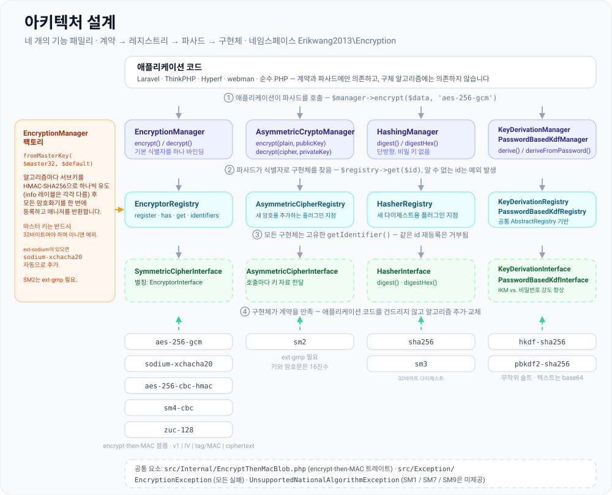
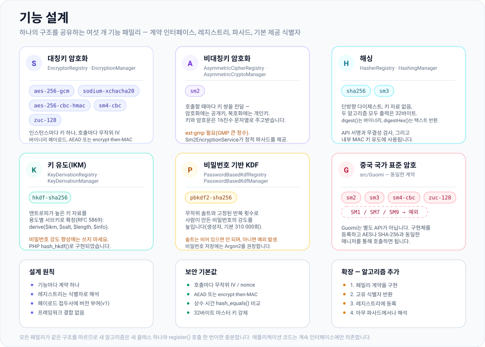
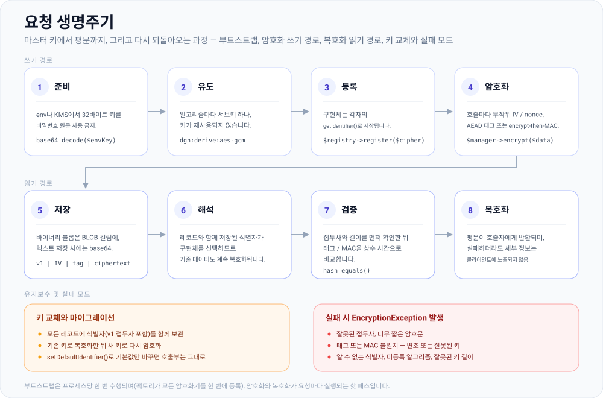

# erikwang2013/encryption

**Languages:** [English](../en/README.md) | [简体中文](../../../README.zh-CN.md) | **한국어** | [Русский](../ru/README.md) | [Deutsch](../de/README.md) | [Français](../fr/README.md) | [Español](../es/README.md) | [Português](../pt/README.md) | [हिन्दी](../hi/README.md) | [العربية](../ar/README.md) | [বাংলা](../bn/README.md) | [Bahasa Indonesia](../id/README.md) | [日本語](../ja/README.md)

<p align="center">
  
</p>

플러그인 방식으로 확장할 수 있는 암호화 컴포넌트 라이브러리입니다. 하나의 통일된 계약 아래 **대칭키 암호화**, **비대칭키 암호화**, **해싱**, **키 유도**(HKDF / PBKDF2)를 제공하며, AES/Sodium과 중국 국가 표준 알고리즘 SM2/SM3/SM4/ZUC 구현을 포함합니다. Composer로 설치할 수 있습니다.

위에 있는 자물쇠 **Locky**는 이 프로젝트의 마스코트입니다. 알고리즘마다 키를 하나씩 보관하고, 호출할 때마다 새로운 IV를 사용하며, 끝까지 비밀을 지키는 열쇠 구멍을 갖고 있습니다. 여러분의 애플리케이션에서도 Locky를 보여줄 수 있습니다. `Mascot::svg()`는 HTML용 그림을 반환하고, `Mascot::ascii()`는 터미널 배너를 반환하며, `Mascot::NAME`은 `Locky`입니다.

## 프로젝트 소개

### 무엇인가

`erikwang2013/encryption`은 PHP 애플리케이션에 **타입 안전하고 확장 가능한** 암호화, 해싱, 키 유도를 제공하는 순수 PHP 암호화 컴포넌트 라이브러리입니다. 프레임워크 의존성이 전혀 없으며, 단독으로 사용하거나 Laravel, ThinkPHP, Hyperf, webman 안에서 사용할 수 있습니다.

아래에서는 [프로젝트 구조](#프로젝트-구조)와 함께 [아키텍처 설계](#아키텍처-개요), [기능 설계](#기능-설계), [요청 생명주기](#요청-생명주기)를 담은 SVG 다이어그램을 확인할 수 있습니다. 다이어그램 원본은 [`docs/`](../../)에 있습니다.

### 왜 만들었는가

PHP 생태계의 암호화 기능은 파편화되어 있습니다. Laravel은 자체 `Crypt`를 제공하고, 중국 국가 표준 알고리즘(SM2/SM3/SM4)은 통합된 Composer 패키지가 없으며, 키 유도 프리미티브(HKDF/PBKDF2)에는 공통 인터페이스가 없습니다. 이 라이브러리는 주류 대칭키/비대칭키/해시/KDF 알고리즘을 **하나의 계약 체계**로 모읍니다. 그 결과:

- **애플리케이션 코드는 인터페이스에만 의존합니다** — 알고리즘을 바꿔도 비즈니스 로직은 전혀 수정할 필요가 없습니다
- **Guomi 알고리즘을 동등하게 대우합니다** — AES/Sodium과 같은 Manager를 통해 호출할 수 있습니다
- **키 관리가 표준화됩니다** — 마스터 키 하나에서 알고리즘별 서브키를 유도하므로 암호마다 같은 키가 재사용되는 일이 없습니다
- **안전한 기본값이 내장되어 있습니다** — 인증 암호화(GCM / encrypt-then-MAC), 무작위 IV, 상수 시간 비교가 기본으로 제공됩니다

### 활용 사례

- 필드 단위 암호화(전화번호나 주민등록번호 같은 개인정보를 데이터베이스에 저장하기 전에 암호화)
- 여러 알고리즘의 공존과 점진적 마이그레이션(예: AES-256-CBC에서 AES-256-GCM으로)
- 중국 국가 표준 규격을 따라야 하는 백오피스 시스템(SM2 비대칭키, SM3 해싱, SM4 대칭키, ZUC 스트림 암호)
- API 서명과 검증(HMAC / SHA-256 / SM3)
- 비밀번호나 마스터 키에서 서브키 유도(PBKDF2 / HKDF)

## 목차

- [프레임워크 호환성](#프레임워크-호환성)
- [프레임워크별 통합](#프레임워크별-통합)
- [빠른 시작](#빠른-시작)
- [아키텍처 개요](#아키텍처-개요)
- [기능 설계](#기능-설계)
- [요청 생명주기](#요청-생명주기)
- [요구 사항](#요구-사항)
- [설치](#설치)
- [내장 알고리즘과 식별자](#내장-알고리즘과-식별자)
- [사용법](#사용법)
- [프로젝트 구조](#프로젝트-구조)
- [자주 묻는 질문(FAQ)](#자주-묻는-질문faq)
- [보안 유의 사항](#보안-유의-사항)
- [테스트 실행](#테스트-실행)
- [라이선스](#라이선스)

---

## 프레임워크 호환성

이 패키지는 어떤 웹 프레임워크에도 **의존하지 않습니다**. 클래스와 오토로딩만 담긴 Composer 라이브러리로 배포됩니다. 애플리케이션에서 `composer require erikwang2013/encryption`을 실행하기만 하면 되며, 라우팅·컨테이너·설정은 관계가 없습니다.

**PHP ≥ 8.0**과 [요구 사항](#요구-사항)에 나열된 확장/의존성이 필요합니다. 이를 갖추면 다음 프레임워크 버전에서 사용할 수 있습니다(각 프레임워크 자체의 암호화 API와 함께 쓰며, 필요에 따라 `EncryptionManager` 등을 주입합니다).

| 프레임워크 | 비고 |
|-----------|--------|
| **Laravel** 7 / 8 / 9 / 10 / 11 | **PHP 8.0+** 런타임에 설치하세요. 아직 PHP 7.x에서 도는 Laravel 7만 이 패키지의 제약을 충족하지 못하므로, 먼저 PHP를 업그레이드해야 합니다. |
| **ThinkPHP** 6 / 8 | 애플리케이션의 표준 `composer.json` `require`에 패키지를 추가하세요. |
| **Hyperf** 2 / 3 | 서비스의 `composer.json`에 추가하고, Hyperf에서 평소 하듯 `config`에 싱글턴을 등록하거나 팩토리를 사용하세요. |
| **webman** 1 / 2 | 프로젝트 루트에서 `composer require`로 설치하고, 비즈니스 클래스나 `support` 헬퍼에서 사용하세요. |

### 프레임워크별 통합

Laravel 전용 ServiceProvider나 ThinkPHP 동작(behavior) 번들은 **제공하지 않습니다**. 설정이나 환경 변수에서 32바이트 마스터 키를 읽어, 프레임워크의 **DI 컨테이너**나 **싱글턴 팩토리**에 `EncryptionManager`(또는 다른 Manager)를 등록하면 됩니다. 아래 예제는 최소한의 형태이며, 키 자료(`.env`, KMS, 설정 서비스)에 대해서는 **각자의 보안 정책을 따르세요**. 비밀 값을 하드코딩해서는 안 됩니다.

**Laravel (`App\Providers\AppServiceProvider` 또는 전용 ServiceProvider)**

```php
use Erikwang2013\Encryption\EncryptionManagerFactory;

public function register(): void
{
    $this->app->singleton(\Erikwang2013\Encryption\EncryptionManager::class, function () {
        $raw = config('app.custom_master_key'); // e.g. base64 for 32 bytes
        $master = is_string($raw) ? base64_decode($raw, true) : '';
        if ($master === false || strlen($master) !== 32) {
            throw new \RuntimeException('Invalid 32-byte master key.');
        }
        return EncryptionManagerFactory::fromMasterKey($master, 'aes-256-gcm');
    });
}
```

`app(\Erikwang2013\Encryption\EncryptionManager::class)`로 해석(resolve)하면 됩니다. 이 라이브러리는 Laravel의 `Crypt` / `encrypt()`를 **대체하지 않습니다**. 이 라이브러리는 필드 단위 암호화와 다중 알고리즘 레지스트리를 목표로 하고, Laravel의 헬퍼는 프레임워크 직렬화와 쿠키 등을 담당합니다.

**ThinkPHP 6 / 8 (`common.php`의 서비스 클래스 또는 팩토리)**

```php
use Erikwang2013\Encryption\EncryptionManagerFactory;

function app_encryption_manager(): \Erikwang2013\Encryption\EncryptionManager
{
    static $mgr = null;
    if ($mgr === null) {
        $master = base64_decode(config('app.master_key'), true);
        $mgr = EncryptionManagerFactory::fromMasterKey($master, 'aes-256-gcm');
    }
    return $mgr;
}
```

`app\service` 아래에 `EncryptionService`를 정의하고 컨트롤러에 주입하면 테스트에서 목(mock)으로 바꾸기가 더 쉽습니다.

**Hyperf 2 / 3 (`config/autoload/dependencies.php` 또는 어노테이션 팩토리)**

```php
use Erikwang2013\Encryption\EncryptionManager;
use Erikwang2013\Encryption\EncryptionManagerFactory;

return [
    EncryptionManager::class => function () {
        $master = base64_decode((string) config('encryption.master_key'), true);
        return EncryptionManagerFactory::fromMasterKey($master, 'aes-256-gcm');
    },
];
```

코루틴 모드에서 키를 원격 설정에서 가져온다면 파싱한 값을 캐싱하세요.

**webman 1 / 2**

`config/plugin.php`, 사용자 정의 `bootstrap`, 또는 그 방식을 쓴다면 `support/bootstrap.php`에서 전역 `support` 컨테이너에 `EncryptionManager`를 등록하거나, 서비스 클래스 안에서 `EncryptionManagerFactory::fromMasterKey(...)`로 직접 생성하세요. webman은 특정 컨테이너를 강제하지 않으므로 **프로젝트 관례를 따르면 됩니다**.

**바닐라 PHP(프레임워크 없음)**

연결할 컨테이너가 없습니다. 프로젝트 루트에서 `composer require`를 실행한 뒤 매니저를 한 번만 만들어 재사용하면 됩니다. 이 절을 그대로 실행할 수 있는 예제가 [`examples/plain-php/`](../../../examples/plain-php)에 있으며, `php examples/plain-php/demo.php`를 실행하면 암호화 → 저장 → 읽기 → 복호화 → 변조 감지의 전체 흐름을 출력합니다.

```php
// bootstrap.php — require this once from your front controller
use Erikwang2013\Encryption\EncryptionManagerFactory;

$raw = getenv('ENCRYPTION_MASTER_KEY');            // base64 of 32 random bytes
$key = is_string($raw) ? base64_decode($raw, true) : false;
if ($key === false || strlen($key) !== 32) {
    throw new RuntimeException('ENCRYPTION_MASTER_KEY must be base64 of 32 bytes.');
}
$manager = EncryptionManagerFactory::fromMasterKey($key, 'aes-256-gcm');

// anywhere else in the project
$stored = base64_encode($manager->encrypt($phone));   // store as TEXT
$phone  = $manager->decrypt(base64_decode($stored));  // read it back
```

```bash
# generate the key once, keep it in the server environment — never in the code
export ENCRYPTION_MASTER_KEY="$(php -r 'echo base64_encode(random_bytes(32)), PHP_EOL;')"
```

순수 PHP 프로젝트를 위한 참고 사항: 비용이 큰 부분은 팩토리입니다(모든 하위 키를 유도하고 각 암호화기를 등록합니다). 따라서 쿼리마다가 아니라 프로세스당 한 번만 호출하고 같은 인스턴스를 재사용하세요. 키는 프로세스 환경 변수나 자체 시크릿 저장소에 두고 반드시 백업하세요. 키를 잃으면 데이터도 잃습니다. 읽을 때는 `EncryptionException`을 잡아 이유를 클라이언트에 그대로 돌려주지 말고 서버 측에 로깅하세요. 암호문은 바이너리이므로 `base64_encode(...)` 값을 `TEXT` 컬럼에, 또는 원본 바이트를 `BLOB` 컬럼에 저장하세요.

### 이 라이브러리와 무관한 사항

- 프레임워크 업그레이드(예: Laravel 10 → 11)는 보통 이 라이브러리의 API 변경을 **요구하지 않습니다**. Composer가 PHP 버전 충돌을 보고하면 `composer.json`에 있는 이 패키지의 `php` 제약을 따르세요.
- 중국 국가 표준 **SM2**는 **`ext-gmp`**가 필요합니다. 이 확장이 없으면 프레임워크와 무관하게 관련 클래스가 런타임에 실패합니다.

---

## 빠른 시작

1. 프로젝트 루트에서 `composer require erikwang2013/encryption:^1.0`을 실행합니다(또는 배포된 버전 제약을 지정합니다).
2. `php -v`가 **8.0+**이고 `openssl`이 활성화되어 있는지 확인합니다. `sodium-xchacha20`이나 SM2를 쓸 때는 `sodium` 및/또는 `gmp` 확장을 설치합니다.
3. `use Erikwang2013\Encryption\...`로 불러온 뒤, [사용법](#사용법)에 설명된 대로 `EncryptionManager`, 해싱, KDF 등을 골라 씁니다.

---

## 아키텍처 개요

기능은 네 개의 계약 패밀리로 나뉘며, 각 패밀리는 자체 레지스트리와 조합·테스트를 위한 선택적 파사드(`*Manager`)를 갖습니다. 모든 패밀리는 계약 인터페이스 → 레지스트리 → 파사드 → 구현체라는 같은 모양을 따르며, `EncryptionManagerFactory`가 마스터 키 하나로 대칭키 패밀리를 구성합니다.



출처: [`docs/architecture-design.svg`](./architecture-design.svg)

| 기능 | 계약 | 레지스트리 | 파사드(기본 알고리즘) |
|------------|----------|----------|----------------------------|
| 대칭키 | `SymmetricCipherInterface` (`EncryptorInterface` 별칭) | `EncryptorRegistry` | `EncryptionManager` |
| 비대칭키 | `AsymmetricCipherInterface` | `AsymmetricCipherRegistry` | `AsymmetricCryptoManager` |
| 해싱 | `HasherInterface` | `HasherRegistry` | `HashingManager` |
| 키 유도(IKM) | `KeyDerivationInterface` | `KeyDerivationRegistry` | `KeyDerivationManager` |
| 비밀번호 기반 KDF | `PasswordBasedKdfInterface` | `PasswordBasedKdfRegistry` | `PasswordBasedKdfManager` |

설계 노트:

- **대칭키**: 인스턴스가 고정된 키를 바인딩하며, 페이로드는 바이너리입니다. 대량 필드 암호화에 적합합니다.
- **비대칭키**: 호출할 때마다 공개키/개인키 자료를 전달합니다(형식은 구현체가 정의하며, 예를 들어 SM2는 16진수 문자열).
- **해싱**: 비밀 키가 필요 없는 단방향 다이제스트입니다(또는 SM3 방식의 표준 해싱).
- **키 유도**: **HKDF**는 엔트로피가 높은 키 자료를 서브키로 확장하고, **PBKDF2**는 사람이 만든 비밀번호의 강도를 높입니다(무작위 솔트와 높은 반복 횟수를 사용하세요).

---

## 기능 설계

여섯 개의 기능 패밀리가 있으며, 각각 아래에 나열된 식별자를 기본 제공합니다. 알고리즘을 추가하는 일은 새 클래스 하나에 `register()` 호출 한 번을 더하는 것으로 끝납니다. 코어는 전혀 바뀌지 않고, 애플리케이션 코드는 계속 인터페이스에만 의존합니다.



출처: [`docs/functional-design.svg`](./functional-design.svg)

| 패밀리 | 식별자 | 용도 |
|--------|-----------|----------------|
| 대칭키 | `aes-256-gcm`, `sodium-xchacha20`, `aes-256-cbc-hmac`, `sm4-cbc`, `zuc-128` | 크기에 제한 없이 필드 단위로 암호화하며, 인스턴스마다 키 하나를 바인딩합니다 |
| 비대칭키 | `sm2` | 호출마다 공개키/개인키 자료(16진수)를 전달하며 `ext-gmp`가 필요합니다 |
| 해싱 | `sha256`, `sm3` | 서명과 무결성 검사를 위한 단방향 다이제스트 |
| 키 유도(IKM) | `hkdf-sha256` | 엔트로피가 높은 키 자료를 용도별 서브키로 확장 |
| 비밀번호 기반 KDF | `pbkdf2-sha256` | 사람이 만든 비밀번호의 강도를 높입니다(무작위 솔트, 기본 310 000회 반복) |
| Guomi | SM2 / SM3 / SM4 / ZUC | 같은 계약을 통해 제공되는 중국 국가 표준 알고리즘. SM1 / SM7 / SM9은 `UnsupportedNationalAlgorithmException`을 발생시킵니다 |

---

## 요청 생명주기

부트스트랩은 프로세스당 한 번만 일어나고, 암호화와 복호화는 요청마다 실행되는 핫 패스입니다. 모든 페이로드에는 버전 접두사(`v1`)가 붙으므로, 오늘 기록한 암호문은 키를 교체한 뒤에도 계속 읽을 수 있습니다.



출처: [`docs/lifecycle.svg`](./lifecycle.svg)

1. **준비(Provision)** — `.env`나 KMS에서 32바이트 마스터 키를 가져옵니다. 팩토리는 다른 길이의 키를 거부합니다.
2. **유도 및 등록** — `EncryptionManagerFactory::fromMasterKey()`가 HMAC-SHA256(알고리즘마다 다른 info 레이블)으로 알고리즘별 서브키를 하나씩 유도하고, 모든 암호화기를 한 번에 등록합니다.
3. **암호화** — `$manager->encrypt($data, 'aes-256-gcm')`; 호출마다 무작위 IV/nonce가 생성되고, 암호문에 대해 태그나 MAC이 계산됩니다.
4. **저장** — 바이너리 블롭 `v1 | IV | tag/MAC | ciphertext`을 `BLOB` 컬럼에 넣거나, 텍스트로 저장해야 한다면 `base64_encode`합니다.
5. **복호화** — 저장된 식별자로 구현체를 고르고, 접두사와 길이를 검사한 뒤, 태그/MAC을 상수 시간으로 비교하고 나서야 평문을 반환합니다. 어느 단계에서든 실패하면 `EncryptionException`이 발생합니다.

---

## 요구 사항

| 항목 | 설명 |
|------|---------|
| PHP | `^8.0`(위 프레임워크와 함께 쓸 때는 이 제약이 우선합니다) |
| 확장 | `ext-openssl`(필수) |
| 확장 | `ext-sodium`(선택, `sodium-xchacha20`용) |
| 확장 | `ext-gmp`(선택, **SM2** 암호화/복호화 및 키 생성) |
| Composer | `pohoc/crypto-sm`(의존성, SM2/SM3/SM4 래퍼) |

## 설치

### 로컬 경로에서 설치 (개발용)

사용하는 프로젝트의 `composer.json`에 다음을 넣습니다.

```json
{
    "repositories": [
        {
            "type": "path",
            "url": "/absolute/path/to/encryption"
        }
    ],
    "require": {
        "erikwang2013/encryption": "@dev"
    }
}
```

그런 다음:

```bash
composer update erikwang2013/encryption
```

### Git / Packagist에서 설치 (릴리스 후)

```bash
composer require erikwang2013/encryption:^1.0
```

(저장소를 접근 가능한 Git 원격과 Composer 소스에 푸시하거나 Packagist에 게시하세요.)

---

## 내장 알고리즘과 식별자

### 대칭키 암호화 (`SymmetricCipherInterface`)

| 식별자(`getIdentifier`) | 클래스 | 키 길이 | 비고 |
|------------------------------|-------|------------|--------|
| `aes-256-gcm` | `Aes256GcmEncryptor` | 32바이트 | AEAD. 신규 시스템에 권장되는 기본값 |
| `sodium-xchacha20` | `SodiumXChaCha20Encryptor` | 32바이트 | `ext-sodium` 필요 |
| `aes-256-cbc-hmac` | `OpenSslAes256CbcEncryptor` | 32바이트 | 레거시 호환을 위한 CBC + HMAC |
| `sm4-cbc` | `Sm4CbcEncryptor` | 16바이트 | SM4-CBC(OpenSSL SM4) |
| `zuc-128` | `ZucEncryptor` | 16바이트 | ZUC-128 스트림 암호 |

### 비대칭키 암호화 (`AsymmetricCipherInterface`)

| 식별자 | 클래스 | 비고 |
|------------|-------|--------|
| `sm2` | `Sm2AsymmetricCipher` | SM2. 키와 암호문은 16진수 문자열이며 `ext-gmp`가 필요합니다 |

정적 파사드 `Sm2EncryptionService`를 사용할 수도 있으며, 동작은 `Sm2AsymmetricCipher`와 같습니다.

### 해싱 (`HasherInterface`)

| 식별자 | 클래스 | 출력 길이 |
|------------|-------|-----------------|
| `sha256` | `Sha256Hasher` | 32바이트 |
| `sm3` | `Sm3Hasher` | 32바이트 |

### 키 유도

| 식별자 | 클래스 | 계약 | 비고 |
|------------|-------|----------|--------|
| `hkdf-sha256` | `HkdfSha256` | `KeyDerivationInterface` | RFC 5869: IKM + salt + info |
| `pbkdf2-sha256` | `Pbkdf2Sha256` | `PasswordBasedKdfInterface` | 비밀번호 + 솔트 + 반복 횟수(생성자) |

암호문과 다이제스트는 보통 바이너리입니다. JSON이나 텍스트로 저장할 때는 `base64_encode` / `base64_decode`를 직접 적용하세요.

---

## 사용법

### 1. 대칭키 암호화: 단일 알고리즘과 레지스트리

```php
<?php

use Erikwang2013\Encryption\Encryptor\Aes256GcmEncryptor;
use Erikwang2013\Encryption\EncryptionManager;
use Erikwang2013\Encryption\EncryptorRegistry;

$key = random_bytes(32);
$encryptor = new Aes256GcmEncryptor($key);
$ciphertext = $encryptor->encrypt('plaintext');
$plaintext  = $encryptor->decrypt($ciphertext);

$registry = new EncryptorRegistry(new Aes256GcmEncryptor($key));
$manager = new EncryptionManager($registry, 'aes-256-gcm');
$blob = $manager->encrypt('data');
```

마스터 키 팩토리: `EncryptionManagerFactory::fromMasterKey($masterKey32, 'aes-256-gcm')`는 알고리즘별 서브키를 유도하고 **aes-256-gcm**, **aes-256-cbc-hmac**, **sm4-cbc**, **zuc-128**, **sodium-xchacha20**(ext-sodium을 쓸 수 있을 때)을 한 번에 등록합니다.

### 2. 비대칭키 암호화

```php
<?php

use Erikwang2013\Encryption\Asymmetric\Sm2AsymmetricCipher;
use Erikwang2013\Encryption\AsymmetricCipherRegistry;
use Erikwang2013\Encryption\AsymmetricCryptoManager;
use Erikwang2013\Encryption\Guomi\Sm2EncryptionService;

// requires ext-gmp
$pair = Sm2EncryptionService::generateKeyPairHex();

$cipher = new Sm2AsymmetricCipher();
$hexCipher = $cipher->encrypt('plaintext', $pair->getPublicKey());
$plain = $cipher->decrypt($hexCipher, $pair->getPrivateKey());

$mgr = new AsymmetricCryptoManager(new AsymmetricCipherRegistry($cipher), 'sm2');
$hexCipher2 = $mgr->encrypt('plaintext', $pair->getPublicKey());
```

### 3. 해싱

```php
<?php

use Erikwang2013\Encryption\Hash\Sha256Hasher;
use Erikwang2013\Encryption\Guomi\Sm3Hasher;
use Erikwang2013\Encryption\HasherRegistry;
use Erikwang2013\Encryption\HashingManager;

$registry = new HasherRegistry(
    new Sha256Hasher(),
    new Sm3Hasher(),
);
$hashing = new HashingManager($registry, 'sha256');
$bin = $hashing->digest('data');
$hex = $hashing->digestHex('data', 'sm3');
```

### 4. 키 유도(HKDF / PBKDF2)

```php
<?php

use Erikwang2013\Encryption\Kdf\HkdfSha256;
use Erikwang2013\Encryption\Kdf\Pbkdf2Sha256;
use Erikwang2013\Encryption\KeyDerivationManager;
use Erikwang2013\Encryption\KeyDerivationRegistry;
use Erikwang2013\Encryption\PasswordBasedKdfManager;
use Erikwang2013\Encryption\PasswordBasedKdfRegistry;

// Derive subkey from high-entropy material (e.g. TLS, envelope subkeys)
$hkdf = new HkdfSha256();
$subKey = $hkdf->derive($ikm32, $salt, 32, 'app:v1');

$kdfMgr = new KeyDerivationManager(new KeyDerivationRegistry($hkdf), 'hkdf-sha256');

// Derive from user password (for password storage prefer password_hash / Argon2, etc.)
$pbkdf2 = new Pbkdf2Sha256(iterations: 310_000);
$derived = $pbkdf2->deriveFromPassword('user password', random_bytes(16), 32);

$pwdMgr = new PasswordBasedKdfManager(new PasswordBasedKdfRegistry($pbkdf2), 'pbkdf2-sha256');
```

### 5. 중국 국가 표준 알고리즘(SM3 / SM4 / ZUC / SM2)

```php
<?php

use Erikwang2013\Encryption\Guomi\Sm2EncryptionService;
use Erikwang2013\Encryption\Guomi\Sm3Hasher;
use Erikwang2013\Encryption\Guomi\Sm4CbcEncryptor;
use Erikwang2013\Encryption\Guomi\ZucEncryptor;

$sm3 = new Sm3Hasher();
$bin = $sm3->digest('data');

$key16 = random_bytes(16);
$sm4 = new Sm4CbcEncryptor($key16);
$blob = $sm4->encrypt('plaintext');

$zuc = new ZucEncryptor($key16);
$blob2 = $zuc->encrypt('plaintext');

// SM2: see asymmetric example above or Sm2EncryptionService
```

SM1, SM7, SM9: `UnavailableNationalAlgorithms::sm1()` 같은 메서드는 `UnsupportedNationalAlgorithmException`을 발생시킵니다.

### 6. 사용자 정의 플러그인

- 대칭키: `EncryptorInterface`(`SymmetricCipherInterface`)를 구현하고 `EncryptorRegistry`에 등록합니다.
- 비대칭키: `AsymmetricCipherInterface`를 구현하고 `AsymmetricCipherRegistry`에 등록합니다.
- 해싱: `HasherInterface`를 구현하고 `HasherRegistry`에 등록합니다.
- KDF: `KeyDerivationInterface` 또는 `PasswordBasedKdfInterface`를 구현하고 해당 `Registry`에 등록합니다.

### 7. 예외

실패하면 `Erikwang2013\Encryption\Exception\EncryptionException`이 발생하며, 지원하지 않는 국가 표준 알고리즘은 `UnsupportedNationalAlgorithmException`을 사용합니다. 애플리케이션 코드에서 예외를 잡아 로그로 남기고, 클라이언트에는 세부 정보를 흘리지 마세요.

---

## 프로젝트 구조

```text
encryption/
├── src/
│   ├── Contract/                    기능 인터페이스 — 외부에 공개되는 계약:
│   │                                SymmetricCipherInterface (별칭 EncryptorInterface),
│   │                                AsymmetricCipherInterface, HasherInterface,
│   │                                KeyDerivationInterface, PasswordBasedKdfInterface
│   ├── Encryptor/                   Aes256GcmEncryptor, OpenSslAes256CbcEncryptor,
│   │                                SodiumXChaCha20Encryptor
│   ├── Asymmetric/                  Sm2AsymmetricCipher
│   ├── Hash/                        Sha256Hasher
│   ├── Kdf/                         HkdfSha256, Pbkdf2Sha256
│   ├── Guomi/                       Sm2EncryptionService, Sm3Hasher, Sm4CbcEncryptor,
│   │                                ZucEncryptor, UnavailableNationalAlgorithms
│   │   └── Internal/ZucEngine.php   ZUC 키스트림 엔진
│   ├── Internal/                    EncryptThenMacBlob 트레이트(공용 encrypt-then-MAC)
│   ├── Exception/                   EncryptionException,
│   │                                UnsupportedNationalAlgorithmException
│   ├── AbstractRegistry.php         식별자 → 구현체 저장소, 모든 레지스트리가 공유
│   ├── EncryptorRegistry.php        AsymmetricCipherRegistry.php, HasherRegistry.php,
│   │                                KeyDerivationRegistry.php, PasswordBasedKdfRegistry.php
│   ├── EncryptionManager.php        AsymmetricCryptoManager.php, HashingManager.php,
│   │                                KeyDerivationManager.php, PasswordBasedKdfManager.php
│   ├── EncryptionManagerFactory.php 마스터 키 → 알고리즘별 서브키 → 레지스트리
│   └── Mascot.php                   선택적 마스코트 API(SVG / ASCII). 암호화 코드는 호출하지 않습니다
├── tests/                           PHPUnit 테스트 모음: 계약, 레지스트리, 매니저 및
│                                    알고리즘 테스트와 TestCase 헬퍼
├── docs/                            마스코트와 설계 다이어그램
│   ├── mascot.svg                   프로젝트 마스코트(Locky)
│   ├── architecture-design.svg      “아키텍처 개요”에 포함
│   ├── functional-design.svg        “기능 설계”에 포함
│   ├── lifecycle.svg                “요청 생명주기”에 포함
│   ├── i18n/                        이 README의 12개 언어판. 언어마다
│   │                                다이어그램 현지화 사본 포함 (+ labels/*.json)
│   └── *.md                         리뷰 / 테스트 보고서 아카이브
├── examples/plain-php/              실행 가능한 바닐라 PHP 통합 (부트스트랩 + 데모)
├── scripts/i18n-build-svg.php       레이블 사전에서 docs/i18n/<lang>/*.svg 생성
├── composer.json                    psr-4 오토로드, PHP ^8.0, phpunit 개발 의존성
├── phpunit.xml.dist
└── README.md  README.zh-CN.md
```

| 경로 | 용도 |
|------|---------|
| `src/Contract/` | 기능 인터페이스(`EncryptorInterface`, `HasherInterface` 등) |
| `src/Encryptor/`, `src/Asymmetric/`, `src/Hash/`, `src/Kdf/` | 알고리즘 구현체 |
| `src/Guomi/` | 중국 국가 표준 암호 구현과 `UnavailableNationalAlgorithms` |
| `src/Internal/` | `EncryptThenMacBlob` — CBC / SM4 / ZUC가 공유하는 encrypt-then-MAC |
| `src/Exception/` | `EncryptionException` 등 |
| `*Registry.php`, `*Manager.php`, `EncryptionManagerFactory.php` | 레지스트리, 파사드, 마스터 키 팩토리 |
| `docs/*.svg` | 이 README에 포함된 마스코트와 설계 다이어그램 |

네임스페이스 접두사: `Erikwang2013\Encryption\`, Composer `psr-4`와 동일합니다.

---

## 자주 묻는 질문(FAQ)

**Composer가 PHP 버전 불일치를 보고합니다**

이 패키지는 `php ^8.0`을 요구합니다. 애플리케이션이 아직 PHP 8.0 이하에서 실행된다면 PHP를 업그레이드하거나 이 패키지를 사용하지 마세요.

**`sodium-xchacha20`을 사용할 수 없습니다**

`sodium` 확장(`ext-sodium`)을 설치하고 활성화하세요. 이 확장이 없으면 `EncryptionManagerFactory::fromMasterKey(..., 'sodium-xchacha20')`이 실패하므로, 대신 `aes-256-gcm`을 사용하세요.

**SM2에서 오류가 나거나 키 생성이 실패합니다**

**`ext-gmp`**를 설치하고 활성화하세요. SM2는 큰 정수 연산에 의존하므로, GMP가 없으면 동작이 보장되지 않습니다.

**암호문을 데이터베이스 / JSON에 저장할 때**

바이너리 컬럼에는 `BLOB`을 사용하세요. 텍스트로 저장해야 한다면 암호문과 IV를 **`base64_encode`**한 뒤, 복호화 전에 **`base64_decode`**하세요.

**Laravel `encrypt()` / `Crypt`와의 차이**

Laravel의 API는 프레임워크 직렬화와 쿠키를 목표로 하고, 이 라이브러리는 **명시적인 알고리즘 ID, 다중 레지스트리, 국가 표준 알고리즘, HKDF/PBKDF2** 등을 목표로 합니다. 두 가지는 공존할 수 있지만, 형식을 직접 맞추지 않는 한 키 체계를 섞어 쓰지 마세요.

---

## 보안 유의 사항

1. **키**: 엔트로피가 높은 키가 필요하면 `random_bytes()`나 KMS를 사용하세요. 비밀번호 원문을 AES 키로 쓰지 말고, 반드시 먼저 **PBKDF2 / Argon2**로 강도를 높이세요.
2. **알고리즘**: 신규 시스템에는 **AES-256-GCM** 또는 **Sodium**을 권장합니다. 규정상 필요하면 **SM3/SM4/ZUC/SM2**를 쓰고, 서브키 확장에는 **HKDF**를, **PBKDF2**로 비밀번호 강도를 높일 때는 충분한 반복 횟수와 무작위 솔트를 사용하세요.
3. **전송**: 통신 구간에는 여전히 TLS를 사용하세요. 이 라이브러리는 필드 단위 암호화와 다이제스트를 담당합니다.
4. **마이그레이션**: 알고리즘 버전마다 `identifier`를 함께 기록해 두면 기존 데이터를 복호화한 뒤 다시 암호화할 수 있습니다.

---

## 테스트 실행

저장소를 복제한 뒤:

```bash
composer install
composer test
```

`./vendor/bin/phpunit tests/`와 같습니다. `phpunit.xml`을 추가한다면 `composer.json`의 `test` 스크립트가 그 파일을 가리키도록 하세요.

---

## 후원해 주셔서 감사합니다

| 위챗페이(WeChat Pay) | 알리페이(Alipay) |
|:---:|:---:|
|  |  |

---

## 라이선스

MIT (`composer.json`의 `license` 필드를 참고하세요).
