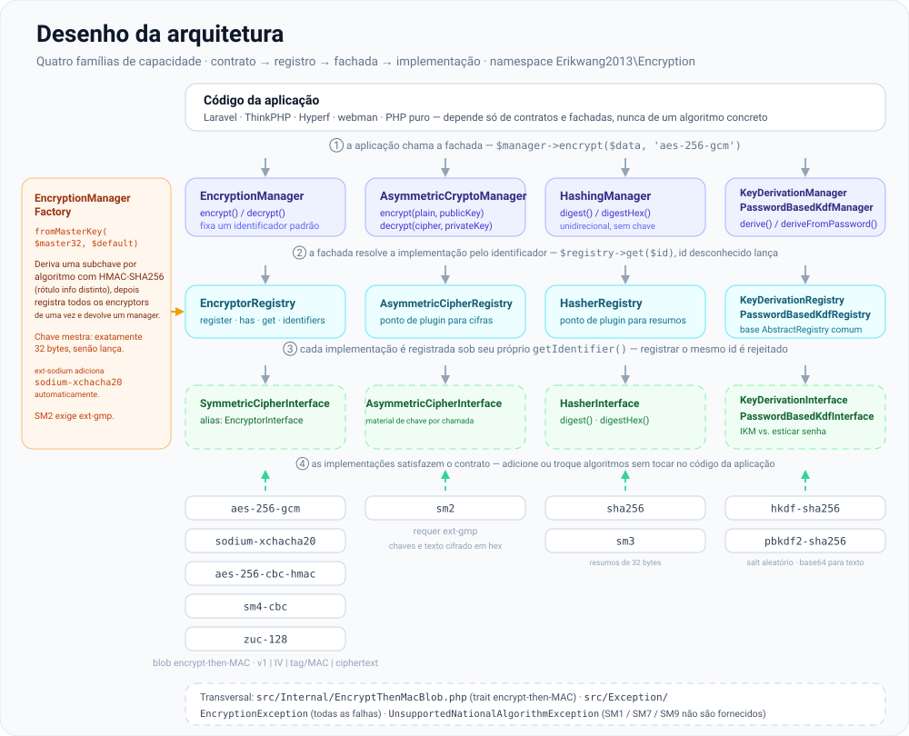
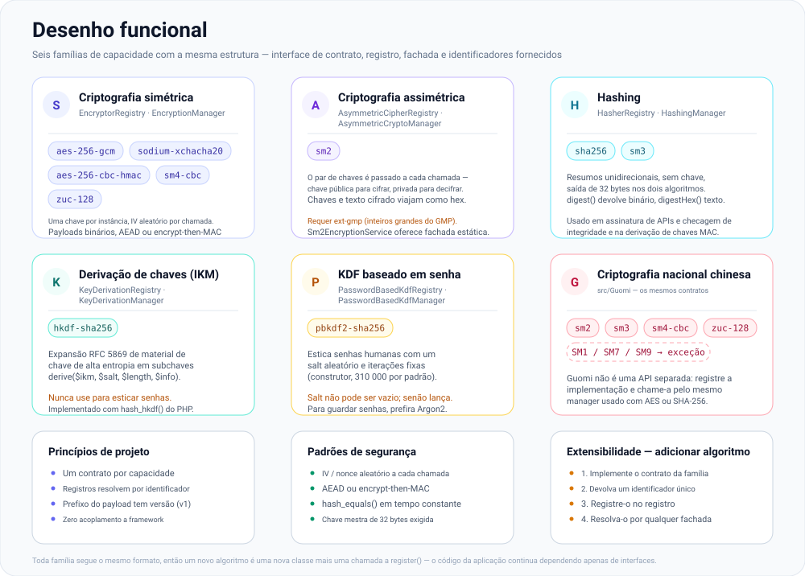
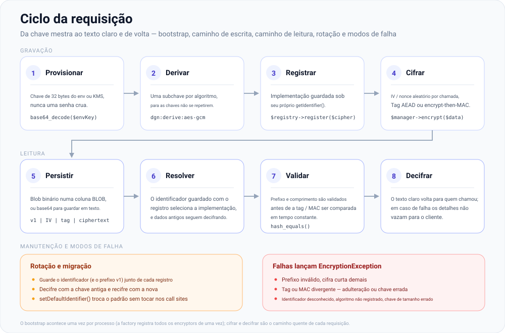

# erikwang2013/encryption

**Languages:** [English](../en/README.md) | [简体中文](../../../README.zh-CN.md) | [한국어](../ko/README.md) | [Русский](../ru/README.md) | [Deutsch](../de/README.md) | [Français](../fr/README.md) | [Español](../es/README.md) | **Português** | [हिन्दी](../hi/README.md) | [العربية](../ar/README.md) | [বাংলা](../bn/README.md) | [Bahasa Indonesia](../id/README.md) | [日本語](../ja/README.md)

<p align="center">
  
</p>

Uma biblioteca de componentes de criptografia plugável: sob um contrato unificado, ela oferece **criptografia simétrica**, **criptografia assimétrica**, **hashing** e **derivação de chaves** (HKDF / PBKDF2), com implementações que incluem AES/Sodium e os algoritmos nacionais chineses SM2/SM3/SM4/ZUC. Instalável via Composer.

**Locky**, o cadeado acima, é o mascote do projeto: ele guarda uma chave por algoritmo, um IV novo a cada chamada e um buraco de fechadura que nunca entrega segredos. O seu aplicativo também pode exibi-lo — `Mascot::svg()` devolve a arte para HTML, `Mascot::ascii()` um banner de terminal, e `Mascot::NAME` é `Locky`.

## Sobre o projeto

### O que é

`erikwang2013/encryption` é uma biblioteca de componentes de criptografia em PHP puro que dá às aplicações PHP criptografia, hashing e derivação de chaves **com segurança de tipos e extensíveis**. Ela não tem nenhuma dependência de framework e funciona tanto sozinha quanto dentro de Laravel, ThinkPHP, Hyperf e webman.

Abaixo você encontra a [estrutura do projeto](#estrutura-do-projeto) junto com os diagramas SVG do [desenho da arquitetura](#visão-geral-da-arquitetura), do [desenho funcional](#desenho-funcional) e do [ciclo de vida da requisição](#ciclo-de-vida-da-requisição); os arquivos-fonte dos diagramas ficam em [`docs/`](../../).

### Por que existe

O cenário de criptografia em PHP é fragmentado: o Laravel traz o seu próprio `Crypt`, os algoritmos nacionais chineses (SM2/SM3/SM4) não têm um pacote Composer unificado, e as primitivas de derivação de chaves (HKDF/PBKDF2) não possuem interface comum. Esta biblioteca reúne os algoritmos convencionais de criptografia simétrica/assimétrica/hash/KDF sob um **único sistema de contratos**, de modo que:

- **O código da aplicação depende apenas de interfaces** — trocar de algoritmo não exige nenhuma mudança na lógica de negócio
- **Os algoritmos Guomi recebem tratamento de primeira classe** — chame-os pelo mesmo Manager usado com AES/Sodium
- **O gerenciamento de chaves é padronizado** — derive subchaves por algoritmo a partir de uma única chave mestra, evitando a reutilização de chaves entre cifras
- **Padrões seguros já vêm embutidos** — criptografia autenticada (GCM / encrypt-then-MAC), IVs aleatórios e comparação em tempo constante saem prontos de fábrica

### Casos de uso

- Criptografia em nível de campo (criptografe dados pessoais, como telefone ou documento, antes de gravá-los no banco de dados)
- Convivência de múltiplos algoritmos e migração gradual (por exemplo, de AES-256-CBC para AES-256-GCM)
- Sistemas internos em conformidade com Guomi (SM2 assimétrico, SM3 para hash, SM4 simétrico, cifra de fluxo ZUC)
- Assinatura e verificação de APIs (HMAC / SHA-256 / SM3)
- Derivação de subchaves a partir de senhas ou chaves mestras (PBKDF2 / HKDF)

## Sumário

- [Compatibilidade com frameworks](#compatibilidade-com-frameworks)
- [Integração por framework](#integração-por-framework)
- [Início rápido](#início-rápido)
- [Visão geral da arquitetura](#visão-geral-da-arquitetura)
- [Desenho funcional](#desenho-funcional)
- [Ciclo de vida da requisição](#ciclo-de-vida-da-requisição)
- [Requisitos](#requisitos)
- [Instalação](#instalação)
- [Algoritmos e identificadores integrados](#algoritmos-e-identificadores-integrados)
- [Uso](#uso)
- [Estrutura do projeto](#estrutura-do-projeto)
- [Perguntas frequentes](#perguntas-frequentes)
- [Notas de segurança](#notas-de-segurança)
- [Executando os testes](#executando-os-testes)
- [Licença](#licença)

---

## Compatibilidade com frameworks

Este pacote **não depende** de nenhum framework web. Ele é distribuído como uma biblioteca Composer, apenas com classes e autoload. Na sua aplicação, execute `composer require erikwang2013/encryption`; roteamento, contêiner e configuração são irrelevantes.

Você precisa de **PHP ≥ 8.0** e das extensões/dependências listadas em [Requisitos](#requisitos). Com isso, as seguintes versões de framework funcionam (lado a lado com as APIs de criptografia de cada framework; injete `EncryptionManager` e outros managers conforme necessário):

| Framework | Observações |
|-----------|-------------|
| **Laravel** 7 / 8 / 9 / 10 / 11 | Instale em um runtime **PHP 8.0+**. Apenas o Laravel 7 ainda rodando em PHP 7.x não atende à restrição deste pacote — atualize o PHP primeiro. |
| **ThinkPHP** 6 / 8 | Adicione o pacote ao `require` do `composer.json` padrão da aplicação. |
| **Hyperf** 2 / 3 | Declare no `composer.json` do serviço; registre um singleton no `config` ou uma factory, como você costuma fazer no Hyperf. |
| **webman** 1 / 2 | `composer require` na raiz do projeto; use a partir das classes de negócio ou dos helpers de `support`. |

### Integração por framework

**Não existe** ServiceProvider dedicado para o Laravel nem um pacote de behavior para o ThinkPHP. Você registra o `EncryptionManager` (ou outros managers) no **contêiner de DI** ou na **factory singleton** do seu framework, carregando uma chave mestra de 32 bytes da configuração ou do ambiente. Os trechos abaixo são mínimos; **siga a sua própria política de segurança** para o material de chave (`.env`, KMS, serviços de configuração) — não embuta segredos no código.

**Laravel (`App\Providers\AppServiceProvider` ou um ServiceProvider dedicado)**

```php
use Erikwang2013\Encryption\EncryptionManagerFactory;

public function register(): void
{
    $this->app->singleton(\Erikwang2013\Encryption\EncryptionManager::class, function () {
        $raw = config('app.custom_master_key'); // e.g. base64 for 32 bytes
        $master = is_string($raw) ? base64_decode($raw, true) : '';
        if ($master === false || strlen($master) !== 32) {
            throw new \RuntimeException('Invalid 32-byte master key.');
        }
        return EncryptionManagerFactory::fromMasterKey($master, 'aes-256-gcm');
    });
}
```

Resolva com `app(\Erikwang2013\Encryption\EncryptionManager::class)`. Isto **não** substitui o `Crypt` / `encrypt()` do Laravel: esta biblioteca tem como foco a criptografia em nível de campo e os registros com múltiplos algoritmos; os helpers do Laravel cobrem a serialização do framework, cookies etc.

**ThinkPHP 6 / 8 (classe de serviço ou factory em `common.php`)**

```php
use Erikwang2013\Encryption\EncryptionManagerFactory;

function app_encryption_manager(): \Erikwang2013\Encryption\EncryptionManager
{
    static $mgr = null;
    if ($mgr === null) {
        $master = base64_decode(config('app.master_key'), true);
        $mgr = EncryptionManagerFactory::fromMasterKey($master, 'aes-256-gcm');
    }
    return $mgr;
}
```

Você também pode definir `EncryptionService` em `app\service` e injetá-lo nos controllers, o que facilita o uso de mocks nos testes.

**Hyperf 2 / 3 (`config/autoload/dependencies.php` ou factories por anotação)**

```php
use Erikwang2013\Encryption\EncryptionManager;
use Erikwang2013\Encryption\EncryptionManagerFactory;

return [
    EncryptionManager::class => function () {
        $master = base64_decode((string) config('encryption.master_key'), true);
        return EncryptionManagerFactory::fromMasterKey($master, 'aes-256-gcm');
    },
];
```

No modo corrotina, se as chaves vierem de configuração remota, faça cache do valor já decodificado.

**webman 1 / 2**

Registre o `EncryptionManager` no contêiner global `support` em `config/plugin.php`, em um `bootstrap` personalizado ou em `support/bootstrap.php` caso use esse padrão; ou construa-o com `EncryptionManagerFactory::fromMasterKey(...)` dentro das classes de serviço. O webman não impõe um contêiner específico — **siga as convenções do seu projeto**.

**Vanilla PHP (sem framework)**

Não há contêiner no qual se registrar: rode `composer require` na raiz do projeto e depois construa o manager uma única vez e reutilize-o. Há uma versão executável deste trecho em [`examples/plain-php/`](../../../examples/plain-php) — `php examples/plain-php/demo.php` imprime um ciclo completo de criptografia → gravação → leitura → descriptografia → detecção de adulteração.

```php
// bootstrap.php — require this once from your front controller
use Erikwang2013\Encryption\EncryptionManagerFactory;

$raw = getenv('ENCRYPTION_MASTER_KEY');            // base64 of 32 random bytes
$key = is_string($raw) ? base64_decode($raw, true) : false;
if ($key === false || strlen($key) !== 32) {
    throw new RuntimeException('ENCRYPTION_MASTER_KEY must be base64 of 32 bytes.');
}
$manager = EncryptionManagerFactory::fromMasterKey($key, 'aes-256-gcm');

// anywhere else in the project
$stored = base64_encode($manager->encrypt($phone));   // store as TEXT
$phone  = $manager->decrypt(base64_decode($stored));  // read it back
```

```bash
# generate the key once, keep it in the server environment — never in the code
export ENCRYPTION_MASTER_KEY="$(php -r 'echo base64_encode(random_bytes(32)), PHP_EOL;')"
```

Notas para projetos PHP puro: a parte cara é a factory (ela deriva todas as subchaves e registra cada cifrador), então chame-a uma vez por processo e reutilize a instância em vez de criá-la a cada consulta; mantenha a chave no ambiente do processo ou no seu próprio cofre de segredos e faça backup — perdê-la significa perder os dados; capture `EncryptionException` nas leituras e registre no servidor em vez de devolver o motivo ao cliente; o texto cifrado é binário, então guarde `base64_encode(...)` numa coluna `TEXT` ou os bytes brutos numa coluna `BLOB`.

### Não relacionado a esta biblioteca

- Atualizações de framework (por exemplo, Laravel 10 → 11) normalmente **não** exigem mudanças de API aqui. Se o Composer acusar conflito de versão do PHP, siga a restrição `php` deste pacote no `composer.json`.
- O algoritmo nacional chinês **SM2** exige **`ext-gmp`**; sem ela, as classes relacionadas falham em tempo de execução, independentemente do framework.

---

## Início rápido

1. Na raiz do seu projeto: `composer require erikwang2013/encryption:^1.0` (ou a restrição de versão que você publicou).
2. Confirme que `php -v` é **8.0+** e que o `openssl` está habilitado; para `sodium-xchacha20` ou SM2, instale as extensões `sodium` e/ou `gmp` conforme a necessidade.
3. `use Erikwang2013\Encryption\...` e escolha `EncryptionManager`, hashing, KDF etc. conforme descrito em [Uso](#uso).

---

## Visão geral da arquitetura

As capacidades são divididas em quatro famílias de contrato, cada uma com o seu próprio registro e uma fachada opcional (`*Manager`) para composição e testes. Todas as famílias têm o mesmo formato — interface de contrato → registro → fachada → implementações — e o `EncryptionManagerFactory` monta a família simétrica a partir de uma única chave mestra.



Fonte: [`docs/architecture-design.svg`](./architecture-design.svg)

| Capacidade | Contrato | Registro | Fachada (algoritmo padrão) |
|------------|----------|----------|----------------------------|
| Simétrica | `SymmetricCipherInterface` (alias `EncryptorInterface`) | `EncryptorRegistry` | `EncryptionManager` |
| Assimétrica | `AsymmetricCipherInterface` | `AsymmetricCipherRegistry` | `AsymmetricCryptoManager` |
| Hashing | `HasherInterface` | `HasherRegistry` | `HashingManager` |
| Derivação de chaves (IKM) | `KeyDerivationInterface` | `KeyDerivationRegistry` | `KeyDerivationManager` |
| KDF baseado em senha | `PasswordBasedKdfInterface` | `PasswordBasedKdfRegistry` | `PasswordBasedKdfManager` |

Notas de projeto:

- **Simétrica**: cada instância fixa uma chave; os payloads são binários — ideais para criptografia de campos em volume.
- **Assimétrica**: cada chamada recebe o material de chave pública/privada (o formato é definido pela implementação, por exemplo hex do SM2).
- **Hashing**: resumos unidirecionais, sem chave secreta (ou hashing padrão no estilo SM3).
- **Derivação de chaves**: o **HKDF** expande material de chave de alta entropia em subchaves; o **PBKDF2** estica senhas humanas (use salt aleatório e contagens de iteração altas).

---

## Desenho funcional

Seis famílias de capacidade, cada uma fornecida com os identificadores listados abaixo. Adicionar um algoritmo é uma nova classe mais uma chamada a `register()` — nada no núcleo muda, e o código da aplicação continua dependendo apenas de interfaces.



Fonte: [`docs/functional-design.svg`](./functional-design.svg)

| Família | Identificador | Para que serve |
|---------|---------------|----------------|
| Simétrica | `aes-256-gcm`, `sodium-xchacha20`, `aes-256-cbc-hmac`, `sm4-cbc`, `zuc-128` | Criptografia em nível de campo de qualquer tamanho, uma chave vinculada por instância |
| Assimétrica | `sm2` | Material de chave pública/privada por chamada (hex), exige `ext-gmp` |
| Hashing | `sha256`, `sm3` | Resumos unidirecionais para assinatura e verificação de integridade |
| Derivação de chaves (IKM) | `hkdf-sha256` | Expandir material de chave de alta entropia em subchaves por finalidade |
| KDF baseado em senha | `pbkdf2-sha256` | Esticar senhas humanas (salt aleatório, 310 000 iterações por padrão) |
| Guomi | SM2 / SM3 / SM4 / ZUC | Algoritmos nacionais pelos mesmos contratos; SM1 / SM7 / SM9 lançam `UnsupportedNationalAlgorithmException` |

---

## Ciclo de vida da requisição

O bootstrap acontece uma vez por processo; cifrar e decifrar são o caminho quente de cada requisição. Todo payload carrega um prefixo de versão (`v1`), então um texto cifrado gravado hoje continua legível depois de uma rotação.



Fonte: [`docs/lifecycle.svg`](./lifecycle.svg)

1. **Provisionar** — uma chave mestra de 32 bytes vinda do `.env` ou de um KMS; a factory rejeita qualquer outro comprimento.
2. **Derivar e registrar** — `EncryptionManagerFactory::fromMasterKey()` deriva uma subchave por algoritmo com HMAC-SHA256 (um rótulo de info distinto para cada uma) e registra todos os encryptors de uma vez.
3. **Cifrar** — `$manager->encrypt($data, 'aes-256-gcm')`; um IV/nonce aleatório é gerado a cada chamada e a tag ou o MAC é calculado sobre o texto cifrado.
4. **Persistir** — o blob binário `v1 | IV | tag/MAC | ciphertext` vai para uma coluna `BLOB`, ou é codificado com `base64_encode` para armazenamento em texto.
5. **Decifrar** — o identificador armazenado seleciona a implementação, o prefixo e o comprimento são verificados, a tag/MAC é comparada em tempo constante e só então o texto claro é retornado. Qualquer falha lança `EncryptionException`.

---

## Requisitos

| Item | Detalhes |
|------|----------|
| PHP | `^8.0` (quando combinado com os frameworks acima, esta restrição prevalece) |
| Extensão | `ext-openssl` (obrigatória) |
| Extensão | `ext-sodium` (opcional, para `sodium-xchacha20`) |
| Extensão | `ext-gmp` (opcional, criptografia/descriptografia **SM2** e geração de chaves) |
| Composer | `pohoc/crypto-sm` (dependência; wrappers de SM2/SM3/SM4) |

SM3 e SM4-CBC usam as implementações nativas do OpenSSL sempre que o OpenSSL vinculado oferece `sm3` / `sm4-cbc` (OpenSSL 1.1.1+). Caso contrário, recorrem às implementações em PHP puro de `pohoc/crypto-sm` — saída idêntica byte a byte, porém bem mais lenta: o fallback de SM3 é quadrático em memória (~490 MB e ~85 s para um único digest de 1 MiB, contra ~4 MB a ~60 MB/s no nativo). A CI roda a suíte nos dois caminhos.

## Instalação

### A partir de um caminho local (desenvolvimento)

No `composer.json` do projeto consumidor:

```json
{
    "repositories": [
        {
            "type": "path",
            "url": "/absolute/path/to/encryption"
        }
    ],
    "require": {
        "erikwang2013/encryption": "@dev"
    }
}
```

Depois:

```bash
composer update erikwang2013/encryption
```

### A partir do Git / Packagist (após o release)

```bash
composer require erikwang2013/encryption:^1.0
```

(Envie o repositório para um remote Git acessível e uma fonte Composer, ou publique no Packagist.)

---

## Algoritmos e identificadores integrados

### Criptografia simétrica (`SymmetricCipherInterface`)

| Identificador (`getIdentifier`) | Classe | Comprimento da chave | Observações |
|------------------------------|-------|------------|--------|
| `aes-256-gcm` | `Aes256GcmEncryptor` | 32 bytes | AEAD; padrão recomendado para novos sistemas |
| `sodium-xchacha20` | `SodiumXChaCha20Encryptor` | 32 bytes | Exige `ext-sodium` |
| `aes-256-cbc-hmac` | `OpenSslAes256CbcEncryptor` | 32 bytes | CBC + HMAC para compatibilidade legada |
| `sm4-cbc` | `Sm4CbcEncryptor` | 16 bytes | SM4-CBC (SM4 do OpenSSL) |
| `zuc-128` | `ZucEncryptor` | 16 bytes | Cifra de fluxo ZUC-128 |

### Criptografia assimétrica (`AsymmetricCipherInterface`)

| Identificador | Classe | Observações |
|------------|-------|--------|
| `sm2` | `Sm2AsymmetricCipher` | SM2; chaves e texto cifrado em hex; exige `ext-gmp` |

Você também pode usar a fachada estática `Sm2EncryptionService`; o comportamento é idêntico ao de `Sm2AsymmetricCipher`.

### Hashing (`HasherInterface`)

| Identificador | Classe | Comprimento da saída |
|------------|-------|-----------------|
| `sha256` | `Sha256Hasher` | 32 bytes |
| `sm3` | `Sm3Hasher` | 32 bytes |

### Derivação de chaves

| Identificador | Classe | Contrato | Observações |
|------------|-------|----------|--------|
| `hkdf-sha256` | `HkdfSha256` | `KeyDerivationInterface` | RFC 5869: IKM + salt + info |
| `pbkdf2-sha256` | `Pbkdf2Sha256` | `PasswordBasedKdfInterface` | Senha + salt + iterações (construtor) |

Textos cifrados e resumos costumam ser binários; para armazenamento em JSON/texto, aplique `base64_encode` / `base64_decode` você mesmo.

---

## Uso

### 1. Criptografia simétrica: algoritmo único e registro

```php
<?php

use Erikwang2013\Encryption\Encryptor\Aes256GcmEncryptor;
use Erikwang2013\Encryption\EncryptionManager;
use Erikwang2013\Encryption\EncryptorRegistry;

$key = random_bytes(32);
$encryptor = new Aes256GcmEncryptor($key);
$ciphertext = $encryptor->encrypt('plaintext');
$plaintext  = $encryptor->decrypt($ciphertext);

$registry = new EncryptorRegistry(new Aes256GcmEncryptor($key));
$manager = new EncryptionManager($registry, 'aes-256-gcm');
$blob = $manager->encrypt('data');
```

Factory de chave mestra: `EncryptionManagerFactory::fromMasterKey($masterKey32, 'aes-256-gcm')` deriva subchaves por algoritmo e registra **aes-256-gcm**, **aes-256-cbc-hmac**, **sm4-cbc**, **zuc-128** e **sodium-xchacha20** (se a ext-sodium estiver disponível) de uma só vez. A derivação usa `'v1'` por padrão; passe `'v2'` como terceiro argumento para obter a ordem de argumentos HMAC corrigida (os dois são mutuamente ilegíveis — veja o §8).

### 2. Criptografia assimétrica

```php
<?php

use Erikwang2013\Encryption\Asymmetric\Sm2AsymmetricCipher;
use Erikwang2013\Encryption\AsymmetricCipherRegistry;
use Erikwang2013\Encryption\AsymmetricCryptoManager;
use Erikwang2013\Encryption\Guomi\Sm2EncryptionService;

// requires ext-gmp
$pair = Sm2EncryptionService::generateKeyPairHex();

$cipher = new Sm2AsymmetricCipher();
$hexCipher = $cipher->encrypt('plaintext', $pair->getPublicKey());
$plain = $cipher->decrypt($hexCipher, $pair->getPrivateKey());

$mgr = new AsymmetricCryptoManager(new AsymmetricCipherRegistry($cipher), 'sm2');
$hexCipher2 = $mgr->encrypt('plaintext', $pair->getPublicKey());
```

### 3. Hashing

```php
<?php

use Erikwang2013\Encryption\Hash\Sha256Hasher;
use Erikwang2013\Encryption\Guomi\Sm3Hasher;
use Erikwang2013\Encryption\HasherRegistry;
use Erikwang2013\Encryption\HashingManager;

$registry = new HasherRegistry(
    new Sha256Hasher(),
    new Sm3Hasher(),
);
$hashing = new HashingManager($registry, 'sha256');
$bin = $hashing->digest('data');
$hex = $hashing->digestHex('data', 'sm3');
```

### 4. Derivação de chaves (HKDF / PBKDF2)

```php
<?php

use Erikwang2013\Encryption\Kdf\HkdfSha256;
use Erikwang2013\Encryption\Kdf\Pbkdf2Sha256;
use Erikwang2013\Encryption\KeyDerivationManager;
use Erikwang2013\Encryption\KeyDerivationRegistry;
use Erikwang2013\Encryption\PasswordBasedKdfManager;
use Erikwang2013\Encryption\PasswordBasedKdfRegistry;

// Derive subkey from high-entropy material (e.g. TLS, envelope subkeys)
$hkdf = new HkdfSha256();
$subKey = $hkdf->derive($ikm32, $salt, 32, 'app:v1');

$kdfMgr = new KeyDerivationManager(new KeyDerivationRegistry($hkdf), 'hkdf-sha256');

// Derive from user password (for password storage prefer password_hash / Argon2, etc.)
$pbkdf2 = new Pbkdf2Sha256(iterations: 310_000);
$derived = $pbkdf2->deriveFromPassword('user password', random_bytes(16), 32);

$pwdMgr = new PasswordBasedKdfManager(new PasswordBasedKdfRegistry($pbkdf2), 'pbkdf2-sha256');
```

### 5. Algoritmos nacionais chineses (SM3 / SM4 / ZUC / SM2)

```php
<?php

use Erikwang2013\Encryption\Guomi\Sm2EncryptionService;
use Erikwang2013\Encryption\Guomi\Sm3Hasher;
use Erikwang2013\Encryption\Guomi\Sm4CbcEncryptor;
use Erikwang2013\Encryption\Guomi\ZucEncryptor;

$sm3 = new Sm3Hasher();
$bin = $sm3->digest('data');

$key16 = random_bytes(16);
$sm4 = new Sm4CbcEncryptor($key16);
$blob = $sm4->encrypt('plaintext');

$zuc = new ZucEncryptor($key16);
$blob2 = $zuc->encrypt('plaintext');

// SM2: see asymmetric example above or Sm2EncryptionService
```

SM1, SM7, SM9: `UnavailableNationalAlgorithms::sm1()` e métodos equivalentes lançam `UnsupportedNationalAlgorithmException`.

### 6. Plugins personalizados

- Simétrica: implemente `EncryptorInterface` (`SymmetricCipherInterface`) e registre em `EncryptorRegistry`.
- Assimétrica: implemente `AsymmetricCipherInterface` e registre em `AsymmetricCipherRegistry`.
- Hashing: implemente `HasherInterface` e registre em `HasherRegistry`.
- KDF: implemente `KeyDerivationInterface` ou `PasswordBasedKdfInterface` e registre no `Registry` correspondente.

### 7. Exceções

Falhas lançam `Erikwang2013\Encryption\Exception\EncryptionException`; algoritmos nacionais indisponíveis usam `UnsupportedNationalAlgorithmException`. Capture e registre em log no código da aplicação; não vaze detalhes para os clientes.

### 8. Esquema de derivação de chaves v1 → v2 (migração opcional)

**O que estava errado.** Ao derivar as subchaves por algoritmo e as chaves MAC de `aes-256-cbc-hmac`, `sm4-cbc` e `zuc-128`, `hash_hmac($algo, $data, $key)` era chamada com o rótulo de uso constante como **chave** do HMAC e o material secreto como **mensagem** — os dois argumentos estavam trocados. A chave do HMAC deve ser o segredo.

**Por que nada é explorável.** O rótulo de uso é uma constante pública e o segredo continua alimentando o HMAC; um atacante sem a chave mestra (ou sem a chave da cifra) não deriva nada e não forja nada. Apenas a ordem dos argumentos estava errada, não a força da derivação.

**Como mudar.** Passe `'v2'` como terceiro argumento. Omiti-lo mantém o comportamento atual byte a byte, então nenhum ponto de chamada existente muda:

```php
$v1 = EncryptionManagerFactory::fromMasterKey($master);                       // default: unchanged behaviour
$v2 = EncryptionManagerFactory::fromMasterKey($master, 'aes-256-gcm', 'v2');  // corrected HMAC order
```

Cada cifrador baseado em MAC aceita o mesmo interruptor como último argumento opcional — `new Sm4CbcEncryptor($key16, macDerivation: 'v2')`. Um nome de esquema desconhecido lança `EncryptionException` em vez de recorrer silenciosamente ao v1.

**Migração.** v1 e v2 derivam subchaves e chaves MAC *diferentes*, portanto não são intercambiáveis: um manager v2 não consegue decifrar texto cifrado v1, e um manager v1 não consegue decifrar texto cifrado v2 (falha de MAC / autenticação). Não há marcador do esquema nos dados transmitidos — ambos escrevem o mesmo prefixo de carga útil `v1` —, então, durante uma migração, uma leitura com o esquema errado é indistinguível de um texto cifrado adulterado: as duas se manifestam como falha de MAC. Registre em log o esquema usado em cada leitura durante a migração e, diante dessas falhas, suspeite de incompatibilidade de esquema antes de suspeitar de corrupção. Construa os dois managers a partir da mesma chave mestra e leia primeiro, grave depois:

```php
$v1 = EncryptionManagerFactory::fromMasterKey($master);                       // read legacy data
$v2 = EncryptionManagerFactory::fromMasterKey($master, 'aes-256-gcm', 'v2');  // write new data
$plain = $v1->decrypt($legacyBlob, 'aes-256-cbc-hmac');                       // 1. decrypt with v1
$blob  = $v2->encrypt($plain, 'aes-256-cbc-hmac');                            // 2. re-encrypt with v2
```

Recifre os dados armazenados (sessões e tokens incluídos) e aposente o manager v1 quando não restar nenhum texto cifrado v1. A chave mestra em si não muda: trocar o esquema de derivação não é uma rotação de chaves.

**Sem relação com o prefixo da carga útil.** O `v1` na estrutura de carga útil `v1 | IV | MAC | ciphertext` é uma versão do *formato do texto cifrado*, não deste esquema de derivação — o prefixo continua `v1` no v2, e os blobs antigos mantêm o seu. Não o renomeie.

---

## Estrutura do projeto

```text
encryption/
├── src/
│   ├── Contract/                    interfaces de capacidade — o contrato público:
│   │                                SymmetricCipherInterface (alias EncryptorInterface),
│   │                                AsymmetricCipherInterface, HasherInterface,
│   │                                KeyDerivationInterface, PasswordBasedKdfInterface
│   ├── Encryptor/                   Aes256GcmEncryptor, OpenSslAes256CbcEncryptor,
│   │                                SodiumXChaCha20Encryptor
│   ├── Asymmetric/                  Sm2AsymmetricCipher
│   ├── Hash/                        Sha256Hasher
│   ├── Kdf/                         HkdfSha256, Pbkdf2Sha256
│   ├── Guomi/                       Sm2EncryptionService, Sm3Hasher, Sm4CbcEncryptor,
│   │                                ZucEncryptor, UnavailableNationalAlgorithms
│   │   └── Internal/ZucEngine.php   motor de keystream ZUC
│   ├── Internal/                    trait EncryptThenMacBlob (encrypt-then-MAC compartilhado)
│   ├── Exception/                   EncryptionException,
│   │                                UnsupportedNationalAlgorithmException
│   ├── AbstractRegistry.php         armazém identificador → implementação, comum aos registros
│   ├── EncryptorRegistry.php        AsymmetricCipherRegistry.php, HasherRegistry.php,
│   │                                KeyDerivationRegistry.php, PasswordBasedKdfRegistry.php
│   ├── EncryptionManager.php        AsymmetricCryptoManager.php, HashingManager.php,
│   │                                KeyDerivationManager.php, PasswordBasedKdfManager.php
│   ├── EncryptionManagerFactory.php chave mestra → subchaves por algoritmo → registro
│   └── Mascot.php                   API opcional do mascote (SVG / ASCII); o código de criptografia nunca a chama
├── tests/                           suítes PHPUnit: testes de contrato, registro, manager e
│                                    algoritmo, além dos helpers TestCase
├── docs/                            mascote e diagramas de projeto
│   ├── mascot.svg                   o mascote do projeto (Locky)
│   ├── architecture-design.svg      embutido em “Visão geral da arquitetura”
│   ├── functional-design.svg        embutido em “Desenho funcional”
│   ├── lifecycle.svg                embutido em “Ciclo de vida da requisição”
│   ├── i18n/                        este README em 12 idiomas adicionais, cada um com
│   │                                cópias localizadas dos diagramas (+ labels/*.json)
│   └── *.md                         relatórios de revisão / teste arquivados
├── examples/plain-php/              integração Vanilla PHP executável (bootstrap + demo)
├── scripts/i18n-build-svg.php       gera docs/i18n/<lang>/*.svg a partir dos dicionários de rótulos
├── .github/workflows/tests.yml      phpunit em PHP 8.0–8.4 na CI (gmp + sodium)
├── composer.json                    autoload psr-4, PHP ^8.0, phpunit como dependência de dev
├── phpunit.xml.dist
├── SECURITY.md                      política de divulgação de vulnerabilidades
└── README.md  README.zh-CN.md
```

| Caminho | Propósito |
|------|---------|
| `src/Contract/` | Interfaces de capacidade (`EncryptorInterface`, `HasherInterface`, …) |
| `src/Encryptor/`, `src/Asymmetric/`, `src/Hash/`, `src/Kdf/` | Implementações de algoritmo |
| `src/Guomi/` | Criptografia nacional chinesa e `UnavailableNationalAlgorithms` |
| `src/Internal/` | `EncryptThenMacBlob` — encrypt-then-MAC compartilhado por CBC / SM4 / ZUC |
| `src/Exception/` | `EncryptionException`, etc. |
| `*Registry.php`, `*Manager.php`, `EncryptionManagerFactory.php` | Registros, fachadas, factory de chave mestra |
| `docs/*.svg` | Mascote e diagramas de projeto embutidos neste README |

Prefixo de namespace: `Erikwang2013\Encryption\`, alinhado ao `psr-4` do Composer.

---

## Perguntas frequentes

**O Composer acusa incompatibilidade de versão do PHP**

Este pacote exige `php ^8.0`. Se a aplicação ainda roda em PHP 8.0 ou inferior, atualize o PHP ou não use este pacote.

**`sodium-xchacha20` indisponível**

Instale e habilite a extensão `sodium` (`ext-sodium`). Sem ela, `EncryptionManagerFactory::fromMasterKey(..., 'sodium-xchacha20')` falha; use `aes-256-gcm`.

**Erros de SM2 ou falha na geração de chaves**

Instale e habilite **`ext-gmp`**. O SM2 depende de inteiros grandes; sem o GMP, o comportamento não é garantido.

**Armazenar texto cifrado em um banco de dados / JSON**

Use `BLOB` para colunas binárias; se precisar mesmo usar texto, aplique **`base64_encode`** no texto cifrado e nos IVs e, antes de decifrar, **`base64_decode`**.

**Diferença em relação ao `encrypt()` / `Crypt` do Laravel**

A API do Laravel tem como alvo a serialização do framework e cookies; esta biblioteca tem como alvo **IDs de algoritmo explícitos, múltiplos registros, algoritmos nacionais, HKDF/PBKDF2** etc. As duas podem coexistir — não misture o uso de chaves a menos que você mesmo alinhe os formatos.

---

## Notas de segurança

1. **Chaves**: use `random_bytes()` ou um KMS para chaves de alta entropia; nunca use senhas cruas como chaves AES — estique-as antes com **PBKDF2 / Argon2**.
2. **Algoritmos**: prefira **AES-256-GCM** ou **Sodium** em sistemas novos; use **SM3/SM4/ZUC/SM2** onde forem exigidos; **HKDF** para expandir subchaves; ao esticar senhas com **PBKDF2**, use iterações suficientes e salt aleatório.
3. **Transporte**: continue usando TLS em trânsito; esta biblioteca cuida da criptografia em nível de campo e dos resumos.
4. **Migração**: acompanhe o `identifier` de cada versão de algoritmo, para que dados antigos possam ser decifrados e recifrados.
5. **Encontrou uma vulnerabilidade?** Comunique-a em particular — veja [`SECURITY.md`](../../../SECURITY.md).

---

## Executando os testes

Depois de clonar:

```bash
composer install
composer test
```

Equivalente a `./vendor/bin/phpunit tests/`. Se você adicionar um `phpunit.xml`, aponte para ele o script `test` do `composer.json`.

---

## Obrigado pelo seu apoio / 开源不易，欢迎支持

| WeChat Pay / 微信 | Alipay / 支付宝 |
|:---:|:---:|
|  |  |

---

## Licença

MIT (veja o campo `license` do `composer.json`).
