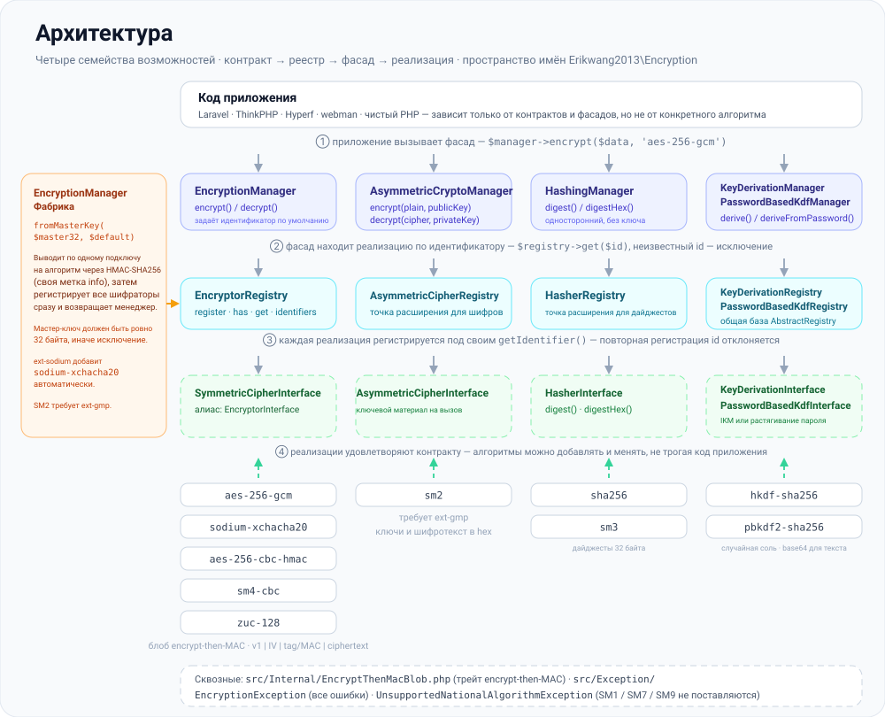
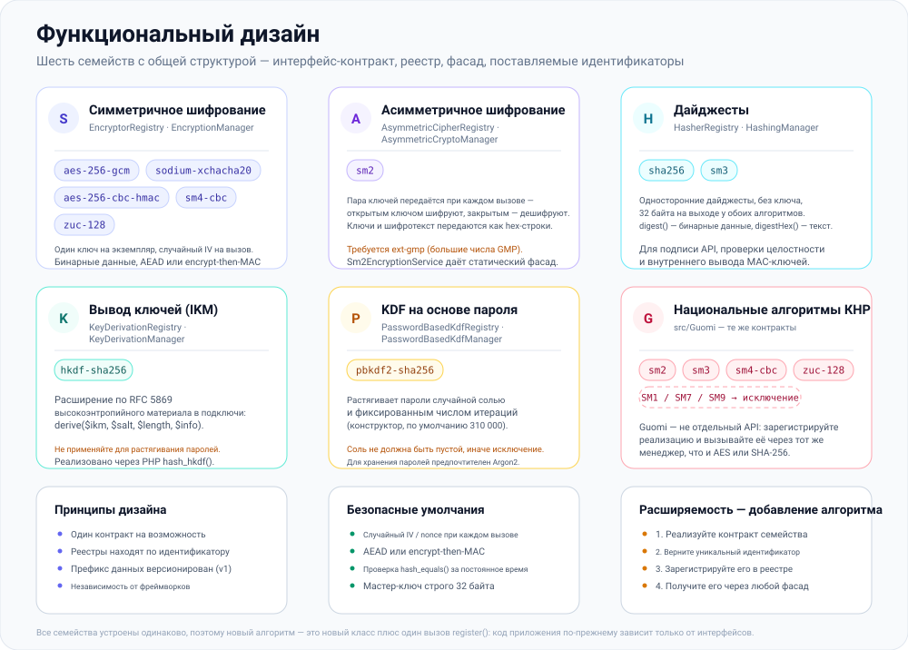
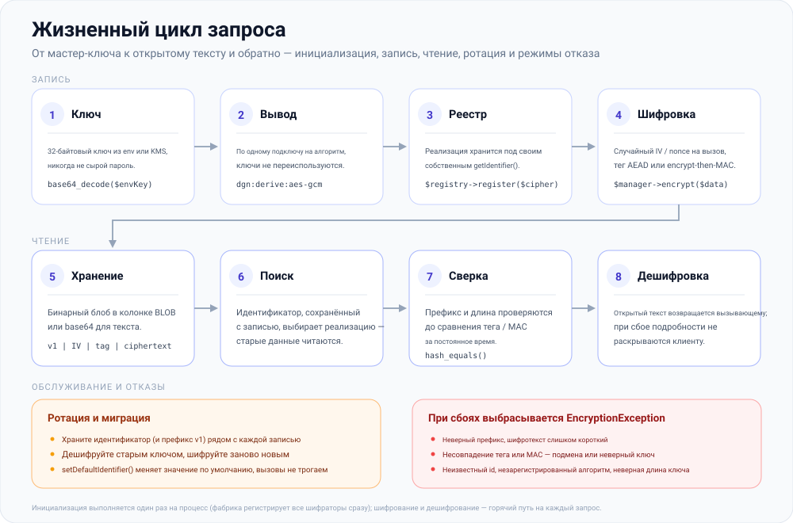

# erikwang2013/encryption

**Languages:** [English](../en/README.md) | [简体中文](../../../README.zh-CN.md) | [한국어](../ko/README.md) | **Русский** | [Deutsch](../de/README.md) | [Français](../fr/README.md) | [Español](../es/README.md) | [Português](../pt/README.md) | [हिन्दी](../hi/README.md) | [العربية](../ar/README.md) | [বাংলা](../bn/README.md) | [Bahasa Indonesia](../id/README.md) | [日本語](../ja/README.md)

<p align="center">
  
</p>

Подключаемая библиотека криптографических компонентов: в рамках единой системы контрактов она предоставляет **симметричное шифрование**, **асимметричное шифрование**, **хеширование** и **вывод ключей** (HKDF / PBKDF2), а среди её реализаций — AES/Sodium и китайские национальные алгоритмы SM2/SM3/SM4/ZUC. Устанавливается через Composer.

**Locky** — замок на картинке выше — талисман проекта: он хранит по одному ключу на алгоритм, генерирует новый IV при каждом вызове и никогда не выдаёт свою замочную скважину. Ваше приложение тоже может его показать: `Mascot::svg()` возвращает изображение для HTML, `Mascot::ascii()` — баннер для терминала, а `Mascot::NAME` равно `Locky`.

## О проекте

### Что это такое

`erikwang2013/encryption` — библиотека криптографических компонентов на чистом PHP, которая даёт PHP-приложениям **типобезопасное и расширяемое** шифрование, хеширование и вывод ключей. У неё нет зависимостей от фреймворков, и она работает как самостоятельно, так и внутри Laravel, ThinkPHP, Hyperf и webman.

Ниже приведены [структура проекта](#структура-проекта) и SVG-схемы [архитектуры](#обзор-архитектуры), [функционального дизайна](#функциональный-дизайн) и [жизненного цикла запроса](#жизненный-цикл-запроса); исходники схем лежат в [`docs/`](../../).

### Зачем она нужна

Криптографический ландшафт PHP разрознен: Laravel поставляет собственный `Crypt`, китайские национальные алгоритмы (SM2/SM3/SM4) не имеют единого Composer-пакета, а у примитивов вывода ключей (HKDF/PBKDF2) нет общего интерфейса. Эта библиотека сводит основные алгоритмы симметричного и асимметричного шифрования, хеширования и KDF под **единую систему контрактов**, благодаря чему:

- **Код приложения зависит только от интерфейсов** — смена алгоритма не требует ни малейших правок в бизнес-логике
- **Алгоритмы Guomi получают полноценную поддержку** — они вызываются через тот же Manager, что и AES/Sodium
- **Управление ключами стандартизировано** — подключи для каждого алгоритма выводятся из одного мастер-ключа, что исключает повторное использование ключа в разных шифрах
- **Безопасные значения по умолчанию встроены** — аутентифицированное шифрование (GCM / encrypt-then-MAC), случайные IV и сравнение за постоянное время доступны из коробки

### Сценарии использования

- Шифрование отдельных полей (шифрование персональных данных — номеров телефонов, удостоверений личности — перед сохранением в базу данных)
- Сосуществование нескольких алгоритмов и постепенная миграция (например, с AES-256-CBC на AES-256-GCM)
- Внутренние системы, требующие соответствия стандартам КНР (асимметричный SM2, хеширование SM3, симметричный SM4, потоковый шифр ZUC)
- Подпись и проверка API-запросов (HMAC / SHA-256 / SM3)
- Вывод подключей из паролей или мастер-ключей (PBKDF2 / HKDF)

## Содержание

- [Совместимость с фреймворками](#совместимость-с-фреймворками)
- [Интеграция для каждого фреймворка](#интеграция-для-каждого-фреймворка)
- [Быстрый старт](#быстрый-старт)
- [Обзор архитектуры](#обзор-архитектуры)
- [Функциональный дизайн](#функциональный-дизайн)
- [Жизненный цикл запроса](#жизненный-цикл-запроса)
- [Требования](#требования)
- [Установка](#установка)
- [Встроенные алгоритмы и идентификаторы](#встроенные-алгоритмы-и-идентификаторы)
- [Использование](#использование)
- [Структура проекта](#структура-проекта)
- [Часто задаваемые вопросы](#часто-задаваемые-вопросы)
- [Замечания по безопасности](#замечания-по-безопасности)
- [Запуск тестов](#запуск-тестов)
- [Лицензия](#лицензия)

---

## Совместимость с фреймворками

Этот пакет **не зависит** ни от какого веб-фреймворка. Он поставляется как Composer-библиотека, содержащая только классы и автозагрузку. В своём приложении выполните `composer require erikwang2013/encryption`; маршрутизация, контейнер и конфигурация здесь ни при чём.

Вам потребуется **PHP ≥ 8.0** и расширения/зависимости, перечисленные в разделе [Требования](#требования). При их наличии работают следующие версии фреймворков (вместе с собственными криптографическими API этих фреймворков; внедряйте `EncryptionManager` и прочие менеджеры по необходимости):

| Фреймворк | Примечания |
|-----------|------------|
| **Laravel** 7 / 8 / 9 / 10 / 11 | Устанавливайте в среде **PHP 8.0+**. Только Laravel 7, всё ещё работающий на PHP 7.x, не удовлетворяет ограничению этого пакета — сначала обновите PHP. |
| **ThinkPHP** 6 / 8 | Добавьте пакет в стандартный раздел `require` файла `composer.json` приложения. |
| **Hyperf** 2 / 3 | Подключите в `composer.json` сервиса; зарегистрируйте синглтон в `config` или фабрику — так, как это обычно делается в Hyperf. |
| **webman** 1 / 2 | `composer require` в корне проекта; используйте из бизнес-классов или хелперов в `support`. |

### Интеграция для каждого фреймворка

Отдельного Laravel ServiceProvider или набора поведений для ThinkPHP **нет**. Вы регистрируете `EncryptionManager` (или другие менеджеры) в **DI-контейнере** или **фабрике синглтонов** своего фреймворка, загружая 32-байтовый мастер-ключ из конфигурации или переменных окружения. Фрагменты ниже минимальны; **руководствуйтесь собственной политикой безопасности** в отношении ключевого материала (`.env`, KMS, сервисы конфигурации) — не вшивайте секреты в код.

**Laravel (`App\Providers\AppServiceProvider` или отдельный ServiceProvider)**

```php
use Erikwang2013\Encryption\EncryptionManagerFactory;

public function register(): void
{
    $this->app->singleton(\Erikwang2013\Encryption\EncryptionManager::class, function () {
        $raw = config('app.custom_master_key'); // e.g. base64 for 32 bytes
        $master = is_string($raw) ? base64_decode($raw, true) : '';
        if ($master === false || strlen($master) !== 32) {
            throw new \RuntimeException('Invalid 32-byte master key.');
        }
        return EncryptionManagerFactory::fromMasterKey($master, 'aes-256-gcm');
    });
}
```

Получение экземпляра — `app(\Erikwang2013\Encryption\EncryptionManager::class)`. Это **не** заменяет laravel-овские `Crypt` / `encrypt()`: библиотека нацелена на шифрование отдельных полей и реестры с несколькими алгоритмами, тогда как хелперы Laravel закрывают сериализацию средствами фреймворка, cookie и т. п.

**ThinkPHP 6 / 8 (сервисный класс или фабрика в `common.php`)**

```php
use Erikwang2013\Encryption\EncryptionManagerFactory;

function app_encryption_manager(): \Erikwang2013\Encryption\EncryptionManager
{
    static $mgr = null;
    if ($mgr === null) {
        $master = base64_decode(config('app.master_key'), true);
        $mgr = EncryptionManagerFactory::fromMasterKey($master, 'aes-256-gcm');
    }
    return $mgr;
}
```

Можно также объявить `EncryptionService` в `app\service` и внедрять его в контроллеры — так проще подменять его в тестах.

**Hyperf 2 / 3 (`config/autoload/dependencies.php` или фабрики-аннотации)**

```php
use Erikwang2013\Encryption\EncryptionManager;
use Erikwang2013\Encryption\EncryptionManagerFactory;

return [
    EncryptionManager::class => function () {
        $master = base64_decode((string) config('encryption.master_key'), true);
        return EncryptionManagerFactory::fromMasterKey($master, 'aes-256-gcm');
    },
];
```

В корутинном режиме, если ключи приходят из удалённой конфигурации, кешируйте разобранное значение.

**webman 1 / 2**

Зарегистрируйте `EncryptionManager` в глобальном контейнере `support` в `config/plugin.php`, в собственном `bootstrap` или в `support/bootstrap.php`, если вы используете такой подход, либо создавайте его через `EncryptionManagerFactory::fromMasterKey(...)` внутри сервисных классов. webman не навязывает конкретный контейнер — **следуйте соглашениям своего проекта**.

**Vanilla PHP (без фреймворка)**

Контейнера, в который можно зарегистрироваться, здесь нет: выполните `composer require` в корне проекта, а затем создайте менеджер один раз и переиспользуйте его. Рабочий вариант этого раздела лежит в [`examples/plain-php/`](../../../examples/plain-php) — `php examples/plain-php/demo.php` печатает полный цикл шифрование → сохранение → чтение → расшифровка → обнаружение подмены.

```php
// bootstrap.php — require this once from your front controller
use Erikwang2013\Encryption\EncryptionManagerFactory;

$raw = getenv('ENCRYPTION_MASTER_KEY');            // base64 of 32 random bytes
$key = is_string($raw) ? base64_decode($raw, true) : false;
if ($key === false || strlen($key) !== 32) {
    throw new RuntimeException('ENCRYPTION_MASTER_KEY must be base64 of 32 bytes.');
}
$manager = EncryptionManagerFactory::fromMasterKey($key, 'aes-256-gcm');

// anywhere else in the project
$stored = base64_encode($manager->encrypt($phone));   // store as TEXT
$phone  = $manager->decrypt(base64_decode($stored));  // read it back
```

```bash
# generate the key once, keep it in the server environment — never in the code
export ENCRYPTION_MASTER_KEY="$(php -r 'echo base64_encode(random_bytes(32)), PHP_EOL;')"
```

Замечания для проектов на чистом PHP: самое дорогое здесь — фабрика (она выводит все подключи и регистрирует каждый шифратор), поэтому вызывайте её один раз на процесс и переиспользуйте экземпляр, а не создавайте его на каждый запрос; храните ключ в окружении процесса или в собственном хранилище секретов и делайте резервную копию — его потеря означает потерю данных; перехватывайте `EncryptionException` при чтении и логируйте на сервере, вместо того чтобы возвращать причину клиенту; шифртекст бинарный, поэтому сохраняйте `base64_encode(...)` в столбце `TEXT` или необработанный набор байтов в столбце `BLOB`.

### Что не связано с этой библиотекой

- Обновление фреймворка (например, Laravel 10 → 11) обычно **не** требует правок этого API. Если Composer сообщает о конфликте версий PHP, ориентируйтесь на ограничение `php` в `composer.json` этого пакета.
- Китайский национальный **SM2** требует **`ext-gmp`**; без него соответствующие классы падают во время выполнения независимо от фреймворка.

---

## Быстрый старт

1. В корне проекта: `composer require erikwang2013/encryption:^1.0` (или ваше ограничение опубликованной версии).
2. Убедитесь, что `php -v` выдаёт **8.0+**, а `openssl` включён; для `sodium-xchacha20` или SM2 установите расширения `sodium` и/или `gmp` по необходимости.
3. Подключите `use Erikwang2013\Encryption\...` и выберите `EncryptionManager`, хеширование, KDF и т. д., как описано в разделе [Использование](#использование).

---

## Обзор архитектуры

Возможности разделены на четыре семейства контрактов, у каждого из которых есть собственный реестр и необязательный фасад (`*Manager`) для композиции и тестирования. Все семейства устроены одинаково — интерфейс-контракт → реестр → фасад → реализации, — а `EncryptionManagerFactory` собирает симметричное семейство из одного мастер-ключа.



Источник: [`docs/i18n/ru/architecture-design.svg`](./architecture-design.svg)

| Возможность | Контракт | Реестр | Фасад (алгоритм по умолчанию) |
|------------|----------|----------|----------------------------|
| Симметричное шифрование | `SymmetricCipherInterface` (алиас `EncryptorInterface`) | `EncryptorRegistry` | `EncryptionManager` |
| Асимметричное шифрование | `AsymmetricCipherInterface` | `AsymmetricCipherRegistry` | `AsymmetricCryptoManager` |
| Хеширование | `HasherInterface` | `HasherRegistry` | `HashingManager` |
| Вывод ключей (IKM) | `KeyDerivationInterface` | `KeyDerivationRegistry` | `KeyDerivationManager` |
| KDF на основе пароля | `PasswordBasedKdfInterface` | `PasswordBasedKdfRegistry` | `PasswordBasedKdfManager` |

Замечания по дизайну:

- **Симметричное шифрование**: экземпляр привязан к фиксированному ключу; данные бинарные — хорошо подходит для массового шифрования полей.
- **Асимметричное шифрование**: при каждом вызове передаётся открытый/закрытый ключ (формат определяется реализацией, например hex для SM2).
- **Хеширование**: односторонние дайджесты без секретного ключа (или стандартное хеширование в стиле SM3).
- **Вывод ключей**: **HKDF** разворачивает высокоэнтропийный ключевой материал в подключи; **PBKDF2** растягивает человеческие пароли (используйте случайную соль и большое число итераций).

---

## Функциональный дизайн

Шесть семейств возможностей, каждое поставляется с перечисленными ниже идентификаторами. Добавление алгоритма — это новый класс плюс один вызов `register()`: в ядре ничего не меняется, а код приложения по-прежнему зависит только от интерфейсов.



Источник: [`docs/i18n/ru/functional-design.svg`](./functional-design.svg)

| Семейство | Идентификатор | Для чего предназначено |
|--------|-----------|----------------|
| Симметричное шифрование | `aes-256-gcm`, `sodium-xchacha20`, `aes-256-cbc-hmac`, `sm4-cbc`, `zuc-128` | Шифрование полей любого размера, один ключ на экземпляр |
| Асимметричное шифрование | `sm2` | Открытый/закрытый ключ при каждом вызове (hex), требуется `ext-gmp` |
| Хеширование | `sha256`, `sm3` | Односторонние дайджесты для подписи и проверки целостности |
| Вывод ключей (IKM) | `hkdf-sha256` | Разворачивание высокоэнтропийного ключевого материала в подключи для конкретных задач |
| KDF на основе пароля | `pbkdf2-sha256` | Растягивание человеческих паролей (случайная соль, 310 000 итераций по умолчанию) |
| Guomi | SM2 / SM3 / SM4 / ZUC | Национальные алгоритмы через те же контракты; SM1 / SM7 / SM9 выбрасывают `UnsupportedNationalAlgorithmException` |

---

## Жизненный цикл запроса

Инициализация выполняется один раз на процесс; шифрование и дешифрование — горячий путь на каждый запрос. Каждый блок данных несёт префикс версии (`v1`), поэтому шифротекст, записанный сегодня, останется читаемым и после ротации.



Источник: [`docs/i18n/ru/lifecycle.svg`](./lifecycle.svg)

1. **Получение ключа** — 32-байтовый мастер-ключ из `.env` или KMS; фабрика отвергает любую другую длину.
2. **Вывод и регистрация** — `EncryptionManagerFactory::fromMasterKey()` выводит по одному подключу на алгоритм с помощью HMAC-SHA256 (у каждого своя метка info) и сразу регистрирует все шифраторы.
3. **Шифрование** — `$manager->encrypt($data, 'aes-256-gcm')`; случайный IV/nonce генерируется при каждом вызове, а тег или MAC вычисляется по шифротексту.
4. **Сохранение** — бинарный блоб `v1 | IV | tag/MAC | ciphertext` отправляется в колонку `BLOB` либо кодируется через `base64_encode` для текстового хранения.
5. **Дешифрование** — сохранённый идентификатор выбирает реализацию, проверяются префикс и длина, тег/MAC сравнивается за постоянное время, и только затем возвращается открытый текст. Любая ошибка приводит к `EncryptionException`.

---

## Требования

| Пункт | Подробности |
|------|---------|
| PHP | `^8.0` (в сочетании с перечисленными выше фреймворками приоритет у этого ограничения) |
| Расширение | `ext-openssl` (обязательно) |
| Расширение | `ext-sodium` (необязательно, для `sodium-xchacha20`) |
| Расширение | `ext-gmp` (необязательно, для шифрования и дешифрования **SM2** и генерации ключей) |
| Composer | `pohoc/crypto-sm` (зависимость; обёртки SM2/SM3/SM4) |

## Установка

### Из локального пути (для разработки)

В `composer.json` потребляющего проекта:

```json
{
    "repositories": [
        {
            "type": "path",
            "url": "/absolute/path/to/encryption"
        }
    ],
    "require": {
        "erikwang2013/encryption": "@dev"
    }
}
```

Затем:

```bash
composer update erikwang2013/encryption
```

### Из Git / Packagist (после релиза)

```bash
composer require erikwang2013/encryption:^1.0
```

(Отправьте репозиторий в доступный Git-remote и Composer-источник либо опубликуйте пакет на Packagist.)

---

## Встроенные алгоритмы и идентификаторы

### Симметричное шифрование (`SymmetricCipherInterface`)

| Идентификатор (`getIdentifier`) | Класс | Длина ключа | Примечания |
|------------------------------|-------|------------|--------|
| `aes-256-gcm` | `Aes256GcmEncryptor` | 32 байта | AEAD; рекомендуемый по умолчанию для новых систем |
| `sodium-xchacha20` | `SodiumXChaCha20Encryptor` | 32 байта | Требуется `ext-sodium` |
| `aes-256-cbc-hmac` | `OpenSslAes256CbcEncryptor` | 32 байта | CBC + HMAC для обратной совместимости |
| `sm4-cbc` | `Sm4CbcEncryptor` | 16 байт | SM4-CBC (SM4 из OpenSSL) |
| `zuc-128` | `ZucEncryptor` | 16 байт | Потоковый шифр ZUC-128 |

### Асимметричное шифрование (`AsymmetricCipherInterface`)

| Идентификатор | Класс | Примечания |
|------------|-------|--------|
| `sm2` | `Sm2AsymmetricCipher` | SM2; ключи и шифротекст в hex; требуется `ext-gmp` |

Можно также использовать статический фасад `Sm2EncryptionService`; поведение совпадает с `Sm2AsymmetricCipher`.

### Хеширование (`HasherInterface`)

| Идентификатор | Класс | Длина вывода |
|------------|-------|-----------------|
| `sha256` | `Sha256Hasher` | 32 байта |
| `sm3` | `Sm3Hasher` | 32 байта |

### Вывод ключей

| Идентификатор | Класс | Контракт | Примечания |
|------------|-------|----------|--------|
| `hkdf-sha256` | `HkdfSha256` | `KeyDerivationInterface` | RFC 5869: IKM + соль + info |
| `pbkdf2-sha256` | `Pbkdf2Sha256` | `PasswordBasedKdfInterface` | Пароль + соль + число итераций (в конструкторе) |

Шифротексты и дайджесты обычно бинарные; для хранения в JSON или тексте применяйте `base64_encode` / `base64_decode` самостоятельно.

---

## Использование

### 1. Симметричное шифрование: один алгоритм и реестр

```php
<?php

use Erikwang2013\Encryption\Encryptor\Aes256GcmEncryptor;
use Erikwang2013\Encryption\EncryptionManager;
use Erikwang2013\Encryption\EncryptorRegistry;

$key = random_bytes(32);
$encryptor = new Aes256GcmEncryptor($key);
$ciphertext = $encryptor->encrypt('plaintext');
$plaintext  = $encryptor->decrypt($ciphertext);

$registry = new EncryptorRegistry(new Aes256GcmEncryptor($key));
$manager = new EncryptionManager($registry, 'aes-256-gcm');
$blob = $manager->encrypt('data');
```

Фабрика мастер-ключа: `EncryptionManagerFactory::fromMasterKey($masterKey32, 'aes-256-gcm')` выводит подключи для каждого алгоритма и сразу регистрирует **aes-256-gcm**, **aes-256-cbc-hmac**, **sm4-cbc**, **zuc-128** и **sodium-xchacha20** (если доступен ext-sodium).

### 2. Асимметричное шифрование

```php
<?php

use Erikwang2013\Encryption\Asymmetric\Sm2AsymmetricCipher;
use Erikwang2013\Encryption\AsymmetricCipherRegistry;
use Erikwang2013\Encryption\AsymmetricCryptoManager;
use Erikwang2013\Encryption\Guomi\Sm2EncryptionService;

// requires ext-gmp
$pair = Sm2EncryptionService::generateKeyPairHex();

$cipher = new Sm2AsymmetricCipher();
$hexCipher = $cipher->encrypt('plaintext', $pair->getPublicKey());
$plain = $cipher->decrypt($hexCipher, $pair->getPrivateKey());

$mgr = new AsymmetricCryptoManager(new AsymmetricCipherRegistry($cipher), 'sm2');
$hexCipher2 = $mgr->encrypt('plaintext', $pair->getPublicKey());
```

### 3. Хеширование

```php
<?php

use Erikwang2013\Encryption\Hash\Sha256Hasher;
use Erikwang2013\Encryption\Guomi\Sm3Hasher;
use Erikwang2013\Encryption\HasherRegistry;
use Erikwang2013\Encryption\HashingManager;

$registry = new HasherRegistry(
    new Sha256Hasher(),
    new Sm3Hasher(),
);
$hashing = new HashingManager($registry, 'sha256');
$bin = $hashing->digest('data');
$hex = $hashing->digestHex('data', 'sm3');
```

### 4. Вывод ключей (HKDF / PBKDF2)

```php
<?php

use Erikwang2013\Encryption\Kdf\HkdfSha256;
use Erikwang2013\Encryption\Kdf\Pbkdf2Sha256;
use Erikwang2013\Encryption\KeyDerivationManager;
use Erikwang2013\Encryption\KeyDerivationRegistry;
use Erikwang2013\Encryption\PasswordBasedKdfManager;
use Erikwang2013\Encryption\PasswordBasedKdfRegistry;

// Derive subkey from high-entropy material (e.g. TLS, envelope subkeys)
$hkdf = new HkdfSha256();
$subKey = $hkdf->derive($ikm32, $salt, 32, 'app:v1');

$kdfMgr = new KeyDerivationManager(new KeyDerivationRegistry($hkdf), 'hkdf-sha256');

// Derive from user password (for password storage prefer password_hash / Argon2, etc.)
$pbkdf2 = new Pbkdf2Sha256(iterations: 310_000);
$derived = $pbkdf2->deriveFromPassword('user password', random_bytes(16), 32);

$pwdMgr = new PasswordBasedKdfManager(new PasswordBasedKdfRegistry($pbkdf2), 'pbkdf2-sha256');
```

### 5. Китайские национальные алгоритмы (SM3 / SM4 / ZUC / SM2)

```php
<?php

use Erikwang2013\Encryption\Guomi\Sm2EncryptionService;
use Erikwang2013\Encryption\Guomi\Sm3Hasher;
use Erikwang2013\Encryption\Guomi\Sm4CbcEncryptor;
use Erikwang2013\Encryption\Guomi\ZucEncryptor;

$sm3 = new Sm3Hasher();
$bin = $sm3->digest('data');

$key16 = random_bytes(16);
$sm4 = new Sm4CbcEncryptor($key16);
$blob = $sm4->encrypt('plaintext');

$zuc = new ZucEncryptor($key16);
$blob2 = $zuc->encrypt('plaintext');

// SM2: see asymmetric example above or Sm2EncryptionService
```

SM1, SM7, SM9: `UnavailableNationalAlgorithms::sm1()` и аналогичные методы выбрасывают `UnsupportedNationalAlgorithmException`.

### 6. Собственные плагины

- Симметричное шифрование: реализуйте `EncryptorInterface` (`SymmetricCipherInterface`) и зарегистрируйте в `EncryptorRegistry`.
- Асимметричное шифрование: реализуйте `AsymmetricCipherInterface` и зарегистрируйте в `AsymmetricCipherRegistry`.
- Хеширование: реализуйте `HasherInterface` и зарегистрируйте в `HasherRegistry`.
- KDF: реализуйте `KeyDerivationInterface` или `PasswordBasedKdfInterface` и зарегистрируйте в соответствующем `Registry`.

### 7. Исключения

При сбоях выбрасывается `Erikwang2013\Encryption\Exception\EncryptionException`; для недоступных национальных алгоритмов используется `UnsupportedNationalAlgorithmException`. Перехватывайте и логируйте их в коде приложения; не раскрывайте детали клиентам.

---

## Структура проекта

```text
encryption/
├── src/
│   ├── Contract/                    интерфейсы возможностей — публичный контракт:
│   │                                SymmetricCipherInterface (алиас EncryptorInterface),
│   │                                AsymmetricCipherInterface, HasherInterface,
│   │                                KeyDerivationInterface, PasswordBasedKdfInterface
│   ├── Encryptor/                   Aes256GcmEncryptor, OpenSslAes256CbcEncryptor,
│   │                                SodiumXChaCha20Encryptor
│   ├── Asymmetric/                  Sm2AsymmetricCipher
│   ├── Hash/                        Sha256Hasher
│   ├── Kdf/                         HkdfSha256, Pbkdf2Sha256
│   ├── Guomi/                       Sm2EncryptionService, Sm3Hasher, Sm4CbcEncryptor,
│   │                                ZucEncryptor, UnavailableNationalAlgorithms
│   │   └── Internal/ZucEngine.php   движок гаммирования ZUC
│   ├── Internal/                    трейт EncryptThenMacBlob (общий encrypt-then-MAC)
│   ├── Exception/                   EncryptionException,
│   │                                UnsupportedNationalAlgorithmException
│   ├── AbstractRegistry.php         хранилище «идентификатор → реализация», общее для реестров
│   ├── EncryptorRegistry.php        AsymmetricCipherRegistry.php, HasherRegistry.php,
│   │                                KeyDerivationRegistry.php, PasswordBasedKdfRegistry.php
│   ├── EncryptionManager.php        AsymmetricCryptoManager.php, HashingManager.php,
│   │                                KeyDerivationManager.php, PasswordBasedKdfManager.php
│   ├── EncryptionManagerFactory.php мастер-ключ → подключи на алгоритм → реестр
│   └── Mascot.php                   необязательный API талисмана (SVG / ASCII); криптокод его не вызывает
├── tests/                           наборы PHPUnit: тесты контрактов, реестров, менеджеров
│                                    и алгоритмов плюс вспомогательные TestCase
├── docs/                            талисман и схемы дизайна
│   ├── mascot.svg                   талисман проекта (Locky)
│   ├── architecture-design.svg      встроена в «Обзор архитектуры»
│   ├── functional-design.svg        встроена в «Функциональный дизайн»
│   ├── lifecycle.svg                встроена в «Жизненный цикл запроса»
│   ├── i18n/                        этот README ещё на 12 языках, в каждом —
│   │                                локализованные копии диаграмм (+ labels/*.json)
│   └── *.md                         архивные отчёты о ревью и тестировании
├── examples/plain-php/              рабочий пример интеграции на чистом PHP (bootstrap + демо)
├── scripts/i18n-build-svg.php       собирает docs/i18n/<lang>/*.svg из словарей подписей
├── composer.json                    автозагрузка psr-4, PHP ^8.0, phpunit как dev-зависимость
├── phpunit.xml.dist
└── README.md  README.zh-CN.md
```

| Путь | Назначение |
|------|---------|
| `src/Contract/` | Интерфейсы возможностей (`EncryptorInterface`, `HasherInterface`, …) |
| `src/Encryptor/`, `src/Asymmetric/`, `src/Hash/`, `src/Kdf/` | Реализации алгоритмов |
| `src/Guomi/` | Китайская национальная криптография и `UnavailableNationalAlgorithms` |
| `src/Internal/` | `EncryptThenMacBlob` — общий encrypt-then-MAC для CBC / SM4 / ZUC |
| `src/Exception/` | `EncryptionException` и другие |
| `*Registry.php`, `*Manager.php`, `EncryptionManagerFactory.php` | Реестры, фасады, фабрика мастер-ключа |
| `docs/*.svg` | Талисман и схемы дизайна, встроенные в этот README |

Префикс пространства имён: `Erikwang2013\Encryption\`, согласован с `psr-4` в Composer.

---

## Часто задаваемые вопросы

**Composer сообщает о несовпадении версии PHP**

Пакету требуется `php ^8.0`. Если приложение всё ещё работает на PHP 8.0 или ниже, обновите PHP либо не используйте этот пакет.

**`sodium-xchacha20` недоступен**

Установите и включите расширение `sodium` (`ext-sodium`). Без него `EncryptionManagerFactory::fromMasterKey(..., 'sodium-xchacha20')` завершится ошибкой; используйте `aes-256-gcm`.

**Ошибки SM2 или сбой генерации ключей**

Установите и включите **`ext-gmp`**. SM2 опирается на большие целые числа; без GMP поведение не гарантируется.

**Хранение шифротекста в базе данных / JSON**

Используйте `BLOB` для бинарных колонок; если без текста не обойтись, кодируйте шифротекст и IV через **`base64_encode`**, а перед дешифрованием выполняйте **`base64_decode`**.

**Отличия от Laravel `encrypt()` / `Crypt`**

API Laravel рассчитан на сериализацию средствами фреймворка и cookie; эта библиотека рассчитана на **явные идентификаторы алгоритмов, несколько реестров, национальные алгоритмы, HKDF/PBKDF2** и т. д. Они могут сосуществовать — не смешивайте ключевые схемы, если только не приведёте форматы к общему виду самостоятельно.

---

## Замечания по безопасности

1. **Ключи**: для высокоэнтропийных ключей используйте `random_bytes()` или KMS; никогда не применяйте пароли в роли AES-ключей напрямую — сначала растяните их через **PBKDF2 / Argon2**.
2. **Алгоритмы**: для новых систем предпочитайте **AES-256-GCM** или **Sodium**; там, где это требуется, используйте **SM3/SM4/ZUC/SM2**; для разворачивания подключей — **HKDF**; для растягивания паролей в **PBKDF2** берите достаточное число итераций и случайную соль.
3. **Транспорт**: при передаче данных всё равно используйте TLS; библиотека отвечает за криптографию уровня полей и дайджесты.
4. **Миграция**: храните `identifier` рядом с каждой версией алгоритма, чтобы старые данные можно было расшифровать и зашифровать заново.

---

## Запуск тестов

После клонирования:

```bash
composer install
composer test
```

Эквивалентно `./vendor/bin/phpunit tests/`. Если вы добавите `phpunit.xml`, укажите на него скрипт `test` в `composer.json`.

---

## Спасибо за поддержку

| WeChat Pay / 微信 | Alipay / 支付宝 |
|:---:|:---:|
|  |  |

---

## Лицензия

MIT (см. поле `license` в `composer.json`).
